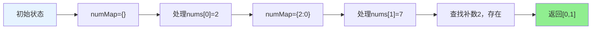

# 1. 两数之和

## 题目描述

给定一个整数数组 nums 和一个整数目标值 target，请你在该数组中找出 和为目标值 target  的那 两个 整数，并返回它们的数组下标。

你可以假设每种输入只会对应一个答案，并且你不能使用两次相同的元素。

你可以按任意顺序返回答案。

>来源：力扣（LeetCode）
链接：https://leetcode.cn/problems/two-sum
著作权归领扣网络所有。商业转载请联系官方授权，非商业转载请注明出处。
<hr></hr>

## 示例 1：

输入：nums = [2,7,11,15], target = 9
输出：[0,1]
解释：因为 nums[0] + nums[1] == 9 ，返回 [0, 1] 。

## 示例 2：

输入：nums = [3,2,4], target = 6
输出：[1,2]

## 示例 3：

输入：nums = [3,3], target = 6
输出：[0,1]

## 示例 4：

输入：nums = [1,5,8,10,13], target = 18
输出：[2,4]

## 提示：

- 2 <= nums.length <= 10^4
- -10^9 <= nums[i] <= 10^9
- -10^9 <= target <= 10^9
- 只会存在一个有效答案

## 解题思路

### 方法一：哈希表（推荐）

**核心思想**：
- 使用哈希表记录已经遍历过的数字及其索引
- 对于当前数字nums[i]，查找哈希表中是否存在target - nums[i]
- 如果存在，则找到了答案；如果不存在，将当前数字加入哈希表

**算法步骤**：
1. 初始化哈希表 map[int]int
2. 遍历数组，对于每个数字nums[i]：
   - 计算补数 complement = target - nums[i]
   - 检查哈希表中是否存在complement
   - 如果存在，返回[map[complement], i]
   - 如果不存在，将{nums[i]: i}加入哈希表
3. 如果没有找到，返回空数组

**时间复杂度**：O(n)，其中n是数组长度
**空间复杂度**：O(n)

### 方法二：暴力枚举

**核心思想**：
- 使用两层循环枚举所有可能的数对
- 检查每对数是否满足条件

**时间复杂度**：O(n²)
**空间复杂度**：O(1)

### 方法三：排序 + 双指针

**核心思想**：
- 先对数组排序，然后使用双指针从两端向中间移动
- 根据当前和与target的比较决定移动哪个指针

**时间复杂度**：O(n log n)
**空间复杂度**：O(n)（需要保存原始索引）

## 代码实现

```go
// 哈希表解法（推荐）
func twoSum(nums []int, target int) []int {
    numMap := make(map[int]int)
    
    for i, num := range nums {
        complement := target - num
        if j, exists := numMap[complement]; exists {
            return []int{j, i}
        }
        numMap[num] = i
    }
    
    return []int{}
}
```

## 复杂度分析

| 方法        | 时间复杂度 | 空间复杂度 | 适用场景     |
| ----------- | ---------- | ---------- | ------------ |
| 哈希表      | O(n)       | O(n)       | 推荐，最优解 |
| 暴力枚举    | O(n²)      | O(1)       | 小规模数据   |
| 排序+双指针 | O(n log n) | O(n)       | 需要有序数组 |

## 算法图解

### 哈希表查找过程

```mermaid
graph TD
    A[开始: nums=[2,7,11,15], target=9] --> B[初始化: numMap={}]
    B --> C[遍历: i=0, num=2]
    C --> D[计算补数: 9-2=7]
    D --> E{检查 numMap[7] 是否存在?}
    E -->|否| F[将 {2:0} 加入 numMap]
    F --> G[遍历: i=1, num=7]
    G --> H[计算补数: 9-7=2]
    H --> I{检查 numMap[2] 是否存在?}
    I -->|是| J[找到答案: [0,1]]
    
    style J fill:#90EE90
    style A fill:#E6F3FF
    style B fill:#FFF2CC
```

### 哈希表状态变化



### 暴力枚举过程

```mermaid
graph TD
    A[开始: nums=[3,2,4], target=6] --> B[外层循环: i=0]
    B --> C[内层循环: j=1]
    C --> D{检查: nums[0]+nums[1]=3+2=5 == 6?}
    D -->|否| E[内层循环: j=2]
    E --> F{检查: nums[0]+nums[2]=3+4=7 == 6?}
    F -->|否| G[外层循环: i=1]
    G --> H[内层循环: j=2]
    H --> I{检查: nums[1]+nums[2]=2+4=6 == 6?}
    I -->|是| J[找到答案: [1,2]]
    
    style J fill:#90EE90
    style A fill:#E6F3FF
    style B fill:#FFF2CC
```

### 双指针解法


## 边界情况处理

1. **数组长度为2**：直接检查两个元素
2. **目标值等于两个相同元素**：如[3,3], target=6
3. **负数情况**：如[-1,-2,-3,-4,-5], target=-8
4. **大数情况**：处理整数溢出
5. **无解情况**：返回空数组

## 测试用例

```go
func main() {
    // 测试用例1
    nums1 := []int{2, 7, 11, 15}
    target1 := 9
    fmt.Printf("测试用例1: nums=%v, target=%d, 结果=%v\n", nums1, target1, twoSum(nums1, target1))
    
    // 测试用例2
    nums2 := []int{3, 2, 4}
    target2 := 6
    fmt.Printf("测试用例2: nums=%v, target=%d, 结果=%v\n", nums2, target2, twoSum(nums2, target2))
    
    // 测试用例3
    nums3 := []int{3, 3}
    target3 := 6
    fmt.Printf("测试用例3: nums=%v, target=%d, 结果=%v\n", nums3, target3, twoSum(nums3, target3))
    
    // 边界测试
    nums4 := []int{1, 5, 8, 10, 13}
    target4 := 18
    fmt.Printf("边界测试1: nums=%v, target=%d, 结果=%v\n", nums4, target4, twoSum(nums4, target4))
    
    nums5 := []int{-1, -2, -3, -4, -5}
    target5 := -8
    fmt.Printf("边界测试2: nums=%v, target=%d, 结果=%v\n", nums5, target5, twoSum(nums5, target5))
}
```

