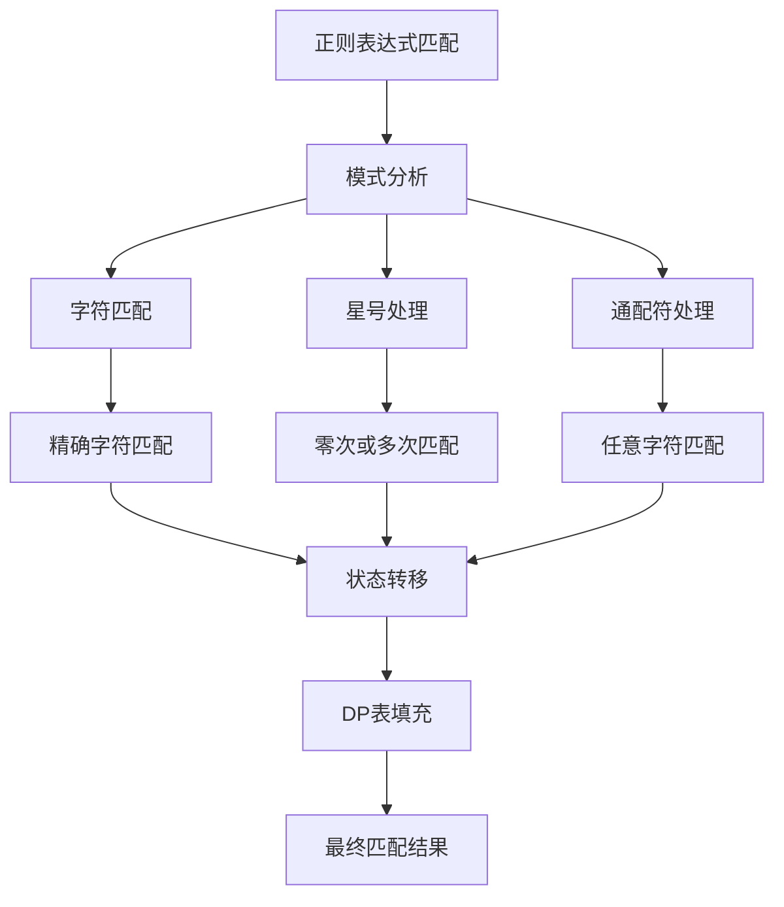
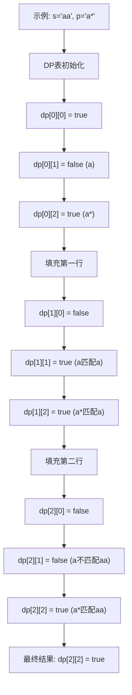
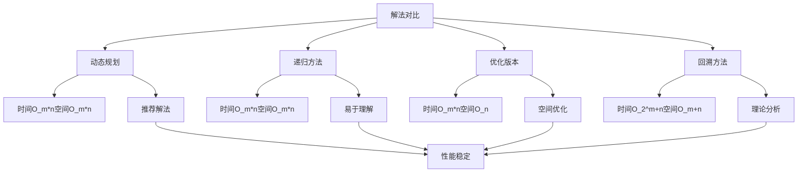
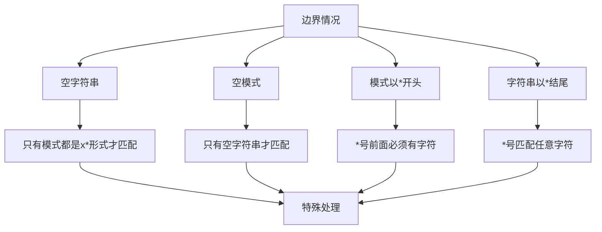
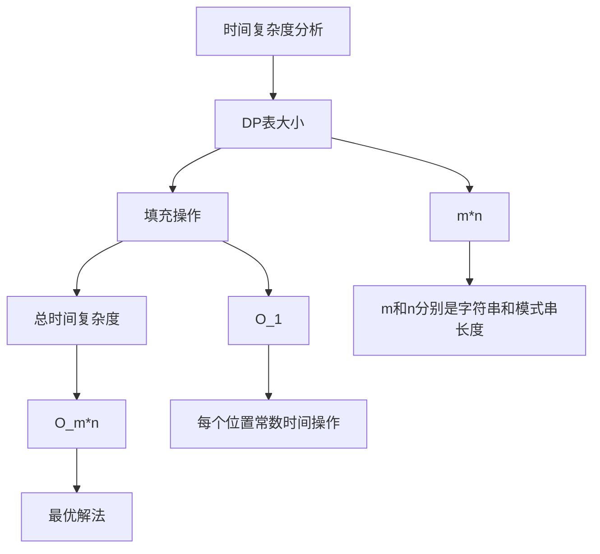
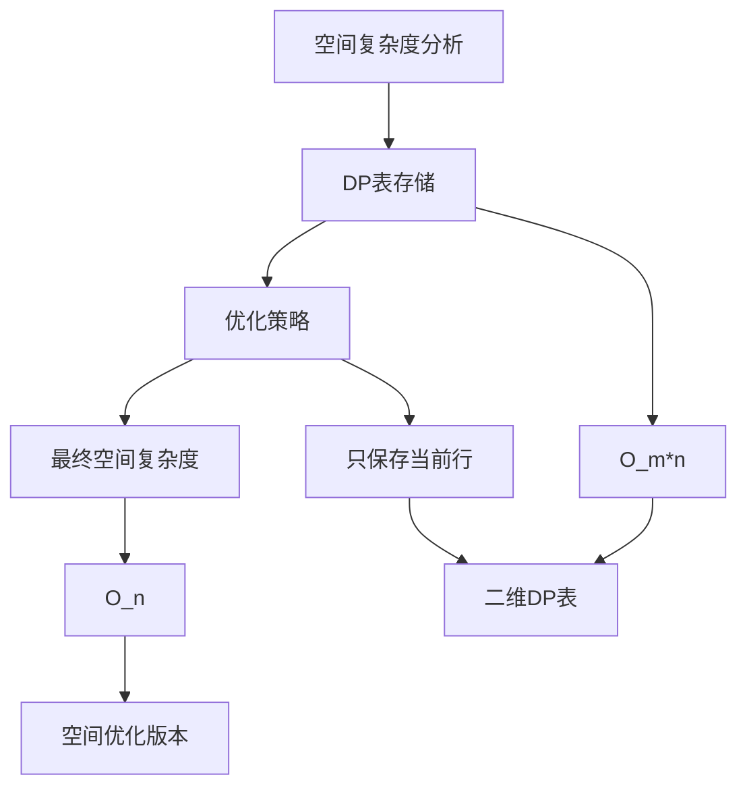
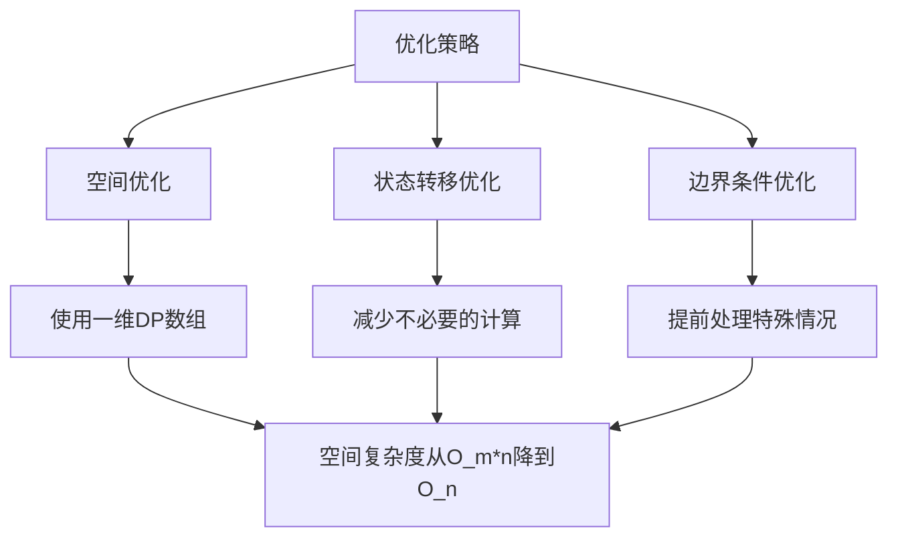
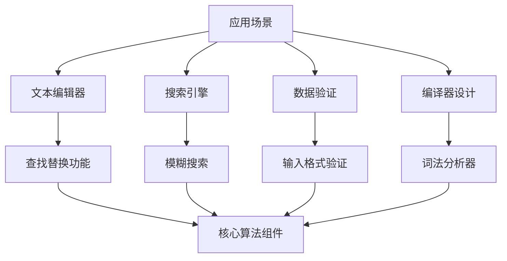
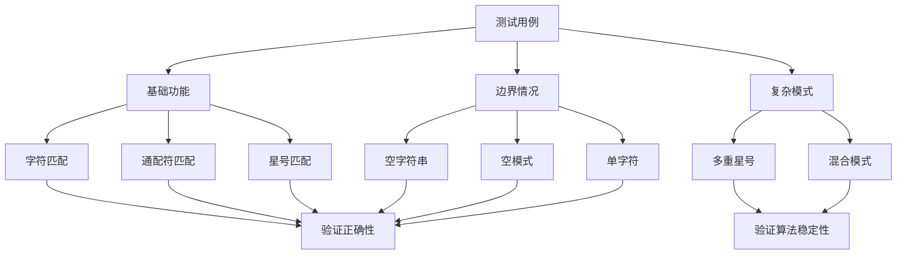

# 10. 正则表达式匹配

## 题目描述

给你一个字符串 s 和一个字符规律 p，请你来实现一个支持 '.' 和 '*' 的正则表达式匹配。

'.' 匹配任意单个字符
'*' 匹配零个或多个前面的那一个元素
所谓匹配，是要涵盖 整个 字符串 s 的，而不是部分字符串。

## 示例 1：

输入：s = "aa", p = "a"
输出：false
解释："a" 无法匹配 "aa" 整个字符串。

## 示例 2:

输入：s = "aa", p = "a*"
输出：true
解释：因为 '*' 代表可以匹配零个或多个前面的那一个元素, 在这里前面的元素就是 'a'。因此，字符串 "aa" 可被视为 'a' 重复了一次。

## 示例 3：

输入：s = "ab", p = ".*"
输出：true
解释：".*" 表示可匹配零个或多个（'*'）任意字符（'.'）。
 
## 提示：

- 1 <= s.length <= 20
- 1 <= p.length <= 20
- s 只包含从 a-z 的小写字母。
- p 只包含从 a-z 的小写字母，以及字符 . 和 *。
- 保证每次出现字符 * 时，前面都匹配到有效的字符

## 解题思路

这道题要求实现一个支持 '.' 和 '*' 的正则表达式匹配器。这是一个经典的字符串匹配问题，需要处理复杂的模式匹配逻辑。

### 算法分析

这道题的核心思想是**动态规划状态转移**，主要解法包括：

1. **动态规划方法**：使用二维DP表记录匹配状态（推荐）
2. **递归方法**：带备忘录的递归实现
3. **优化版本**：减少空间复杂度的DP实现
4. **回溯方法**：不使用备忘录的递归实现

### 问题本质分析



### 动态规划详解

```mermaid
flowchart TD
    A[创建DP表] --> B[初始化边界条件]
    B --> C[填充DP表]
    C --> D[返回最终结果]
    
    B --> E[dp[0][0] = true]
    B --> F[处理模式串开头的*号]
    
    C --> G[遍历字符串和模式串]
    G --> H{当前字符匹配?}
    
    H -->|是| I[dp[i][j] = dp[i-1][j-1]]
    H -->|否| J{当前模式是*号?}
    
    J -->|是| K[处理*号匹配]
    J -->|否| L[dp[i][j] = false]
    
    K --> M[匹配0次: dp[i][j-2]]
    K --> N[匹配多次: dp[i-1][j]]
    
    I --> O[继续下一位置]
    L --> O
    M --> P[dp[i][j] = dp[i][j-2]]
    N --> Q[dp[i][j] = dp[i][j] || dp[i-1][j]]
    
    P --> O
    Q --> O
    O --> R{还有位置?}
    R -->|是| G
    R -->|否| D
```

### DP表填充过程



### 星号处理策略

```mermaid
graph TD
    A[星号处理] --> B[匹配0次]
    A --> C[匹配1次]
    A --> D[匹配多次]
    
    B --> E[跳过当前字符和星号]
    C --> F[匹配当前字符]
    D --> G[继续匹配相同字符]
    
    E --> H[dp[i][j] = dp[i][j-2]]
    F --> I[dp[i][j] = dp[i-1][j-2]]
    G --> J[dp[i][j] = dp[i-1][j]]
    
    H --> K[状态转移]
    I --> K
    J --> K
```

### 各种解法对比



### 算法流程图

```mermaid
flowchart TD
    A[开始] --> B[创建DP表]
    B --> C[初始化边界条件]
    C --> D[i = 1, j = 1]
    
    D --> E{i <= m?}
    E -->|否| F[返回dp[m][n]]
    E -->|是| G{j <= n?}
    
    G -->|否| H[i++, j = 1]
    G -->|是| I{当前字符匹配?}
    
    I -->|是| J[dp[i][j] = dp[i-1][j-1]]
    I -->|否| K{当前模式是*号?}
    
    K -->|是| L[处理*号匹配]
    K -->|否| M[dp[i][j] = false]
    
    L --> N[匹配0次: dp[i][j-2]]
    N --> O[匹配多次: dp[i-1][j]]
    O --> P[dp[i][j] = dp[i][j] || dp[i-1][j]]
    
    J --> Q[j++]
    M --> Q
    P --> Q
    Q --> G
    H --> E
    F --> R[结束]
```

### 边界情况处理



### 时间复杂度分析



### 空间复杂度分析



### 关键优化点



### 实际应用场景



### 测试用例设计



### 代码实现要点

1. **DP表设计**：
   - dp[i][j]表示s的前i个字符与p的前j个字符是否匹配
   - 需要处理空字符串和空模式的边界情况

2. **星号处理**：
   - 匹配0次：dp[i][j] = dp[i][j-2]
   - 匹配多次：dp[i][j] = dp[i-1][j]
   - 需要检查前一个字符是否匹配

3. **状态转移**：
   - 普通字符：dp[i][j] = dp[i-1][j-1]
   - 通配符：dp[i][j] = dp[i-1][j-1]
   - 星号：复杂的组合逻辑

4. **边界条件**：
   - dp[0][0] = true（空字符串匹配空模式）
   - 处理模式串开头的*号情况
   - 字符串为空时的特殊处理

5. **空间优化**：
   - 只保存当前行和前一行
   - 使用滚动数组减少空间复杂度

这个问题的关键在于**理解动态规划的状态转移逻辑**和**正确处理星号的各种匹配情况**，通过构建DP表记录所有可能的匹配状态，实现高效的正则表达式匹配。
