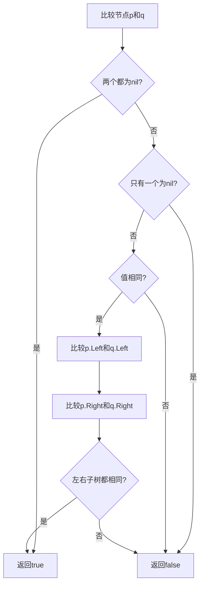
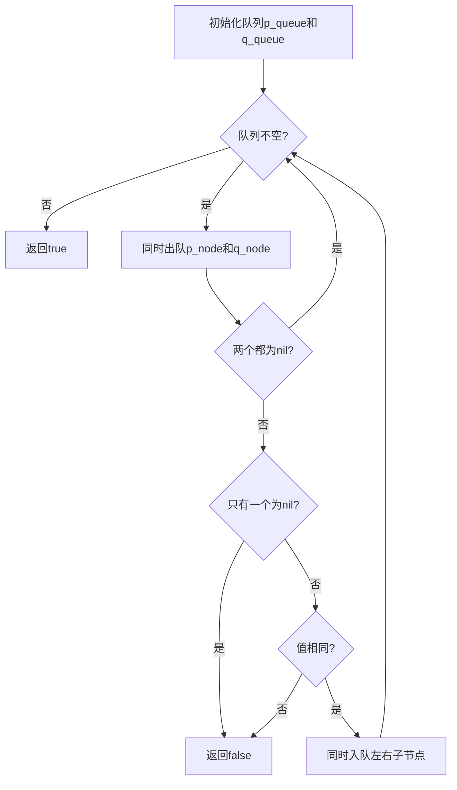

# 100. 相同的树

## 题目描述

给你两棵二叉树的根节点 p 和 q ，编写一个函数来检验这两棵树是否相同。

如果两个树在结构上相同，并且节点具有相同的值，则认为它们是相同的。


## 示例 1：


输入：p = [1,2,3], q = [1,2,3]
输出：true


## 示例 2：


输入：p = [1,2], q = [1,null,2]
输出：false


## 示例 3：


输入：p = [1,2,1], q = [1,1,2]
输出：false


## 提示：

- 两棵树上的节点数目都在范围 [0, 100] 内
- -10^4 <= Node.val <= 10^4

## 解题思路

### 问题深度分析

这是经典的**树比较**问题，也是**树遍历**的基础应用。核心在于**同时遍历两棵树，比较它们的结构和节点值**。

#### 问题本质

给定两棵二叉树，判断它们是否完全相同。需要同时满足两个条件：
1. **结构相同**：两棵树的节点位置和连接关系完全一致
2. **值相同**：对应位置的节点值完全相同

这是一个**树遍历 + 同步比较**问题，需要同时访问两棵树的对应节点并进行比较。

#### 核心思想

**同步遍历两棵树**：
1. **递归比较**：同时递归访问两棵树的对应节点
2. **节点比较**：
   - 如果两个节点都为nil，返回true
   - 如果只有一个为nil，返回false
   - 如果两个节点值不同，返回false
   - 如果两个节点值相同，继续比较左右子树
3. **迭代比较**：使用队列或栈同时遍历两棵树
4. **序列化比较**：将两棵树序列化为字符串，然后比较字符串

**关键技巧**：
- 同时访问两棵树的对应节点
- 先检查nil情况，避免空指针异常
- 使用递归或迭代实现同步遍历
- 利用队列实现BFS，利用栈实现DFS

#### 关键难点分析

**难点1：同步遍历**
- 需要同时访问两棵树的对应位置
- 递归时两个树的递归深度必须同步
- 迭代时需要同时维护两个队列或栈

**难点2：边界条件处理**
- 两棵树都为空：返回true
- 一棵树为空，另一棵不为空：返回false
- 节点值不同：立即返回false

**难点3：迭代实现**
- BFS需要同时维护两个队列
- DFS需要同时维护两个栈
- 需要确保两个队列/栈的操作同步

#### 典型情况分析

**情况1：完全相同的树**
```
树p:          树q:
    1             1
   / \           / \
  2   3         2   3

比较过程：
1. 根节点：1 == 1 ✓
2. 左子树：2 == 2 ✓
3. 右子树：3 == 3 ✓
结果：true
```

**情况2：结构不同**
```
树p:          树q:
    1             1
   /               \
  2                 2

比较过程：
1. 根节点：1 == 1 ✓
2. 左子树：p.Left=2, q.Left=nil ✗
结果：false
```

**情况3：值不同**
```
树p:          树q:
    1             1
   / \           / \
  2   3         2   4

比较过程：
1. 根节点：1 == 1 ✓
2. 左子树：2 == 2 ✓
3. 右子树：3 != 4 ✗
结果：false
```

**情况4：一棵树为空**
```
树p:          树q:
    1            (空)

比较过程：
1. p != nil, q == nil ✗
结果：false
```

#### 算法对比

| 算法       | 时间复杂度 | 空间复杂度 | 特点                   |
| ---------- | ---------- | ---------- | ---------------------- |
| 递归比较   | O(n)       | O(h)       | **最优解法**，代码简洁 |
| BFS迭代    | O(n)       | O(n)       | 层次遍历，易于理解     |
| DFS迭代    | O(n)       | O(h)       | 深度优先，空间优化     |
| 序列化比较 | O(n)       | O(n)       | 思路新颖，但效率较低   |

注：n为节点数，h为树高度

### 算法流程图

#### 主算法流程（递归比较）

```mermaid
graph TD
    A[isSameTree(p, q)] --> B{p == nil && q == nil?}
    B -->|是| C[return true]
    B -->|否| D{p == nil || q == nil?}
    D -->|是| E[return false]
    D -->|否| F{p.Val == q.Val?}
    F -->|否| E
    F -->|是| G[递归比较左子树]
    G --> H[递归比较右子树]
    H --> I{左右子树都相同?}
    I -->|是| J[return true]
    I -->|否| E
```

#### 递归比较详细流程



#### BFS迭代流程



### 复杂度分析

#### 时间复杂度详解

**递归比较算法**：O(n)
- 需要访问两棵树的所有节点
- 每个节点访问一次，进行常数时间比较
- 最坏情况：需要比较所有节点
- 总时间：O(n)

**BFS迭代算法**：O(n)
- 需要遍历两棵树的所有节点
- 每个节点入队和出队一次
- 总时间：O(n)

**DFS迭代算法**：O(n)
- 需要遍历两棵树的所有节点
- 每个节点入栈和出栈一次
- 总时间：O(n)

#### 空间复杂度详解

**递归比较算法**：O(h)
- 递归调用栈深度为树高度
- 最坏情况（链状树）：O(n)
- 最好情况（平衡树）：O(log n)

**BFS迭代算法**：O(n)
- 需要队列存储节点
- 最坏情况（完全二叉树）：队列大小为叶子节点数，约为n/2
- 总空间：O(n)

**DFS迭代算法**：O(h)
- 需要栈存储节点
- 最坏情况（链状树）：O(n)
- 最好情况（平衡树）：O(log n)

### 关键优化技巧

#### 技巧1：递归比较（最优解法）

```go
func isSameTree(p *TreeNode, q *TreeNode) bool {
    // 两棵树都为空
    if p == nil && q == nil {
        return true
    }
    
    // 一棵树为空，另一棵不为空
    if p == nil || q == nil {
        return false
    }
    
    // 节点值不同
    if p.Val != q.Val {
        return false
    }
    
    // 递归比较左右子树
    return isSameTree(p.Left, q.Left) && 
           isSameTree(p.Right, q.Right)
}
```

**优势**：
- 时间复杂度：O(n)
- 空间复杂度：O(h)
- 代码简洁，逻辑清晰
- 易于理解和实现

#### 技巧2：BFS迭代比较

```go
func isSameTree(p *TreeNode, q *TreeNode) bool {
    pQueue := []*TreeNode{p}
    qQueue := []*TreeNode{q}
    
    for len(pQueue) > 0 {
        // 同时出队
        pNode := pQueue[0]
        qNode := qQueue[0]
        pQueue = pQueue[1:]
        qQueue = qQueue[1:]
        
        // 检查nil
        if pNode == nil && qNode == nil {
            continue
        }
        if pNode == nil || qNode == nil {
            return false
        }
        if pNode.Val != qNode.Val {
            return false
        }
        
        // 同时入队左右子节点
        pQueue = append(pQueue, pNode.Left, pNode.Right)
        qQueue = append(qQueue, qNode.Left, qNode.Right)
    }
    
    return true
}
```

**特点**：层次遍历，适合需要逐层比较的场景

#### 技巧3：DFS迭代比较

```go
func isSameTree(p *TreeNode, q *TreeNode) bool {
    pStack := []*TreeNode{p}
    qStack := []*TreeNode{q}
    
    for len(pStack) > 0 {
        // 同时出栈
        n1 := len(pStack) - 1
        pNode := pStack[n1]
        qNode := qStack[n1]
        pStack = pStack[:n1]
        qStack = qStack[:n1]
        
        // 检查nil
        if pNode == nil && qNode == nil {
            continue
        }
        if pNode == nil || qNode == nil {
            return false
        }
        if pNode.Val != qNode.Val {
            return false
        }
        
        // 同时入栈左右子节点（注意顺序：先右后左）
        pStack = append(pStack, pNode.Right, pNode.Left)
        qStack = append(qStack, qNode.Right, qNode.Left)
    }
    
    return true
}
```

**特点**：深度优先遍历，空间复杂度O(h)

#### 技巧4：序列化比较

```go
func isSameTree(p *TreeNode, q *TreeNode) bool {
    return serialize(p) == serialize(q)
}

func serialize(root *TreeNode) string {
    if root == nil {
        return "#"
    }
    return fmt.Sprintf("%d,%s,%s", 
        root.Val, 
        serialize(root.Left), 
        serialize(root.Right))
}
```

**特点**：思路新颖，但效率较低（字符串拼接开销大）

### 边界条件处理

#### 边界情况1：两棵树都为空
- **处理**：返回true
- **验证**：空树和空树相同

#### 边界情况2：一棵树为空
- **处理**：返回false
- **验证**：空树和非空树不同

#### 边界情况3：单节点树
- **处理**：比较根节点值
- **验证**：值相同返回true，值不同返回false

#### 边界情况4：完全相同的树
- **处理**：递归比较所有节点
- **验证**：所有节点值相同，结构相同，返回true

#### 边界情况5：结构相同但值不同
- **处理**：比较到第一个不同值时立即返回false
- **验证**：不需要比较所有节点，提前终止

#### 边界情况6：结构不同
- **处理**：比较到第一个结构不一致时立即返回false
- **验证**：一个节点有子节点，另一个没有，立即返回false

### 测试用例设计

#### 基础测试用例

1. **完全相同**：`[1,2,3]` vs `[1,2,3]` → `true`
2. **结构不同**：`[1,2]` vs `[1,null,2]` → `false`
3. **值不同**：`[1,2,1]` vs `[1,1,2]` → `false`
4. **都为空**：`[]` vs `[]` → `true`

#### 进阶测试用例

5. **单节点相同**：`[1]` vs `[1]` → `true`
6. **单节点不同**：`[1]` vs `[2]` → `false`
7. **一棵为空**：`[1]` vs `[]` → `false`
8. **完全二叉树相同**：`[4,2,6,1,3,5,7]` vs `[4,2,6,1,3,5,7]` → `true`
9. **链状树相同**：`[1,null,2,null,3]` vs `[1,null,2,null,3]` → `true`
10. **深度不同**：`[1,2]` vs `[1,2,null]` → `false`

### 常见错误和陷阱

#### 错误1：忘记检查nil
```go
// 错误写法
if p.Val != q.Val {
    return false
}

// 正确写法
if p == nil && q == nil {
    return true
}
if p == nil || q == nil {
    return false
}
if p.Val != q.Val {
    return false
}
```
**原因**：直接访问p.Val或q.Val可能导致空指针异常

#### 错误2：使用||而不是&&
```go
// 错误写法
return isSameTree(p.Left, q.Left) || 
       isSameTree(p.Right, q.Right)

// 正确写法
return isSameTree(p.Left, q.Left) && 
       isSameTree(p.Right, q.Right)
```
**原因**：左右子树都必须相同，树才相同

#### 错误3：BFS时队列不同步
```go
// 错误写法
pQueue = append(pQueue, pNode.Left)
qQueue = append(qQueue, qNode.Left)
// 忘记入队右子节点

// 正确写法
pQueue = append(pQueue, pNode.Left, pNode.Right)
qQueue = append(qQueue, qNode.Left, qNode.Right)
```
**原因**：必须同时入队左右子节点，保持队列同步

#### 错误4：DFS时栈顺序错误
```go
// 错误写法：先左后右
pStack = append(pStack, pNode.Left, pNode.Right)

// 正确写法：先右后左（因为栈是后进先出）
pStack = append(pStack, pNode.Right, pNode.Left)
```
**原因**：栈是后进先出，需要先压右后压左才能先访问左

### 实用技巧

1. **优先使用递归方法**：代码简洁，逻辑清晰，易于理解和调试
2. **提前终止**：发现不同立即返回false，不需要继续比较
3. **nil检查放在前面**：先处理nil情况，避免空指针异常
4. **BFS适合层次比较**：如果需要逐层比较，使用BFS
5. **DFS适合深度比较**：如果需要深度优先比较，使用DFS
6. **迭代方法避免栈溢出**：对于深度很大的树，使用迭代方法

### 进阶扩展

#### 扩展1：判断子树是否相同
- 判断一棵树是否是另一棵树的子树（需要先找到对应节点）

#### 扩展2：判断树是否对称
- 判断一棵树是否对称（镜像比较）

#### 扩展3：判断树的结构是否相同
- 只比较结构，不比较值

#### 扩展4：找出不同的节点
- 不仅返回true/false，还返回具体哪些节点不同

### 应用场景

1. **数据结构验证**：验证两个树结构是否相同
2. **算法测试**：测试树操作算法的正确性
3. **代码审查**：检查树构建代码的一致性
4. **数据同步**：检查两个数据源中的树结构是否一致
5. **版本控制**：比较不同版本的树结构

### 总结

判断两棵树是否相同是一个经典的树遍历 + 同步比较问题，核心在于：
1. **同步遍历两棵树**：同时访问对应位置的节点
2. **先检查nil**：避免空指针异常
3. **递归比较最直观**：代码简洁，易于理解
4. **提前终止优化**：发现不同立即返回，提高效率

通过系统学习和练习，可以熟练掌握树比较的各种方法！