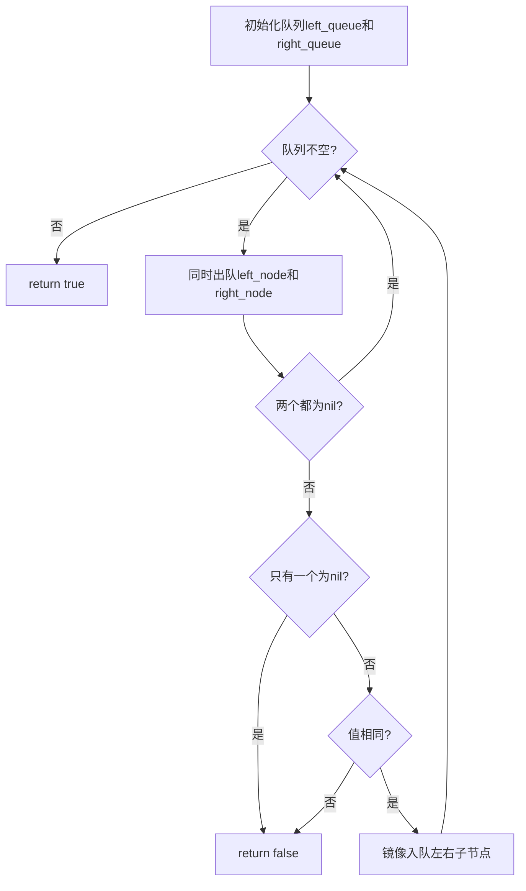

# 101. 对称二叉树

## 题目描述

给你一个二叉树的根节点 root ， 检查它是否轴对称。


## 示例 1：


输入：root = [1,2,2,3,4,4,3]
输出：true


## 示例 2：


输入：root = [1,2,2,null,3,null,3]
输出：false


## 提示：

- 树中节点数目在范围 [1, 1000] 内
- -100 <= Node.val <= 100

## 进阶：你可以运用递归和迭代两种方法解决这个问题吗？

## 解题思路

### 问题深度分析

这是经典的**树对称性判断**问题，也是**树遍历**的典型应用。核心在于**判断一棵树的左子树和右子树是否镜像对称**。

#### 问题本质

给定一棵二叉树，判断它是否是轴对称的。轴对称意味着：
1. **结构对称**：左子树和右子树的结构镜像对称
2. **值对称**：对应位置的节点值相同

这是一个**树遍历 + 镜像比较**问题，需要同时访问左子树和右子树并进行镜像比较。

#### 核心思想

**镜像对称的判断**：
1. **递归比较**：同时递归访问左子树和右子树的镜像位置
2. **镜像映射**：
   - 左子树的左节点 ↔ 右子树的右节点
   - 左子树的右节点 ↔ 右子树的左节点
3. **节点比较**：
   - 如果两个节点都为nil，返回true
   - 如果只有一个为nil，返回false
   - 如果两个节点值不同，返回false
   - 如果两个节点值相同，继续比较镜像位置
4. **迭代比较**：使用队列或栈同时遍历左右子树（镜像方式）

**关键技巧**：
- 将对称判断转化为两棵树的镜像比较问题
- 同时访问左子树的左和右子树的右
- 同时访问左子树的右和右子树的左
- 使用递归或迭代实现镜像遍历

#### 关键难点分析

**难点1：镜像映射的理解**
- 左子树的左节点对应右子树的右节点
- 左子树的右节点对应右子树的左节点
- 需要同时递归访问镜像位置

**难点2：边界条件处理**
- 两棵树都为空：返回true
- 一棵树为空，另一棵不为空：返回false
- 节点值不同：立即返回false

**难点3：迭代实现镜像遍历**
- BFS需要同时维护两个队列，但入队顺序相反
- DFS需要同时维护两个栈，但入栈顺序相反

#### 典型情况分析

**情况1：对称二叉树**
```
树结构:
        1
       / \
      2   2
     / \ / \
    3  4 4  3

比较过程：
1. 根节点：1 == 1 ✓
2. 左2 vs 右2：2 == 2 ✓
3. 左2的左3 vs 右2的右3：3 == 3 ✓
4. 左2的右4 vs 右2的左4：4 == 4 ✓
结果：true
```

**情况2：值不对称**
```
树结构:
        1
       / \
      2   2
       \   \
        3   4

比较过程：
1. 根节点：1 == 1 ✓
2. 左2 vs 右2：2 == 2 ✓
3. 左2的右3 vs 右2的左4：3 != 4 ✗
结果：false
```

**情况3：结构不对称**
```
树结构:
        1
       / \
      2   2
     /     \
    3       3

比较过程：
1. 根节点：1 == 1 ✓
2. 左2 vs 右2：2 == 2 ✓
3. 左2的左3 vs 右2的右3：3 == 3 ✓
4. 左2的右nil vs 右2的左nil：nil == nil ✓
结果：true（但结构不完全对称）
```

**情况4：单节点树**
```
树结构:
        1

比较过程：
1. 根节点：1 == 1 ✓
结果：true（单节点总是对称的）
```

#### 算法对比

| 算法     | 时间复杂度 | 空间复杂度 | 特点                   |
| -------- | ---------- | ---------- | ---------------------- |
| 递归比较 | O(n)       | O(h)       | **最优解法**，代码简洁 |
| BFS迭代  | O(n)       | O(n)       | 层次遍历，易于理解     |
| DFS迭代  | O(n)       | O(h)       | 深度优先，空间优化     |
| 翻转比较 | O(n)       | O(n)       | 翻转右子树后比较       |

注：n为节点数，h为树高度

### 算法流程图

#### 主算法流程（递归比较）

```mermaid
graph TD
    A[isSymmetric(root)] --> B{root==nil?}
    B -->|是| C[return true]
    B -->|否| D[isMirror(root.Left, root.Right)]
    D --> E{左右子树镜像?}
    E -->|是| F[return true]
    E -->|否| G[return false]
```

#### 镜像比较详细流程

```mermaid
graph TD
    A[isMirror(left, right)] --> B{left==nil && right==nil?}
    B -->|是| C[return true]
    B -->|否| D{left==nil || right==nil?}
    D -->|是| E[return false]
    D -->|否| F{left.Val==right.Val?}
    F -->|否| E
    F -->|是| G[比较left.Left和right.Right]
    G --> H[比较left.Right和right.Left]
    H --> I{都镜像?}
    I -->|是| C
    I -->|否| E
```

#### BFS迭代流程



### 复杂度分析

#### 时间复杂度详解

**递归比较算法**：O(n)
- 需要访问树的所有节点
- 每个节点访问一次，进行常数时间比较
- 最坏情况：需要比较所有节点
- 总时间：O(n)

**BFS迭代算法**：O(n)
- 需要遍历树的所有节点
- 每个节点入队和出队一次
- 总时间：O(n)

**DFS迭代算法**：O(n)
- 需要遍历树的所有节点
- 每个节点入栈和出栈一次
- 总时间：O(n)

#### 空间复杂度详解

**递归比较算法**：O(h)
- 递归调用栈深度为树高度
- 最坏情况（链状树）：O(n)
- 最好情况（平衡树）：O(log n)

**BFS迭代算法**：O(n)
- 需要队列存储节点
- 最坏情况（完全二叉树）：队列大小为叶子节点数，约为n/2
- 总空间：O(n)

**DFS迭代算法**：O(h)
- 需要栈存储节点
- 最坏情况（链状树）：O(n)
- 最好情况（平衡树）：O(log n)

### 关键优化技巧

#### 技巧1：递归比较（最优解法）

```go
func isSymmetric(root *TreeNode) bool {
    if root == nil {
        return true
    }
    return isMirror(root.Left, root.Right)
}

func isMirror(left *TreeNode, right *TreeNode) bool {
    // 两棵树都为空
    if left == nil && right == nil {
        return true
    }
    
    // 一棵树为空，另一棵不为空
    if left == nil || right == nil {
        return false
    }
    
    // 节点值不同
    if left.Val != right.Val {
        return false
    }
    
    // 递归比较镜像位置
    return isMirror(left.Left, right.Right) && 
           isMirror(left.Right, right.Left)
}
```

**优势**：
- 时间复杂度：O(n)
- 空间复杂度：O(h)
- 代码简洁，逻辑清晰
- 易于理解和实现

#### 技巧2：BFS迭代比较

```go
func isSymmetric(root *TreeNode) bool {
    if root == nil {
        return true
    }
    
    leftQueue := []*TreeNode{root.Left}
    rightQueue := []*TreeNode{root.Right}
    
    for len(leftQueue) > 0 {
        // 同时出队
        leftNode := leftQueue[0]
        rightNode := rightQueue[0]
        leftQueue = leftQueue[1:]
        rightQueue = rightQueue[1:]
        
        // 检查nil
        if leftNode == nil && rightNode == nil {
            continue
        }
        if leftNode == nil || rightNode == nil {
            return false
        }
        if leftNode.Val != rightNode.Val {
            return false
        }
        
        // 镜像入队：左左对右右，左右对右左
        leftQueue = append(leftQueue, leftNode.Left, leftNode.Right)
        rightQueue = append(rightQueue, rightNode.Right, rightNode.Left)
    }
    
    return true
}
```

**特点**：层次遍历，适合需要逐层比较的场景

#### 技巧3：DFS迭代比较

```go
func isSymmetric(root *TreeNode) bool {
    if root == nil {
        return true
    }
    
    leftStack := []*TreeNode{root.Left}
    rightStack := []*TreeNode{root.Right}
    
    for len(leftStack) > 0 {
        // 同时出栈
        n1 := len(leftStack) - 1
        leftNode := leftStack[n1]
        rightNode := rightStack[n1]
        leftStack = leftStack[:n1]
        rightStack = rightStack[:n1]
        
        // 检查nil
        if leftNode == nil && rightNode == nil {
            continue
        }
        if leftNode == nil || rightNode == nil {
            return false
        }
        if leftNode.Val != rightNode.Val {
            return false
        }
        
        // 镜像入栈：左左对右右，左右对右左（注意顺序：先右后左）
        leftStack = append(leftStack, leftNode.Right, leftNode.Left)
        rightStack = append(rightStack, rightNode.Left, rightNode.Right)
    }
    
    return true
}
```

**特点**：深度优先遍历，空间复杂度O(h)

#### 技巧4：翻转右子树后比较

```go
func isSymmetric(root *TreeNode) bool {
    if root == nil {
        return true
    }
    
    // 翻转右子树
    root.Right = invertTree(root.Right)
    
    // 比较左子树和翻转后的右子树
    return isSameTree(root.Left, root.Right)
}

func invertTree(root *TreeNode) *TreeNode {
    if root == nil {
        return nil
    }
    root.Left, root.Right = invertTree(root.Right), invertTree(root.Left)
    return root
}

func isSameTree(p *TreeNode, q *TreeNode) bool {
    if p == nil && q == nil {
        return true
    }
    if p == nil || q == nil {
        return false
    }
    return p.Val == q.Val && 
           isSameTree(p.Left, q.Left) && 
           isSameTree(p.Right, q.Right)
}
```

**特点**：思路新颖，但会修改原树结构（需要恢复）

### 边界条件处理

#### 边界情况1：空树
- **处理**：返回true（空树是对称的）
- **验证**：nil节点对称

#### 边界情况2：单节点树
- **处理**：返回true
- **验证**：单节点总是对称的

#### 边界情况3：只有根节点和两个子节点
- **处理**：比较两个子节点的值
- **验证**：值相同返回true，值不同返回false

#### 边界情况4：完全对称的树
- **处理**：递归比较所有镜像位置
- **验证**：所有镜像位置的值都相同，返回true

#### 边界情况5：结构对称但值不同
- **处理**：比较到第一个不同值时立即返回false
- **验证**：不需要比较所有节点，提前终止

#### 边界情况6：结构不对称
- **处理**：比较到第一个结构不一致时立即返回false
- **验证**：一个节点有子节点，另一个没有，立即返回false

### 测试用例设计

#### 基础测试用例

1. **对称二叉树**：`[1,2,2,3,4,4,3]` → `true`
2. **值不对称**：`[1,2,2,null,3,null,3]` → `false`
3. **空树**：`[]` → `true`
4. **单节点**：`[1]` → `true`

#### 进阶测试用例

5. **完全对称**：`[1,2,2,3,4,4,3,5,6,6,5]` → `true`
6. **结构不对称**：`[1,2,2,null,3,3]` → `false`
7. **单层对称**：`[1,2,2]` → `true`
8. **单层不对称**：`[1,2,3]` → `false`
9. **链状树**：`[1,2,null,3]` → `false`
10. **复杂不对称**：`[1,2,2,3,null,3,null]` → `false`

### 常见错误和陷阱

#### 错误1：只比较值不比较结构
```go
// 错误写法
if left.Val == right.Val {
    return true
}

// 正确写法
if left == nil && right == nil {
    return true
}
if left == nil || right == nil {
    return false
}
if left.Val != right.Val {
    return false
}
```
**原因**：需要同时检查结构和值

#### 错误2：镜像映射错误
```go
// 错误写法：非镜像比较
return isMirror(left.Left, right.Left) && 
       isMirror(left.Right, right.Right)

// 正确写法：镜像比较
return isMirror(left.Left, right.Right) && 
       isMirror(left.Right, right.Left)
```
**原因**：对称需要镜像比较，左左对右右，左右对右左

#### 错误3：BFS时入队顺序错误
```go
// 错误写法：非镜像入队
leftQueue = append(leftQueue, leftNode.Left, leftNode.Right)
rightQueue = append(rightQueue, rightNode.Left, rightNode.Right)

// 正确写法：镜像入队
leftQueue = append(leftQueue, leftNode.Left, leftNode.Right)
rightQueue = append(rightQueue, rightNode.Right, rightNode.Left)
```
**原因**：需要镜像入队，保持镜像位置对应

#### 错误4：忘记检查根节点
```go
// 错误写法：直接比较左右子树
return isMirror(root.Left, root.Right)

// 正确写法：先检查根节点
if root == nil {
    return true
}
return isMirror(root.Left, root.Right)
```
**原因**：空树需要特殊处理

### 实用技巧

1. **优先使用递归方法**：代码简洁，逻辑清晰，易于理解和调试
2. **理解镜像映射**：左左对右右，左右对右左
3. **提前终止**：发现不对称立即返回false，不需要继续比较
4. **nil检查放在前面**：先处理nil情况，避免空指针异常
5. **BFS适合层次比较**：如果需要逐层比较，使用BFS
6. **DFS适合深度比较**：如果需要深度优先比较，使用DFS

### 进阶扩展

#### 扩展1：判断树是否完全对称
- 不仅检查值对称，还检查结构完全对称

#### 扩展2：找出不对称的节点
- 不仅返回true/false，还返回具体哪些节点不对称

#### 扩展3：修复不对称的树
- 将不对称的树转换为对称的树（可能需要重建树）

#### 扩展4：判断多叉树对称性
- 扩展算法以支持多叉树的对称性判断

### 应用场景

1. **数据结构验证**：验证树结构是否对称
2. **算法测试**：测试树操作算法的正确性
3. **代码审查**：检查树构建代码的对称性
4. **图形渲染**：在图形渲染中判断图形是否对称
5. **数据压缩**：利用对称性进行数据压缩

### 总结

判断二叉树是否对称是一个经典的树遍历 + 镜像比较问题，核心在于：
1. **理解镜像映射**：左左对右右，左右对右左
2. **同时遍历左右子树**：镜像方式访问对应位置
3. **递归比较最直观**：代码简洁，易于理解
4. **提前终止优化**：发现不对称立即返回，提高效率

通过系统学习和练习，可以熟练掌握树对称性判断的各种方法！