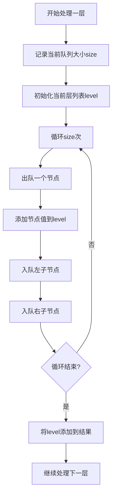

# 102. 二叉树的层序遍历

## 题目描述

给你二叉树的根节点 root ，返回其节点值的 层序遍历 。 （即逐层地，从左到右访问所有节点）。


## 示例 1：


输入：root = [3,9,20,null,null,15,7]
输出：[[3],[9,20],[15,7]]


## 示例 2：

输入：root = [1]
输出：[[1]]


## 示例 3：

输入：root = []
输出：[]


## 提示：

- 树中节点数目在范围 [0, 2000] 内
- -1000 <= Node.val <= 1000

## 解题思路

### 问题深度分析

这是经典的**层序遍历（BFS）**问题，也是**树遍历**的基础应用。核心在于**逐层访问节点，将每一层的节点值收集到一个列表中**。

#### 问题本质

给定一棵二叉树，返回其层序遍历的结果。层序遍历意味着：
1. **逐层访问**：从根节点开始，逐层向下访问
2. **从左到右**：每一层内，从左到右访问节点
3. **分层输出**：每一层的节点值放在一个单独的列表中

这是一个**BFS（广度优先搜索）**问题，需要使用队列来维护待访问的节点。

#### 核心思想

**BFS层序遍历**：
1. **队列维护**：使用队列存储待访问的节点
2. **逐层处理**：每次处理一层，记录当前层的节点数
3. **子节点入队**：访问当前层节点时，将其子节点入队
4. **分层收集**：将每一层的节点值收集到一个列表中

**关键技巧**：
- 使用队列实现BFS
- 记录每层的节点数，确保分层处理
- 在访问当前层节点时，将其子节点入队
- 使用双队列或记录层数来分离不同层

#### 关键难点分析

**难点1：分层处理**
- 需要区分不同层的节点
- 可以使用记录层数或双队列的方法
- 每次处理一层，确保输出格式正确

**难点2：队列操作**
- 需要正确入队和出队
- 在访问当前层节点时，将其子节点入队
- 需要处理nil节点，避免空指针异常

**难点3：边界条件**
- 空树：返回空列表
- 单节点树：返回单层列表
- 需要处理每层的空节点

#### 典型情况分析

**情况1：完全二叉树**
```
树结构:
        3
       / \
      9   20
         /  \
        15   7

层序遍历：
第0层: [3]
第1层: [9, 20]
第2层: [15, 7]
输出: [[3],[9,20],[15,7]]
```

**情况2：单节点树**
```
树结构:
        1

层序遍历：
第0层: [1]
输出: [[1]]
```

**情况3：链状树**
```
树结构:
        1
       /
      2
     /
    3

层序遍历：
第0层: [1]
第1层: [2]
第2层: [3]
输出: [[1],[2],[3]]
```

**情况4：不平衡树**
```
树结构:
        1
       / \
      2   3
     /
    4

层序遍历：
第0层: [1]
第1层: [2, 3]
第2层: [4]
输出: [[1],[2,3],[4]]
```

#### 算法对比

| 算法        | 时间复杂度 | 空间复杂度 | 特点                   |
| ----------- | ---------- | ---------- | ---------------------- |
| BFS队列     | O(n)       | O(n)       | **最优解法**，标准方法 |
| BFS记录层数 | O(n)       | O(n)       | 使用层数标记，清晰     |
| DFS递归     | O(n)       | O(h)       | 递归实现，空间优化     |
| 双队列      | O(n)       | O(n)       | 分离当前层和下一层     |

注：n为节点数，h为树高度

### 算法流程图

#### 主算法流程（BFS队列）

```mermaid
graph TD
    A[levelOrder(root)] --> B{root==nil?}
    B -->|是| C[return []]
    B -->|否| D[初始化队列queue和结果res]
    D --> E[queue入队root]
    E --> F{queue不空?}
    F -->|否| G[return res]
    F -->|是| H[记录当前层节点数size]
    H --> I[初始化当前层列表level]
    I --> J[循环size次]
    J --> K[出队node]
    K --> L[level添加node.Val]
    L --> M{node.Left!=nil?}
    M -->|是| N[queue入队node.Left]
    M -->|否| O{node.Right!=nil?}
    N --> O
    O -->|是| P[queue入队node.Right]
    O -->|否| Q{循环结束?}
    P --> Q
    Q -->|否| J
    Q -->|是| R[res添加level]
    R --> F
```

#### BFS分层处理流程



#### DFS递归流程

```mermaid
graph TD
    A[dfs(node, level)] --> B{node==nil?}
    B -->|是| C[return]
    B -->|否| D{res[level]存在?}
    D -->|否| E[创建res[level]]
    D -->|是| F[添加node.Val到res[level]]
    E --> F
    F --> G[dfs(node.Left, level+1)]
    G --> H[dfs(node.Right, level+1)]
```

### 复杂度分析

#### 时间复杂度详解

**BFS队列算法**：O(n)
- 需要访问树的所有节点
- 每个节点入队和出队一次
- 每次访问进行常数时间操作
- 总时间：O(n)

**DFS递归算法**：O(n)
- 需要访问树的所有节点
- 每个节点访问一次
- 每次访问进行常数时间操作
- 总时间：O(n)

#### 空间复杂度详解

**BFS队列算法**：O(n)
- 需要队列存储节点
- 最坏情况（完全二叉树）：队列大小为叶子节点数，约为n/2
- 结果列表需要O(n)空间
- 总空间：O(n)

**DFS递归算法**：O(h)
- 递归调用栈深度为树高度
- 最坏情况（链状树）：O(n)
- 最好情况（平衡树）：O(log n)
- 结果列表需要O(n)空间
- 总空间：O(n)（结果列表占主导）

### 关键优化技巧

#### 技巧1：BFS队列（最优解法）

```go
func levelOrder(root *TreeNode) [][]int {
    if root == nil {
        return [][]int{}
    }
    
    var res [][]int
    queue := []*TreeNode{root}
    
    for len(queue) > 0 {
        // 记录当前层的节点数
        size := len(queue)
        level := []int{}
        
        // 处理当前层的所有节点
        for i := 0; i < size; i++ {
            node := queue[0]
            queue = queue[1:]
            level = append(level, node.Val)
            
            // 将子节点入队
            if node.Left != nil {
                queue = append(queue, node.Left)
            }
            if node.Right != nil {
                queue = append(queue, node.Right)
            }
        }
        
        res = append(res, level)
    }
    
    return res
}
```

**优势**：
- 时间复杂度：O(n)
- 空间复杂度：O(n)
- 代码简洁，逻辑清晰
- 标准BFS实现

#### 技巧2：BFS记录层数

```go
func levelOrder(root *TreeNode) [][]int {
    if root == nil {
        return [][]int{}
    }
    
    type item struct {
        node  *TreeNode
        level int
    }
    
    var res [][]int
    queue := []item{{root, 0}}
    
    for len(queue) > 0 {
        curr := queue[0]
        queue = queue[1:]
        
        // 扩展结果列表
        if curr.level >= len(res) {
            res = append(res, []int{})
        }
        res[curr.level] = append(res[curr.level], curr.node.Val)
        
        // 将子节点入队
        if curr.node.Left != nil {
            queue = append(queue, item{curr.node.Left, curr.level + 1})
        }
        if curr.node.Right != nil {
            queue = append(queue, item{curr.node.Right, curr.level + 1})
        }
    }
    
    return res
}
```

**特点**：使用层数标记，逻辑清晰

#### 技巧3：DFS递归

```go
func levelOrder(root *TreeNode) [][]int {
    var res [][]int
    
    var dfs func(*TreeNode, int)
    dfs = func(node *TreeNode, level int) {
        if node == nil {
            return
        }
        
        // 扩展结果列表
        if level >= len(res) {
            res = append(res, []int{})
        }
        res[level] = append(res[level], node.Val)
        
        // 递归访问左右子树
        dfs(node.Left, level+1)
        dfs(node.Right, level+1)
    }
    
    dfs(root, 0)
    return res
}
```

**特点**：递归实现，代码简洁，空间复杂度O(h)

#### 技巧4：双队列（分离当前层和下一层）

```go
func levelOrder(root *TreeNode) [][]int {
    if root == nil {
        return [][]int{}
    }
    
    var res [][]int
    currentLevel := []*TreeNode{root}
    
    for len(currentLevel) > 0 {
        level := []int{}
        nextLevel := []*TreeNode{}
        
        // 处理当前层
        for _, node := range currentLevel {
            level = append(level, node.Val)
            if node.Left != nil {
                nextLevel = append(nextLevel, node.Left)
            }
            if node.Right != nil {
                nextLevel = append(nextLevel, node.Right)
            }
        }
        
        res = append(res, level)
        currentLevel = nextLevel
    }
    
    return res
}
```

**特点**：使用双队列分离当前层和下一层，逻辑清晰

### 边界条件处理

#### 边界情况1：空树
- **处理**：返回空列表`[][]`
- **验证**：root为nil时直接返回

#### 边界情况2：单节点树
- **处理**：返回单层列表`[[1]]`
- **验证**：只有根节点，输出一层

#### 边界情况3：链状树
- **处理**：每层一个节点，输出多层列表
- **验证**：`[[1],[2],[3]]`

#### 边界情况4：完全二叉树
- **处理**：每层节点数递增，输出多层列表
- **验证**：`[[3],[9,20],[15,7]]`

#### 边界情况5：不平衡树
- **处理**：某些层节点数较少，输出多层列表
- **验证**：正确处理每层的节点数

### 测试用例设计

#### 基础测试用例

1. **完全二叉树**：`[3,9,20,null,null,15,7]` → `[[3],[9,20],[15,7]]`
2. **单节点**：`[1]` → `[[1]]`
3. **空树**：`[]` → `[]`
4. **链状树**：`[1,null,2,null,3]` → `[[1],[2],[3]]`

#### 进阶测试用例

5. **不平衡树**：`[1,2,3,4]` → `[[1],[2,3],[4]]`
6. **单层树**：`[1,2,3]` → `[[1],[2,3]]`
7. **深度为3**：`[1,2,3,4,5,6,7]` → `[[1],[2,3],[4,5,6,7]]`
8. **左偏树**：`[1,2,null,3]` → `[[1],[2],[3]]`
9. **右偏树**：`[1,null,2,null,3]` → `[[1],[2],[3]]`
10. **复杂树**：`[1,2,3,4,5,null,6,7]` → `[[1],[2,3],[4,5,6],[7]]`

### 常见错误和陷阱

#### 错误1：忘记记录层数
```go
// 错误写法：没有记录层数，无法分层
for len(queue) > 0 {
    node := queue[0]
    queue = queue[1:]
    res = append(res, node.Val)  // 所有节点混在一起
    // ...
}

// 正确写法：记录当前层节点数
for len(queue) > 0 {
    size := len(queue)
    level := []int{}
    for i := 0; i < size; i++ {
        // 处理当前层
    }
    res = append(res, level)
}
```
**原因**：需要记录每层的节点数，才能正确分层

#### 错误2：在循环中修改队列大小
```go
// 错误写法：在循环中队列大小会变化
for i := 0; i < len(queue); i++ {
    node := queue[i]
    queue = append(queue, node.Left, node.Right)  // 队列大小变化
}

// 正确写法：先记录大小
size := len(queue)
for i := 0; i < size; i++ {
    // 处理当前层
}
```
**原因**：需要在循环前记录队列大小，避免循环中队列大小变化

#### 错误3：忘记处理nil节点
```go
// 错误写法：可能入队nil节点
queue = append(queue, node.Left, node.Right)

// 正确写法：检查nil
if node.Left != nil {
    queue = append(queue, node.Left)
}
if node.Right != nil {
    queue = append(queue, node.Right)
}
```
**原因**：nil节点不应该入队，避免空指针异常

#### 错误4：DFS时层数传递错误
```go
// 错误写法：层数传递错误
dfs(node.Left, level)  // 应该是level+1

// 正确写法：层数递增
dfs(node.Left, level+1)
dfs(node.Right, level+1)
```
**原因**：子节点的层数应该是父节点层数+1

### 实用技巧

1. **优先使用BFS队列方法**：代码简洁，逻辑清晰，易于理解和实现
2. **记录层数**：使用size变量记录当前层节点数，确保分层处理
3. **检查nil**：入队前检查子节点是否为nil，避免空指针异常
4. **DFS递归**：适合需要深度优先的场景，但需要维护层数
5. **双队列**：使用双队列分离当前层和下一层，逻辑更清晰
6. **提前终止**：如果只需要前k层，可以提前终止

### 进阶扩展

#### 扩展1：从下到上层序遍历
- 将结果列表反转，实现从下到上的层序遍历

#### 扩展2：锯齿形层序遍历
- 奇数层从左到右，偶数层从右到左

#### 扩展3：只输出特定层
- 只输出第k层的节点值

#### 扩展4：层序遍历并记录父节点
- 在层序遍历时记录每个节点的父节点

### 应用场景

1. **树结构可视化**：按层打印树结构，便于理解
2. **树的序列化**：将树序列化为层序遍历数组
3. **树的构建**：从层序遍历数组构建树
4. **树的比较**：比较两棵树的层序遍历结果
5. **树的搜索**：在特定层搜索节点

### 总结

层序遍历是一个经典的BFS问题，核心在于：
1. **使用队列实现BFS**：维护待访问的节点
2. **记录层数**：确保分层处理，输出格式正确
3. **检查nil**：避免空指针异常
4. **标准实现**：BFS队列方法是最优解法

通过系统学习和练习，可以熟练掌握层序遍历的各种方法！