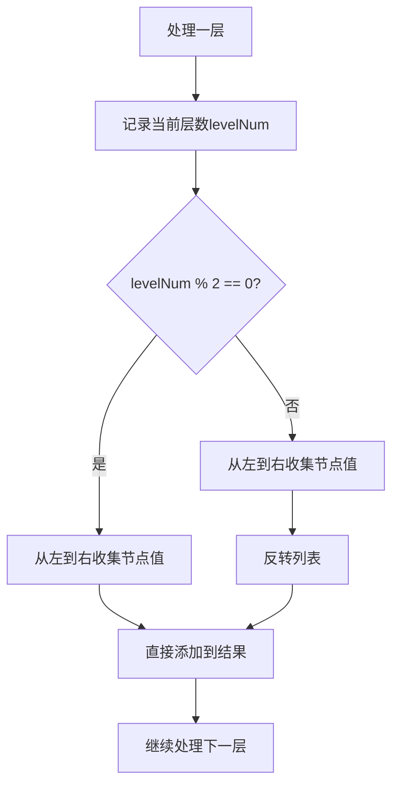

# 103. 二叉树的锯齿形层序遍历

## 题目描述

给你二叉树的根节点 root ，返回其节点值的 锯齿形层序遍历 。（即先从左往右，再从右往左进行下一层遍历，以此类推，层与层之间交替进行）。


## 示例 1：

.jpg)

输入：root = [3,9,20,null,null,15,7]
输出：[[3],[20,9],[15,7]]


## 示例 2：

输入：root = [1]
输出：[[1]]


## 示例 3：

输入：root = []
输出：[]


## 提示：

- 树中节点数目在范围 [0, 2000] 内
- -100 <= Node.val <= 100

## 解题思路

### 问题深度分析

这是经典的**锯齿形层序遍历（Zigzag Level Order）**问题，也是**层序遍历**的变种。核心在于**逐层访问节点，但每层的遍历方向交替变化**。

#### 问题本质

给定一棵二叉树，返回其锯齿形层序遍历的结果。锯齿形层序遍历意味着：
1. **逐层访问**：从根节点开始，逐层向下访问
2. **方向交替**：奇数层（0-indexed）从左到右，偶数层从右到左
3. **分层输出**：每一层的节点值放在一个单独的列表中

这是一个**BFS（广度优先搜索）**问题，需要使用队列来维护待访问的节点，并根据层数决定遍历方向。

#### 核心思想

**锯齿形层序遍历**：
1. **队列维护**：使用队列存储待访问的节点
2. **逐层处理**：每次处理一层，记录当前层的节点数
3. **方向控制**：根据层数（0-indexed）决定遍历方向
   - 偶数层（0, 2, 4...）：从左到右
   - 奇数层（1, 3, 5...）：从右到左
4. **结果反转**：奇数层的结果需要反转

**关键技巧**：
- 使用队列实现BFS
- 记录每层的节点数，确保分层处理
- 根据层数决定是否反转结果
- 使用双端队列（deque）可以优化性能

#### 关键难点分析

**难点1：方向控制**
- 需要根据层数决定遍历方向
- 奇数层需要反转结果
- 需要正确计算层数（0-indexed或1-indexed）

**难点2：分层处理**
- 需要区分不同层的节点
- 可以使用记录层数或双队列的方法
- 每次处理一层，确保输出格式正确

**难点3：结果反转**
- 奇数层的结果需要反转
- 可以在收集时反转，也可以在最后反转
- 需要注意反转的时机

#### 典型情况分析

**情况1：完全二叉树**
```
树结构:
        3
       / \
      9   20
         /  \
        15   7

锯齿形层序遍历：
第0层（偶数，从左到右）: [3]
第1层（奇数，从右到左）: [20, 9]  ← 反转
第2层（偶数，从左到右）: [15, 7]
输出: [[3],[20,9],[15,7]]
```

**情况2：单节点树**
```
树结构:
        1

锯齿形层序遍历：
第0层（偶数，从左到右）: [1]
输出: [[1]]
```

**情况3：链状树**
```
树结构:
        1
       /
      2
     /
    3

锯齿形层序遍历：
第0层（偶数，从左到右）: [1]
第1层（奇数，从右到左）: [2]  ← 反转（单元素，反转后不变）
第2层（偶数，从左到右）: [3]
输出: [[1],[2],[3]]
```

**情况4：不平衡树**
```
树结构:
        1
       / \
      2   3
     /
    4

锯齿形层序遍历：
第0层（偶数，从左到右）: [1]
第1层（奇数，从右到左）: [3, 2]  ← 反转
第2层（偶数，从左到右）: [4]
输出: [[1],[3,2],[4]]
```

#### 算法对比

| 算法        | 时间复杂度 | 空间复杂度 | 特点                   |
| ----------- | ---------- | ---------- | ---------------------- |
| BFS队列     | O(n)       | O(n)       | **最优解法**，标准方法 |
| BFS记录层数 | O(n)       | O(n)       | 使用层数标记，清晰     |
| DFS递归     | O(n)       | O(h)       | 递归实现，空间优化     |
| 双端队列    | O(n)       | O(n)       | 使用deque优化          |

注：n为节点数，h为树高度

### 算法流程图

#### 主算法流程（BFS队列）

```mermaid
graph TD
    A[zigzagLevelOrder(root)] --> B{root==nil?}
    B -->|是| C[return []]
    B -->|否| D[初始化队列queue和结果res]
    D --> E[queue入队root]
    E --> F{queue不空?}
    F -->|否| G[return res]
    F -->|是| H[记录当前层节点数size]
    H --> I[初始化当前层列表level]
    I --> J[记录当前层数levelNum]
    J --> K[循环size次]
    K --> L[出队node]
    L --> M[level添加node.Val]
    M --> N{node.Left!=nil?}
    N -->|是| O[queue入队node.Left]
    N -->|否| P{node.Right!=nil?}
    O --> P
    P -->|是| Q[queue入队node.Right]
    P -->|否| R{循环结束?}
    Q --> R
    R -->|否| K
    R -->|是| S{levelNum是奇数?}
    S -->|是| T[反转level]
    S -->|否| U[res添加level]
    T --> U
    U --> F
```

#### 方向控制流程



### 复杂度分析

#### 时间复杂度详解

**BFS队列算法**：O(n)
- 需要访问树的所有节点
- 每个节点入队和出队一次
- 每次访问进行常数时间操作
- 反转操作：O(k)，k为每层节点数，总时间O(n)
- 总时间：O(n)

**DFS递归算法**：O(n)
- 需要访问树的所有节点
- 每个节点访问一次
- 每次访问进行常数时间操作
- 反转操作：O(k)，k为每层节点数，总时间O(n)
- 总时间：O(n)

#### 空间复杂度详解

**BFS队列算法**：O(n)
- 需要队列存储节点
- 最坏情况（完全二叉树）：队列大小为叶子节点数，约为n/2
- 结果列表需要O(n)空间
- 总空间：O(n)

**DFS递归算法**：O(h)
- 递归调用栈深度为树高度
- 最坏情况（链状树）：O(n)
- 最好情况（平衡树）：O(log n)
- 结果列表需要O(n)空间
- 总空间：O(n)（结果列表占主导）

### 关键优化技巧

#### 技巧1：BFS队列（最优解法）

```go
func zigzagLevelOrder(root *TreeNode) [][]int {
    if root == nil {
        return [][]int{}
    }
    
    var res [][]int
    queue := []*TreeNode{root}
    levelNum := 0
    
    for len(queue) > 0 {
        // 记录当前层的节点数
        size := len(queue)
        level := []int{}
        
        // 处理当前层的所有节点
        for i := 0; i < size; i++ {
            node := queue[0]
            queue = queue[1:]
            level = append(level, node.Val)
            
            // 将子节点入队
            if node.Left != nil {
                queue = append(queue, node.Left)
            }
            if node.Right != nil {
                queue = append(queue, node.Right)
            }
        }
        
        // 奇数层反转
        if levelNum%2 == 1 {
            reverse(level)
        }
        
        res = append(res, level)
        levelNum++
    }
    
    return res
}

func reverse(arr []int) {
    for i, j := 0, len(arr)-1; i < j; i, j = i+1, j-1 {
        arr[i], arr[j] = arr[j], arr[i]
    }
}
```

**优势**：
- 时间复杂度：O(n)
- 空间复杂度：O(n)
- 代码简洁，逻辑清晰
- 标准BFS实现

#### 技巧2：BFS记录层数

```go
func zigzagLevelOrder(root *TreeNode) [][]int {
    if root == nil {
        return [][]int{}
    }
    
    type item struct {
        node  *TreeNode
        level int
    }
    
    var res [][]int
    queue := []item{{root, 0}}
    
    for len(queue) > 0 {
        curr := queue[0]
        queue = queue[1:]
        
        // 扩展结果列表
        if curr.level >= len(res) {
            res = append(res, []int{})
        }
        res[curr.level] = append(res[curr.level], curr.node.Val)
        
        // 将子节点入队
        if curr.node.Left != nil {
            queue = append(queue, item{curr.node.Left, curr.level + 1})
        }
        if curr.node.Right != nil {
            queue = append(queue, item{curr.node.Right, curr.level + 1})
        }
    }
    
    // 反转奇数层
    for i := 1; i < len(res); i += 2 {
        reverse(res[i])
    }
    
    return res
}
```

**特点**：使用层数标记，逻辑清晰

#### 技巧3：DFS递归

```go
func zigzagLevelOrder(root *TreeNode) [][]int {
    var res [][]int
    
    var dfs func(*TreeNode, int)
    dfs = func(node *TreeNode, level int) {
        if node == nil {
            return
        }
        
        // 扩展结果列表
        if level >= len(res) {
            res = append(res, []int{})
        }
        res[level] = append(res[level], node.Val)
        
        // 递归访问左右子树
        dfs(node.Left, level+1)
        dfs(node.Right, level+1)
    }
    
    dfs(root, 0)
    
    // 反转奇数层
    for i := 1; i < len(res); i += 2 {
        reverse(res[i])
    }
    
    return res
}
```

**特点**：递归实现，代码简洁，空间复杂度O(h)

#### 技巧4：双端队列（Deque）

```go
func zigzagLevelOrder(root *TreeNode) [][]int {
    if root == nil {
        return [][]int{}
    }
    
    var res [][]int
    queue := []*TreeNode{root}
    levelNum := 0
    
    for len(queue) > 0 {
        size := len(queue)
        level := make([]int, size)
        
        // 根据层数决定遍历方向
        for i := 0; i < size; i++ {
            node := queue[0]
            queue = queue[1:]
            
            // 根据层数决定插入位置
            if levelNum%2 == 0 {
                level[i] = node.Val  // 从左到右
            } else {
                level[size-1-i] = node.Val  // 从右到左
            }
            
            // 将子节点入队
            if node.Left != nil {
                queue = append(queue, node.Left)
            }
            if node.Right != nil {
                queue = append(queue, node.Right)
            }
        }
        
        res = append(res, level)
        levelNum++
    }
    
    return res
}
```

**特点**：使用双端队列优化，避免反转操作

### 边界条件处理

#### 边界情况1：空树
- **处理**：返回空列表`[][]`
- **验证**：root为nil时直接返回

#### 边界情况2：单节点树
- **处理**：返回单层列表`[[1]]`
- **验证**：只有根节点，输出一层

#### 边界情况3：链状树
- **处理**：每层一个节点，输出多层列表
- **验证**：`[[1],[2],[3]]`

#### 边界情况4：完全二叉树
- **处理**：每层节点数递增，输出多层列表
- **验证**：`[[3],[20,9],[15,7]]`

#### 边界情况5：不平衡树
- **处理**：某些层节点数较少，输出多层列表
- **验证**：正确处理每层的节点数和方向

### 测试用例设计

#### 基础测试用例

1. **完全二叉树**：`[3,9,20,null,null,15,7]` → `[[3],[20,9],[15,7]]`
2. **单节点**：`[1]` → `[[1]]`
3. **空树**：`[]` → `[]`
4. **链状树**：`[1,null,2,null,3]` → `[[1],[2],[3]]`

#### 进阶测试用例

5. **不平衡树**：`[1,2,3,4]` → `[[1],[3,2],[4]]`
6. **单层树**：`[1,2,3]` → `[[1],[3,2]]`
7. **深度为3**：`[1,2,3,4,5,6,7]` → `[[1],[3,2],[4,5,6,7]]`
8. **左偏树**：`[1,2,null,3]` → `[[1],[2],[3]]`
9. **右偏树**：`[1,null,2,null,3]` → `[[1],[2],[3]]`
10. **复杂树**：`[1,2,3,4,5,null,6,7]` → `[[1],[3,2],[4,5,6],[7]]`

### 常见错误和陷阱

#### 错误1：层数计算错误
```go
// 错误写法：使用1-indexed
if levelNum%2 == 0 {
    // 第1层（1-indexed）被当作偶数层
}

// 正确写法：使用0-indexed
if levelNum%2 == 1 {
    // 第1层（0-indexed）是奇数层，需要反转
}
```
**原因**：需要明确层数的索引方式（0-indexed或1-indexed）

#### 错误2：反转时机错误
```go
// 错误写法：在收集时反转
for i := 0; i < size; i++ {
    if levelNum%2 == 1 {
        level = append(level, node.Val)  // 顺序错误
    }
}

// 正确写法：收集后反转
for i := 0; i < size; i++ {
    level = append(level, node.Val)
}
if levelNum%2 == 1 {
    reverse(level)
}
```
**原因**：应该在收集完所有节点值后再反转

#### 错误3：忘记更新层数
```go
// 错误写法：忘记更新levelNum
for len(queue) > 0 {
    // 处理一层
    // 忘记levelNum++
}

// 正确写法：每次处理完一层后更新
for len(queue) > 0 {
    // 处理一层
    levelNum++
}
```
**原因**：需要正确更新层数，才能正确判断方向

#### 错误4：反转函数实现错误
```go
// 错误写法：只交换一半
func reverse(arr []int) {
    for i := 0; i < len(arr); i++ {
        arr[i], arr[len(arr)-1-i] = arr[len(arr)-1-i], arr[i]
    }
}

// 正确写法：交换到中间
func reverse(arr []int) {
    for i, j := 0, len(arr)-1; i < j; i, j = i+1, j-1 {
        arr[i], arr[j] = arr[j], arr[i]
    }
}
```
**原因**：需要交换到中间位置，避免重复交换

### 实用技巧

1. **优先使用BFS队列方法**：代码简洁，逻辑清晰，易于理解和实现
2. **记录层数**：使用levelNum变量记录当前层数，确保方向控制正确
3. **反转时机**：在收集完所有节点值后再反转，避免顺序错误
4. **层数索引**：使用0-indexed，第0层是偶数，第1层是奇数
5. **DFS递归**：适合需要深度优先的场景，但需要最后反转奇数层
6. **双端队列**：使用deque可以优化性能，避免反转操作

### 进阶扩展

#### 扩展1：从下到上锯齿形层序遍历
- 将结果列表反转，实现从下到上的锯齿形层序遍历

#### 扩展2：自定义方向模式
- 支持自定义方向模式，如"左-右-右-左"等

#### 扩展3：只输出特定层
- 只输出第k层的节点值（锯齿形）

#### 扩展4：锯齿形层序遍历并记录父节点
- 在锯齿形层序遍历时记录每个节点的父节点

### 应用场景

1. **树结构可视化**：按锯齿形打印树结构，便于理解
2. **树的序列化**：将树序列化为锯齿形层序遍历数组
3. **树的构建**：从锯齿形层序遍历数组构建树
4. **树的比较**：比较两棵树的锯齿形层序遍历结果
5. **树的搜索**：在特定层搜索节点（锯齿形）

### 总结

锯齿形层序遍历是一个经典的BFS变种问题，核心在于：
1. **使用队列实现BFS**：维护待访问的节点
2. **记录层数**：确保分层处理，输出格式正确
3. **方向控制**：根据层数决定遍历方向
4. **结果反转**：奇数层的结果需要反转

通过系统学习和练习，可以熟练掌握锯齿形层序遍历的各种方法！