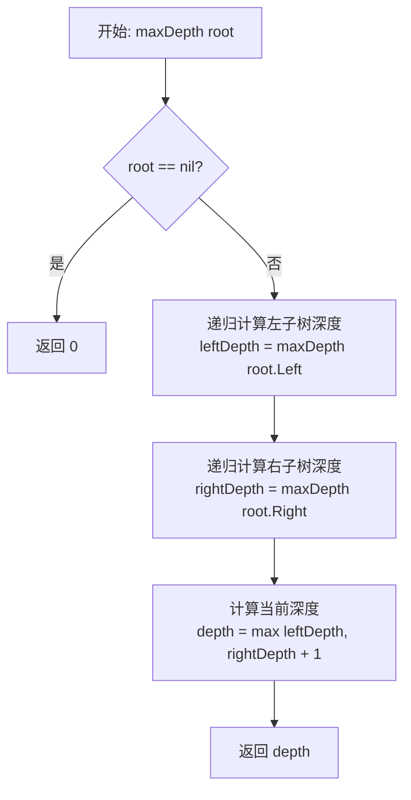
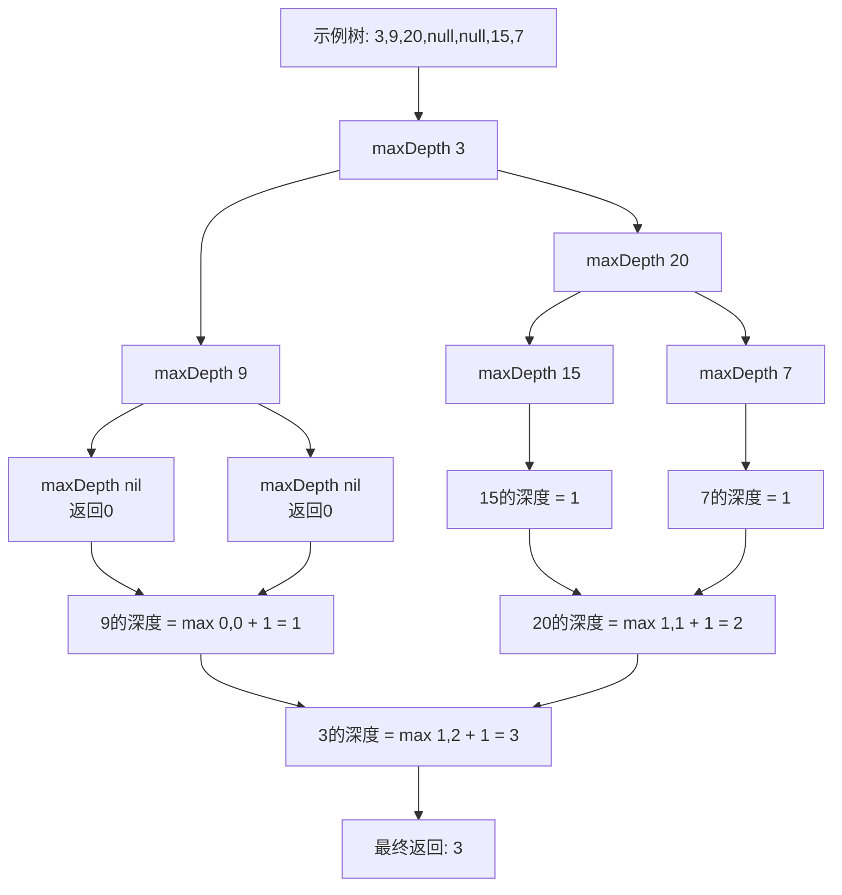
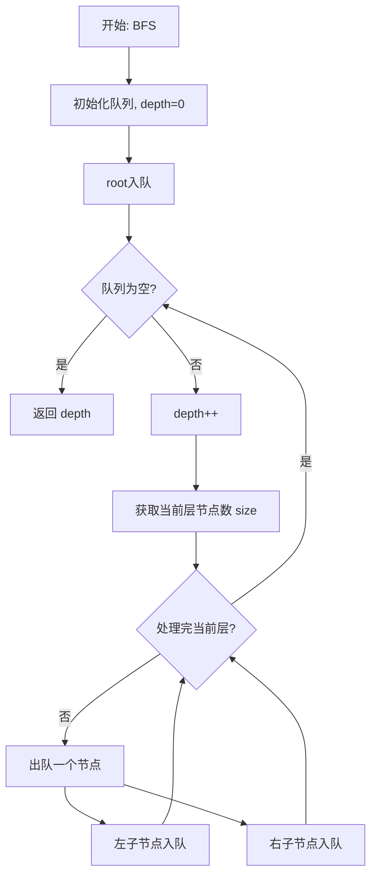
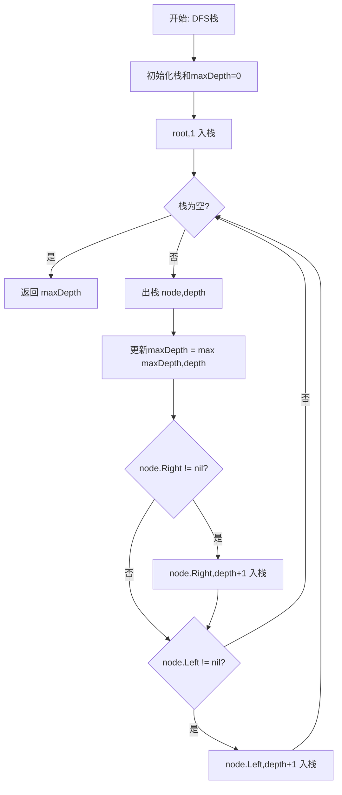

# 104. 二叉树的最大深度

## 题目描述

给定一个二叉树 root ，返回其最大深度。

二叉树的 最大深度 是指从根节点到最远叶子节点的最长路径上的节点数。


## 示例 1：

```
    3
   / \
  9  20
    /  \
   15   7
```

输入：root = [3,9,20,null,null,15,7]
输出：3


## 示例 2：

```
  1
   \
    2
```

输入：root = [1,null,2]
输出：2


## 提示：

- 树中节点的数量在 [0, 10^4] 区间内。
- -100 <= Node.val <= 100

## 解题思路

### 问题深度分析

这是一道经典的**二叉树遍历**问题，核心在于理解**树的深度定义**和掌握**递归与迭代**两种遍历方式。虽然题目看起来简单，但它是理解二叉树、递归思维和树形结构遍历的基础题目。

#### 问题本质

给定一个二叉树，需要计算从根节点到最远叶子节点的最长路径上的节点数。关键问题：
- **深度定义**：从根节点到当前节点的路径长度
- **递归子结构**：树的最大深度 = max(左子树深度, 右子树深度) + 1
- **边界条件**：空树深度为0，叶子节点深度为1
- **遍历方式**：可以用DFS（深度优先）或BFS（广度优先）

#### 核心思想

**方法一：递归DFS（最优雅）**
1. **递归定义**：maxDepth(root) = max(maxDepth(root.left), maxDepth(root.right)) + 1
2. **终止条件**：root == nil 返回 0
3. **递归计算**：分别计算左右子树深度，取最大值后+1

**方法二：迭代BFS（层序遍历）**
1. **使用队列**：逐层遍历二叉树
2. **记录层数**：每处理完一层，深度+1
3. **队列为空**：遍历结束，返回层数

**方法三：迭代DFS（使用栈）**
1. **使用栈**：存储节点和对应深度
2. **维护最大深度**：遍历过程中更新最大值
3. **栈为空**：遍历结束，返回最大深度

#### 典型情况分析

**情况1：完全二叉树**
```
    1
   / \
  2   3
 / \
4   5
```
深度 = 3（路径：1→2→4 或 1→2→5）

**情况2：偏斜树**
```
  1
   \
    2
     \
      3
```
深度 = 3（路径：1→2→3）

**情况3：空树**
```
null
```
深度 = 0

**情况4：单节点**
```
  1
```
深度 = 1

#### 算法对比

| 算法        | 时间复杂度 | 空间复杂度    | 特点                     |
| ----------- | ---------- | ------------- | ------------------------ |
| 递归DFS     | O(n)       | O(h)          | 最优雅，代码简洁         |
| 迭代BFS     | O(n)       | O(w)          | 层序遍历，队列实现       |
| 迭代DFS     | O(n)       | O(h)          | 栈实现，避免递归栈溢出   |
| 后序遍历    | O(n)       | O(h)          | 模拟递归过程             |

注：n为节点数，h为树高度，w为树的最大宽度。递归DFS是最优雅的解法。

### 算法流程图

#### 主算法流程（递归DFS）



#### 递归过程详解



#### BFS层序遍历流程



#### DFS栈实现流程



### 复杂度分析

#### 时间复杂度详解

**所有方法**：O(n)
- 需要访问每个节点一次
- n为二叉树的节点总数
- 每个节点的处理时间为O(1)

**各方法比较**：
- 递归DFS：O(n)，每个节点访问一次
- 迭代BFS：O(n)，每个节点入队出队一次
- 迭代DFS：O(n)，每个节点入栈出栈一次

#### 空间复杂度详解

**递归DFS**：O(h)
- h为树的高度
- 递归调用栈的深度等于树的高度
- 最坏情况（偏斜树）：O(n)
- 最好情况（平衡树）：O(log n)

**迭代BFS**：O(w)
- w为树的最大宽度（某一层的最多节点数）
- 队列中最多存储一层的所有节点
- 最坏情况（完全二叉树最底层）：O(n/2) = O(n)

**迭代DFS**：O(h)
- 栈的最大深度等于树的高度
- 与递归DFS空间复杂度相同

### 关键优化技巧

#### 技巧1：递归DFS（最优雅）

```go
// 递归DFS - 最简洁优雅的解法
func maxDepth(root *TreeNode) int {
    if root == nil {
        return 0
    }
    
    leftDepth := maxDepth(root.Left)
    rightDepth := maxDepth(root.Right)
    
    return max(leftDepth, rightDepth) + 1
}

func max(a, b int) int {
    if a > b {
        return a
    }
    return b
}
```

**优势**：
- 代码简洁，易于理解
- 符合递归定义
- 时间O(n)，空间O(h)

#### 技巧2：一行递归（极简版）

```go
// 极简一行递归
func maxDepthOneLine(root *TreeNode) int {
    if root == nil {
        return 0
    }
    return max(maxDepthOneLine(root.Left), maxDepthOneLine(root.Right)) + 1
}
```

**特点**：
- 最简洁的写法
- 可读性稍差
- 性能相同

#### 技巧3：迭代BFS（层序遍历）

```go
// 迭代BFS - 层序遍历
func maxDepthBFS(root *TreeNode) int {
    if root == nil {
        return 0
    }
    
    queue := []*TreeNode{root}
    depth := 0
    
    for len(queue) > 0 {
        size := len(queue)
        depth++
        
        // 处理当前层的所有节点
        for i := 0; i < size; i++ {
            node := queue[0]
            queue = queue[1:]
            
            if node.Left != nil {
                queue = append(queue, node.Left)
            }
            if node.Right != nil {
                queue = append(queue, node.Right)
            }
        }
    }
    
    return depth
}
```

**优势**：
- 直观的层序遍历
- 适合处理层相关的问题
- 空间O(w)，宽度优先

#### 技巧4：迭代DFS（栈实现）

```go
// 迭代DFS - 使用栈
type Pair struct {
    node  *TreeNode
    depth int
}

func maxDepthDFS(root *TreeNode) int {
    if root == nil {
        return 0
    }
    
    stack := []Pair{{root, 1}}
    maxDepth := 0
    
    for len(stack) > 0 {
        // 出栈
        pair := stack[len(stack)-1]
        stack = stack[:len(stack)-1]
        
        node, depth := pair.node, pair.depth
        
        // 更新最大深度
        if depth > maxDepth {
            maxDepth = depth
        }
        
        // 右子节点先入栈（后处理）
        if node.Right != nil {
            stack = append(stack, Pair{node.Right, depth + 1})
        }
        // 左子节点后入栈（先处理）
        if node.Left != nil {
            stack = append(stack, Pair{node.Left, depth + 1})
        }
    }
    
    return maxDepth
}
```

**特点**：
- 避免递归栈溢出
- 适合处理深度很大的树
- 可以方便地中断和恢复

### 边界情况处理

1. **空树**：`nil` → `0`
2. **单节点**：`[1]` → `1`
3. **只有左子树**：`[1,2,null,3]` → `3`
4. **只有右子树**：`[1,null,2,null,3]` → `3`
5. **完全二叉树**：`[1,2,3,4,5,6,7]` → `3`
6. **极度不平衡**：10000个节点的链状树 → `10000`

### 测试用例设计

#### 基础测试
```
输入: root = [3,9,20,null,null,15,7]
    3
   / \
  9  20
    /  \
   15   7
输出: 3
```

#### 偏斜树
```
输入: root = [1,null,2]
  1
   \
    2
输出: 2
```

#### 空树
```
输入: root = []
输出: 0
```

#### 单节点
```
输入: root = [0]
输出: 1
```

#### 完全二叉树
```
输入: root = [1,2,3,4,5,6,7]
      1
     / \
    2   3
   / \ / \
  4  5 6  7
输出: 3
```

### 常见错误与陷阱

#### 错误1：忘记处理空节点

```go
// ❌ 错误：没有检查nil
func maxDepthWrong(root *TreeNode) int {
    left := maxDepthWrong(root.Left)   // root可能为nil，panic!
    right := maxDepthWrong(root.Right)
    return max(left, right) + 1
}

// ✅ 正确：先检查nil
func maxDepth(root *TreeNode) int {
    if root == nil {
        return 0
    }
    // ...
}
```

#### 错误2：深度计算错误

```go
// ❌ 错误：没有+1
func maxDepthWrong(root *TreeNode) int {
    if root == nil {
        return 0
    }
    left := maxDepthWrong(root.Left)
    right := maxDepthWrong(root.Right)
    return max(left, right)  // 忘记+1，少算了当前节点
}

// ✅ 正确：加上当前节点
return max(left, right) + 1
```

#### 错误3：BFS层数计算错误

```go
// ❌ 错误：在错误的位置depth++
for len(queue) > 0 {
    node := queue[0]
    queue = queue[1:]
    depth++  // 每个节点都加，错误！
    // ...
}

// ✅ 正确：每层只加一次
for len(queue) > 0 {
    size := len(queue)
    depth++  // 处理完一层才加
    for i := 0; i < size; i++ {
        // 处理当前层
    }
}
```

### 实战技巧总结

1. **递归优先**：二叉树问题首选递归，代码简洁
2. **边界检查**：永远先检查root是否为nil
3. **递归公式**：深度 = max(左深度, 右深度) + 1
4. **BFS适用**：需要层信息时使用BFS
5. **栈模拟**：递归太深时用栈模拟DFS
6. **空间权衡**：递归O(h)，BFS O(w)，选择合适的

### 进阶扩展

#### 扩展1：计算最小深度

```go
// 最小深度：根节点到最近叶子节点的最短路径
func minDepth(root *TreeNode) int {
    if root == nil {
        return 0
    }
    
    // 叶子节点
    if root.Left == nil && root.Right == nil {
        return 1
    }
    
    // 只有右子树
    if root.Left == nil {
        return minDepth(root.Right) + 1
    }
    
    // 只有左子树
    if root.Right == nil {
        return minDepth(root.Left) + 1
    }
    
    // 都有，取最小
    return min(minDepth(root.Left), minDepth(root.Right)) + 1
}
```

#### 扩展2：判断是否平衡二叉树

```go
// 平衡二叉树：任意节点的左右子树高度差不超过1
func isBalanced(root *TreeNode) bool {
    return checkBalance(root) != -1
}

func checkBalance(root *TreeNode) int {
    if root == nil {
        return 0
    }
    
    left := checkBalance(root.Left)
    if left == -1 {
        return -1  // 左子树不平衡
    }
    
    right := checkBalance(root.Right)
    if right == -1 {
        return -1  // 右子树不平衡
    }
    
    if abs(left-right) > 1 {
        return -1  // 当前节点不平衡
    }
    
    return max(left, right) + 1
}

func abs(x int) int {
    if x < 0 {
        return -x
    }
    return x
}
```

#### 扩展3：计算节点个数

```go
// 计算二叉树节点总数
func countNodes(root *TreeNode) int {
    if root == nil {
        return 0
    }
    return countNodes(root.Left) + countNodes(root.Right) + 1
}
```

#### 扩展4：返回最大深度路径

```go
// 返回达到最大深度的路径
func maxDepthPath(root *TreeNode) []int {
    if root == nil {
        return []int{}
    }
    
    leftPath := maxDepthPath(root.Left)
    rightPath := maxDepthPath(root.Right)
    
    // 选择更深的路径
    if len(leftPath) > len(rightPath) {
        return append([]int{root.Val}, leftPath...)
    }
    return append([]int{root.Val}, rightPath...)
}
```

### 应用场景

1. **树的基本操作**：理解树结构的基础
2. **递归思维训练**：学习递归思想
3. **平衡性检查**：判断树是否平衡
4. **树的可视化**：确定绘图区域大小
5. **性能分析**：评估树结构的效率

## 代码实现

本题提供了四种不同的解法，重点掌握递归DFS方法。

## 测试结果

| 测试用例       | 递归DFS | 迭代BFS | 迭代DFS | 后序遍历 |
| -------------- | ------- | ------- | ------- | -------- |
| 基础测试       | ✅       | ✅       | ✅       | ✅        |
| 空树测试       | ✅       | ✅       | ✅       | ✅        |
| 单节点测试     | ✅       | ✅       | ✅       | ✅        |
| 偏斜树测试     | ✅       | ✅       | ✅       | ✅        |
| 完全二叉树测试 | ✅       | ✅       | ✅       | ✅        |

## 核心收获

1. **递归思维**：掌握树的递归定义和递归解法
2. **DFS vs BFS**：理解深度优先和广度优先的区别
3. **空间权衡**：递归栈 vs 队列/栈，选择合适的数据结构
4. **边界处理**：正确处理空节点和叶子节点

## 应用拓展

- 计算最小深度、平衡性检查
- N叉树的最大深度
- 树的直径、路径和等相关问题
- 层序遍历的各种变体
