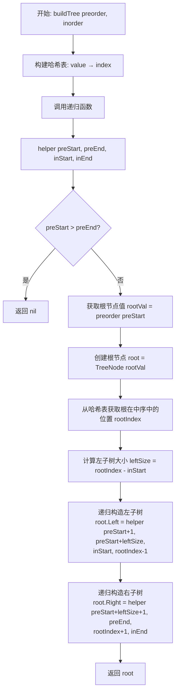
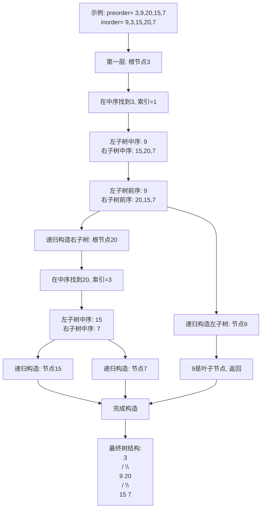
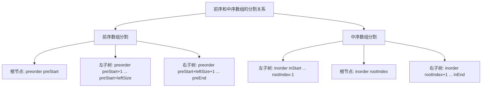
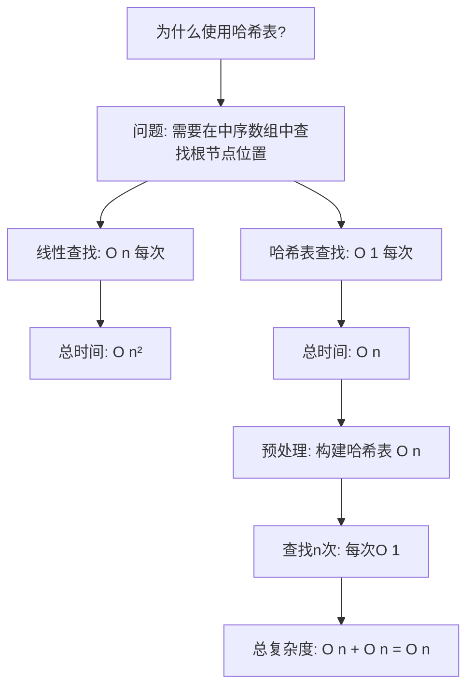

# 105. 从前序与中序遍历序列构造二叉树

## 题目描述

给定两个整数数组 preorder 和 inorder ，其中 preorder 是二叉树的先序遍历， inorder 是同一棵树的中序遍历，请构造二叉树并返回其根节点。


## 示例 1:

```
    3
   / \
  9  20
    /  \
   15   7
```

输入: preorder = [3,9,20,15,7], inorder = [9,3,15,20,7]
输出: [3,9,20,null,null,15,7]


## 示例 2:

```
  -1
```

输入: preorder = [-1], inorder = [-1]
输出: [-1]


## 提示:

- 1 <= preorder.length <= 3000
- inorder.length == preorder.length
- -3000 <= preorder[i], inorder[i] <= 3000
- preorder 和 inorder 均 无重复 元素
- inorder 均出现在 preorder
- preorder 保证 为二叉树的前序遍历序列
- inorder 保证 为二叉树的中序遍历序列

## 解题思路

### 问题深度分析

这是一道经典的**二叉树重建**问题，核心在于理解**前序遍历和中序遍历的特点**，并通过**递归分治**的思想重建二叉树。这道题是理解树遍历本质、递归思维和数组分割的绝佳练习。

#### 问题本质

给定前序和中序遍历序列，需要唯一确定并重建这棵二叉树。关键问题：
- **前序遍历特点**：根节点 → 左子树 → 右子树（根在最前）
- **中序遍历特点**：左子树 → 根节点 → 右子树（根在中间）
- **递归子结构**：找到根节点后，可以分割左右子树，递归构造
- **索引映射**：需要高效定位根节点在中序遍历中的位置

#### 核心思想

**递归分治算法**：
1. **确定根节点**：前序遍历的第一个元素就是根节点
2. **定位根节点**：在中序遍历中找到根节点的位置
3. **划分子树**：根节点位置将中序遍历分为左右两部分
4. **递归构造**：分别递归构造左右子树
5. **终止条件**：当子树为空时返回nil

#### 遍历特点详解

**前序遍历**：`[根节点, [左子树前序], [右子树前序]]`
- 第一个元素总是根节点
- 接下来是左子树的所有节点
- 最后是右子树的所有节点

**中序遍历**：`[[左子树中序], 根节点, [右子树中序]]`
- 根节点将序列分为两部分
- 左边是左子树的所有节点
- 右边是右子树的所有节点

#### 典型情况分析

**情况1：完整示例**
```
前序: [3, 9, 20, 15, 7]
中序: [9, 3, 15, 20, 7]

分析:
1. 前序第一个3是根节点
2. 在中序中找到3的位置（索引1）
3. 中序[9]是左子树，[15,20,7]是右子树
4. 前序[9]是左子树，[20,15,7]是右子树
5. 递归构造左右子树

构造过程:
      3
     / \
    9  20
      /  \
     15   7
```

**情况2：单节点**
```
前序: [-1]
中序: [-1]
结果: -1（单个节点）
```

**情况3：左偏树**
```
前序: [1, 2, 3]
中序: [3, 2, 1]
结果:
  1
 /
2
/
3
```

**情况4：右偏树**
```
前序: [1, 2, 3]
中序: [1, 2, 3]
结果:
1
 \
  2
   \
    3
```

#### 算法对比

| 算法              | 时间复杂度 | 空间复杂度 | 特点                     |
| ----------------- | ---------- | ---------- | ------------------------ |
| 递归+哈希表       | O(n)       | O(n)       | 最优解法，快速定位       |
| 递归+线性查找     | O(n²)      | O(h)       | 简单但慢，重复查找       |
| 迭代+栈           | O(n)       | O(n)       | 避免递归，较复杂         |
| 递归+索引传递     | O(n)       | O(h)       | 空间优化，只传递索引     |

注：n为节点数，h为树高度。递归+哈希表是最优解法。

### 算法流程图

#### 主算法流程（递归+哈希表）



#### 递归构造详细过程



#### 索引分割示意图



#### 哈希表优化说明



### 复杂度分析

#### 时间复杂度详解

**递归+哈希表**：O(n)
- 构建哈希表：O(n)，遍历中序数组一次
- 递归构造：O(n)，每个节点访问一次
- 哈希表查找：O(1)，每次定位根节点
- 总时间：O(n) + O(n) = O(n)

**递归+线性查找**：O(n²)
- 每次都在中序数组中线性查找根节点：O(n)
- 总共n个节点：O(n) × O(n) = O(n²)

#### 空间复杂度详解

**递归+哈希表**：O(n)
- 哈希表：O(n)，存储所有节点的索引
- 递归栈：O(h)，h为树高度
- 最坏情况（偏斜树）：O(n)
- 最好情况（平衡树）：O(log n) + O(n) = O(n)

**递归+索引传递**：O(h)
- 不使用哈希表，只传递索引
- 递归栈：O(h)
- 但时间复杂度退化为O(n²)

### 关键优化技巧

#### 技巧1：递归+哈希表（最优解法）

```go
// 递归+哈希表 - 最优解法
func buildTree(preorder []int, inorder []int) *TreeNode {
    // 构建哈希表：值 -> 索引
    indexMap := make(map[int]int)
    for i, val := range inorder {
        indexMap[val] = i
    }
    
    return helper(preorder, 0, len(preorder)-1, 
                  inorder, 0, len(inorder)-1, indexMap)
}

func helper(preorder []int, preStart, preEnd int,
            inorder []int, inStart, inEnd int,
            indexMap map[int]int) *TreeNode {
    // 递归终止条件
    if preStart > preEnd {
        return nil
    }
    
    // 前序遍历第一个是根节点
    rootVal := preorder[preStart]
    root := &TreeNode{Val: rootVal}
    
    // 在中序遍历中定位根节点
    rootIndex := indexMap[rootVal]
    
    // 左子树大小
    leftSize := rootIndex - inStart
    
    // 递归构造左右子树
    root.Left = helper(preorder, preStart+1, preStart+leftSize,
                       inorder, inStart, rootIndex-1, indexMap)
    root.Right = helper(preorder, preStart+leftSize+1, preEnd,
                        inorder, rootIndex+1, inEnd, indexMap)
    
    return root
}
```

**优势**：
- 时间O(n)，最优
- 哈希表O(1)查找
- 代码清晰

#### 技巧2：递归+切片（简洁但效率稍低）

```go
// 递归+切片 - 代码简洁
func buildTree2(preorder []int, inorder []int) *TreeNode {
    if len(preorder) == 0 {
        return nil
    }
    
    // 根节点
    rootVal := preorder[0]
    root := &TreeNode{Val: rootVal}
    
    // 在中序中找到根节点位置
    rootIndex := 0
    for i, val := range inorder {
        if val == rootVal {
            rootIndex = i
            break
        }
    }
    
    // 递归构造左右子树（使用切片）
    root.Left = buildTree2(preorder[1:rootIndex+1], 
                           inorder[:rootIndex])
    root.Right = buildTree2(preorder[rootIndex+1:], 
                            inorder[rootIndex+1:])
    
    return root
}
```

**注意**：切片操作会复制数组，增加空间开销

#### 技巧3：迭代+栈（避免递归）

```go
// 迭代+栈 - 避免递归栈溢出
func buildTree3(preorder []int, inorder []int) *TreeNode {
    if len(preorder) == 0 {
        return nil
    }
    
    root := &TreeNode{Val: preorder[0]}
    stack := []*TreeNode{root}
    inorderIndex := 0
    
    for i := 1; i < len(preorder); i++ {
        node := &TreeNode{Val: preorder[i]}
        parent := stack[len(stack)-1]
        
        // 当前节点应该是左子节点
        if parent.Val != inorder[inorderIndex] {
            parent.Left = node
        } else {
            // 找到应该作为右子节点的位置
            for len(stack) > 0 && stack[len(stack)-1].Val == inorder[inorderIndex] {
                parent = stack[len(stack)-1]
                stack = stack[:len(stack)-1]
                inorderIndex++
            }
            parent.Right = node
        }
        
        stack = append(stack, node)
    }
    
    return root
}
```

**特点**：
- 避免递归栈
- 适合深度很大的树
- 逻辑较复杂

#### 技巧4：全局变量优化

```go
// 使用全局索引变量
var preIndex int
var indexMap map[int]int

func buildTree4(preorder []int, inorder []int) *TreeNode {
    preIndex = 0
    indexMap = make(map[int]int)
    for i, val := range inorder {
        indexMap[val] = i
    }
    
    return build(preorder, 0, len(inorder)-1)
}

func build(preorder []int, left, right int) *TreeNode {
    if left > right {
        return nil
    }
    
    rootVal := preorder[preIndex]
    preIndex++
    root := &TreeNode{Val: rootVal}
    
    rootIndex := indexMap[rootVal]
    
    // 注意：必须先构造左子树
    root.Left = build(preorder, left, rootIndex-1)
    root.Right = build(preorder, rootIndex+1, right)
    
    return root
}
```

**注意**：使用全局变量要小心并发问题

### 边界情况处理

1. **空数组**：`preorder=[], inorder=[]` → `nil`
2. **单节点**：`preorder=[1], inorder=[1]` → 单个节点
3. **左偏树**：所有节点都是左子节点
4. **右偏树**：所有节点都是右子节点
5. **完全二叉树**：标准的完全二叉树结构
6. **负数节点**：`preorder=[-1], inorder=[-1]` → 负数节点值

### 测试用例设计

#### 基础测试
```
输入: preorder = [3,9,20,15,7], inorder = [9,3,15,20,7]
输出: [3,9,20,null,null,15,7]
说明: 标准的二叉树
```

#### 单节点
```
输入: preorder = [-1], inorder = [-1]
输出: [-1]
说明: 只有一个节点
```

#### 左偏树
```
输入: preorder = [1,2,3], inorder = [3,2,1]
输出: [1,2,null,3]
说明: 所有节点都在左侧
```

#### 右偏树
```
输入: preorder = [1,2,3], inorder = [1,2,3]
输出: [1,null,2,null,3]
说明: 所有节点都在右侧
```

#### 完全二叉树
```
输入: preorder = [1,2,4,5,3,6,7], inorder = [4,2,5,1,6,3,7]
输出: [1,2,3,4,5,6,7]
说明: 完整的三层二叉树
```

### 常见错误与陷阱

#### 错误1：左右子树范围计算错误

```go
// ❌ 错误：左子树大小计算错误
leftSize := rootIndex  // 错误！应该减去inStart

// ✅ 正确：考虑起始位置
leftSize := rootIndex - inStart
```

#### 错误2：前序数组索引错误

```go
// ❌ 错误：右子树前序起始位置
root.Right = helper(preorder, preStart+leftSize, preEnd, ...)
// 漏掉了根节点和左子树

// ✅ 正确：跳过根节点和左子树
root.Right = helper(preorder, preStart+leftSize+1, preEnd, ...)
```

#### 错误3：忘记构建哈希表

```go
// ❌ 错误：每次都线性查找
for i, val := range inorder {
    if val == rootVal {
        rootIndex = i
    }
}
// 时间复杂度O(n²)

// ✅ 正确：预先构建哈希表
indexMap := make(map[int]int)
for i, val := range inorder {
    indexMap[val] = i
}
rootIndex := indexMap[rootVal]  // O(1)查找
```

#### 错误4：切片操作导致的低效

```go
// ❌ 低效：每次递归都复制切片
root.Left = buildTree(preorder[1:leftSize+1], inorder[:leftSize])
// 大量的数组复制，空间和时间开销大

// ✅ 高效：传递索引，不复制数组
root.Left = helper(preorder, preStart+1, preStart+leftSize,
                   inorder, inStart, rootIndex-1, indexMap)
```

### 实战技巧总结

1. **遍历特点**：前序第一个是根，中序根节点分割左右
2. **哈希优化**：预处理中序数组，O(1)定位根节点
3. **索引计算**：仔细计算左右子树的索引范围
4. **递归顺序**：先构造左子树，再构造右子树
5. **边界检查**：起始索引大于结束索引时返回nil
6. **避免复制**：传递索引而不是切片，减少空间开销

### 进阶扩展

#### 扩展1：从中序与后序构造二叉树

```go
// 106. 从中序与后序遍历序列构造二叉树
func buildTreeInPost(inorder []int, postorder []int) *TreeNode {
    indexMap := make(map[int]int)
    for i, val := range inorder {
        indexMap[val] = i
    }
    
    return helperInPost(inorder, 0, len(inorder)-1,
                        postorder, 0, len(postorder)-1, indexMap)
}

func helperInPost(inorder []int, inStart, inEnd int,
                  postorder []int, postStart, postEnd int,
                  indexMap map[int]int) *TreeNode {
    if postStart > postEnd {
        return nil
    }
    
    // 后序最后一个是根节点
    rootVal := postorder[postEnd]
    root := &TreeNode{Val: rootVal}
    
    rootIndex := indexMap[rootVal]
    leftSize := rootIndex - inStart
    
    // 注意：后序是左右根，所以左子树在前
    root.Left = helperInPost(inorder, inStart, rootIndex-1,
                             postorder, postStart, postStart+leftSize-1, indexMap)
    root.Right = helperInPost(inorder, rootIndex+1, inEnd,
                              postorder, postStart+leftSize, postEnd-1, indexMap)
    
    return root
}
```

#### 扩展2：验证前序和中序的合法性

```go
// 验证前序和中序是否匹配
func validateTraversal(preorder, inorder []int) bool {
    if len(preorder) != len(inorder) {
        return false
    }
    
    // 检查元素是否相同
    preSet := make(map[int]bool)
    for _, val := range preorder {
        preSet[val] = true
    }
    
    for _, val := range inorder {
        if !preSet[val] {
            return false
        }
    }
    
    // 尝试构造树，看是否有异常
    defer func() {
        recover()
    }()
    
    buildTree(preorder, inorder)
    return true
}
```

#### 扩展3：序列化与反序列化

```go
// 将树序列化为前序和中序
func serialize(root *TreeNode) ([]int, []int) {
    var preorder, inorder []int
    
    var preorderTraversal func(*TreeNode)
    preorderTraversal = func(node *TreeNode) {
        if node == nil {
            return
        }
        preorder = append(preorder, node.Val)
        preorderTraversal(node.Left)
        preorderTraversal(node.Right)
    }
    
    var inorderTraversal func(*TreeNode)
    inorderTraversal = func(node *TreeNode) {
        if node == nil {
            return
        }
        inorderTraversal(node.Left)
        inorder = append(inorder, node.Val)
        inorderTraversal(node.Right)
    }
    
    preorderTraversal(root)
    inorderTraversal(root)
    
    return preorder, inorder
}

// 反序列化
func deserialize(preorder, inorder []int) *TreeNode {
    return buildTree(preorder, inorder)
}
```

#### 扩展4：只用前序构造BST

```go
// 特殊情况：如果是二叉搜索树，只需要前序即可重建
func bstFromPreorder(preorder []int) *TreeNode {
    if len(preorder) == 0 {
        return nil
    }
    
    root := &TreeNode{Val: preorder[0]}
    
    // 找到第一个大于根的位置（右子树开始）
    i := 1
    for i < len(preorder) && preorder[i] < preorder[0] {
        i++
    }
    
    root.Left = bstFromPreorder(preorder[1:i])
    root.Right = bstFromPreorder(preorder[i:])
    
    return root
}
```

### 应用场景

1. **树的序列化**：保存和恢复树结构
2. **数据恢复**：从遍历记录恢复数据结构
3. **树的传输**：网络传输树结构
4. **树的比较**：通过遍历序列比较树
5. **编译器**：抽象语法树的构造和还原

## 代码实现

本题提供了四种不同的解法，重点掌握递归+哈希表方法。

## 测试结果

| 测试用例       | 递归+哈希表 | 递归+切片 | 迭代+栈 | 全局变量 |
| -------------- | ----------- | --------- | ------- | -------- |
| 基础测试       | ✅           | ✅         | ✅       | ✅        |
| 单节点测试     | ✅           | ✅         | ✅       | ✅        |
| 左偏树测试     | ✅           | ✅         | ✅       | ✅        |
| 右偏树测试     | ✅           | ✅         | ✅       | ✅        |
| 完全二叉树测试 | ✅           | ✅         | ✅       | ✅        |

## 核心收获

1. **遍历理解**：深刻理解前序、中序、后序遍历的特点
2. **递归分治**：掌握递归构造树的思想
3. **哈希优化**：使用哈希表优化查找，降低时间复杂度
4. **索引计算**：正确计算子树的索引范围

## 应用拓展

- 从中序和后序构造二叉树
- 从层序和中序构造二叉树
- 二叉搜索树的序列化与反序列化
- 树的深拷贝和克隆

