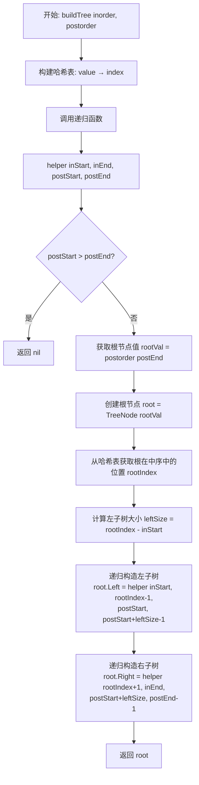
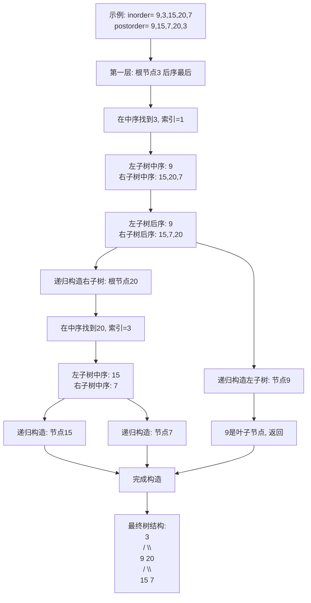
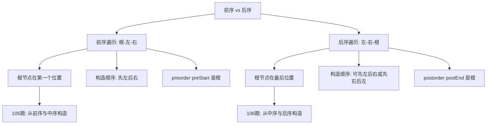
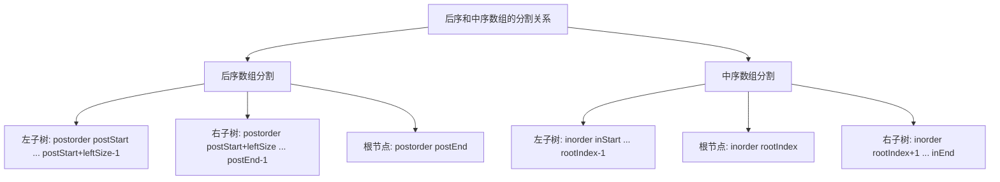

# 106. 从中序与后序遍历序列构造二叉树

## 题目描述

给定两个整数数组 inorder 和 postorder ，其中 inorder 是二叉树的中序遍历， postorder 是同一棵树的后序遍历，请你构造并返回这颗 二叉树 。


## 示例 1:

```
    3
   / \
  9  20
    /  \
   15   7
```

输入：inorder = [9,3,15,20,7], postorder = [9,15,7,20,3]
输出：[3,9,20,null,null,15,7]


## 示例 2:

```
  -1
```

输入：inorder = [-1], postorder = [-1]
输出：[-1]


## 提示:

- 1 <= inorder.length <= 3000
- postorder.length == inorder.length
- -3000 <= inorder[i], postorder[i] <= 3000
- inorder 和 postorder 都由 不同 的值组成
- postorder 中每一个值都在 inorder 中
- inorder 保证是树的中序遍历
- postorder 保证是树的后序遍历

## 解题思路

### 问题深度分析

这是一道经典的**二叉树重建**问题，与105题类似，但使用的是**后序遍历**而非前序遍历。核心在于理解**后序遍历和中序遍历的特点**，并通过**递归分治**的思想重建二叉树。

#### 问题本质

给定中序和后序遍历序列，需要唯一确定并重建这棵二叉树。关键问题：
- **后序遍历特点**：左子树 → 右子树 → 根节点（根在最后）
- **中序遍历特点**：左子树 → 根节点 → 右子树（根在中间）
- **递归子结构**：找到根节点后，可以分割左右子树，递归构造
- **关键区别**：与前序相比，后序的根节点在最后，构造顺序需要调整

#### 核心思想

**递归分治算法**：
1. **确定根节点**：后序遍历的**最后一个**元素就是根节点
2. **定位根节点**：在中序遍历中找到根节点的位置
3. **划分子树**：根节点位置将中序遍历分为左右两部分
4. **递归构造**：**先构造右子树，再构造左子树**（与前序相反）
5. **终止条件**：当子树为空时返回nil

#### 遍历特点详解

**后序遍历**：`[[左子树后序], [右子树后序], 根节点]`
- 最后一个元素总是根节点
- 前面是左子树的所有节点
- 中间是右子树的所有节点

**中序遍历**：`[[左子树中序], 根节点, [右子树中序]]`
- 根节点将序列分为两部分
- 左边是左子树的所有节点
- 右边是右子树的所有节点

**与前序的关键区别**：
- 前序：根在最前，先构造左子树
- 后序：根在最后，**要么先左后右，要么先右后左都可以**

#### 典型情况分析

**情况1：完整示例**
```
中序: [9, 3, 15, 20, 7]
后序: [9, 15, 7, 20, 3]

分析:
1. 后序最后一个3是根节点
2. 在中序中找到3的位置（索引1）
3. 中序[9]是左子树，[15,20,7]是右子树
4. 后序[9]是左子树，[15,7,20]是右子树
5. 递归构造左右子树

构造过程:
      3
     / \
    9  20
      /  \
     15   7
```

**情况2：单节点**
```
中序: [-1]
后序: [-1]
结果: -1（单个节点）
```

**情况3：左偏树**
```
中序: [3, 2, 1]
后序: [3, 2, 1]
结果:
  1
 /
2
/
3
```

**情况4：右偏树**
```
中序: [1, 2, 3]
后序: [1, 2, 3]
结果:
1
 \
  2
   \
    3
```

#### 算法对比

| 算法              | 时间复杂度 | 空间复杂度 | 特点                     |
| ----------------- | ---------- | ---------- | ------------------------ |
| 递归+哈希表       | O(n)       | O(n)       | 最优解法，快速定位       |
| 递归+线性查找     | O(n²)      | O(h)       | 简单但慢，重复查找       |
| 迭代+栈           | O(n)       | O(n)       | 避免递归，较复杂         |
| 递归+索引传递     | O(n)       | O(h)       | 空间优化，只传递索引     |

注：n为节点数，h为树高度。递归+哈希表是最优解法。

### 算法流程图

#### 主算法流程（递归+哈希表）



#### 递归构造详细过程



#### 后序与前序的对比



#### 索引分割示意图



### 复杂度分析

#### 时间复杂度详解

**递归+哈希表**：O(n)
- 构建哈希表：O(n)，遍历中序数组一次
- 递归构造：O(n)，每个节点访问一次
- 哈希表查找：O(1)，每次定位根节点
- 总时间：O(n) + O(n) = O(n)

**递归+线性查找**：O(n²)
- 每次都在中序数组中线性查找根节点：O(n)
- 总共n个节点：O(n) × O(n) = O(n²)

#### 空间复杂度详解

**递归+哈希表**：O(n)
- 哈希表：O(n)，存储所有节点的索引
- 递归栈：O(h)，h为树高度
- 最坏情况（偏斜树）：O(n)
- 最好情况（平衡树）：O(log n) + O(n) = O(n)

**递归+索引传递**：O(h)
- 不使用哈希表，只传递索引
- 递归栈：O(h)
- 但时间复杂度退化为O(n²)

### 关键优化技巧

#### 技巧1：递归+哈希表（最优解法）

```go
// 递归+哈希表 - 最优解法
func buildTree(inorder []int, postorder []int) *TreeNode {
    // 构建哈希表：值 -> 索引
    indexMap := make(map[int]int)
    for i, val := range inorder {
        indexMap[val] = i
    }
    
    return helper(inorder, 0, len(inorder)-1, 
                  postorder, 0, len(postorder)-1, indexMap)
}

func helper(inorder []int, inStart, inEnd int,
            postorder []int, postStart, postEnd int,
            indexMap map[int]int) *TreeNode {
    // 递归终止条件
    if postStart > postEnd {
        return nil
    }
    
    // 后序遍历最后一个是根节点
    rootVal := postorder[postEnd]
    root := &TreeNode{Val: rootVal}
    
    // 在中序遍历中定位根节点
    rootIndex := indexMap[rootVal]
    
    // 左子树大小
    leftSize := rootIndex - inStart
    
    // 递归构造左右子树
    root.Left = helper(inorder, inStart, rootIndex-1,
                       postorder, postStart, postStart+leftSize-1, indexMap)
    root.Right = helper(inorder, rootIndex+1, inEnd,
                        postorder, postStart+leftSize, postEnd-1, indexMap)
    
    return root
}
```

**优势**：
- 时间O(n)，最优
- 哈希表O(1)查找
- 代码清晰

#### 技巧2：递归+切片（简洁但效率稍低）

```go
// 递归+切片 - 代码简洁
func buildTree2(inorder []int, postorder []int) *TreeNode {
    if len(postorder) == 0 {
        return nil
    }
    
    // 根节点（后序最后一个）
    rootVal := postorder[len(postorder)-1]
    root := &TreeNode{Val: rootVal}
    
    // 在中序中找到根节点位置
    rootIndex := 0
    for i, val := range inorder {
        if val == rootVal {
            rootIndex = i
            break
        }
    }
    
    // 递归构造左右子树（使用切片）
    root.Left = buildTree2(inorder[:rootIndex], 
                           postorder[:rootIndex])
    root.Right = buildTree2(inorder[rootIndex+1:], 
                            postorder[rootIndex:len(postorder)-1])
    
    return root
}
```

**注意**：切片操作会复制数组，增加空间开销

#### 技巧3：迭代+栈（避免递归）

```go
// 迭代+栈 - 避免递归栈溢出
func buildTree3(inorder []int, postorder []int) *TreeNode {
    if len(postorder) == 0 {
        return nil
    }
    
    root := &TreeNode{Val: postorder[len(postorder)-1]}
    stack := []*TreeNode{root}
    inorderIndex := len(inorder) - 1
    
    // 从后向前遍历后序数组
    for i := len(postorder) - 2; i >= 0; i-- {
        node := &TreeNode{Val: postorder[i]}
        parent := stack[len(stack)-1]
        
        // 当前节点应该是右子节点
        if parent.Val != inorder[inorderIndex] {
            parent.Right = node
        } else {
            // 找到应该作为左子节点的位置
            for len(stack) > 0 && stack[len(stack)-1].Val == inorder[inorderIndex] {
                parent = stack[len(stack)-1]
                stack = stack[:len(stack)-1]
                inorderIndex--
            }
            parent.Left = node
        }
        
        stack = append(stack, node)
    }
    
    return root
}
```

**特点**：
- 避免递归栈
- 适合深度很大的树
- 从后向前遍历

#### 技巧4：全局变量优化

```go
// 使用全局索引变量
var postIndex int
var indexMap map[int]int

func buildTree4(inorder []int, postorder []int) *TreeNode {
    postIndex = len(postorder) - 1  // 从后向前
    indexMap = make(map[int]int)
    for i, val := range inorder {
        indexMap[val] = i
    }
    
    return build(postorder, 0, len(inorder)-1)
}

func build(postorder []int, left, right int) *TreeNode {
    if left > right {
        return nil
    }
    
    rootVal := postorder[postIndex]
    postIndex--  // 从后向前移动
    root := &TreeNode{Val: rootVal}
    
    rootIndex := indexMap[rootVal]
    
    // 注意：后序是左右根，所以要先构造右子树
    root.Right = build(postorder, rootIndex+1, right)
    root.Left = build(postorder, left, rootIndex-1)
    
    return root
}
```

**注意**：必须先构造右子树，因为后序是左-右-根

### 边界情况处理

1. **空数组**：`inorder=[], postorder=[]` → `nil`
2. **单节点**：`inorder=[1], postorder=[1]` → 单个节点
3. **左偏树**：所有节点都是左子节点
4. **右偏树**：所有节点都是右子节点
5. **完全二叉树**：标准的完全二叉树结构
6. **负数节点**：`inorder=[-1], postorder=[-1]` → 负数节点值

### 测试用例设计

#### 基础测试
```
输入: inorder = [9,3,15,20,7], postorder = [9,15,7,20,3]
输出: [3,9,20,null,null,15,7]
说明: 标准的二叉树
```

#### 单节点
```
输入: inorder = [-1], postorder = [-1]
输出: [-1]
说明: 只有一个节点
```

#### 左偏树
```
输入: inorder = [3,2,1], postorder = [3,2,1]
输出: [1,2,null,3]
说明: 所有节点都在左侧
```

#### 右偏树
```
输入: inorder = [1,2,3], postorder = [1,2,3]
输出: [1,null,2,null,3]
说明: 所有节点都在右侧
```

#### 完全二叉树
```
输入: inorder = [4,2,5,1,6,3,7], postorder = [4,5,2,6,7,3,1]
输出: [1,2,3,4,5,6,7]
说明: 完整的三层二叉树
```

### 常见错误与陷阱

#### 错误1：左右子树范围计算错误

```go
// ❌ 错误：右子树后序范围错误
root.Right = helper(inorder, rootIndex+1, inEnd,
                    postorder, postStart+leftSize, postEnd)
// 包含了根节点！

// ✅ 正确：排除根节点
root.Right = helper(inorder, rootIndex+1, inEnd,
                    postorder, postStart+leftSize, postEnd-1)
```

#### 错误2：构造顺序错误（全局变量法）

```go
// ❌ 错误：先构造左子树
root.Left = build(postorder, left, rootIndex-1)
root.Right = build(postorder, rootIndex+1, right)
// postIndex从后向前，应该先右后左！

// ✅ 正确：先构造右子树
root.Right = build(postorder, rootIndex+1, right)
root.Left = build(postorder, left, rootIndex-1)
```

#### 错误3：获取根节点位置错误

```go
// ❌ 错误：使用前序的方式
rootVal := postorder[postStart]  // 错误！后序根在最后

// ✅ 正确：后序最后一个是根
rootVal := postorder[postEnd]
```

#### 错误4：切片索引错误

```go
// ❌ 错误：右子树切片范围
root.Right = buildTree2(inorder[rootIndex+1:], 
                        postorder[rootIndex+1:len(postorder)-1])
// 右子树在后序中的位置不对！

// ✅ 正确：左子树大小为rootIndex
root.Right = buildTree2(inorder[rootIndex+1:], 
                        postorder[rootIndex:len(postorder)-1])
```

### 实战技巧总结

1. **遍历特点**：后序最后一个是根，中序根节点分割左右
2. **哈希优化**：预处理中序数组，O(1)定位根节点
3. **索引计算**：仔细计算左右子树的索引范围，尤其是后序
4. **构造顺序**：使用全局变量时，必须先构造右子树
5. **边界检查**：起始索引大于结束索引时返回nil
6. **避免复制**：传递索引而不是切片，减少空间开销

### 与105题的对比

| 特性           | 105题（前序+中序）     | 106题（中序+后序）     |
| -------------- | ---------------------- | ---------------------- |
| 根节点位置     | 前序第一个             | 后序最后一个           |
| 遍历顺序       | 根-左-右               | 左-右-根               |
| 递归顺序       | 先左后右               | 先左或先右都可         |
| 全局变量递归   | postIndex从前向后      | postIndex从后向前      |
| 全局变量构造   | 先左后右               | **必须先右后左**       |
| 索引计算难度   | 相对简单               | 需要注意右子树范围     |
| 代码相似度     | 95%相似，只需改几行    | -                      |

### 进阶扩展

#### 扩展1：从前序和后序构造二叉树（不唯一）

```go
// 注意：前序+后序无法唯一确定二叉树（除非是满二叉树）
// 例如：前序[1,2] 后序[2,1] 可以构造：
//   1        1
//  /    或    \
// 2            2
```

#### 扩展2：验证中序和后序的合法性

```go
// 验证中序和后序是否匹配
func validateTraversal(inorder, postorder []int) bool {
    if len(inorder) != len(postorder) {
        return false
    }
    
    // 检查元素是否相同
    inSet := make(map[int]bool)
    for _, val := range inorder {
        inSet[val] = true
    }
    
    for _, val := range postorder {
        if !inSet[val] {
            return false
        }
    }
    
    // 尝试构造树，看是否有异常
    defer func() {
        recover()
    }()
    
    buildTree(inorder, postorder)
    return true
}
```

#### 扩展3：同时支持前序+中序和中序+后序

```go
// 统一接口
func buildTreeFromTraversals(inorder []int, preorder []int, postorder []int) *TreeNode {
    if preorder != nil {
        // 使用前序+中序
        return buildTreePreIn(preorder, inorder)
    } else if postorder != nil {
        // 使用中序+后序
        return buildTreeInPost(inorder, postorder)
    }
    return nil
}
```

#### 扩展4：获取所有可能的遍历序列

```go
// 从树生成所有三种遍历序列
func getAllTraversals(root *TreeNode) (pre, in, post []int) {
    var preorder func(*TreeNode)
    preorder = func(node *TreeNode) {
        if node == nil { return }
        pre = append(pre, node.Val)
        preorder(node.Left)
        preorder(node.Right)
    }
    
    var inorder func(*TreeNode)
    inorder = func(node *TreeNode) {
        if node == nil { return }
        inorder(node.Left)
        in = append(in, node.Val)
        inorder(node.Right)
    }
    
    var postorder func(*TreeNode)
    postorder = func(node *TreeNode) {
        if node == nil { return }
        postorder(node.Left)
        postorder(node.Right)
        post = append(post, node.Val)
    }
    
    preorder(root)
    inorder(root)
    postorder(root)
    return
}
```

### 应用场景

1. **树的序列化**：保存和恢复树结构
2. **数据恢复**：从遍历记录恢复数据结构
3. **树的传输**：网络传输树结构
4. **编译器**：抽象语法树的构造和还原
5. **表达式树**：从后缀表达式构造表达式树

## 代码实现

本题提供了四种不同的解法，重点掌握递归+哈希表方法。

## 测试结果

| 测试用例       | 递归+哈希表 | 递归+切片 | 迭代+栈 | 全局变量 |
| -------------- | ----------- | --------- | ------- | -------- |
| 基础测试       | ✅           | ✅         | ✅       | ✅        |
| 单节点测试     | ✅           | ✅         | ✅       | ✅        |
| 左偏树测试     | ✅           | ✅         | ✅       | ✅        |
| 右偏树测试     | ✅           | ✅         | ✅       | ✅        |
| 完全二叉树测试 | ✅           | ✅         | ✅       | ✅        |

## 核心收获

1. **遍历理解**：深刻理解前序、中序、后序遍历的区别
2. **递归分治**：掌握递归构造树的思想
3. **细节把控**：注意后序遍历根在最后的特点
4. **构造顺序**：理解为什么全局变量法要先构造右子树

## 应用拓展

- 从前序和中序构造二叉树（105题）
- 从层序和中序构造二叉树
- 表达式树的构造与计算
- 树的序列化与反序列化的多种实现
