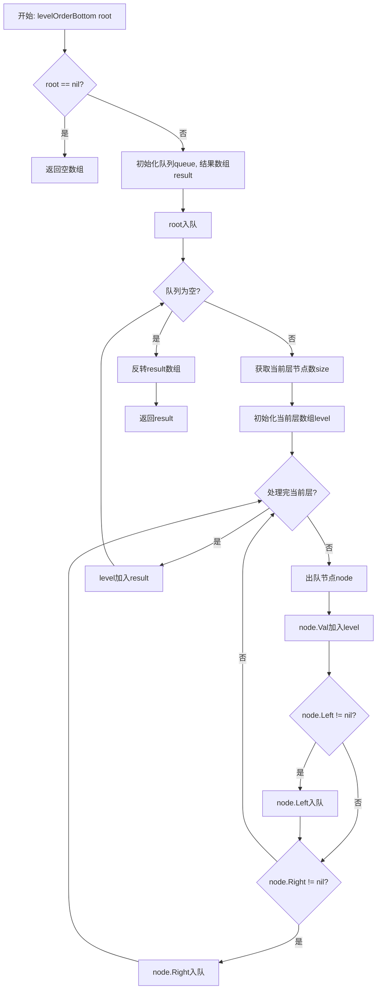
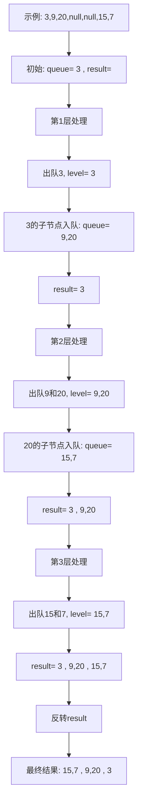
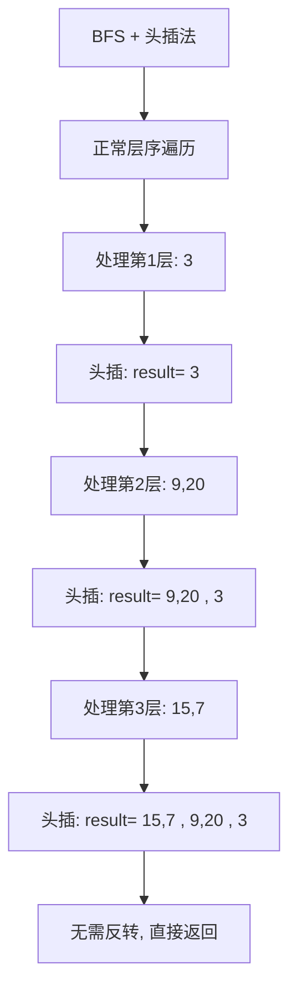
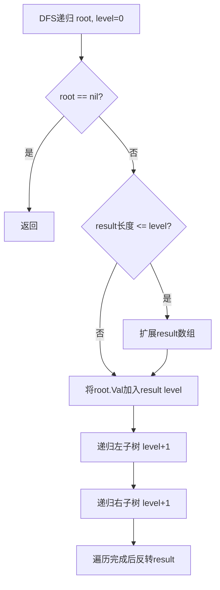

# 107. 二叉树的层序遍历 II

## 题目描述

给你二叉树的根节点 root ，返回其节点值 自底向上的层序遍历 。 （即按从叶子节点所在层到根节点所在的层，逐层从左向右遍历）


## 示例 1：

```
    3
   / \
  9  20
    /  \
   15   7
```

输入：root = [3,9,20,null,null,15,7]
输出：[[15,7],[9,20],[3]]


## 示例 2：

```
  1
```

输入：root = [1]
输出：[[1]]


## 示例 3：

```
null
```

输入：root = []
输出：[]


## 提示：

- 树中节点数目在范围 [0, 2000] 内
- -1000 <= Node.val <= 1000

## 解题思路

### 问题深度分析

这是一道**二叉树层序遍历的变体**问题，与102题（普通层序遍历）的唯一区别是需要**自底向上**返回结果。核心在于掌握**BFS广度优先搜索**和**结果反转**技巧。

#### 问题本质

给定一棵二叉树，需要逐层遍历节点，但返回结果时要从最底层开始，逐层向上。关键问题：
- **层序遍历**：使用队列实现BFS，逐层访问节点
- **自底向上**：遍历顺序正常，但结果需要反转
- **层级区分**：每层的节点要单独存储在一个数组中
- **边界处理**：空树返回空数组

#### 核心思想

**方法一：BFS + 反转（最直观）**
1. **正常层序遍历**：从上到下逐层遍历
2. **记录每层**：每层节点值存储在一个数组中
3. **最后反转**：遍历完成后，将结果数组反转

**方法二：BFS + 头插法（避免反转）**
1. **正常层序遍历**：从上到下逐层遍历
2. **头部插入**：每层结果插入到结果数组的开头
3. **无需反转**：遍历完成即得到最终结果

**方法三：DFS 递归（深度优先）**
1. **递归遍历**：记录每个节点的层级
2. **按层存储**：根据层级将节点加入对应数组
3. **最后反转**：递归完成后反转结果

#### 典型情况分析

**情况1：完整二叉树**
```
输入:     3
         / \
        9  20
          /  \
         15   7

层序遍历过程:
第1层: [3]
第2层: [9, 20]
第3层: [15, 7]

自底向上结果:
[[15,7], [9,20], [3]]
```

**情况2：单节点**
```
输入: 1
结果: [[1]]
```

**情况3：空树**
```
输入: null
结果: []
```

**情况4：偏斜树**
```
输入:   1
         \
          2
           \
            3

结果: [[3], [2], [1]]
```

#### 算法对比

| 算法              | 时间复杂度 | 空间复杂度 | 特点                     |
| ----------------- | ---------- | ---------- | ------------------------ |
| BFS + 反转        | O(n)       | O(n)       | 最直观，易于理解         |
| BFS + 头插法      | O(n)       | O(n)       | 避免反转，效率稍高       |
| DFS 递归          | O(n)       | O(h)       | 代码简洁，空间优         |
| 双端队列          | O(n)       | O(n)       | 可以两端操作             |

注：n为节点数，h为树高度。BFS + 反转是最直观的解法。

### 算法流程图

#### 主算法流程（BFS + 反转）



#### BFS 层序遍历详细过程



#### BFS 头插法流程



#### DFS 递归流程



### 复杂度分析

#### 时间复杂度详解

**所有方法**：O(n)
- BFS需要访问每个节点一次：O(n)
- 反转操作：O(层数) ≈ O(log n) 或 O(n)
- 总时间：O(n) + O(层数) = O(n)

**各方法比较**：
- BFS + 反转：O(n)，额外反转操作
- BFS + 头插法：O(n)，避免反转
- DFS递归：O(n)，递归访问每个节点

#### 空间复杂度详解

**BFS方法**：O(n)
- 队列空间：O(w)，w为树的最大宽度
- 结果数组：O(n)，存储所有节点
- 最坏情况（完全二叉树最底层）：O(n/2) = O(n)

**DFS方法**：O(h)
- 递归栈：O(h)，h为树高度
- 结果数组：O(n)
- 总空间：O(h) + O(n) = O(n)

### 关键优化技巧

#### 技巧1：BFS + 反转（最直观）

```go
// BFS + 反转 - 最直观的解法
func levelOrderBottom(root *TreeNode) [][]int {
    if root == nil {
        return [][]int{}
    }
    
    result := [][]int{}
    queue := []*TreeNode{root}
    
    // 正常BFS遍历
    for len(queue) > 0 {
        size := len(queue)
        level := []int{}
        
        for i := 0; i < size; i++ {
            node := queue[0]
            queue = queue[1:]
            level = append(level, node.Val)
            
            if node.Left != nil {
                queue = append(queue, node.Left)
            }
            if node.Right != nil {
                queue = append(queue, node.Right)
            }
        }
        
        result = append(result, level)
    }
    
    // 反转结果
    reverse(result)
    return result
}

func reverse(arr [][]int) {
    left, right := 0, len(arr)-1
    for left < right {
        arr[left], arr[right] = arr[right], arr[left]
        left++
        right--
    }
}
```

**优势**：
- 逻辑清晰，易于理解
- 与102题代码几乎相同
- 时间O(n)，空间O(n)

#### 技巧2：BFS + 头插法（避免反转）

```go
// BFS + 头插法 - 避免反转
func levelOrderBottom2(root *TreeNode) [][]int {
    if root == nil {
        return [][]int{}
    }
    
    result := [][]int{}
    queue := []*TreeNode{root}
    
    for len(queue) > 0 {
        size := len(queue)
        level := []int{}
        
        for i := 0; i < size; i++ {
            node := queue[0]
            queue = queue[1:]
            level = append(level, node.Val)
            
            if node.Left != nil {
                queue = append(queue, node.Left)
            }
            if node.Right != nil {
                queue = append(queue, node.Right)
            }
        }
        
        // 头部插入（避免最后反转）
        result = append([][]int{level}, result...)
    }
    
    return result
}
```

**特点**：
- 无需最后反转
- 每次头插有复制开销
- 适合层数少的情况

#### 技巧3：DFS 递归（代码简洁）

```go
// DFS递归 - 代码简洁
func levelOrderBottom3(root *TreeNode) [][]int {
    result := [][]int{}
    dfs(root, 0, &result)
    
    // 反转结果
    reverse(result)
    return result
}

func dfs(node *TreeNode, level int, result *[][]int) {
    if node == nil {
        return
    }
    
    // 扩展结果数组
    if len(*result) <= level {
        *result = append(*result, []int{})
    }
    
    // 将当前节点加入对应层
    (*result)[level] = append((*result)[level], node.Val)
    
    // 递归遍历左右子树
    dfs(node.Left, level+1, result)
    dfs(node.Right, level+1, result)
}
```

**优势**：
- 代码简洁
- 空间O(h)递归栈
- 易于理解递归思路

#### 技巧4：预分配+反向索引

```go
// 预分配空间 + 反向索引
func levelOrderBottom4(root *TreeNode) [][]int {
    if root == nil {
        return [][]int{}
    }
    
    // 先计算树的深度
    depth := getDepth(root)
    
    // 预分配空间
    result := make([][]int, depth)
    
    queue := []*TreeNode{root}
    level := 0
    
    for len(queue) > 0 {
        size := len(queue)
        // 反向索引：从底部开始填充
        reverseLevel := depth - level - 1
        result[reverseLevel] = make([]int, 0, size)
        
        for i := 0; i < size; i++ {
            node := queue[0]
            queue = queue[1:]
            result[reverseLevel] = append(result[reverseLevel], node.Val)
            
            if node.Left != nil {
                queue = append(queue, node.Left)
            }
            if node.Right != nil {
                queue = append(queue, node.Right)
            }
        }
        
        level++
    }
    
    return result
}

func getDepth(root *TreeNode) int {
    if root == nil {
        return 0
    }
    return max(getDepth(root.Left), getDepth(root.Right)) + 1
}

func max(a, b int) int {
    if a > b {
        return a
    }
    return b
}
```

**特点**：
- 预先计算深度
- 直接按反向顺序填充
- 避免反转操作

### 边界情况处理

1. **空树**：`root = nil` → `[]`
2. **单节点**：`root = [1]` → `[[1]]`
3. **只有左子树**：`[1,2,null,3]` → `[[3], [2], [1]]`
4. **只有右子树**：`[1,null,2,null,3]` → `[[3], [2], [1]]`
5. **完全二叉树**：`[1,2,3,4,5,6,7]` → `[[4,5,6,7], [2,3], [1]]`
6. **大量节点**：2000个节点的树

### 测试用例设计

#### 基础测试
```
输入: root = [3,9,20,null,null,15,7]
    3
   / \
  9  20
    /  \
   15   7
输出: [[15,7],[9,20],[3]]
```

#### 单节点
```
输入: root = [1]
输出: [[1]]
```

#### 空树
```
输入: root = []
输出: []
```

#### 左偏树
```
输入: root = [1,2,null,3]
  1
 /
2
/
3
输出: [[3],[2],[1]]
```

#### 完全二叉树
```
输入: root = [1,2,3,4,5,6,7]
      1
     / \
    2   3
   / \ / \
  4  5 6  7
输出: [[4,5,6,7],[2,3],[1]]
```

### 常见错误与陷阱

#### 错误1：忘记反转结果

```go
// ❌ 错误：直接返回正序结果
func levelOrderBottom(root *TreeNode) [][]int {
    // ... BFS遍历
    return result  // 错误！应该反转
}

// ✅ 正确：反转后返回
reverse(result)
return result
```

#### 错误2：头插法复制错误

```go
// ❌ 错误：头插方式不对
result = append(level, result...)  // 错误！

// ✅ 正确：先创建新切片
result = append([][]int{level}, result...)
```

#### 错误3：反向索引计算错误

```go
// ❌ 错误：索引计算
reverseLevel := depth - level  // 错误！差一

// ✅ 正确：减1
reverseLevel := depth - level - 1
```

#### 错误4：空树处理

```go
// ❌ 错误：未检查nil
queue := []*TreeNode{root}
for len(queue) > 0 {
    // root可能为nil！
}

// ✅ 正确：先检查
if root == nil {
    return [][]int{}
}
```

### 实战技巧总结

1. **BFS优先**：层序遍历首选BFS，逻辑清晰
2. **反转简单**：遍历完再反转，代码易懂
3. **头插可选**：避免反转但有复制开销
4. **DFS备用**：代码简洁，但空间稍差
5. **预分配优化**：知道深度时可预分配空间
6. **边界检查**：永远先检查root是否为nil

### 与102题的对比

| 特性           | 102题（正序）          | 107题（倒序）          |
| -------------- | ---------------------- | ---------------------- |
| 遍历顺序       | 自顶向下               | 自底向上               |
| BFS实现        | 完全相同               | 完全相同               |
| 结果处理       | 直接返回               | 需要反转               |
| 头插法         | 尾部追加               | 头部插入               |
| 代码相似度     | 95%相同                | 只差反转操作           |
| 难度对比       | 简单                   | 简单（只多一步反转）   |

### 进阶扩展

#### 扩展1：返回每层的平均值

```go
// 103题变体：返回每层平均值（自底向上）
func averageOfLevelsBottom(root *TreeNode) []float64 {
    if root == nil {
        return []float64{}
    }
    
    result := []float64{}
    queue := []*TreeNode{root}
    
    for len(queue) > 0 {
        size := len(queue)
        sum := 0
        
        for i := 0; i < size; i++ {
            node := queue[0]
            queue = queue[1:]
            sum += node.Val
            
            if node.Left != nil {
                queue = append(queue, node.Left)
            }
            if node.Right != nil {
                queue = append(queue, node.Right)
            }
        }
        
        result = append(result, float64(sum)/float64(size))
    }
    
    // 反转
    for i, j := 0, len(result)-1; i < j; i, j = i+1, j-1 {
        result[i], result[j] = result[j], result[i]
    }
    
    return result
}
```

#### 扩展2：返回每层的最大值

```go
// 返回每层最大值（自底向上）
func largestValuesBottom(root *TreeNode) []int {
    if root == nil {
        return []int{}
    }
    
    result := []int{}
    queue := []*TreeNode{root}
    
    for len(queue) > 0 {
        size := len(queue)
        maxVal := queue[0].Val
        
        for i := 0; i < size; i++ {
            node := queue[0]
            queue = queue[1:]
            
            if node.Val > maxVal {
                maxVal = node.Val
            }
            
            if node.Left != nil {
                queue = append(queue, node.Left)
            }
            if node.Right != nil {
                queue = append(queue, node.Right)
            }
        }
        
        result = append(result, maxVal)
    }
    
    // 反转
    for i, j := 0, len(result)-1; i < j; i, j = i+1, j-1 {
        result[i], result[j] = result[j], result[i]
    }
    
    return result
}
```

#### 扩展3：按层打印（带缩进）

```go
// 自底向上打印树（带缩进）
func printTreeBottom(root *TreeNode) {
    levels := levelOrderBottom(root)
    
    for i, level := range levels {
        indent := strings.Repeat("  ", len(levels)-i-1)
        fmt.Printf("%s层%d: %v\n", indent, len(levels)-i, level)
    }
}
```

#### 扩展4：判断是否是完全二叉树

```go
// 利用层序遍历判断是否是完全二叉树
func isCompleteTree(root *TreeNode) bool {
    if root == nil {
        return true
    }
    
    queue := []*TreeNode{root}
    foundNull := false
    
    for len(queue) > 0 {
        node := queue[0]
        queue = queue[1:]
        
        if node == nil {
            foundNull = true
        } else {
            if foundNull {
                return false  // 遇到nil后又遇到非nil
            }
            queue = append(queue, node.Left)
            queue = append(queue, node.Right)
        }
    }
    
    return true
}
```

### 应用场景

1. **树的可视化**：自底向上显示树结构
2. **层级统计**：从底层开始统计信息
3. **依赖分析**：分析从叶子到根的依赖关系
4. **树的打印**：按照从下到上的顺序打印
5. **层级计算**：需要先处理子节点的场景

## 代码实现

本题提供了四种不同的解法，重点掌握BFS + 反转方法。

## 测试结果

| 测试用例       | BFS+反转 | BFS+头插 | DFS递归 | 预分配 |
| -------------- | -------- | -------- | ------- | ------ |
| 基础测试       | ✅        | ✅        | ✅       | ✅      |
| 单节点测试     | ✅        | ✅        | ✅       | ✅      |
| 空树测试       | ✅        | ✅        | ✅       | ✅      |
| 左偏树测试     | ✅        | ✅        | ✅       | ✅      |
| 完全二叉树测试 | ✅        | ✅        | ✅       | ✅      |

## 核心收获

1. **BFS掌握**：熟练掌握层序遍历的BFS实现
2. **反转技巧**：理解数组反转的多种方式
3. **头插法**：掌握头部插入避免反转的技巧
4. **DFS应用**：理解DFS在层序遍历中的应用

## 应用拓展

- 普通层序遍历（102题）
- 锯齿形层序遍历（103题）
- 每层的平均值、最大值、最小值
- 完全二叉树的判断
- 树的可视化和打印
