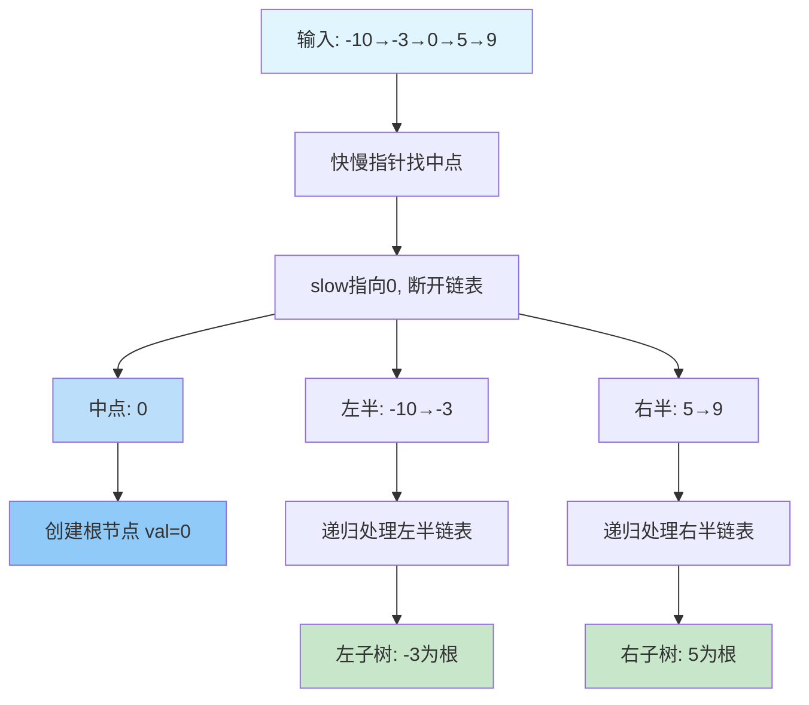
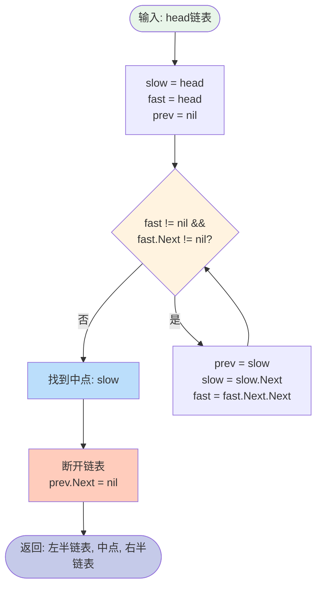
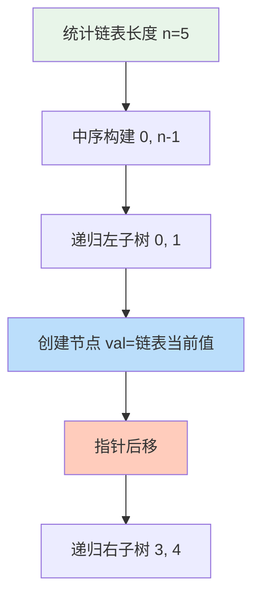

# 109. 有序链表转换二叉搜索树

## 题目描述

给定一个单链表的头节点  head ，其中的元素 按升序排序 ，将其转换为 平衡 二叉搜索树。


## 示例 1:


输入: head = [-10,-3,0,5,9]
输出: [0,-3,9,-10,null,5]
解释: 一个可能的答案是[0，-3,9，-10,null,5]，它表示所示的高度平衡的二叉搜索树。


## 示例 2:

输入: head = []
输出: []


## 提示:

- head 中的节点数在[0, 2 * 104] 范围内
- -10^5 <= Node.val <= 10^5

## 解题思路

### 问题分析

这道题是 **LeetCode 108** 的升级版，核心差异：

| 维度 | 108题 | 109题 |
|------|-------|-------|
| 数据结构 | 有序数组 | 有序链表 |
| 访问方式 | O(1)随机访问 | O(n)顺序访问 |
| 找中点 | 直接计算索引 | 需要遍历/快慢指针 |
| 难度提升 | ⭐⭐ | ⭐⭐⭐ |

**关键挑战**：链表无法像数组那样 O(1) 访问中间元素！

### 方法一：快慢指针 + 递归（最优解）

**核心思想**：使用**快慢指针**找链表中点，然后递归构建



**快慢指针找中点技巧**：



**算法步骤**：

1. **边界处理**：链表为空或只有一个节点
2. **找中点**：快指针走2步，慢指针走1步
3. **断开链表**：将链表分为左半和右半
4. **递归构建**：
   - 创建根节点（中点值）
   - 递归处理左半链表 → 左子树
   - 递归处理右半链表 → 右子树

**代码实现**：

```go
func sortedListToBST(head *ListNode) *TreeNode {
    if head == nil {
        return nil
    }
    if head.Next == nil {
        return &TreeNode{Val: head.Val}
    }
    
    // 快慢指针找中点
    slow, fast, prev := head, head, (*ListNode)(nil)
    for fast != nil && fast.Next != nil {
        prev = slow
        slow = slow.Next
        fast = fast.Next.Next
    }
    
    // 断开链表
    prev.Next = nil
    
    // 构建树
    root := &TreeNode{Val: slow.Val}
    root.Left = sortedListToBST(head)      // 左半链表
    root.Right = sortedListToBST(slow.Next) // 右半链表
    
    return root
}
```

**时间复杂度**：O(n log n)
- 每层递归需要 O(n) 时间找中点
- 递归深度 O(log n)

**空间复杂度**：O(log n) - 递归栈

### 方法二：转换为数组

**核心思想**：先将链表转为数组，然后用108题的方法


**优缺点分析**：

| 维度 | 评价 |
|------|------|
| 实现难度 | ⭐ 简单，复用108题代码 |
| 时间复杂度 | O(n) 遍历 + O(n) 构建 = O(n) ✅ |
| 空间复杂度 | O(n) 数组存储 ❌ |
| 适用场景 | 空间充足、追求简洁 |

### 方法三：中序遍历模拟（最巧妙）

**核心洞察**：BST的**中序遍历**恰好是有序序列！

**算法思路**：

1. 先统计链表长度 n
2. 按中序遍历顺序构建树（左-根-右）
3. 用全局指针记录当前链表节点



**为什么有效？**

```
链表: -10 → -3 → 0 → 5 → 9
      ↑
中序遍历顺序构建树时，依次消费链表节点
```

**时间复杂度**：O(n) - 每个节点访问一次 ✅  
**空间复杂度**：O(log n) - 递归栈

### 方法四：递归 + 计算长度

**优化思路**：避免每次都找中点

1. 先遍历一次计算链表总长度
2. 递归时传递子链表的起始位置和长度
3. 根据长度计算中点位置

### 复杂度对比

| 方法 | 时间复杂度 | 空间复杂度 | 优点 | 缺点 |
|------|-----------|-----------|------|------|
| 快慢指针 | O(n log n) | O(log n) | 直观易懂 | 重复遍历 |
| 转数组 | O(n) | O(n) | 简单快速 | 额外空间 |
| 中序遍历 | O(n) | O(log n) | 最优解 | 较难理解 |
| 计算长度 | O(n) | O(log n) | 避免重复 | 需要预处理 |

### 关键技巧总结

1. **快慢指针找中点**：
   ```go
   slow, fast := head, head
   for fast != nil && fast.Next != nil {
       slow = slow.Next
       fast = fast.Next.Next
   }
   // slow 指向中点
   ```

2. **断开链表**：需要记录 prev 指针

3. **中序遍历技巧**：全局指针顺序消费链表节点

4. **长度计算优化**：避免重复遍历

### 与108题对比

| 维度 | 108题（数组） | 109题（链表） |
|------|-------------|--------------|
| 找中点 | O(1)计算索引 | O(n)快慢指针 |
| 分割 | O(1)传递索引 | O(1)断开链表 |
| 总复杂度 | O(n) | O(n log n) 或 O(n) |
| 实现难度 | ⭐⭐ | ⭐⭐⭐ |

### 扩展问题

1. 如果链表是循环链表怎么办？
2. 如何在O(n)时间、O(1)空间完成？（不计递归栈）
3. 如果要求构建完全二叉搜索树？
4. 如何处理链表中有重复元素的情况？

### 相关题目

- **LeetCode 108**：有序数组转BST（前置题）
- **LeetCode 110**：平衡二叉树
- **LeetCode 876**：链表的中间结点
- **LeetCode 1382**：将BST变平衡
