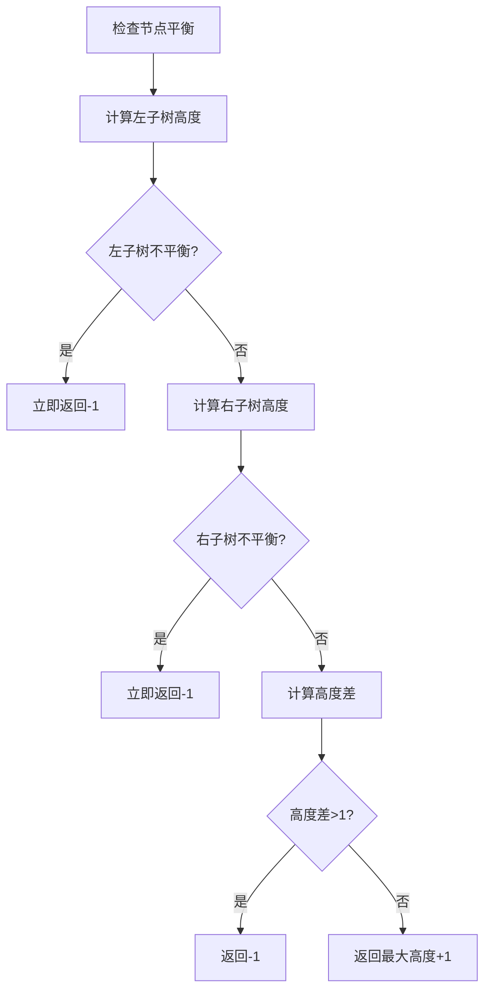

# 110. 平衡二叉树

## 题目描述

给定一个二叉树，判断它是否是 平衡二叉树  


## 示例 1：


输入：root = [3,9,20,null,null,15,7]
输出：true


## 示例 2：


输入：root = [1,2,2,3,3,null,null,4,4]
输出：false


## 示例 3：

输入：root = []
输出：true


## 提示：

- 树中的节点数在范围 [0, 5000] 内
- -10^4 <= Node.val <= 10^4

## 解题思路

### 问题深度分析

这是经典的**平衡二叉树判断**问题，核心在于理解**平衡二叉树的定义**和掌握**自底向上的递归**方法。虽然题目看起来简单，但它是理解树的性质、递归优化和剪枝技巧的重要题目。

#### 问题本质

给定一个二叉树，判断它是否是平衡二叉树。平衡二叉树的定义：
- **平衡条件**：任意节点的左右子树高度差不超过1
- **递归性质**：一棵树是平衡的，当且仅当：
  1. 左子树是平衡的
  2. 右子树是平衡的
  3. 左右子树高度差不超过1

关键问题：
- **高度计算**：需要计算每个节点的子树高度
- **平衡检查**：在计算高度的同时检查平衡性
- **优化策略**：自底向上递归，一旦发现不平衡立即返回

#### 核心思想

**方法一：自底向上递归（最优解法）**
1. **递归定义**：checkHeight(root) 返回子树高度，如果不平衡返回-1
2. **终止条件**：root == nil 返回 0
3. **递归计算**：
   - 计算左子树高度，如果不平衡直接返回-1
   - 计算右子树高度，如果不平衡直接返回-1
   - 检查高度差，如果>1返回-1
   - 否则返回max(左高度, 右高度) + 1
4. **剪枝优化**：一旦发现不平衡，立即返回，避免继续计算

**方法二：自顶向下递归（直观但低效）**
1. **递归定义**：isBalanced(root) = isBalanced(root.left) && isBalanced(root.right) && abs(height(root.left) - height(root.right)) <= 1
2. **计算高度**：单独计算每个节点的子树高度
3. **检查平衡**：检查当前节点和递归检查子树
4. **时间复杂度**：O(n²)，因为每个节点都要计算高度

**方法三：迭代BFS（层序遍历）**
1. **使用队列**：逐层遍历二叉树
2. **计算高度**：对每个节点计算其子树高度
3. **检查平衡**：检查每个节点的左右子树高度差
4. **时间复杂度**：O(n²)，需要多次计算高度

**方法四：迭代DFS（使用栈）**
1. **使用栈**：存储节点和对应状态
2. **后序遍历**：先处理子节点，再处理父节点
3. **维护高度**：使用哈希表记录每个节点的高度
4. **检查平衡**：处理节点时检查其子树高度差

#### 关键难点分析

**难点1：时间复杂度优化**
- 自顶向下方法：每个节点都要计算高度，时间复杂度O(n²)
- 自底向上方法：在计算高度的同时检查平衡，时间复杂度O(n)
- 关键：使用-1作为不平衡标记，实现剪枝

**难点2：高度计算与平衡检查的结合**
- 需要同时返回高度和平衡状态
- 使用-1表示不平衡，正数表示高度
- 需要在递归过程中及时剪枝

**难点3：边界条件处理**
- 空树是平衡的（返回true）
- 单节点树是平衡的（高度差为0）
- 需要正确处理nil节点

#### 典型情况分析

**情况1：平衡二叉树**
```
        3
       / \
      9   20
         /  \
        15   7
```
- 节点3：左高度1，右高度2，差1，平衡
- 节点20：左高度1，右高度1，差0，平衡
- 整棵树平衡，返回true

**情况2：不平衡二叉树**
```
        1
       / \
      2   2
     / \
    3   3
   / \
  4   4
```
- 节点1：左高度3，右高度1，差2，不平衡
- 返回false

**情况3：空树**
```
null
```
- 空树是平衡的，返回true

**情况4：单节点树**
```
  1
```
- 单节点树是平衡的，返回true

**情况5：链状树（不平衡）**
```
  1
   \
    2
     \
      3
```
- 节点1：左高度0，右高度2，差2，不平衡
- 返回false

#### 算法对比

| 算法            | 时间复杂度 | 空间复杂度 | 特点                   |
| --------------- | ---------- | ---------- | ---------------------- |
| 自底向上递归    | O(n)       | O(h)       | **最优解法**，剪枝优化 |
| 自顶向下递归    | O(n²)      | O(h)       | 直观但低效             |
| 迭代BFS         | O(n²)      | O(n)       | 需要多次计算高度       |
| 迭代DFS（后序） | O(n)       | O(n)       | 使用栈和哈希表         |

注：n为节点数，h为树高度

### 算法流程图

#### 主算法流程（自底向上递归）

```mermaid
graph TD
    A[isBalanced(root)] --> B{root==nil?}
    B -->|是| C[return true]
    B -->|否| D[checkHeight(root)]
    D --> E{返回值==-1?}
    E -->|是| F[return false]
    E -->|否| G[return true]
    
    H[checkHeight(node)] --> I{node==nil?}
    I -->|是| J[return 0]
    I -->|否| K[leftHeight = checkHeight(node.Left)]
    K --> L{leftHeight==-1?}
    L -->|是| M[return -1]
    L -->|否| N[rightHeight = checkHeight(node.Right)]
    N --> O{rightHeight==-1?}
    O -->|是| P[return -1]
    O -->|否| Q{abs leftHeight-rightHeight > 1?}
    Q -->|是| R[return -1]
    Q -->|否| S[return max leftHeight,rightHeight + 1]
```

#### 平衡检查流程



### 复杂度分析

#### 时间复杂度详解

**自底向上递归算法**：O(n)
- 每个节点只访问一次
- 在计算高度的同时检查平衡
- 一旦发现不平衡立即返回，实现剪枝
- 总时间：O(n)

**自顶向下递归算法**：O(n²)
- 每个节点都要计算其子树高度
- 计算高度需要O(n)时间
- n个节点，总时间：O(n²)

**迭代BFS算法**：O(n²)
- 需要遍历所有节点
- 对每个节点计算子树高度，需要O(n)时间
- n个节点，总时间：O(n²)

**迭代DFS算法**：O(n)
- 每个节点只访问一次
- 使用哈希表记录高度，避免重复计算
- 总时间：O(n)

#### 空间复杂度详解

**自底向上递归算法**：O(h)
- 递归调用栈深度为树高度
- 最坏情况（链状树）：O(n)
- 最好情况（平衡树）：O(log n)
- 总空间：O(h)

**自顶向下递归算法**：O(h)
- 递归调用栈深度为树高度
- 最坏情况（链状树）：O(n)
- 最好情况（平衡树）：O(log n)
- 总空间：O(h)

**迭代BFS算法**：O(n)
- 需要队列存储节点
- 最坏情况（完全二叉树）：队列大小为叶子节点数，约为n/2
- 总空间：O(n)

**迭代DFS算法**：O(n)
- 需要栈存储节点
- 需要哈希表记录高度，大小为O(n)
- 总空间：O(n)

### 关键优化技巧

#### 技巧1：自底向上递归（最优解法）

```go
func isBalanced(root *TreeNode) bool {
    return checkHeight(root) != -1
}

func checkHeight(root *TreeNode) int {
    if root == nil {
        return 0
    }
    
    // 检查左子树
    leftHeight := checkHeight(root.Left)
    if leftHeight == -1 {
        return -1  // 左子树不平衡，立即返回
    }
    
    // 检查右子树
    rightHeight := checkHeight(root.Right)
    if rightHeight == -1 {
        return -1  // 右子树不平衡，立即返回
    }
    
    // 检查当前节点是否平衡
    if abs(leftHeight - rightHeight) > 1 {
        return -1  // 不平衡
    }
    
    // 返回当前节点的高度
    return max(leftHeight, rightHeight) + 1
}

func abs(x int) int {
    if x < 0 {
        return -x
    }
    return x
}

func max(a, b int) int {
    if a > b {
        return a
    }
    return b
}
```

**优势**：
- 时间复杂度：O(n)
- 空间复杂度：O(h)
- 剪枝优化：一旦发现不平衡立即返回
- 代码简洁，逻辑清晰

#### 技巧2：自顶向下递归

```go
func isBalanced(root *TreeNode) bool {
    if root == nil {
        return true
    }
    
    // 检查当前节点
    leftHeight := getHeight(root.Left)
    rightHeight := getHeight(root.Right)
    if abs(leftHeight - rightHeight) > 1 {
        return false
    }
    
    // 递归检查子树
    return isBalanced(root.Left) && isBalanced(root.Right)
}

func getHeight(root *TreeNode) int {
    if root == nil {
        return 0
    }
    return max(getHeight(root.Left), getHeight(root.Right)) + 1
}
```

**特点**：直观易懂，但时间复杂度O(n²)

#### 技巧3：迭代BFS

```go
func isBalanced(root *TreeNode) bool {
    if root == nil {
        return true
    }
    
    queue := []*TreeNode{root}
    
    for len(queue) > 0 {
        node := queue[0]
        queue = queue[1:]
        
        // 计算左右子树高度
        leftHeight := getHeight(node.Left)
        rightHeight := getHeight(node.Right)
        
        // 检查平衡
        if abs(leftHeight - rightHeight) > 1 {
            return false
        }
        
        // 将子节点入队
        if node.Left != nil {
            queue = append(queue, node.Left)
        }
        if node.Right != nil {
            queue = append(queue, node.Right)
        }
    }
    
    return true
}
```

**特点**：使用队列遍历，但需要多次计算高度

#### 技巧4：迭代DFS（后序遍历）

```go
func isBalanced(root *TreeNode) bool {
    if root == nil {
        return true
    }
    
    type item struct {
        node   *TreeNode
        visited bool
    }
    
    stack := []item{{root, false}}
    heightMap := make(map[*TreeNode]int)
    heightMap[nil] = 0
    
    for len(stack) > 0 {
        curr := stack[len(stack)-1]
        stack = stack[:len(stack)-1]
        
        if curr.visited {
            // 处理节点
            leftHeight := heightMap[curr.node.Left]
            rightHeight := heightMap[curr.node.Right]
            
            if abs(leftHeight - rightHeight) > 1 {
                return false
            }
            
            heightMap[curr.node] = max(leftHeight, rightHeight) + 1
        } else {
            // 后序遍历：右-左-根
            stack = append(stack, item{curr.node, true})
            if curr.node.Right != nil {
                stack = append(stack, item{curr.node.Right, false})
            }
            if curr.node.Left != nil {
                stack = append(stack, item{curr.node.Left, false})
            }
        }
    }
    
    return true
}
```

**特点**：使用栈和哈希表，避免重复计算高度

### 边界条件处理

#### 边界情况1：空树
- **处理**：返回true（空树是平衡的）
- **验证**：root为nil时直接返回true

#### 边界情况2：单节点树
- **处理**：返回true（单节点树是平衡的）
- **验证**：左右子树高度都为0，差为0，平衡

#### 边界情况3：完全平衡树
- **处理**：所有节点左右子树高度差不超过1
- **验证**：递归检查所有节点

#### 边界情况4：链状树（不平衡）
- **处理**：高度差超过1，返回false
- **验证**：如[1,null,2,null,3]，节点1的左右高度差为2，不平衡

#### 边界情况5：只有一侧子树
- **处理**：一侧高度为0，另一侧高度为h，差为h
- **验证**：如果h>1，不平衡；如果h<=1，平衡

### 测试用例设计

#### 基础测试用例

1. **平衡二叉树**：`[3,9,20,null,null,15,7]` → `true`
2. **不平衡二叉树**：`[1,2,2,3,3,null,null,4,4]` → `false`
3. **空树**：`[]` → `true`
4. **单节点**：`[1]` → `true`

#### 进阶测试用例

5. **链状树（不平衡）**：`[1,null,2,null,3]` → `false`
6. **左偏树（不平衡）**：`[1,2,null,3]` → `false`
7. **完全平衡树**：`[1,2,3,4,5,6,7]` → `true`
8. **一侧子树高度差1**：`[1,2,3,4]` → `true`
9. **一侧子树高度差2**：`[1,2,2,3,3,3,3,4,4,4,4,4,4,4,4]` → `false`
10. **复杂不平衡树**：`[1,2,2,3,null,null,3,4,null,null,4]` → `false`

### 常见错误和陷阱

#### 错误1：只检查根节点
```go
// 错误写法：只检查根节点
func isBalanced(root *TreeNode) bool {
    if root == nil {
        return true
    }
    leftHeight := getHeight(root.Left)
    rightHeight := getHeight(root.Right)
    return abs(leftHeight - rightHeight) <= 1
}

// 正确写法：递归检查所有节点
func isBalanced(root *TreeNode) bool {
    if root == nil {
        return true
    }
    leftHeight := getHeight(root.Left)
    rightHeight := getHeight(root.Right)
    if abs(leftHeight - rightHeight) > 1 {
        return false
    }
    return isBalanced(root.Left) && isBalanced(root.Right)
}
```
**原因**：平衡二叉树要求所有节点的左右子树高度差都不超过1

#### 错误2：高度差计算错误
```go
// 错误写法：使用减法
if leftHeight - rightHeight > 1 {
    return false
}

// 正确写法：使用绝对值
if abs(leftHeight - rightHeight) > 1 {
    return false
}
```
**原因**：高度差可能是负数，需要使用绝对值

#### 错误3：忘记剪枝优化
```go
// 错误写法：即使子树不平衡也继续计算
leftHeight := checkHeight(root.Left)
rightHeight := checkHeight(root.Right)
if abs(leftHeight - rightHeight) > 1 {
    return -1
}

// 正确写法：一旦发现不平衡立即返回
leftHeight := checkHeight(root.Left)
if leftHeight == -1 {
    return -1  // 立即返回，不继续计算
}
```
**原因**：需要及时剪枝，避免不必要的计算

#### 错误4：高度计算错误
```go
// 错误写法：忘记+1
return max(leftHeight, rightHeight)

// 正确写法：需要+1
return max(leftHeight, rightHeight) + 1
```
**原因**：节点的高度 = max(左子树高度, 右子树高度) + 1

### 实用技巧

1. **优先使用自底向上递归**：时间复杂度O(n)，空间复杂度O(h)，最优解法
2. **使用-1作为不平衡标记**：在计算高度的同时检查平衡，实现剪枝
3. **及时剪枝**：一旦发现不平衡立即返回，避免继续计算
4. **正确计算高度**：节点高度 = max(左子树高度, 右子树高度) + 1
5. **使用绝对值**：高度差可能是负数，需要使用abs函数
6. **递归检查所有节点**：平衡二叉树要求所有节点都满足平衡条件

### 进阶扩展

#### 扩展1：返回不平衡的节点
- 在检查平衡的同时，记录第一个不平衡的节点

#### 扩展2：计算最小不平衡高度差
- 返回所有节点中最大的高度差

#### 扩展3：平衡化操作
- 对不平衡的树进行旋转操作，使其平衡

#### 扩展4：判断是否为AVL树
- AVL树是平衡二叉搜索树，需要同时检查平衡性和BST性质

### 应用场景

1. **数据结构设计**：设计平衡二叉树（AVL树、红黑树）
2. **性能优化**：确保树的高度平衡，保证操作效率
3. **算法验证**：验证树结构是否符合平衡要求
4. **树的可视化**：在可视化工具中检查树的平衡性
5. **数据库索引**：B+树等索引结构需要保持平衡

### 总结

平衡二叉树判断是一个经典的树遍历问题，核心在于：
1. **理解平衡定义**：任意节点的左右子树高度差不超过1
2. **自底向上递归**：在计算高度的同时检查平衡，实现剪枝优化
3. **时间复杂度优化**：使用-1作为不平衡标记，避免重复计算
4. **递归检查所有节点**：确保整棵树的所有节点都满足平衡条件

通过系统学习和练习，可以熟练掌握平衡二叉树判断的各种方法！