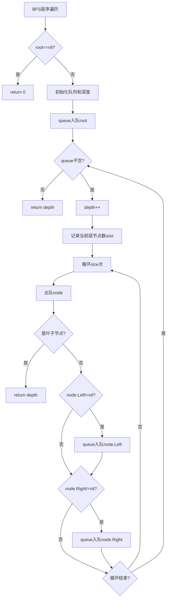

# 111. 二叉树的最小深度

## 题目描述

给定一个二叉树，找出其最小深度。

最小深度是从根节点到最近叶子节点的最短路径上的节点数量。

说明：叶子节点是指没有子节点的节点。


## 示例 1：


输入：root = [3,9,20,null,null,15,7]
输出：2


## 示例 2：

输入：root = [2,null,3,null,4,null,5,null,6]
输出：5


## 提示：

- 树中节点数的范围在 [0, 10^5] 内
- -1000 <= Node.val <= 1000

## 解题思路

### 问题深度分析

这是经典的**二叉树最小深度**问题，核心在于理解**最小深度的定义**和掌握**递归与迭代**两种遍历方式。虽然题目看起来简单，但它是理解二叉树、递归思维和树形结构遍历的重要题目。

#### 问题本质

给定一个二叉树，需要计算从根节点到最近叶子节点的最短路径上的节点数。关键问题：
- **深度定义**：从根节点到当前节点的路径长度
- **叶子节点**：没有子节点的节点
- **最小深度**：到最近叶子节点的最短路径
- **递归子结构**：树的最小深度需要特殊处理，不能简单取min(左子树深度, 右子树深度)

关键区别：
- **最大深度**：max(左深度, 右深度) + 1（即使一侧为空也取另一侧）
- **最小深度**：需要特殊处理，如果一侧为空，不能取0，必须取另一侧

#### 核心思想

**方法一：递归DFS（最优解法）**
1. **递归定义**：
   - 空树：返回0
   - 叶子节点：返回1
   - 只有一侧子树：返回另一侧深度+1
   - 两侧都有：返回min(左深度, 右深度) + 1
2. **终止条件**：root == nil 返回 0
3. **特殊处理**：必须处理只有一侧子树的情况

**方法二：迭代BFS（层序遍历）**
1. **使用队列**：逐层遍历二叉树
2. **找到第一个叶子节点**：一旦找到叶子节点，立即返回当前深度
3. **队列为空**：遍历结束，返回深度

**方法三：迭代DFS（使用栈）**
1. **使用栈**：存储节点和对应深度
2. **维护最小深度**：遍历过程中更新最小值
3. **栈为空**：遍历结束，返回最小深度

**方法四：递归DFS（简化版）**
1. **简化递归**：使用更简洁的递归逻辑
2. **处理空子树**：使用特殊值标记空子树

#### 关键难点分析

**难点1：只有一侧子树的情况**
- 如果左子树为空，右子树不为空，最小深度不能是1（根节点）
- 必须继续向下找到叶子节点
- 错误示例：`[1,2]`的最小深度不是1，而是2

**难点2：叶子节点的判断**
- 叶子节点：左右子树都为空
- 最小深度必须到达叶子节点，不能只到中间节点

**难点3：与最大深度的区别**
- 最大深度：即使一侧为空，也取另一侧
- 最小深度：如果一侧为空，必须取另一侧（不能取0）

#### 典型情况分析

**情况1：完全二叉树**
```
    3
   / \
  9  20
    /  \
   15   7
```
- 节点9是叶子节点，深度为2
- 节点15和7是叶子节点，深度为3
- 最小深度 = 2（到节点9）

**情况2：链状树**
```
  2
   \
    3
     \
      4
       \
        5
         \
          6
```
- 最小深度 = 5（到节点6）
- 所有节点都只有右子树，必须到最底层

**情况3：只有一侧子树**
```
  1
 /
2
```
- 最小深度 = 2（到节点2）
- 不能返回1，因为节点1不是叶子节点

**情况4：单节点树**
```
  1
```
- 最小深度 = 1（节点1是叶子节点）

**情况5：空树**
```
null
```
- 最小深度 = 0

#### 算法对比

| 算法          | 时间复杂度 | 空间复杂度 | 特点                     |
| ------------- | ---------- | ---------- | ------------------------ |
| 递归DFS       | O(n)       | O(h)       | **最优解法**，代码简洁   |
| 迭代BFS       | O(n)       | O(w)       | 找到第一个叶子节点即返回 |
| 迭代DFS（栈） | O(n)       | O(h)       | 需要遍历所有节点         |
| 递归DFS简化   | O(n)       | O(h)       | 代码更简洁               |

注：n为节点数，h为树高度，w为树的最大宽度

### 算法流程图

#### 主算法流程（递归DFS）

```mermaid
graph TD
    A[minDepth(root)] --> B{root==nil?}
    B -->|是| C[return 0]
    B -->|否| D{是叶子节点?}
    D -->|是| E[return 1]
    D -->|否| F{只有左子树?}
    F -->|是| G[return minDepth left + 1]
    F -->|否| H{只有右子树?}
    H -->|是| I[return minDepth right + 1]
    H -->|否| J[return min minDepth left, minDepth right + 1]
```

#### BFS层序遍历流程



### 复杂度分析

#### 时间复杂度详解

**递归DFS算法**：O(n)
- 需要访问树的所有节点
- 每个节点访问一次
- 每次访问进行常数时间操作
- 总时间：O(n)

**迭代BFS算法**：O(n)
- 最坏情况需要访问所有节点
- 最好情况找到第一个叶子节点即返回
- 平均情况：O(n)
- 总时间：O(n)

**迭代DFS算法**：O(n)
- 需要访问树的所有节点
- 每个节点访问一次
- 每次访问进行常数时间操作
- 总时间：O(n)

#### 空间复杂度详解

**递归DFS算法**：O(h)
- 递归调用栈深度为树高度
- 最坏情况（链状树）：O(n)
- 最好情况（平衡树）：O(log n)
- 总空间：O(h)

**迭代BFS算法**：O(w)
- 需要队列存储节点
- 最坏情况（完全二叉树）：队列大小为叶子节点数，约为n/2
- 最好情况（链状树）：O(1)
- 总空间：O(w)，w为树的最大宽度

**迭代DFS算法**：O(h)
- 需要栈存储节点
- 最坏情况（链状树）：O(n)
- 最好情况（平衡树）：O(log n)
- 总空间：O(h)

### 关键优化技巧

#### 技巧1：递归DFS（最优解法）

```go
func minDepth(root *TreeNode) int {
    if root == nil {
        return 0
    }
    
    // 叶子节点
    if root.Left == nil && root.Right == nil {
        return 1
    }
    
    // 只有右子树
    if root.Left == nil {
        return minDepth(root.Right) + 1
    }
    
    // 只有左子树
    if root.Right == nil {
        return minDepth(root.Left) + 1
    }
    
    // 都有，取最小
    return min(minDepth(root.Left), minDepth(root.Right)) + 1
}

func min(a, b int) int {
    if a < b {
        return a
    }
    return b
}
```

**优势**：
- 时间复杂度：O(n)
- 空间复杂度：O(h)
- 代码简洁，逻辑清晰
- 正确处理所有边界情况

#### 技巧2：迭代BFS（找到第一个叶子节点即返回）

```go
func minDepth(root *TreeNode) int {
    if root == nil {
        return 0
    }
    
    queue := []*TreeNode{root}
    depth := 0
    
    for len(queue) > 0 {
        size := len(queue)
        depth++
        
        // 处理当前层的所有节点
        for i := 0; i < size; i++ {
            node := queue[0]
            queue = queue[1:]
            
            // 找到第一个叶子节点，立即返回
            if node.Left == nil && node.Right == nil {
                return depth
            }
            
            // 将子节点入队
            if node.Left != nil {
                queue = append(queue, node.Left)
            }
            if node.Right != nil {
                queue = append(queue, node.Right)
            }
        }
    }
    
    return depth
}
```

**特点**：找到第一个叶子节点即返回，效率高

#### 技巧3：迭代DFS（使用栈）

```go
func minDepth(root *TreeNode) int {
    if root == nil {
        return 0
    }
    
    type item struct {
        node  *TreeNode
        depth int
    }
    
    stack := []item{{root, 1}}
    minDep := math.MaxInt32
    
    for len(stack) > 0 {
        curr := stack[len(stack)-1]
        stack = stack[:len(stack)-1]
        
        // 叶子节点，更新最小深度
        if curr.node.Left == nil && curr.node.Right == nil {
            if curr.depth < minDep {
                minDep = curr.depth
            }
        }
        
        // 将子节点入栈
        if curr.node.Right != nil {
            stack = append(stack, item{curr.node.Right, curr.depth + 1})
        }
        if curr.node.Left != nil {
            stack = append(stack, item{curr.node.Left, curr.depth + 1})
        }
    }
    
    return minDep
}
```

**特点**：使用栈模拟DFS，需要遍历所有节点

#### 技巧4：递归DFS（简化版）

```go
func minDepth(root *TreeNode) int {
    if root == nil {
        return 0
    }
    
    left := minDepth(root.Left)
    right := minDepth(root.Right)
    
    // 如果一侧为空，必须取另一侧
    if left == 0 || right == 0 {
        return left + right + 1
    }
    
    // 都有，取最小
    return min(left, right) + 1
}
```

**特点**：代码更简洁，但逻辑稍复杂

### 边界条件处理

#### 边界情况1：空树
- **处理**：返回0
- **验证**：root为nil时直接返回0

#### 边界情况2：单节点树
- **处理**：返回1（节点是叶子节点）
- **验证**：左右子树都为空，返回1

#### 边界情况3：只有一侧子树
- **处理**：返回另一侧深度+1
- **验证**：如`[1,2]`，最小深度为2

#### 边界情况4：链状树
- **处理**：必须到最底层叶子节点
- **验证**：如`[2,null,3,null,4,null,5,null,6]`，最小深度为5

#### 边界情况5：完全二叉树
- **处理**：找到最近的叶子节点
- **验证**：如`[3,9,20,null,null,15,7]`，最小深度为2（到节点9）

### 测试用例设计

#### 基础测试用例

1. **完全二叉树**：`[3,9,20,null,null,15,7]` → `2`
2. **链状树**：`[2,null,3,null,4,null,5,null,6]` → `5`
3. **空树**：`[]` → `0`
4. **单节点**：`[1]` → `1`

#### 进阶测试用例

5. **只有左子树**：`[1,2]` → `2`
6. **只有右子树**：`[1,null,2]` → `2`
7. **完全平衡树**：`[1,2,3,4,5,6,7]` → `3`
8. **不平衡树**：`[1,2,3,4]` → `2`
9. **单侧链状树**：`[1,2,null,3]` → `3`
10. **复杂树**：`[1,2,3,4,5,null,6,7]` → `2`

### 常见错误和陷阱

#### 错误1：没有处理只有一侧子树的情况
```go
// 错误写法：直接取min
func minDepthWrong(root *TreeNode) int {
    if root == nil {
        return 0
    }
    left := minDepthWrong(root.Left)
    right := minDepthWrong(root.Right)
    return min(left, right) + 1  // 如果一侧为0，会返回1，错误！
}

// 正确写法：特殊处理只有一侧子树的情况
func minDepth(root *TreeNode) int {
    if root == nil {
        return 0
    }
    // 叶子节点
    if root.Left == nil && root.Right == nil {
        return 1
    }
    // 只有右子树
    if root.Left == nil {
        return minDepth(root.Right) + 1
    }
    // 只有左子树
    if root.Right == nil {
        return minDepth(root.Left) + 1
    }
    // 都有，取最小
    return min(minDepth(root.Left), minDepth(root.Right)) + 1
}
```
**原因**：如果一侧为空，返回0，min(0, 右深度) + 1 = 1，但实际应该继续向下找到叶子节点

#### 错误2：没有检查叶子节点
```go
// 错误写法：没有检查叶子节点
func minDepthWrong(root *TreeNode) int {
    if root == nil {
        return 0
    }
    return min(minDepthWrong(root.Left), minDepthWrong(root.Right)) + 1
}

// 正确写法：检查叶子节点
if root.Left == nil && root.Right == nil {
    return 1
}
```
**原因**：最小深度必须到达叶子节点，不能只到中间节点

#### 错误3：BFS没有找到第一个叶子节点就返回
```go
// 错误写法：遍历完所有节点
for len(queue) > 0 {
    node := queue[0]
    queue = queue[1:]
    // 没有检查叶子节点
    // ...
}

// 正确写法：找到第一个叶子节点立即返回
if node.Left == nil && node.Right == nil {
    return depth
}
```
**原因**：BFS的优势是找到第一个叶子节点即返回，需要及时检查

#### 错误4：深度计算错误
```go
// 错误写法：忘记+1
return min(minDepth(root.Left), minDepth(root.Right))

// 正确写法：需要+1
return min(minDepth(root.Left), minDepth(root.Right)) + 1
```
**原因**：节点深度 = 子树深度 + 1

### 实用技巧

1. **优先使用递归DFS**：代码简洁，逻辑清晰，易于理解和实现
2. **特殊处理只有一侧子树**：不能简单取min，必须继续向下
3. **检查叶子节点**：最小深度必须到达叶子节点
4. **BFS优化**：找到第一个叶子节点即返回，效率高
5. **边界条件**：空树返回0，单节点返回1
6. **与最大深度的区别**：最大深度可以取max，最小深度需要特殊处理

### 进阶扩展

#### 扩展1：返回最小深度路径
- 在计算最小深度的同时，记录路径

#### 扩展2：计算所有叶子节点的深度
- 返回所有叶子节点的深度列表

#### 扩展3：找到最小深度的所有叶子节点
- 返回所有达到最小深度的叶子节点

#### 扩展4：最小深度与最大深度的关系
- 分析最小深度和最大深度的关系

### 应用场景

1. **树的基本操作**：理解树结构的基础
2. **路径查找**：找到最短路径
3. **性能优化**：在树结构中查找最近节点
4. **算法设计**：理解递归和迭代的区别
5. **数据结构**：理解二叉树的性质

### 总结

二叉树最小深度是一个经典的树遍历问题，核心在于：
1. **理解最小深度定义**：到最近叶子节点的最短路径
2. **特殊处理只有一侧子树**：不能简单取min，必须继续向下
3. **检查叶子节点**：最小深度必须到达叶子节点
4. **递归与迭代**：掌握多种实现方式

通过系统学习和练习，可以熟练掌握二叉树最小深度的各种方法！