# 112. 路径总和

## 描述

给你二叉树的根节点 root 和一个表示目标和的整数 targetSum 。判断该树中是否存在 根节点到叶子节点 的路径，这条路径上所有节点值相加等于目标和 targetSum 。如果存在，返回 true ；否则，返回 false 。

叶子节点 是指没有子节点的节点。

## 示例 1

输入：root = [5,4,8,11,null,13,4,7,2,null,null,null,1], targetSum = 22
输出：true
解释：等于目标和的根节点到叶节点路径如上图所示。

## 示例 2

输入：root = [1,2,3], targetSum = 5
输出：false
解释：树中存在两条根节点到叶子节点的路径：
(1 --> 2): 和为 3
(1 --> 3): 和为 4
不存在 sum = 5 的根节点到叶子节点的路径。

## 示例 3

输入：root = [], targetSum = 0
输出：false
解释：由于树是空的，所以不存在根节点到叶子节点的路径。

## 提示

- 树中节点的数目在范围 [0, 5000] 内
- -1000 <= Node.val <= 1000
- -1000 <= targetSum <= 1000

## 解题思路

### 算法分析

这道题的核心是**二叉树递归遍历**和**路径和计算**。主要涉及：

1. **深度优先搜索（DFS）**：遍历从根节点到叶子节点的所有路径
2. **递归思想**：将大问题分解为子问题
3. **路径和累加**：在遍历过程中累加节点值
4. **叶子节点判断**：确定路径的终点

### 问题本质分析

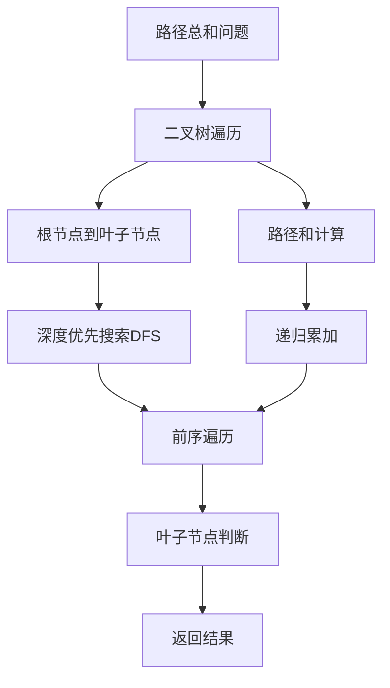

### 递归思路分析

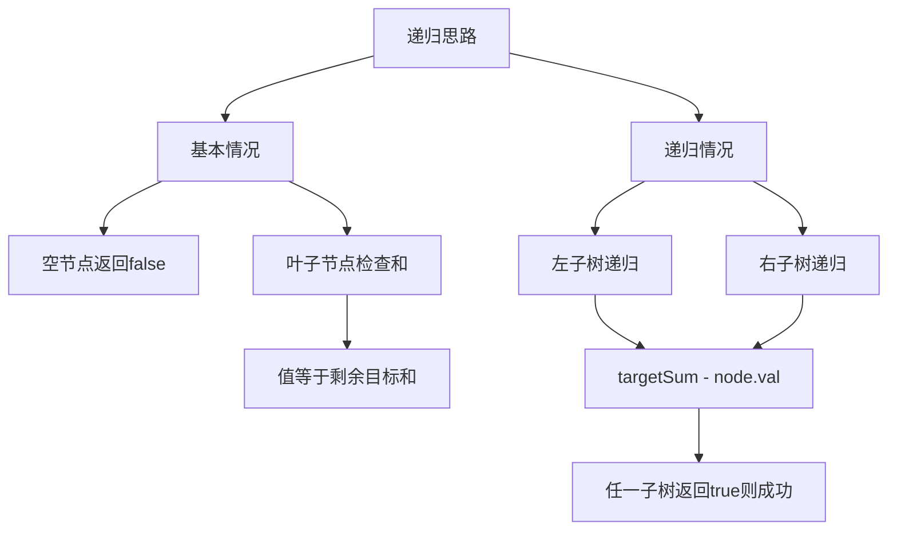

### 算法流程详解

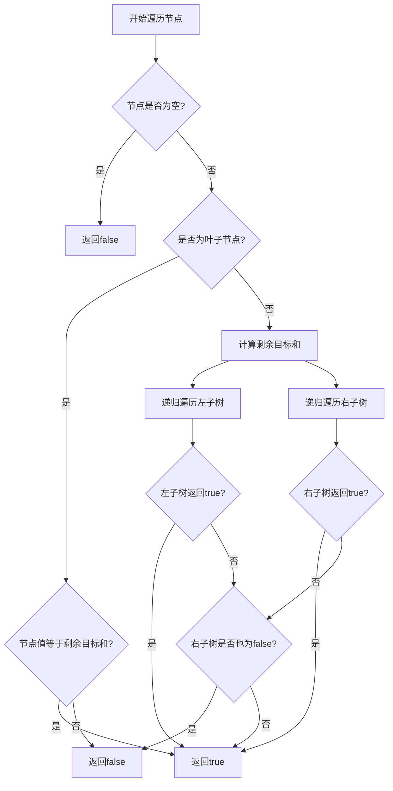

### 叶子节点判断

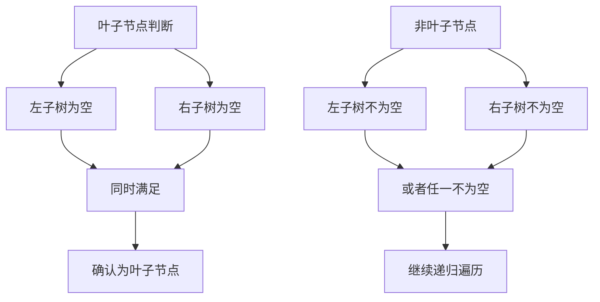

### 递归状态转移

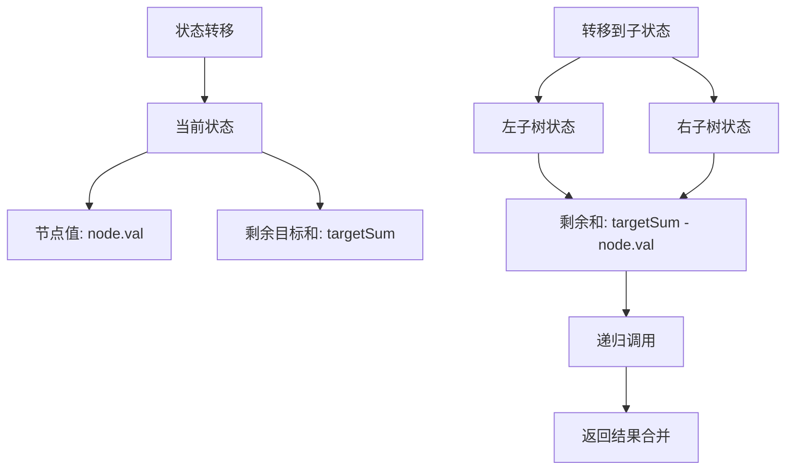

### 代码实现思路

1. **节点定义**：
   - 标准二叉树节点结构
   - 包含值、左子树、右子树指针

2. **递归函数设计**：
   - 参数：当前节点、剩余目标和
   - 返回值：是否存在满足条件的路径
   - 边界条件：空节点和叶子节点

3. **路径判断逻辑**：
   - 空节点直接返回false
   - 叶子节点检查值是否等于剩余目标和
   - 非叶子节点递归检查左右子树

### 时间复杂度分析

- **时间复杂度**：O(n)，其中n是树中节点的数量
- **空间复杂度**：O(h)，其中h是树的高度（递归栈深度）

### 关键优化点

1. **提前终止**：找到满足条件的路径立即返回
2. **短路求值**：利用逻辑或操作的短路特性
3. **递归优化**：避免不必要的重复计算
4. **边界处理**：正确处理空树和单节点情况

### 边界情况处理

1. **空树**：根节点为空，直接返回false
2. **单节点树**：根节点即为叶子节点，检查值是否等于目标和
3. **负数节点**：正确处理负值节点的情况
4. **目标和为0**：特殊情况的正确处理

### 算法变种分析

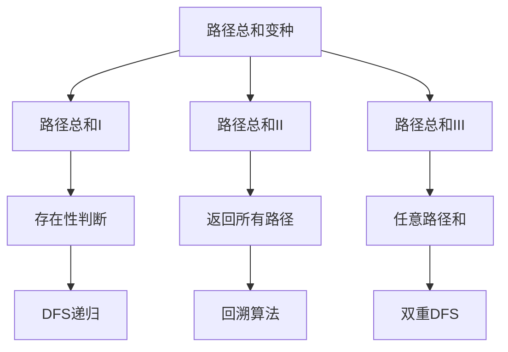

### 测试用例分析

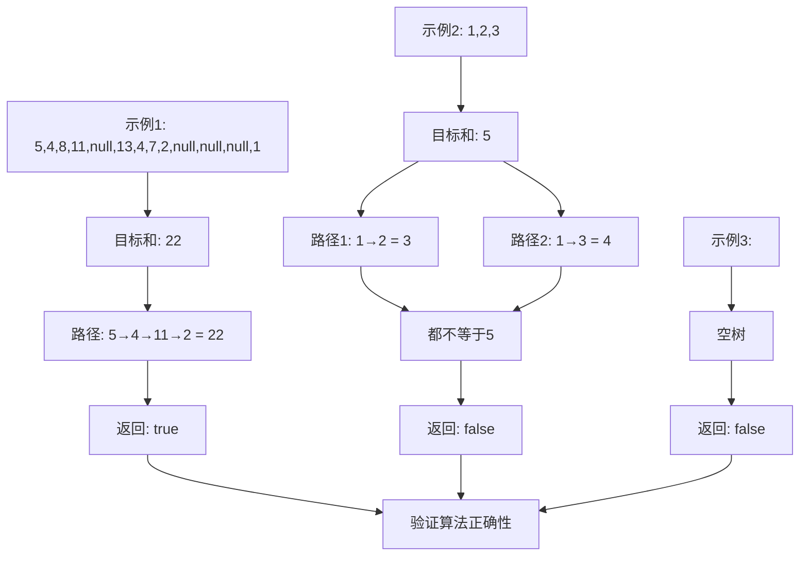

### 递归树示例

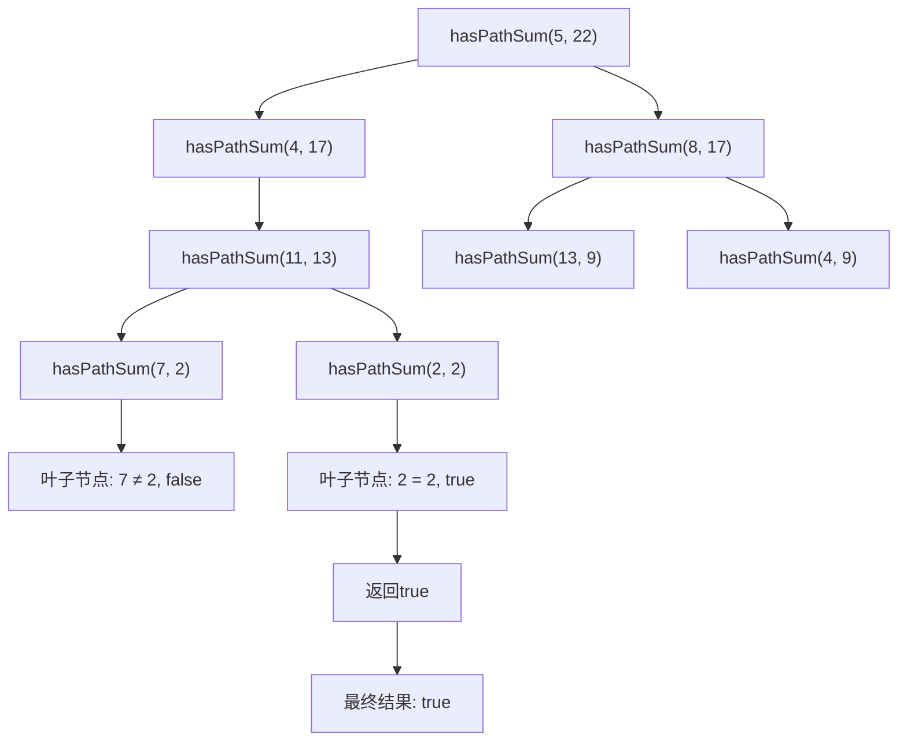

### 算法特点

1. **递归简洁**：代码结构清晰，易于理解
2. **DFS遍历**：深度优先搜索所有路径
3. **提前返回**：找到答案即可返回
4. **空间高效**：只使用递归栈空间

### 实际应用场景

1. **文件系统**：查找指定大小的文件路径
2. **游戏开发**：寻路算法中的路径代价计算
3. **决策树**：业务逻辑中的条件判断路径
4. **网络路由**：最短路径算法的变种

### 相关问题扩展

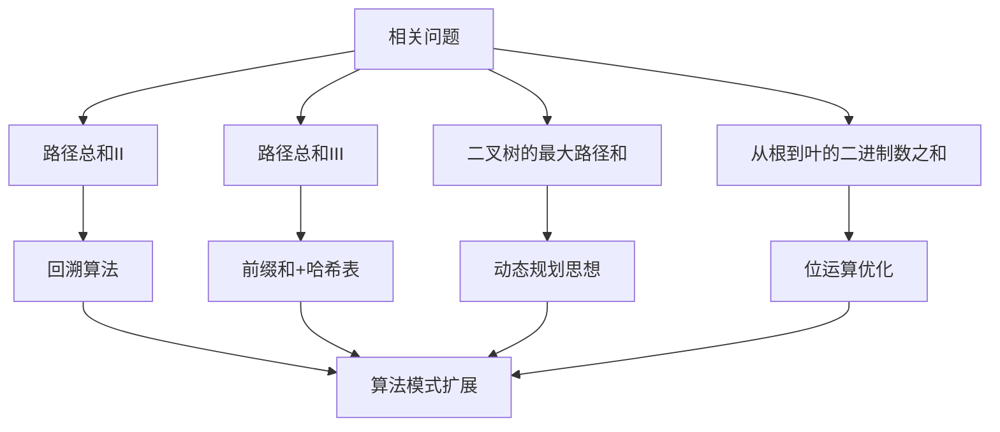

### 代码优化技巧

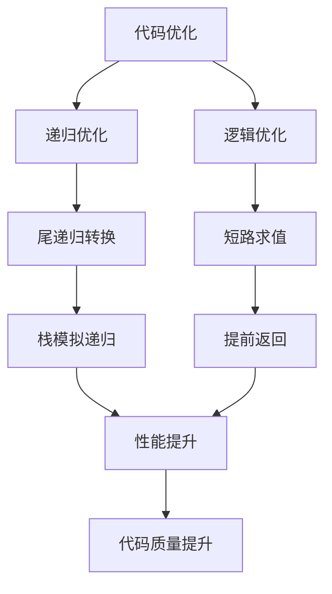

### 错误处理策略

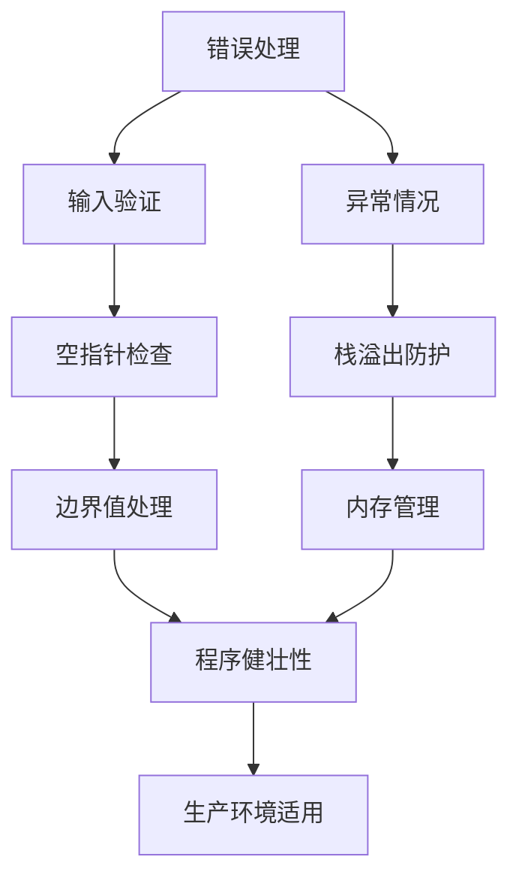

这个问题的关键在于**正确理解递归的本质**和**准确判断叶子节点**，通过深度优先搜索遍历所有可能的根到叶路径，找到满足目标和的路径。

