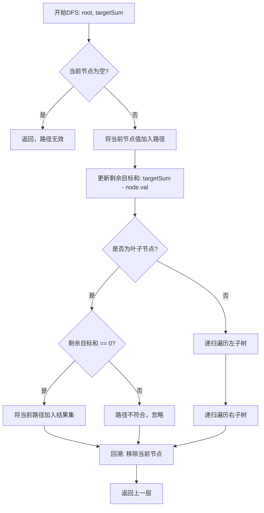
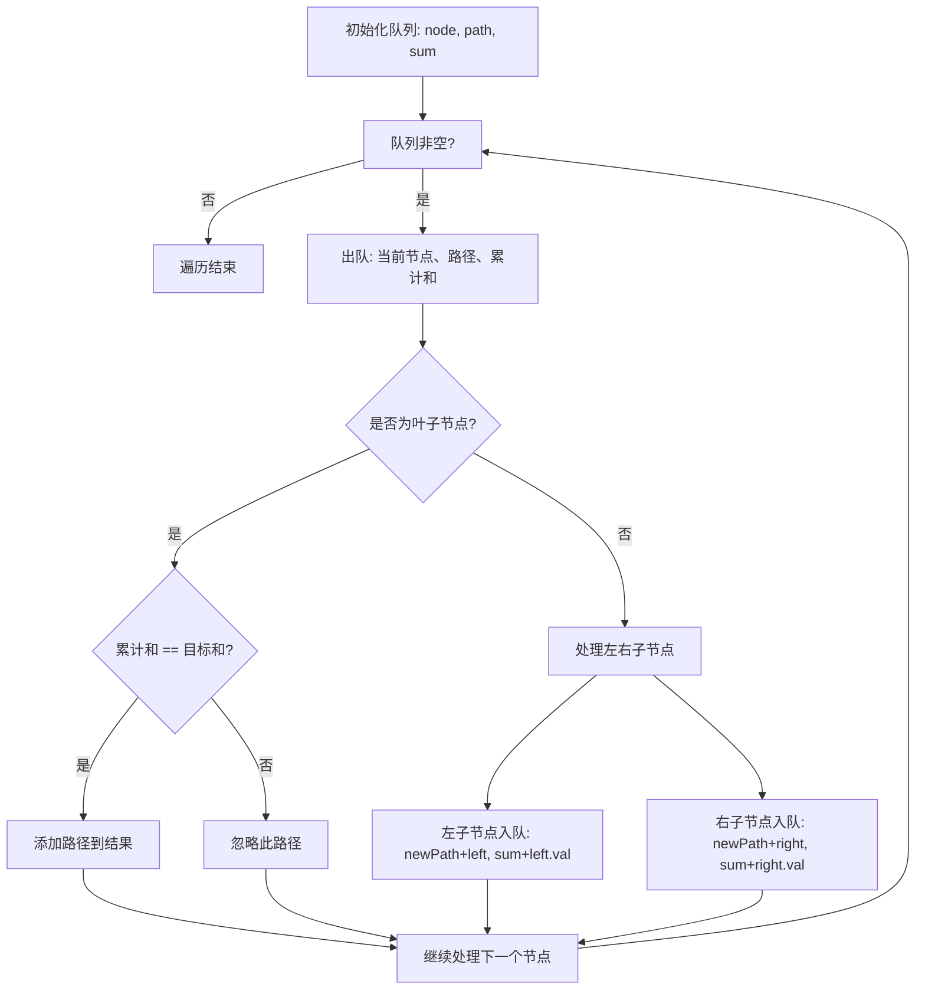

# 113. 路径总和 II

## 题目描述

给你二叉树的根节点 root 和一个整数目标和 targetSum ，找出所有 从根节点到叶子节点 路径总和等于给定目标和的路径。

叶子节点 是指没有子节点的节点。

## 示例 1：


输入：root = [5,4,8,11,null,13,4,7,2,null,null,5,1], targetSum = 22
输出：[[5,4,11,2],[5,8,4,5]]

## 示例 2：


输入：root = [1,2,3], targetSum = 5
输出：[]

## 示例 3：

输入：root = [1,2], targetSum = 0
输出：[]

## 提示：

- 树中节点总数在范围 [0, 5000] 内
- -1000 <= Node.val <= 1000
- -1000 <= targetSum <= 1000

## 解题思路

### 算法分析

这是一道经典的**二叉树路径搜索**问题，需要找到所有从根节点到叶子节点且路径和等于目标值的路径。核心思想是**深度优先搜索(DFS)** + **回溯算法**。

#### 核心思想

1. **DFS遍历**：从根节点开始，深度优先遍历所有可能路径
2. **路径记录**：在遍历过程中记录当前路径上的所有节点
3. **条件判断**：到达叶子节点时检查路径和是否等于目标值
4. **回溯处理**：遍历完一个分支后，回溯到上一层继续探索

#### 关键要素

- **叶子节点判断**：`node.Left == nil && node.Right == nil`
- **路径和计算**：累计当前路径上所有节点的值
- **结果收集**：满足条件的路径加入结果集
- **回溯机制**：确保路径状态的正确维护

#### 算法对比

| 算法 | 时间复杂度 | 空间复杂度 | 特点 |
|------|------------|------------|------|
| DFS递归回溯 | O(N) | O(H) | 经典解法，代码简洁 |
| DFS迭代栈 | O(N) | O(H) | 显式栈，空间可控 |
| BFS层序遍历 | O(N) | O(W) | 层次遍历，适合宽树 |
| Morris遍历 | O(N) | O(1) | 空间最优，实现复杂 |

注：N为节点数，H为树高，W为树的最大宽度

### DFS递归回溯流程



### 回溯机制详解

```mermaid
graph TD
    A[进入节点] --> B[path.add(node.val)]
    B --> C[递归处理子节点]
    C --> D{处理完所有子节点?}
    D -->|否| E[继续处理下一个子节点]
    D -->|是| F[path.remove(最后一个元素)]
    F --> G[返回上一层]
    E --> C
```

### 完整搜索过程

```mermaid
graph TD
    A[root=5, target=22, path=[]] --> B[path=[5], remaining=17]
    B --> C[左子树: 4]
    B --> D[右子树: 8]
    
    C --> E[path=[5,4], remaining=13]
    E --> F[左子树: 11]
    F --> G[path=[5,4,11], remaining=2]
    G --> H[左子树: 7]
    G --> I[右子树: 2]
    
    H --> J[path=[5,4,11,7], remaining=-5]
    J --> K[叶子节点，和不匹配]
    
    I --> L[path=[5,4,11,2], remaining=0]
    L --> M[叶子节点，和匹配! 收集路径]
    
    D --> N[path=[5,8], remaining=14]
    N --> O[左子树: 13]
    N --> P[右子树: 4]
    
    P --> Q[path=[5,8,4], remaining=10]
    Q --> R[左子树: 5]
    Q --> S[右子树: 1]
    
    R --> T[path=[5,8,4,5], remaining=5]
    T --> U[叶子节点，但和不为0]
    
    subgraph 结果收集
        V[收集到的路径:] 
        W[[5,4,11,2]]
        X[[5,8,4,5]]
    end
```

### BFS层序遍历方法



### 复杂度分析

#### 时间复杂度
- **访问节点**：O(N)，每个节点访问一次
- **路径复制**：O(H×K)，H为树高，K为有效路径数
- **总体时间**：O(N + H×K)，通常简化为O(N)

#### 空间复杂度
- **递归栈**：O(H)，最大递归深度
- **路径存储**：O(H)，当前路径最大长度
- **结果存储**：O(H×K)，K个路径，每个最长H
- **总体空间**：O(H + H×K) = O(H×K)

### 关键实现技巧

#### 1. 路径状态管理
```go
// 方法1: 值传递（自动回溯）
func dfs(node *TreeNode, targetSum int, path []int, result *[][]int) {
    if node == nil {
        return
    }
    
    // 添加当前节点到路径（新切片）
    newPath := append(path, node.Val)
    
    if node.Left == nil && node.Right == nil && targetSum == node.Val {
        *result = append(*result, newPath)
        return
    }
    
    // 递归时传递新路径，无需手动回溯
    dfs(node.Left, targetSum-node.Val, newPath, result)
    dfs(node.Right, targetSum-node.Val, newPath, result)
}
```

#### 2. 引用传递+手动回溯
```go
// 方法2: 引用传递（手动回溯）
func dfs(node *TreeNode, targetSum int, path *[]int, result *[][]int) {
    if node == nil {
        return
    }
    
    // 添加当前节点
    *path = append(*path, node.Val)
    
    if node.Left == nil && node.Right == nil && targetSum == node.Val {
        // 复制路径到结果
        pathCopy := make([]int, len(*path))
        copy(pathCopy, *path)
        *result = append(*result, pathCopy)
    } else {
        // 递归处理子节点
        dfs(node.Left, targetSum-node.Val, path, result)
        dfs(node.Right, targetSum-node.Val, path, result)
    }
    
    // 回溯：移除当前节点
    *path = (*path)[:len(*path)-1]
}
```

#### 3. BFS迭代实现
```go
type PathNode struct {
    node *TreeNode
    path []int
    sum  int
}

func pathSumBFS(root *TreeNode, targetSum int) [][]int {
    if root == nil {
        return [][]int{}
    }
    
    var result [][]int
    queue := []*PathNode{{root, []int{root.Val}, root.Val}}
    
    for len(queue) > 0 {
        current := queue[0]
        queue = queue[1:]
        
        if current.node.Left == nil && current.node.Right == nil {
            if current.sum == targetSum {
                result = append(result, current.path)
            }
            continue
        }
        
        if current.node.Left != nil {
            leftPath := append([]int{}, current.path...)
            leftPath = append(leftPath, current.node.Left.Val)
            queue = append(queue, &PathNode{
                current.node.Left, leftPath, current.sum + current.node.Left.Val,
            })
        }
        
        if current.node.Right != nil {
            rightPath := append([]int{}, current.path...)
            rightPath = append(rightPath, current.node.Right.Val)
            queue = append(queue, &PathNode{
                current.node.Right, rightPath, current.sum + current.node.Right.Val,
            })
        }
    }
    
    return result
}
```

### 边界情况处理

#### 1. 空树处理
- 根节点为nil：返回空结果
- 单节点树：检查节点值是否等于目标和

#### 2. 负数处理
- 节点值可能为负数
- 目标和可能为负数
- 路径和的计算需要考虑正负抵消

#### 3. 路径复制
- 确保结果中的路径是独立的副本
- 避免引用同一个切片导致的数据污染

### 算法优化策略

#### 1. 空间优化
- 使用值传递避免手动回溯
- 预估结果集大小，减少切片扩容
- 路径长度预分配

#### 2. 时间优化
- 提前剪枝：如果当前节点值已经超过剩余目标和（所有后续节点都为正数的情况）
- 路径长度限制：如果路径长度超过合理范围

#### 3. 内存优化
- 复用临时切片
- 及时释放不再使用的路径

### 实际应用场景

1. **决策树分析**：业务流程中的路径决策
2. **游戏路径规划**：RPG游戏中的任务路径
3. **文件系统遍历**：查找特定属性的文件路径
4. **网络路由**：寻找满足条件的网络路径
5. **基因序列分析**：DNA序列中的特定模式匹配

### 测试用例设计

#### 基础测试
- 单节点树（正数、负数、零）
- 简单二叉树（有解、无解）
- 多路径树（多个有效路径）

#### 边界测试
- 空树
- 目标和为0
- 所有节点值为负数
- 路径和溢出边界

#### 性能测试
- 深度优先的极端情况（链式树）
- 广度优先的极端情况（满二叉树）
- 大规模随机树

### 实战技巧总结

1. **路径管理**：选择合适的路径维护策略（值传递vs引用传递）
2. **回溯思想**：理解回溯的本质是状态恢复
3. **边界判断**：准确识别叶子节点和空节点
4. **结果收集**：确保路径副本的正确性
5. **性能权衡**：在代码简洁性和性能之间找到平衡
6. **测试覆盖**：考虑各种边界情况和特殊输入

### 核心洞察

这道题的核心在于**理解树的遍历和路径状态管理**，通过**DFS+回溯**的经典模式，系统地探索所有可能路径，体现了**递归分解**和**状态恢复**的重要思想，是掌握树形结构算法的关键题目。

