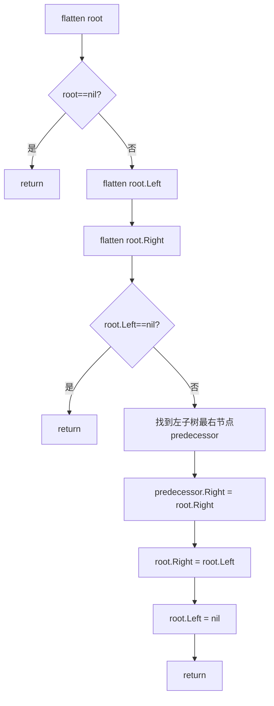
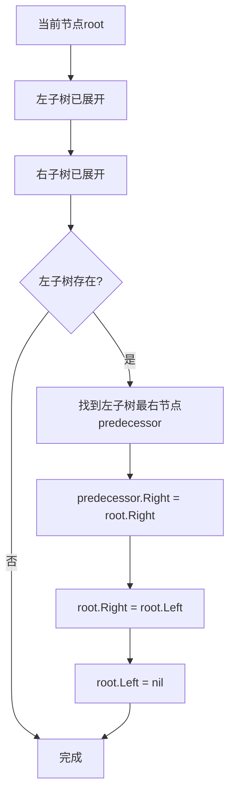

# 114. 二叉树展开为链表

## 题目描述

给你二叉树的根结点 root ，请你将它展开为一个单链表：

展开后的单链表应该同样使用 TreeNode ，其中 right 子指针指向链表中下一个结点，而左子指针始终为 null 。
展开后的单链表应该与二叉树 先序遍历 顺序相同。


## 示例 1：


输入：root = [1,2,5,3,4,null,6]
输出：[1,null,2,null,3,null,4,null,5,null,6]

## 示例 2：

输入：root = []
输出：[]

## 示例 3：

输入：root = [0]
输出：[0]


## 提示：

- 树中结点数在范围 [0, 2000] 内
- -100 <= Node.val <= 100


## 进阶：你可以使用原地算法（O(1) 额外空间）展开这棵树吗？

## 解题思路

### 问题深度分析

这是经典的**二叉树展开为链表**问题，核心在于理解**先序遍历顺序**和掌握**原地修改**技巧。虽然题目看起来简单，但它是理解树的结构变换、指针操作和空间优化的重要题目。

#### 问题本质

给定一个二叉树，需要将其展开为一个单链表，要求：
- **展开顺序**：与先序遍历（根-左-右）顺序相同
- **节点结构**：使用TreeNode，right指针指向下一个节点，left指针为null
- **空间要求**：进阶要求O(1)额外空间（原地算法）

关键问题：
- **先序遍历**：需要按照根-左-右的顺序访问节点
- **指针操作**：需要修改节点的left和right指针
- **空间优化**：如何在不使用额外空间的情况下完成展开

#### 核心思想

**方法一：递归DFS + 存储节点列表**
1. **先序遍历**：递归遍历二叉树，按先序顺序存储所有节点
2. **重新连接**：遍历节点列表，将每个节点的right指向下一个节点，left设为null
3. **空间复杂度**：O(n)，需要存储所有节点

**方法二：递归DFS + 原地修改（最优解法）**
1. **后序遍历**：从下往上处理，先处理子树，再处理根节点
2. **连接逻辑**：
   - 将左子树的最右节点（前驱）的right指向右子树
   - 将根节点的right指向左子树
   - 将根节点的left设为null
3. **空间复杂度**：O(1)额外空间（递归栈O(h)）

**方法三：迭代DFS + 栈**
1. **使用栈**：模拟先序遍历
2. **存储节点**：按先序顺序存储所有节点
3. **重新连接**：遍历节点列表，重新连接指针
4. **空间复杂度**：O(n)，需要栈和节点列表

**方法四：Morris遍历（真正的O(1)空间）**
1. **Morris遍历**：使用线索二叉树的思想
2. **原地修改**：在遍历过程中直接修改指针
3. **空间复杂度**：O(1)真正额外空间

#### 关键难点分析

**难点1：先序遍历顺序**
- 需要按照根-左-右的顺序访问节点
- 展开后的链表顺序必须与先序遍历相同
- 关键：理解先序遍历的递归和迭代实现

**难点2：指针操作的顺序**
- 修改指针的顺序很重要
- 如果先修改right，可能会丢失原来的右子树
- 需要先保存右子树，再修改指针

**难点3：原地修改的实现**
- 如何在O(1)额外空间下完成展开
- 使用后序遍历，从下往上处理
- 利用前驱节点连接左右子树

**难点4：边界条件处理**
- 空树：直接返回
- 单节点树：不需要修改
- 只有左子树或只有右子树：需要特殊处理

#### 典型情况分析

**情况1：完全二叉树**
```
    1
   / \
  2   5
 / \   \
3   4   6
```
先序遍历：1, 2, 3, 4, 5, 6
展开后：1 -> 2 -> 3 -> 4 -> 5 -> 6

**情况2：只有左子树**
```
  1
 /
2
 \
  3
```
先序遍历：1, 2, 3
展开后：1 -> 2 -> 3

**情况3：只有右子树**
```
  1
   \
    2
     \
      3
```
先序遍历：1, 2, 3
展开后：1 -> 2 -> 3

**情况4：链状树**
```
  1
   \
    2
     \
      3
```
先序遍历：1, 2, 3
展开后：1 -> 2 -> 3（已经是链表形式）

**情况5：单节点树**
```
  1
```
先序遍历：1
展开后：1（不需要修改）

#### 算法对比

| 算法               | 时间复杂度 | 空间复杂度 | 特点                   |
| ------------------ | ---------- | ---------- | ---------------------- |
| 递归DFS + 列表     | O(n)       | O(n)       | 直观易懂               |
| 递归DFS + 原地修改 | O(n)       | O(h)       | **最优解法**，空间优化 |
| 迭代DFS + 栈       | O(n)       | O(n)       | 使用栈模拟             |
| Morris遍历         | O(n)       | O(1)       | 真正的O(1)空间         |

注：n为节点数，h为树高度

### 算法流程图

#### 主算法流程（递归DFS + 原地修改）



#### 指针操作流程



### 复杂度分析

#### 时间复杂度详解

**递归DFS + 列表算法**：O(n)
- 先序遍历：O(n)，访问所有节点
- 重新连接：O(n)，遍历节点列表
- 总时间：O(n)

**递归DFS + 原地修改算法**：O(n)
- 后序遍历：O(n)，访问所有节点
- 找前驱节点：最坏情况O(h)，但每个节点最多被访问一次
- 总时间：O(n)

**迭代DFS + 栈算法**：O(n)
- 先序遍历：O(n)，访问所有节点
- 重新连接：O(n)，遍历节点列表
- 总时间：O(n)

**Morris遍历算法**：O(n)
- 遍历所有节点：O(n)
- 每个节点最多被访问两次
- 总时间：O(n)

#### 空间复杂度详解

**递归DFS + 列表算法**：O(n)
- 节点列表：O(n)
- 递归栈：O(h)
- 总空间：O(n)

**递归DFS + 原地修改算法**：O(h)
- 递归调用栈深度为树高度
- 最坏情况（链状树）：O(n)
- 最好情况（平衡树）：O(log n)
- 总空间：O(h)

**迭代DFS + 栈算法**：O(n)
- 栈：O(h)
- 节点列表：O(n)
- 总空间：O(n)

**Morris遍历算法**：O(1)
- 只使用常数额外空间
- 总空间：O(1)

### 关键优化技巧

#### 技巧1：递归DFS + 原地修改（最优解法）

```go
func flatten(root *TreeNode) {
    if root == nil {
        return
    }
    
    // 后序遍历：先处理子树
    flatten(root.Left)
    flatten(root.Right)
    
    // 如果左子树为空，不需要修改
    if root.Left == nil {
        return
    }
    
    // 找到左子树的最右节点（前驱）
    predecessor := root.Left
    for predecessor.Right != nil {
        predecessor = predecessor.Right
    }
    
    // 连接：前驱的right指向右子树
    predecessor.Right = root.Right
    
    // 将左子树移到右边
    root.Right = root.Left
    root.Left = nil
}
```

**优势**：
- 时间复杂度：O(n)
- 空间复杂度：O(h)（递归栈）
- 原地修改，不需要额外空间存储节点
- 代码简洁，逻辑清晰

#### 技巧2：递归DFS + 存储节点列表

```go
func flatten(root *TreeNode) {
    if root == nil {
        return
    }
    
    // 先序遍历，存储所有节点
    nodes := []*TreeNode{}
    var preorder func(*TreeNode)
    preorder = func(node *TreeNode) {
        if node == nil {
            return
        }
        nodes = append(nodes, node)
        preorder(node.Left)
        preorder(node.Right)
    }
    preorder(root)
    
    // 重新连接节点
    for i := 0; i < len(nodes)-1; i++ {
        nodes[i].Left = nil
        nodes[i].Right = nodes[i+1]
    }
    // 最后一个节点
    if len(nodes) > 0 {
        nodes[len(nodes)-1].Left = nil
        nodes[len(nodes)-1].Right = nil
    }
}
```

**特点**：直观易懂，但需要O(n)额外空间

#### 技巧3：迭代DFS + 栈

```go
func flatten(root *TreeNode) {
    if root == nil {
        return
    }
    
    stack := []*TreeNode{root}
    nodes := []*TreeNode{}
    
    // 先序遍历
    for len(stack) > 0 {
        node := stack[len(stack)-1]
        stack = stack[:len(stack)-1]
        
        nodes = append(nodes, node)
        
        // 先右后左入栈（保证左先出）
        if node.Right != nil {
            stack = append(stack, node.Right)
        }
        if node.Left != nil {
            stack = append(stack, node.Left)
        }
    }
    
    // 重新连接
    for i := 0; i < len(nodes)-1; i++ {
        nodes[i].Left = nil
        nodes[i].Right = nodes[i+1]
    }
    if len(nodes) > 0 {
        nodes[len(nodes)-1].Left = nil
        nodes[len(nodes)-1].Right = nil
    }
}
```

**特点**：使用栈模拟先序遍历

#### 技巧4：Morris遍历（真正的O(1)空间）

```go
func flatten(root *TreeNode) {
    curr := root
    for curr != nil {
        if curr.Left != nil {
            // 找到左子树的最右节点（前驱）
            predecessor := curr.Left
            for predecessor.Right != nil {
                predecessor = predecessor.Right
            }
            
            // 连接：前驱的right指向右子树
            predecessor.Right = curr.Right
            
            // 将左子树移到右边
            curr.Right = curr.Left
            curr.Left = nil
        }
        
        // 移动到下一个节点
        curr = curr.Right
    }
}
```

**特点**：真正的O(1)额外空间，不需要递归栈

### 边界条件处理

#### 边界情况1：空树
- **处理**：直接返回，不需要修改
- **验证**：root为nil时直接返回

#### 边界情况2：单节点树
- **处理**：不需要修改，已经是链表形式
- **验证**：左右子树都为空，不需要修改

#### 边界情况3：只有左子树
- **处理**：将左子树移到右边，left设为null
- **验证**：如`[1,2]`，展开后为`[1,null,2]`

#### 边界情况4：只有右子树
- **处理**：已经是链表形式，不需要修改
- **验证**：如`[1,null,2]`，已经是链表形式

#### 边界情况5：链状树
- **处理**：已经是链表形式，不需要修改
- **验证**：如`[1,null,2,null,3]`，已经是链表形式

### 测试用例设计

#### 基础测试用例

1. **完全二叉树**：`[1,2,5,3,4,null,6]` → `[1,null,2,null,3,null,4,null,5,null,6]`
2. **空树**：`[]` → `[]`
3. **单节点**：`[0]` → `[0]`
4. **只有左子树**：`[1,2]` → `[1,null,2]`

#### 进阶测试用例

5. **只有右子树**：`[1,null,2]` → `[1,null,2]`（已经是链表）
6. **链状树**：`[1,null,2,null,3]` → `[1,null,2,null,3]`（已经是链表）
7. **左偏树**：`[1,2,null,3]` → `[1,null,2,null,3]`
8. **右偏树**：`[1,null,2,null,3]` → `[1,null,2,null,3]`（已经是链表）
9. **复杂树**：`[1,2,3,4,5,6,7]` → `[1,null,2,null,4,null,5,null,3,null,6,null,7]`
10. **不平衡树**：`[1,2,3,4]` → `[1,null,2,null,4,null,3]`

### 常见错误和陷阱

#### 错误1：先修改right指针，丢失右子树
```go
// 错误写法：先修改right，丢失了原来的右子树
func flattenWrong(root *TreeNode) {
    if root == nil {
        return
    }
    flattenWrong(root.Left)
    flattenWrong(root.Right)
    
    if root.Left != nil {
        root.Right = root.Left  // 错误！丢失了原来的右子树
        root.Left = nil
    }
}

// 正确写法：先保存右子树，再修改
func flatten(root *TreeNode) {
    if root == nil {
        return
    }
    flatten(root.Left)
    flatten(root.Right)
    
    if root.Left != nil {
        // 找到前驱
        predecessor := root.Left
        for predecessor.Right != nil {
            predecessor = predecessor.Right
        }
        // 先连接前驱和右子树
        predecessor.Right = root.Right
        // 再修改根节点
        root.Right = root.Left
        root.Left = nil
    }
}
```
**原因**：如果先修改root.Right，会丢失原来的右子树

#### 错误2：没有找到前驱节点
```go
// 错误写法：直接连接，顺序不对
if root.Left != nil {
    root.Right = root.Left  // 错误！左子树的最右节点应该连接右子树
    root.Left = nil
}

// 正确写法：找到前驱节点
predecessor := root.Left
for predecessor.Right != nil {
    predecessor = predecessor.Right
}
predecessor.Right = root.Right
root.Right = root.Left
root.Left = nil
```
**原因**：左子树的最右节点（前驱）应该连接右子树，保证先序遍历顺序

#### 错误3：使用前序遍历而不是后序遍历
```go
// 错误写法：前序遍历，子树还没展开
func flattenWrong(root *TreeNode) {
    if root == nil {
        return
    }
    // 先处理根节点，但子树还没展开
    if root.Left != nil {
        // ...
    }
    flattenWrong(root.Left)
    flattenWrong(root.Right)
}

// 正确写法：后序遍历，先处理子树
func flatten(root *TreeNode) {
    if root == nil {
        return
    }
    flatten(root.Left)   // 先处理左子树
    flatten(root.Right)   // 再处理右子树
    // 最后处理根节点
    if root.Left != nil {
        // ...
    }
}
```
**原因**：需要先展开子树，再处理根节点

#### 错误4：忘记将left设为null
```go
// 错误写法：忘记将left设为null
if root.Left != nil {
    predecessor.Right = root.Right
    root.Right = root.Left
    // 忘记 root.Left = nil
}

// 正确写法：必须将left设为null
root.Right = root.Left
root.Left = nil
```
**原因**：展开后的链表，left指针必须为null

### 实用技巧

1. **优先使用递归DFS + 原地修改**：时间复杂度O(n)，空间复杂度O(h)，最优解法
2. **后序遍历**：先处理子树，再处理根节点，保证子树已展开
3. **找前驱节点**：左子树的最右节点是前驱，应该连接右子树
4. **指针操作顺序**：先连接前驱和右子树，再修改根节点
5. **边界条件**：空树和单节点树不需要修改
6. **Morris遍历**：如果需要真正的O(1)空间，使用Morris遍历

### 进阶扩展

#### 扩展1：展开为双向链表
- 不仅right指向下一个，left也指向前一个

#### 扩展2：展开为循环链表
- 最后一个节点的right指向第一个节点

#### 扩展3：按中序遍历展开
- 改变遍历顺序，按中序展开

#### 扩展4：按后序遍历展开
- 改变遍历顺序，按后序展开

### 应用场景

1. **数据结构转换**：将树结构转换为链表结构
2. **序列化**：将树序列化为链表形式
3. **内存优化**：减少树结构的内存占用
4. **算法设计**：理解指针操作和空间优化
5. **面试题目**：经典的树结构变换问题

### 总结

二叉树展开为链表是一个经典的树结构变换问题，核心在于：
1. **理解先序遍历**：展开顺序必须与先序遍历相同
2. **后序遍历处理**：先处理子树，再处理根节点
3. **前驱节点连接**：左子树的最右节点连接右子树
4. **指针操作顺序**：先保存右子树，再修改指针

通过系统学习和练习，可以熟练掌握二叉树展开为链表的各种方法！
