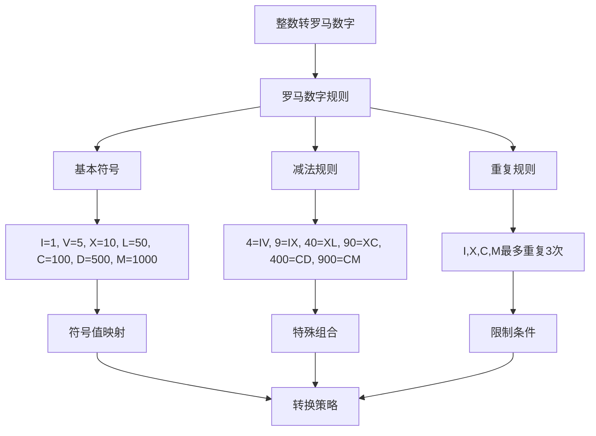
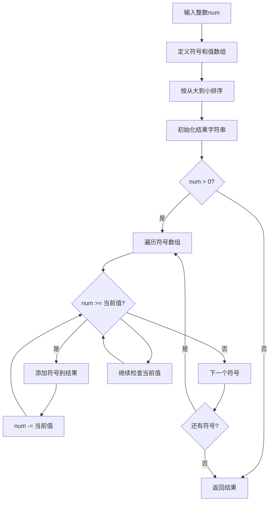
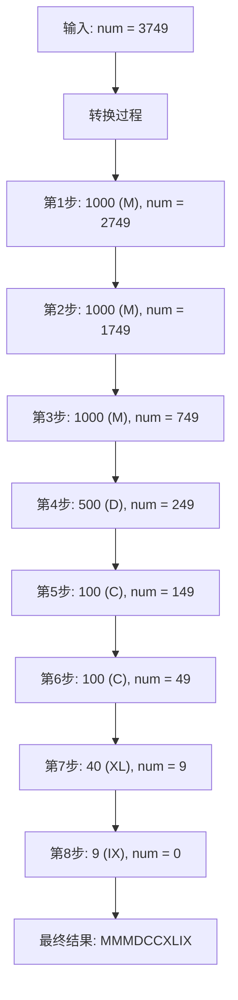
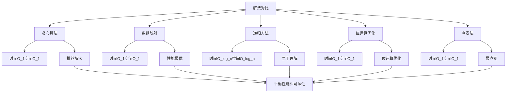
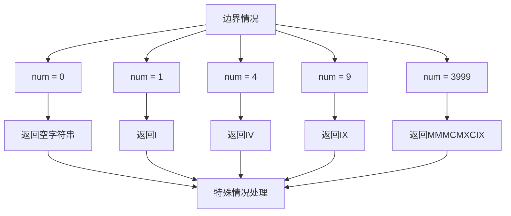
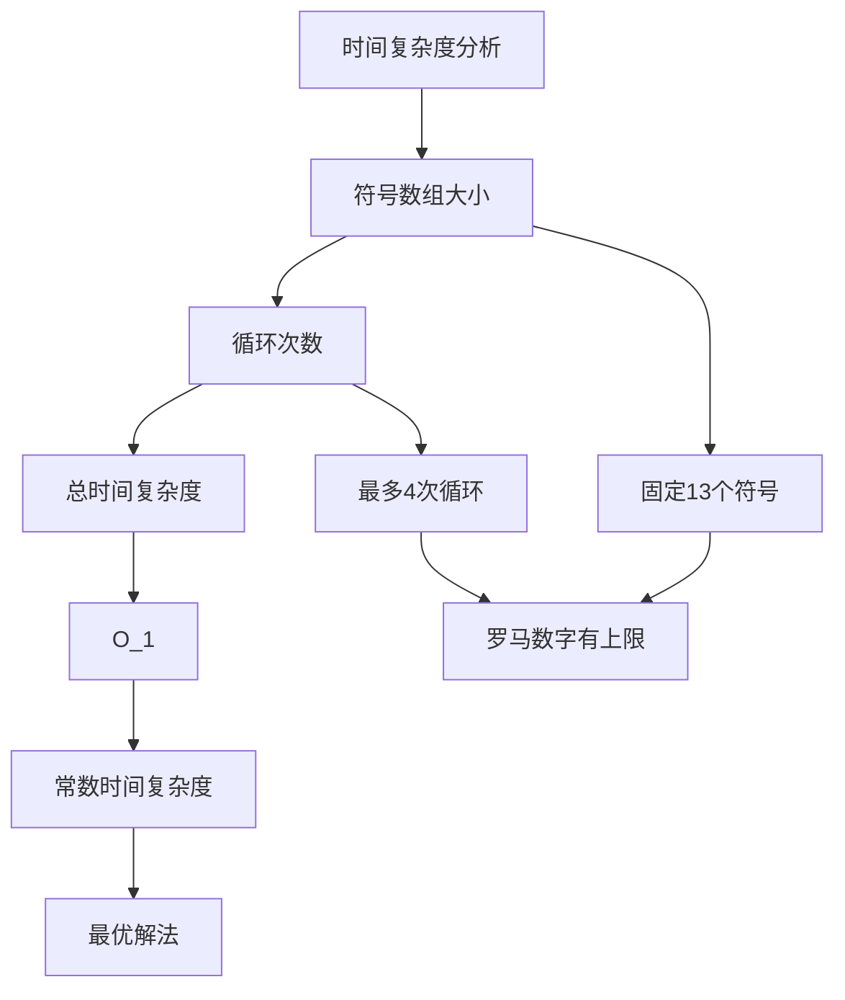
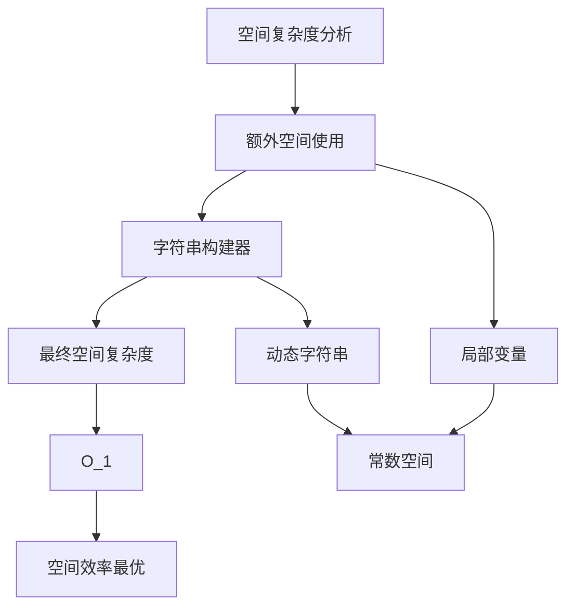
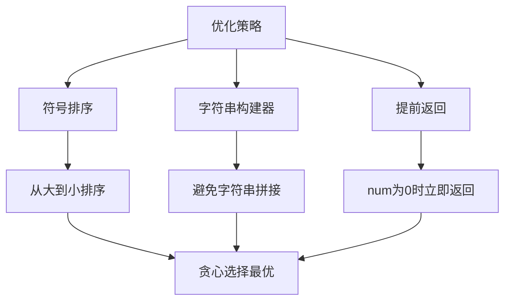
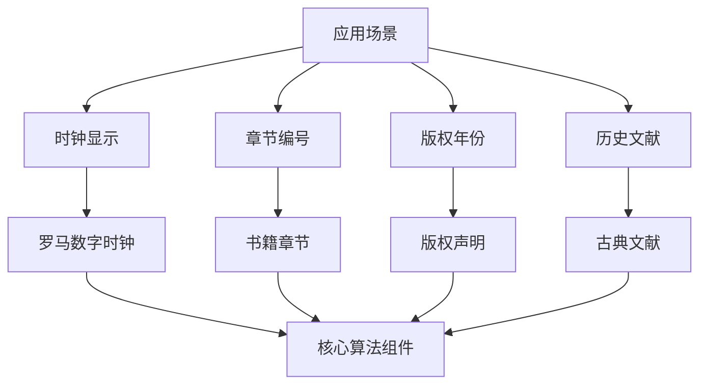
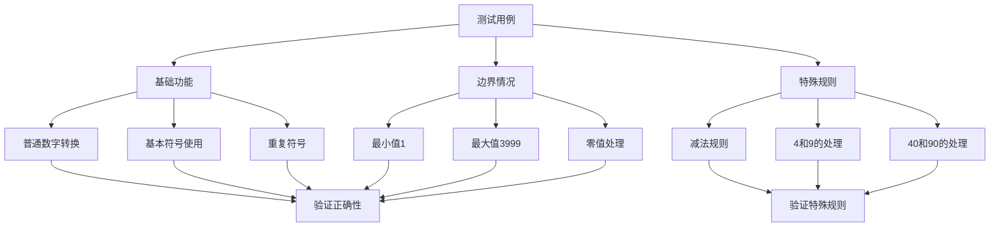

# 12. 整数转罗马数字

## 题目描述

七个不同的符号代表罗马数字，其值如下：

符号	值
I	1
V	5
X	10
L	50
C	100
D	500
M	1000
罗马数字是通过添加从最高到最低的小数位值的转换而形成的。将小数位值转换为罗马数字有以下规则：

如果该值不是以 4 或 9 开头，请选择可以从输入中减去的最大值的符号，将该符号附加到结果，减去其值，然后将其余部分转换为罗马数字。
如果该值以 4 或 9 开头，使用 减法形式，表示从以下符号中减去一个符号，例如 4 是 5 (V) 减 1 (I): IV ，9 是 10 (X) 减 1 (I)：IX。仅使用以下减法形式：4 (IV)，9 (IX)，40 (XL)，90 (XC)，400 (CD) 和 900 (CM)。
只有 10 的次方（I, X, C, M）最多可以连续附加 3 次以代表 10 的倍数。你不能多次附加 5 (V)，50 (L) 或 500 (D)。如果需要将符号附加4次，请使用 减法形式。
给定一个整数，将其转换为罗马数字。

 

示例 1：

输入：num = 3749

输出： "MMMDCCXLIX"

解释：

3000 = MMM 由于 1000 (M) + 1000 (M) + 1000 (M)
 700 = DCC 由于 500 (D) + 100 (C) + 100 (C)
  40 = XL 由于 50 (L) 减 10 (X)
   9 = IX 由于 10 (X) 减 1 (I)
注意：49 不是 50 (L) 减 1 (I) 因为转换是基于小数位
示例 2：

输入：num = 58

输出："LVIII"

解释：

50 = L
 8 = VIII
示例 3：

输入：num = 1994

输出："MCMXCIV"

解释：

1000 = M
 900 = CM
  90 = XC
   4 = IV

## 提示：

- 1 <= num <= 3999

## 解题思路

这道题要求将整数转换为罗马数字，需要理解罗马数字的构成规则和特殊的减法表示法。这是一个数学转换和字符串构建的经典问题。

### 算法分析

这道题的核心思想是**贪心算法**，主要解法包括：

1. **贪心算法**：每次选择最大的可能值进行转换（推荐）
2. **数组映射法**：预定义所有可能的组合，直接查表
3. **递归方法**：使用分治思想逐步转换
4. **位运算优化**：按位处理，减少循环次数
5. **查表法**：最直观的实现方式

### 问题本质分析



### 贪心算法详解



### 转换过程可视化



### 减法规则处理

```mermaid
graph TD
    A[减法规则] --> B[4和9的处理]
    B --> C[40和90的处理]
    C --> D[400和900的处理]
    
    B --> E[4 = IV (5-1)]
    B --> F[9 = IX (10-1)]
    
    C --> G[40 = XL (50-10)]
    C --> H[90 = XC (100-10)]
    
    D --> I[400 = CD (500-100)]
    D --> J[900 = CM (1000-100)]
    
    E --> K[避免重复4次]
    F --> K
    G --> K
    H --> K
    I --> K
    J --> K
```

### 各种解法对比



### 算法流程图

```mermaid
flowchart TD
    A[开始] --> B[定义符号值数组]
    B --> C[初始化结果字符串]
    C --> D[i = 0]
    
    D --> E{i < 数组长度 && num > 0?}
    E -->|否| F[返回结果]
    E -->|是| G{num >= values[i]?}
    
    G -->|否| H[i++]
    G -->|是| I[添加符号到结果]
    
    I --> J[num -= values[i]]
    J --> G
    
    H --> E
    G --> K[继续检查当前值]
    K --> G
```

### 边界情况处理



### 时间复杂度分析



### 空间复杂度分析



### 关键优化点



### 实际应用场景



### 测试用例设计



### 代码实现要点

1. **符号数组设计**：
   - 按从大到小排序
   - 包含所有基本符号和减法组合
   - 确保贪心选择的正确性

2. **贪心策略**：
   - 每次选择最大的可能值
   - 重复添加符号直到无法继续
   - 处理减法规则的特殊情况

3. **字符串构建**：
   - 使用strings.Builder提高效率
   - 避免频繁的字符串拼接操作
   - 动态构建结果字符串

4. **边界条件处理**：
   - 处理num = 0的情况
   - 处理最大值3999的情况
   - 确保所有情况都有正确的输出

5. **性能优化**：
   - 固定大小的符号数组
   - 常数时间复杂度和空间复杂度
   - 适合处理范围内的所有整数

这个问题的关键在于**理解罗马数字的构成规则**和**掌握贪心算法的应用**，通过预定义符号数组和贪心选择策略，实现高效的整数到罗马数字的转换。
