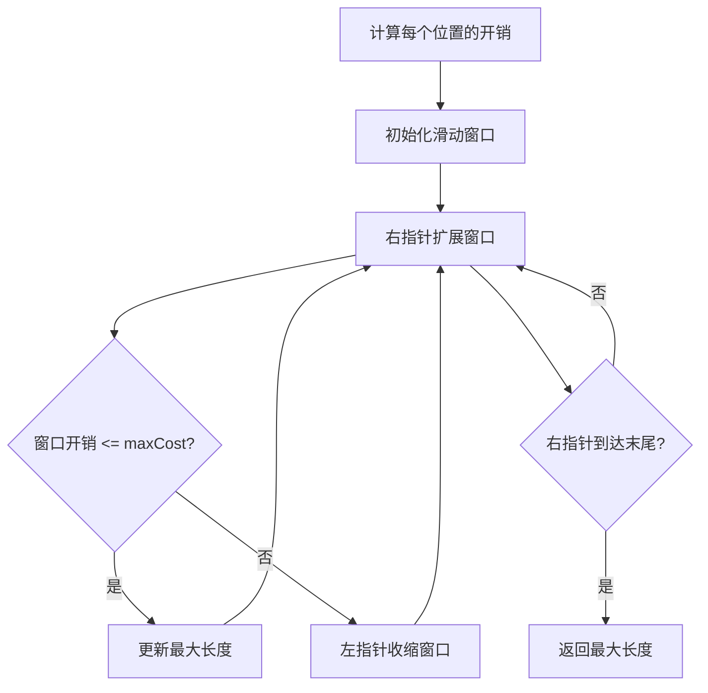

# 1208. 尽可能使字符串相等

## 描述

给你两个长度相同的字符串，s 和 t。

将 s 中的第 i 个字符变到 t 中的第 i 个字符需要 |s[i] - t[i]| 的开销（开销可能为 0），也就是两个字符的 ASCII 码值的差的绝对值。

用于变更字符串的最大预算是 maxCost。在转化字符串时，总开销应当小于等于该预算，这也意味着字符串的转化可能是不完全的。

如果你可以将 s 的子字符串转化为它在 t 中对应的子字符串，则返回可以转化的最大长度。

如果 s 中没有子字符串可以转化成 t 中对应的子字符串，则返回 0。

## 示例 1

输入：s = "abcd", t = "bcdf", maxCost = 3
输出：3
解释：s 中的 "abc" 可以变为 "bcd"。开销为 3，所以最大长度为 3。

## 示例 2

输入：s = "abcd", t = "cdef", maxCost = 3
输出：1
解释：s 中的任一字符要想变成 t 中对应的字符，其开销都是 2。因此，最大长度为 1。

## 示例 3

输入：s = "abcd", t = "acde", maxCost = 0
输出：1
解释：a -> a, cost = 0，字符串未发生变化，所以最大长度为 1。

## 提示

- 1 <= s.length, t.length <= 10^5
- 0 <= maxCost <= 10^6
- s 和 t 都只含小写英文字母。

## 解题思路

### 方法一：滑动窗口（推荐）

这道题的本质是找到一个最长的连续子数组，使得子数组中所有元素的和不超过 `maxCost`。

**算法步骤：**

1. **计算开销数组**：首先计算每个位置字符转换的开销 `costs[i] = |s[i] - t[i]|`
2. **滑动窗口**：使用双指针维护一个滑动窗口，窗口内的开销总和不超过 `maxCost`
3. **更新答案**：在滑动过程中记录最大窗口长度

**算法流程：**



**时间复杂度：** O(n)，其中 n 是字符串长度
**空间复杂度：** O(1)，只使用常数额外空间

### 方法二：前缀和 + 二分查找

**算法思路：**
1. 计算开销数组的前缀和
2. 对于每个起始位置，使用二分查找找到最远的结束位置

**时间复杂度：** O(n log n)
**空间复杂度：** O(n)

## 代码实现

```go
// 方法一：滑动窗口
func equalSubstring(s string, t string, maxCost int) int {
    n := len(s)
    left, right := 0, 0
    currentCost := 0
    maxLength := 0
    
    for right < n {
        // 计算当前字符的开销
        cost := abs(int(s[right]) - int(t[right]))
        
        // 扩展窗口
        currentCost += cost
        right++
        
        // 如果开销超过预算，收缩窗口
        for currentCost > maxCost {
            currentCost -= abs(int(s[left]) - int(t[left]))
            left++
        }
        
        // 更新最大长度
        maxLength = max(maxLength, right - left)
    }
    
    return maxLength
}

func abs(x int) int {
    if x < 0 {
        return -x
    }
    return x
}

func max(a, b int) int {
    if a > b {
        return a
    }
    return b
}
```

## 测试用例

```go
func testEqualSubstring() {
    testCases := []struct {
        s, t     string
        maxCost  int
        expected int
    }{
        {"abcd", "bcdf", 3, 3},
        {"abcd", "cdef", 3, 1},
        {"abcd", "acde", 0, 1},
        {"krrgw", "zjxss", 19, 2},
        {"abcd", "abcd", 0, 4},
        {"a", "b", 1, 1},
        {"a", "b", 0, 0},
    }
    
    for i, tc := range testCases {
        result := equalSubstring(tc.s, tc.t, tc.maxCost)
        if result == tc.expected {
            fmt.Printf("测试用例 %d 通过: s=%s, t=%s, maxCost=%d, 结果=%d\n", 
                i+1, tc.s, tc.t, tc.maxCost, result)
        } else {
            fmt.Printf("测试用例 %d 失败: s=%s, t=%s, maxCost=%d, 期望=%d, 实际=%d\n", 
                i+1, tc.s, tc.t, tc.maxCost, tc.expected, result)
        }
    }
}
```

## 关键点总结

1. **问题转化**：将字符串转换问题转化为子数组和不超过阈值的最大长度问题
2. **滑动窗口**：使用双指针维护满足条件的连续子数组
3. **开销计算**：使用 ASCII 码差的绝对值计算转换开销
4. **边界处理**：注意处理 `maxCost = 0` 的特殊情况
5. **优化技巧**：滑动窗口可以在 O(n) 时间内找到最优解

## 相似题目

- [209. 长度最小的子数组](./209/) - 滑动窗口找最小长度
- [1004. 最大连续1的个数 III](./1004/) - 滑动窗口找最大长度
- [3. 无重复字符的最长子串](./3/) - 滑动窗口经典应用

