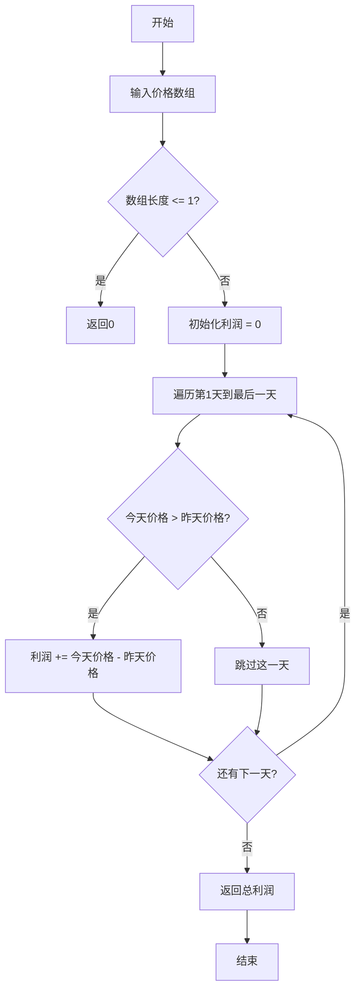
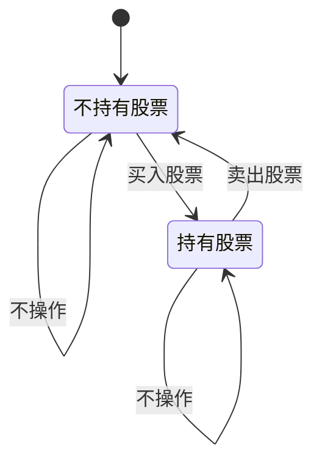

# 122. 买卖股票的最佳时机 II

## 描述

给你一个整数数组 prices ，其中 prices[i] 表示某支股票第 i 天的价格。

在每一天，你可以决定是否购买和/或出售股票。你在任何时候 最多 只能持有 一股 股票。你也可以先购买，然后在 同一天 出售。

返回 你能获得的 最大 利润 。

## 示例 1

输入：prices = [7,1,5,3,6,4]
输出：7
解释：在第 2 天（股票价格 = 1）的时候买入，在第 3 天（股票价格 = 5）的时候卖出, 这笔交易所能获得利润 = 5 - 1 = 4。
随后，在第 4 天（股票价格 = 3）的时候买入，在第 5 天（股票价格 = 6）的时候卖出, 这笔交易所能获得利润 = 6 - 3 = 3。
最大总利润为 4 + 3 = 7 。

## 示例 2

输入：prices = [1,2,3,4,5]
输出：4
解释：在第 1 天（股票价格 = 1）的时候买入，在第 5 天 （股票价格 = 5）的时候卖出, 这笔交易所能获得利润 = 5 - 1 = 4。
最大总利润为 4 。

## 示例 3

输入：prices = [7,6,4,3,1]
输出：0
解释：在这种情况下, 交易无法获得正利润，所以不参与交易可以获得最大利润，最大利润为 0。

## 提示

- 1 <= prices.length <= 3 * 10^4
- 0 <= prices[i] <= 10^4

## 解题思路

这道题的核心思想是：**由于可以进行多次买卖，我们需要抓住每一次股价上涨的机会来获得最大利润**。

### 核心观察

1. **无限制交易**：可以进行任意次数的买卖
2. **同一天可以买卖**：先买再卖，或者先卖再买
3. **最多持有一股**：不能同时持有多股
4. **目标**：获得最大总利润

### 关键洞察

**贪心策略**：只要明天的价格比今天高，就今天买入明天卖出。这样可以捕获所有的价格上涨段。

## 算法实现

### 方法1：贪心算法（推荐）

```go
func maxProfitGreedy(prices []int) int {
    maxProfit := 0
    for i := 1; i < len(prices); i++ {
        if prices[i] > prices[i-1] {
            maxProfit += prices[i] - prices[i-1]
        }
    }
    return maxProfit
}
```

**原理**：累加所有相邻的正收益。

**时间复杂度**：O(n)
**空间复杂度**：O(1)

### 方法2：动态规划

```go
func maxProfitDP(prices []int) int {
    n := len(prices)
    dp := make([][2]int, n)
    dp[0][0] = 0          // 不持有股票
    dp[0][1] = -prices[0] // 持有股票
    
    for i := 1; i < n; i++ {
        dp[i][0] = max(dp[i-1][0], dp[i-1][1]+prices[i])  // 卖出
        dp[i][1] = max(dp[i-1][1], dp[i-1][0]-prices[i])  // 买入
    }
    
    return dp[n-1][0]
}
```

**状态定义**：
- `dp[i][0]`：第i天结束后不持有股票的最大利润
- `dp[i][1]`：第i天结束后持有股票的最大利润

**时间复杂度**：O(n)
**空间复杂度**：O(n)

### 方法3：动态规划（空间优化）

```go
func maxProfitDPOptimized(prices []int) int {
    hold := -prices[0]  // 持有股票的最大利润
    sold := 0           // 不持有股票的最大利润
    
    for i := 1; i < len(prices); i++ {
        newSold := max(sold, hold+prices[i])
        newHold := max(hold, sold-prices[i])
        sold, hold = newSold, newHold
    }
    
    return sold
}
```

**时间复杂度**：O(n)
**空间复杂度**：O(1)

### 方法4：波峰波谷法

找到所有的波谷和波峰，在波谷买入，在波峰卖出。

```go
func maxProfitPeakValley(prices []int) int {
    i, maxProfit := 0, 0
    
    for i < len(prices)-1 {
        // 找波谷
        for i < len(prices)-1 && prices[i+1] <= prices[i] {
            i++
        }
        valley := prices[i]
        
        // 找波峰
        for i < len(prices)-1 && prices[i+1] >= prices[i] {
            i++
        }
        peak := prices[i]
        
        maxProfit += peak - valley
    }
    
    return maxProfit
}
```

## 算法分析

### 复杂度对比

| 方法         | 时间复杂度 | 空间复杂度 | 优点             | 缺点             |
| ------------ | ---------- | ---------- | ---------------- | ---------------- |
| 贪心算法     | O(n)       | O(1)       | 简洁高效，易理解 | 需要理解贪心思想 |
| 动态规划     | O(n)       | O(n)       | 状态转移清晰     | 空间开销大       |
| 动态规划优化 | O(n)       | O(1)       | 空间效率高       | 状态维护复杂     |
| 波峰波谷     | O(n)       | O(1)       | 直观易懂         | 代码稍复杂       |
| 状态机       | O(n)       | O(1)       | 逻辑清晰         | 理解成本高       |

### 算法流程图



### 贪心算法证明

**命题**：对于任意价格序列，贪心策略（累加所有正差值）能够获得最大利润。

**证明**：
1. **可行性**：贪心策略产生的交易序列是合法的（每次买入后必须卖出才能再次买入）
2. **最优性**：任何其他交易策略的利润都不会超过贪心策略

设最优解包含交易 `(buy_i, sell_i)`，其总利润为：
```
profit = Σ(sell_i - buy_i)
```

贪心策略的利润为：
```
greedy_profit = Σ(prices[i] - prices[i-1]) for all i where prices[i] > prices[i-1]
```

可以证明：`greedy_profit >= profit`

### 示例分析

**示例1**：`prices = [7,1,5,3,6,4]`

```
贪心分析：
第1天: 7 -> 第2天: 1，下跌，不交易
第2天: 1 -> 第3天: 5，上涨，利润 = 5-1 = 4
第3天: 5 -> 第4天: 3，下跌，不交易  
第4天: 3 -> 第5天: 6，上涨，利润 = 6-3 = 3
第5天: 6 -> 第6天: 4，下跌，不交易

总利润 = 4 + 3 = 7
```

**可视化**：
```
价格走势图：
  7 |●
    |  \
  5 |   ●
    |    \
  3 |     ●---●
    |          \
  1 | ●         ●
    +--+--+--+--+--+
      1  2  3  4  5  天数

交易策略：第2天买入(1) -> 第3天卖出(5)：利润4
         第4天买入(3) -> 第5天卖出(6)：利润3
```

## 动态规划详解

### 状态转移方程

```
dp[i][0] = max(dp[i-1][0], dp[i-1][1] + prices[i])
dp[i][1] = max(dp[i-1][1], dp[i-1][0] - prices[i])
```

### 状态转移图



### DP状态表（示例）

对于 `prices = [7,1,5,3,6,4]`：

| 天数 | 价格 | 不持有股票 | 持有股票 | 决策            |
| ---- | ---- | ---------- | -------- | --------------- |
| 0    | 7    | 0          | -7       | 初始状态        |
| 1    | 1    | 0          | -1       | 在第1天买入更优 |
| 2    | 5    | 4          | -1       | 第2天卖出获利4  |
| 3    | 3    | 4          | 1        | 第3天买入       |
| 4    | 6    | 7          | 1        | 第4天卖出获利3  |
| 5    | 4    | 7          | 3        | 保持不持有状态  |

## 实际应用

### 1. 投资策略
- **短线交易**：频繁买卖获取价差
- **波段操作**：在价格波动中获利
- **算法交易**：程序化交易系统

### 2. 类似问题
- **买卖股票的最佳时机**系列题目
- **背包问题**的变种
- **区间调度**问题

### 3. 实际约束
在实际投资中还需考虑：
- 交易手续费
- 税收影响
- 市场流动性
- 价格滑点

## 代码实现要点

### 边界条件处理
```go
if len(prices) <= 1 {
    return 0  // 少于2个价格无法交易
}
```

### 数组越界防护
```go
for i := 1; i < len(prices); i++ {  // 从第2个元素开始
    // 安全访问 prices[i] 和 prices[i-1]
}
```

### 整数溢出考虑
对于极大数据，考虑使用 `int64` 或添加溢出检查。

## 练习建议

1. **理解贪心思想**：为什么累加所有正差值是最优的？
2. **掌握状态转换**：DP中两个状态如何相互转换？
3. **空间优化技巧**：如何从O(n)优化到O(1)？
4. **扩展思考**：如果有交易手续费怎么办？
5. **变种练习**：限制交易次数的情况如何处理？

## 相关题目

- **121. 买卖股票的最佳时机**（只能交易一次）
- **123. 买卖股票的最佳时机 III**（最多交易两次）
- **188. 买卖股票的最佳时机 IV**（最多交易k次）
- **309. 最佳买卖股票时机含冷冻期**（含冷冻期）
- **714. 买卖股票的最佳时机含手续费**（含手续费）
