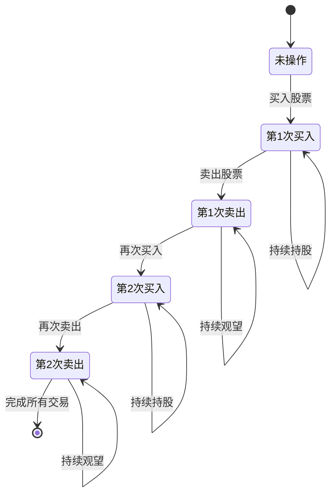
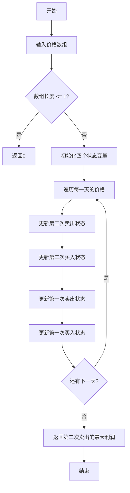

# 123. 买卖股票的最佳时机 III

## 描述

给定一个数组，它的第 i 个元素是一支给定的股票在第 i 天的价格。

设计一个算法来计算你所能获取的最大利润。你最多可以完成 两笔 交易。

注意：你不能同时参与多笔交易（你必须在再次购买前出售掉之前的股票）。

## 示例 1

输入：prices = [3,3,5,0,0,3,1,4]
输出：6
解释：在第 4 天（股票价格 = 0）的时候买入，在第 6 天（股票价格 = 3）的时候卖出，这笔交易所能获得利润 = 3-0 = 3 。
     随后，在第 7 天（股票价格 = 1）的时候买入，在第 8 天 （股票价格 = 4）的时候卖出，这笔交易所能获得利润 = 4-1 = 3 。

## 示例 2

输入：prices = [1,2,3,4,5]
输出：4
解释：在第 1 天（股票价格 = 1）的时候买入，在第 5 天 （股票价格 = 5）的时候卖出, 这笔交易所能获得利润 = 5-1 = 4 。   
     注意你不能在第 1 天和第 2 天接连购买股票，之后再将它们卖出。   
     因为这样属于同时参与了多笔交易，你必须在再次购买前出售掉之前的股票。

## 示例 3

输入：prices = [7,6,4,3,1] 
输出：0 
解释：在这个情况下, 没有交易完成, 所以最大利润为 0。

## 示例 4

输入：prices = [1]
输出：0

## 提示

- 1 <= prices.length <= 10^5
- 0 <= prices[i] <= 10^5

## 解题思路

这道题是股票交易系列中的经典问题，限制最多完成**2笔交易**。相比于可以无限次交易的版本，这里需要精确控制交易次数。

### 核心观察

1. **交易限制**：最多完成2笔交易（买入+卖出为1笔）
2. **不能同时持股**：必须卖出后才能再次买入
3. **状态复杂**：需要跟踪交易次数和持股状态
4. **最优策略**：在有限次数内获得最大利润

### 关键洞察

这是一个典型的**状态机问题**，可以用动态规划的思想，通过状态转移来求解。

## 算法实现

### 方法1：五状态动态规划（推荐）

```go
func maxProfitDP5States(prices []int) int {
    buy1 := -prices[0]  // 第一次买入
    sell1 := 0          // 第一次卖出
    buy2 := -prices[0]  // 第二次买入
    sell2 := 0          // 第二次卖出
    
    for i := 1; i < len(prices); i++ {
        sell2 = max(sell2, buy2+prices[i]) // 第二次卖出
        buy2 = max(buy2, sell1-prices[i])  // 第二次买入
        sell1 = max(sell1, buy1+prices[i]) // 第一次卖出
        buy1 = max(buy1, -prices[i])       // 第一次买入
    }
    
    return sell2
}
```

**状态定义**：
- `buy1`: 第一次买入后的最大利润
- `sell1`: 第一次卖出后的最大利润
- `buy2`: 第二次买入后的最大利润
- `sell2`: 第二次卖出后的最大利润

**时间复杂度**：O(n)
**空间复杂度**：O(1)

### 方法2：通用k笔交易解法

```go
func maxProfitDPGeneral(prices []int) int {
    k := 2
    buy := make([]int, k+1)
    sell := make([]int, k+1)
    
    for i := 1; i <= k; i++ {
        buy[i] = -prices[0]
    }
    
    for i := 1; i < len(prices); i++ {
        for j := k; j >= 1; j-- {
            sell[j] = max(sell[j], buy[j]+prices[i])
            buy[j] = max(buy[j], sell[j-1]-prices[i])
        }
    }
    
    return sell[k]
}
```

这是一个可以扩展到任意k笔交易的通用解法。

**时间复杂度**：O(nk)
**空间复杂度**：O(k)

### 方法3：分割数组解法

**思路**：将数组分为两部分，左边完成1笔交易，右边完成1笔交易。

```go
func maxProfitSplit(prices []int) int {
    n := len(prices)
    
    // 计算从左到右的最大利润
    leftProfit := make([]int, n)
    minPrice := prices[0]
    for i := 1; i < n; i++ {
        minPrice = min(minPrice, prices[i])
        leftProfit[i] = max(leftProfit[i-1], prices[i]-minPrice)
    }
    
    // 计算从右到左的最大利润
    rightProfit := make([]int, n)
    maxPrice := prices[n-1]
    for i := n-2; i >= 0; i-- {
        maxPrice = max(maxPrice, prices[i])
        rightProfit[i] = max(rightProfit[i+1], maxPrice-prices[i])
    }
    
    // 枚举分割点
    maxProfit := 0
    for i := 0; i < n; i++ {
        profit := leftProfit[i]
        if i+1 < n {
            profit += rightProfit[i+1]
        }
        maxProfit = max(maxProfit, profit)
    }
    
    return maxProfit
}
```

**时间复杂度**：O(n)
**空间复杂度**：O(n)

## 算法分析

### 复杂度对比

| 方法        | 时间复杂度 | 空间复杂度 | 优点             | 缺点          |
| ----------- | ---------- | ---------- | ---------------- | ------------- |
| 五状态DP    | O(n)       | O(1)       | 简洁高效，易理解 | 不易扩展到k笔 |
| 通用k笔交易 | O(nk)      | O(k)       | 通用性强         | k=2时略复杂   |
| 完整状态表  | O(n)       | O(n)       | 状态清晰         | 空间开销大    |
| 分割数组    | O(n)       | O(n)       | 思路直观         | 不易扩展      |
| 状态机      | O(n)       | O(1)       | 逻辑清晰         | 理解成本高    |

### 状态转移图



### 算法流程图



### 状态转移方程

对于五状态动态规划：

```
buy1[i] = max(buy1[i-1], -prices[i])
sell1[i] = max(sell1[i-1], buy1[i-1] + prices[i])
buy2[i] = max(buy2[i-1], sell1[i-1] - prices[i])
sell2[i] = max(sell2[i-1], buy2[i-1] + prices[i])
```

### 示例分析

**示例1**：`prices = [3,3,5,0,0,3,1,4]`

```
最优策略分析：
第1笔交易：第4天买入(0) -> 第6天卖出(3)，利润 = 3
第2笔交易：第7天买入(1) -> 第8天卖出(4)，利润 = 3
总利润 = 3 + 3 = 6
```

**状态变化过程**：
```
天数 | 价格 | buy1 | sell1 | buy2 | sell2
  0  |  3   |  -3  |   0   |  -3  |   0
  1  |  3   |  -3  |   0   |  -3  |   0
  2  |  5   |  -3  |   2   |  -3  |   2
  3  |  0   |   0  |   2   |   2  |   2
  4  |  0   |   0  |   2   |   2  |   2
  5  |  3   |   0  |   3   |   2  |   5
  6  |  1   |   0  |   3   |   2  |   5
  7  |  4   |   0  |   3   |   2  |   6
```

### 分割数组方法详解

**核心思想**：在每个位置i，计算：
- 左半部分 `[0, i]` 完成1笔交易的最大利润
- 右半部分 `[i+1, n-1]` 完成1笔交易的最大利润
- 两部分利润之和

**可视化演示**：
```
价格数组: [3,3,5,0,0,3,1,4]
位置 | 价格 | 左侧利润 | 右侧利润 | 总利润
  0  |  3  |    0    |    4    |   4
  1  |  3  |    0    |    4    |   4
  2  |  5  |    2    |    4    |   6  ← 最优分割
  3  |  0  |    2    |    3    |   5
  4  |  0  |    2    |    3    |   5
  5  |  3  |    3    |    3    |   6
  6  |  1  |    3    |    3    |   6
  7  |  4  |    3    |    0    |   3
```

## 实际应用

### 1. 投资策略
- **分批建仓**：分两次买入，降低风险
- **波段操作**：捕获两个上涨波段
- **资金管理**：合理分配投资资金

### 2. 算法扩展
这个解法可以很容易扩展到：
- **k笔交易限制**：买卖股票的最佳时机 IV
- **冷冻期限制**：含冷冻期的股票交易
- **手续费约束**：含手续费的股票交易

### 3. 实际约束
在实际应用中还需考虑：
- 交易手续费的影响
- 市场流动性限制
- 资金分割的合理性
- 风险控制机制

## 代码实现要点

### 状态更新顺序
```go
// 必须从后往前更新，避免状态污染
sell2 = max(sell2, buy2+prices[i])  // 第二次卖出
buy2 = max(buy2, sell1-prices[i])   // 第二次买入
sell1 = max(sell1, buy1+prices[i])  // 第一次卖出
buy1 = max(buy1, -prices[i])        // 第一次买入
```

### 边界条件处理
```go
if len(prices) <= 1 {
    return 0  // 少于2个价格无法交易
}
```

### 初始状态设置
```go
buy1 := -prices[0]  // 第0天买入的成本
sell1 := 0          // 第0天还没卖出
buy2 := -prices[0]  // 可以当天买卖，所以初始化为第0天的成本
sell2 := 0          // 第0天还没有第二次卖出
```

## 练习建议

1. **理解状态机**：画出完整的状态转移图
2. **手动模拟**：用示例数据手动执行算法
3. **扩展思考**：如何扩展到k笔交易？
4. **优化探索**：是否还有其他优化空间？
5. **边界测试**：测试各种边界情况

## 相关题目

- **121. 买卖股票的最佳时机**（1笔交易）
- **122. 买卖股票的最佳时机 II**（无限次交易）
- **188. 买卖股票的最佳时机 IV**（k笔交易）
- **309. 最佳买卖股票时机含冷冻期**（含冷冻期）
- **714. 买卖股票的最佳时机含手续费**（含手续费）
