# 127. 单词接龙

## 描述

字典 wordList 中从单词 beginWord 到 endWord 的 转换序列 是一个按下述规格形成的序列 beginWord -> s1 -> s2 -> ... -> sk：

每一对相邻的单词只差一个字母。
 对于 1 <= i <= k 时，每个 si 都在 wordList 中。注意， beginWord 不需要在 wordList 中。
sk == endWord
给你两个单词 beginWord 和 endWord 和一个字典 wordList ，返回 从 beginWord 到 endWord 的 最短转换序列 中的 单词数目 。如果不存在这样的转换序列，返回 0 。

## 示例 1：

输入：beginWord = "hit", endWord = "cog", wordList = ["hot","dot","dog","lot","log","cog"]
输出：5
解释：一个最短转换序列是 "hit" -> "hot" -> "dot" -> "dog" -> "cog", 返回它的长度 5。

## 示例 2：

输入：beginWord = "hit", endWord = "cog", wordList = ["hot","dot","dog","lot","log"]
输出：0
解释：endWord "cog" 不在字典中，所以无法进行转换。
 
## 提示：

- 1 <= beginWord.length <= 10
- endWord.length == beginWord.length
- 1 <= wordList.length <= 5000
- wordList[i].length == beginWord.length
- beginWord、endWord 和 wordList[i] 由小写英文字母组成
- beginWord != endWord
- wordList 中的所有字符串 互不相同

## 解题思路

### 算法分析

这道题是**图的最短路径**和**BFS广度优先搜索**的经典应用。主要解法包括：

1. **单向BFS**：从起点开始广度优先搜索
2. **双向BFS**：从起点和终点同时搜索
3. **A*搜索**：启发式搜索算法
4. **Dijkstra算法**：适用于加权图的最短路径

### 问题本质分析

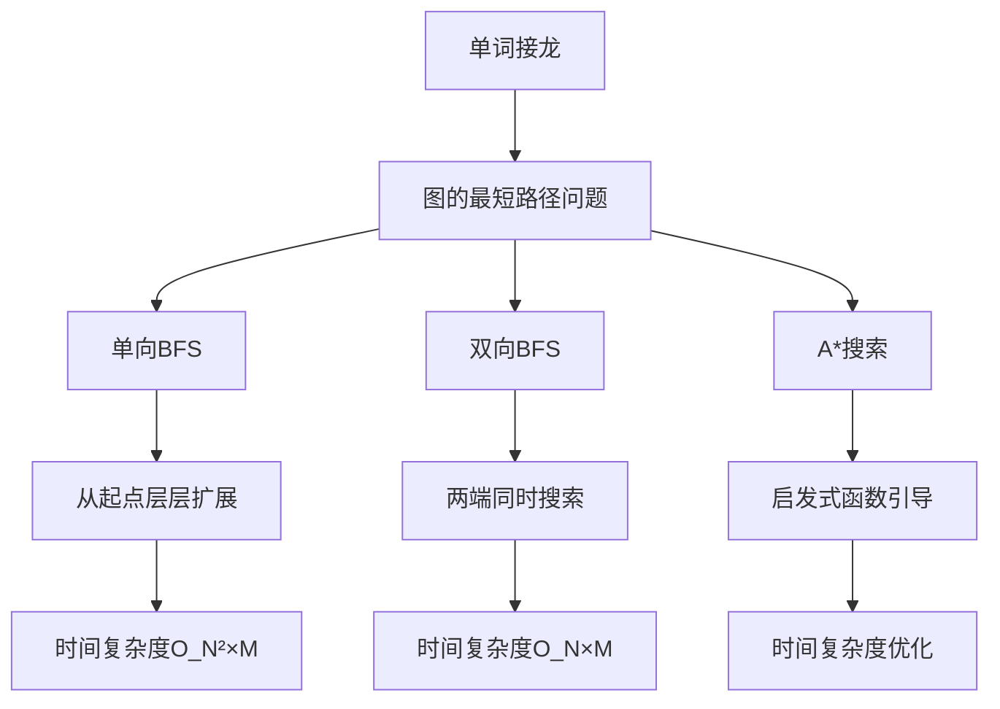

### 单向BFS算法详解

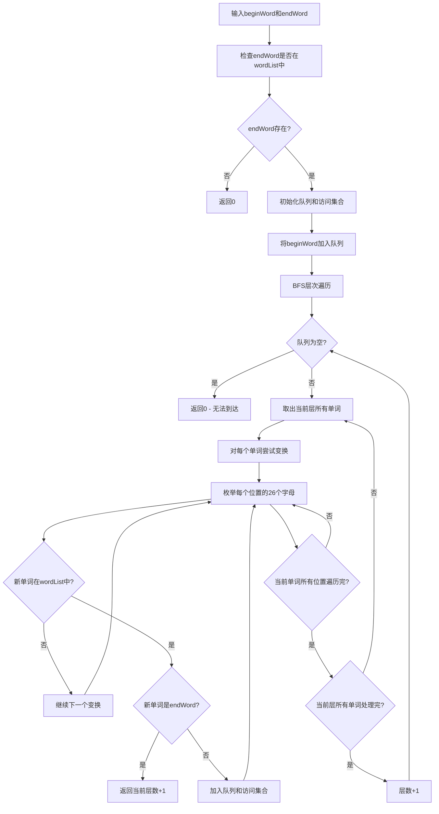

### 双向BFS算法详解

```mermaid
flowchart TD
    A[双向BFS初始化] --> B[创建正向和反向搜索集合]
    B --> C[beginSet = {beginWord}]
    C --> D[endSet = {endWord}]
    D --> E[visited = 空集合]
    
    E --> F{beginSet和endSet都非空?}
    F -->|否| G[返回0]
    F -->|是| H{beginSet与endSet有交集?}
    
    H -->|是| I[返回当前层数]
    H -->|否| J[选择较小的集合扩展]
    
    J --> K[遍历当前集合中的每个单词]
    K --> L[生成所有可能的邻居]
    L --> M{邻居在对方集合中?}
    
    M -->|是| N[找到连接路径]
    M -->|否| O{邻居未被访问?}
    
    O -->|是| P[加入下一层集合]
    O -->|否| Q[跳过此邻居]
    
    P --> R[标记为已访问]
    Q --> L
    R --> L
    L --> S{当前单词所有邻居处理完?}
    S -->|否| L
    S -->|是| T{当前集合所有单词处理完?}
    T -->|否| K
    T -->|是| U[更新当前集合为下一层]
    U --> V[层数+1]
    V --> F
    
    N --> W[返回总层数]
```

### 邻居单词生成过程

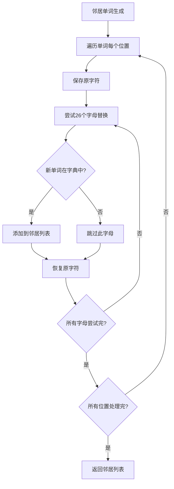

### 算法流程图

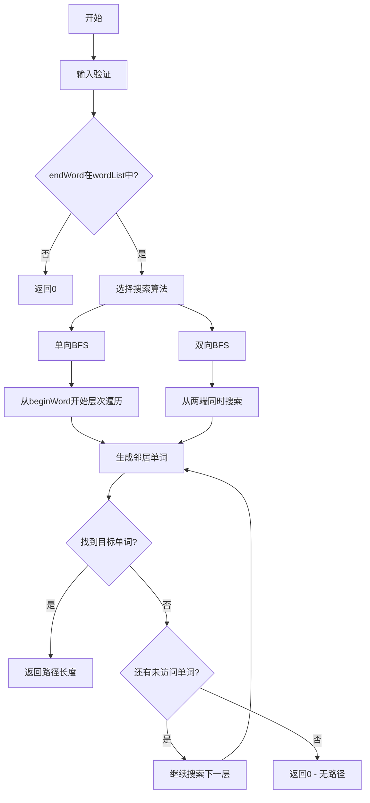

### 边界情况分析

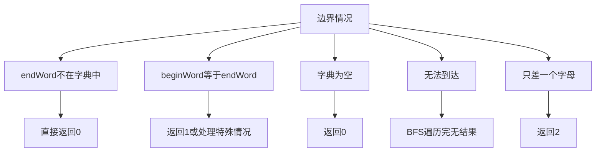

### 各种解法对比

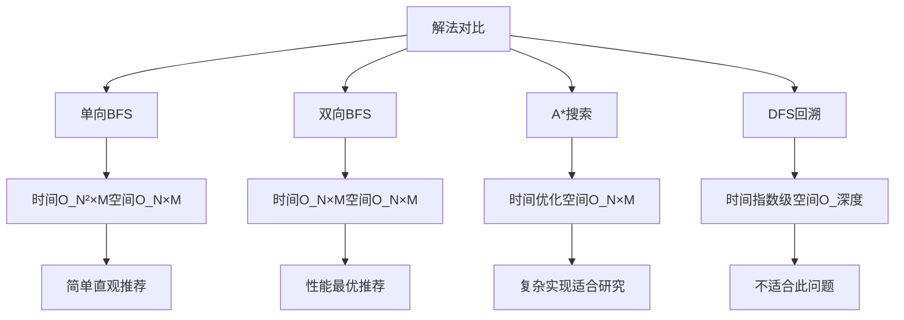

### 时间复杂度分析

- **单向BFS**：O(N² × M)，N为单词数，M为单词长度
- **双向BFS**：O(N × M)，搜索空间减半
- **A*搜索**：O(N × M × log N)，依赖启发函数
- **DFS回溯**：O(N!)，指数级时间复杂度

### 空间复杂度分析

- **单向BFS**：O(N × M)，队列和访问集合
- **双向BFS**：O(N × M)，两个搜索集合
- **A*搜索**：O(N × M)，优先队列和访问记录
- **DFS回溯**：O(深度 × M)，递归栈空间

### 关键优化点

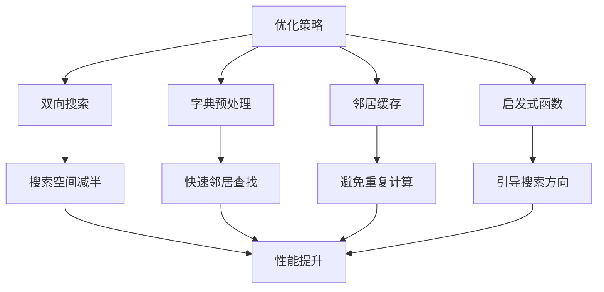

### 实际应用场景

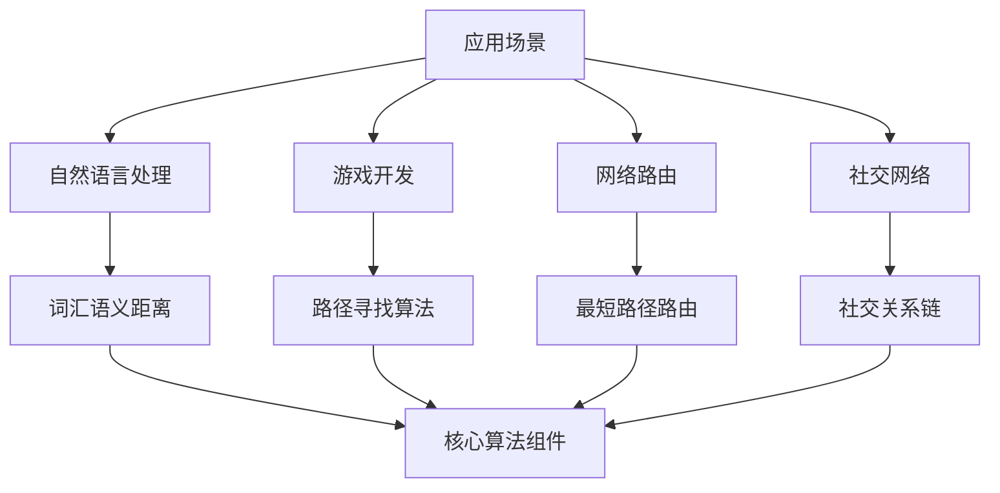

### 图构建策略

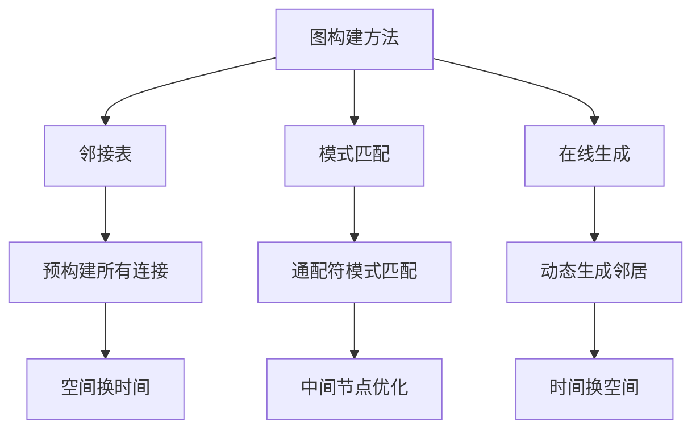

### 双向BFS优化细节

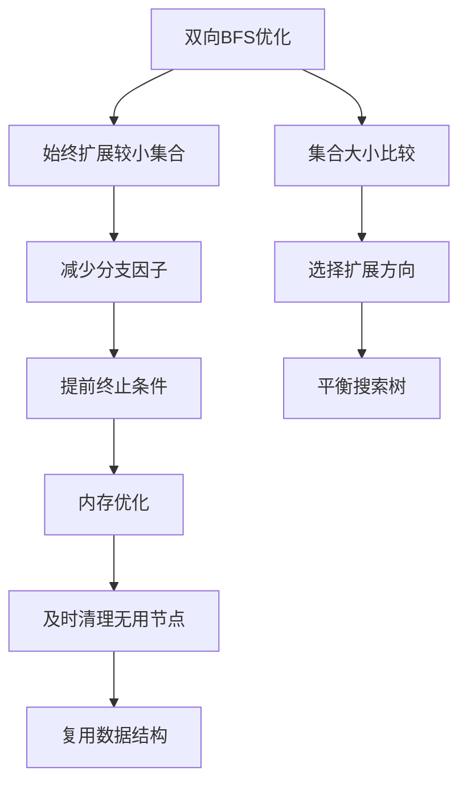

### 测试用例设计

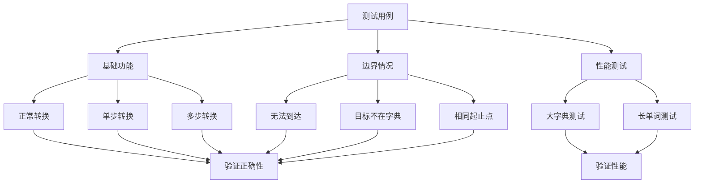

### 算法扩展

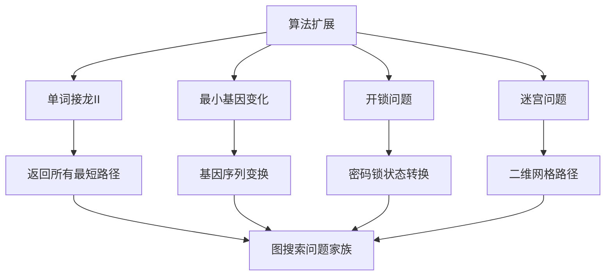

### 代码实现要点

1. **图的表示**：
   - 使用邻接表或在线生成邻居
   - 字典可以用Set进行快速查找
   - 考虑内存和时间的平衡

2. **BFS实现细节**：
   - 使用队列进行层次遍历
   - 记录访问状态避免重复
   - 正确处理层数计算

3. **双向BFS优化**：
   - 始终扩展较小的集合
   - 及时检测两个搜索的交集
   - 合理的终止条件

4. **邻居生成策略**：
   - 枚举每个位置的所有可能字符
   - 利用字典进行有效性检查
   - 避免生成已访问的单词

### 手工验证示例

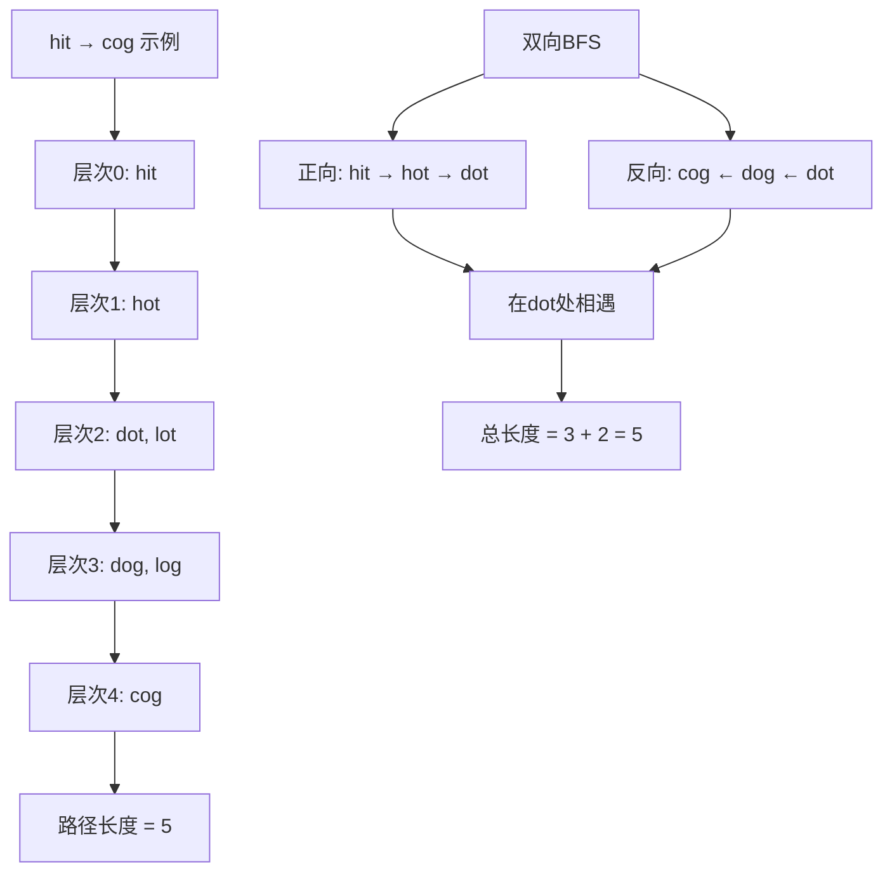

这个问题的关键在于**理解图的最短路径本质**和**掌握BFS层次遍历技巧**，通过合适的搜索策略找到从起始单词到目标单词的最短变换序列。
