# 13. 罗马数字转整数

## 题目描述

罗马数字包含以下七种字符: I， V， X， L，C，D 和 M。

字符          数值
I             1
V             5
X             10
L             50
C             100
D             500
M             1000
例如， 罗马数字 2 写做 II ，即为两个并列的 1 。12 写做 XII ，即为 X + II 。 27 写做  XXVII, 即为 XX + V + II 。

通常情况下，罗马数字中小的数字在大的数字的右边。但也存在特例，例如 4 不写做 IIII，而是 IV。数字 1 在数字 5 的左边，所表示的数等于大数 5 减小数 1 得到的数值 4 。同样地，数字 9 表示为 IX。这个特殊的规则只适用于以下六种情况：

I 可以放在 V (5) 和 X (10) 的左边，来表示 4 和 9。
X 可以放在 L (50) 和 C (100) 的左边，来表示 40 和 90。 
C 可以放在 D (500) 和 M (1000) 的左边，来表示 400 和 900。
给定一个罗马数字，将其转换成整数。


## 示例 1:

输入: s = "III"
输出: 3

## 示例 2:

输入: s = "IV"
输出: 4

## 示例 3:

输入: s = "IX"
输出: 9

## 示例 4:

输入: s = "LVIII"
输出: 58
解释: L = 50, V= 5, III = 3.

## 示例 5:

输入: s = "MCMXCIV"
输出: 1994
解释: M = 1000, CM = 900, XC = 90, IV = 4.

## 提示：

- 1 <= s.length <= 15
- s 仅含字符 ('I', 'V', 'X', 'L', 'C', 'D', 'M')
- 题目数据保证 s 是一个有效的罗马数字，且表示整数在范围 [1, 3999] 内
- 题目所给测试用例皆符合罗马数字书写规则，不会出现跨位等情况。
- IL 和 IM 这样的例子并不符合题目要求，49 应该写作 XLIX，999 应该写作 CMXCIX 。
- 关于罗马数字的详尽书写规则，可以参考 罗马数字 - 百度百科。

## 解题思路

这道题要求将罗马数字转换为整数，是第12题的反向操作。需要理解罗马数字的构成规则，特别是减法表示法的处理。这是一个字符串解析和数学计算的经典问题。

### 算法分析

这道题的核心思想是**减法规则识别**，主要解法包括：

1. **从右到左遍历法**：从右向左遍历，比较相邻字符的值（推荐）
2. **从左到右遍历法**：从左向右遍历，预判下一个字符
3. **数组映射优化**：使用数组替代map，提高查找效率
4. **递归方法**：使用分治思想逐步解析
5. **位运算优化**：使用位运算优化比较操作

### 问题本质分析

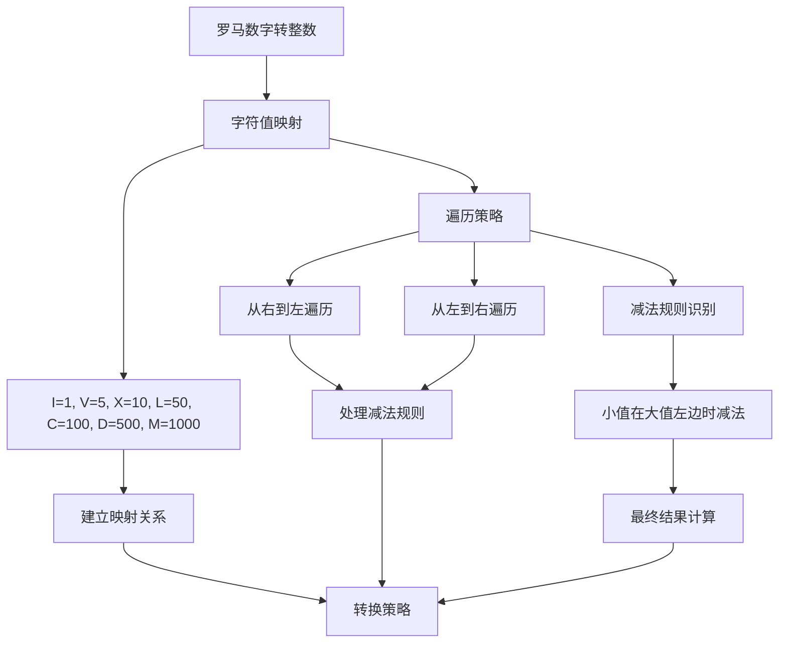

### 从右到左遍历法详解

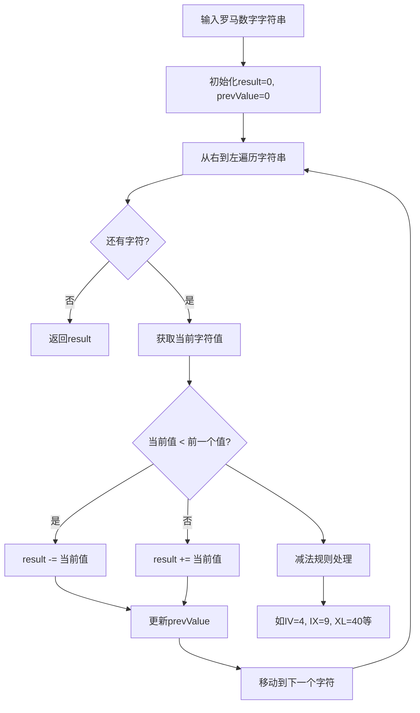

### 转换过程可视化

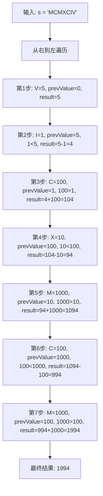

### 减法规则识别

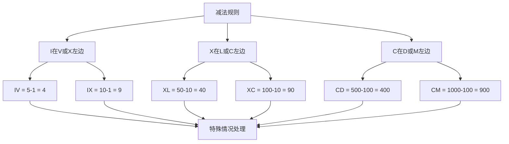

### 各种解法对比

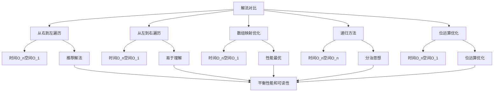

### 算法流程图

```mermaid
flowchart TD
    A[开始] --> B[初始化result=0, prevValue=0]
    B --> C[i = len(s)-1]
    
    C --> D{i >= 0?}
    D -->|否| E[返回result]
    D -->|是| F[获取当前字符值currentValue]
    
    F --> G{currentValue < prevValue?}
    G -->|是| H[result -= currentValue]
    G -->|否| I[result += currentValue]
    
    H --> J[prevValue = currentValue]
    I --> J
    J --> K[i--]
    K --> D
    
    G --> L[减法规则处理]
    L --> M[如IV、IX、XL、XC、CD、CM]
```

### 边界情况处理

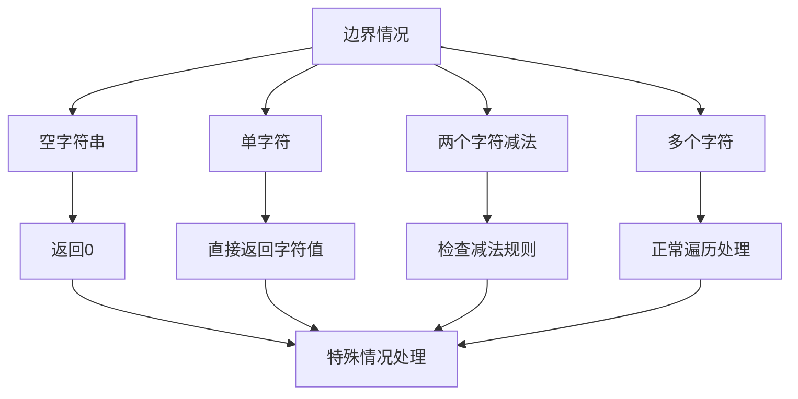

### 时间复杂度分析

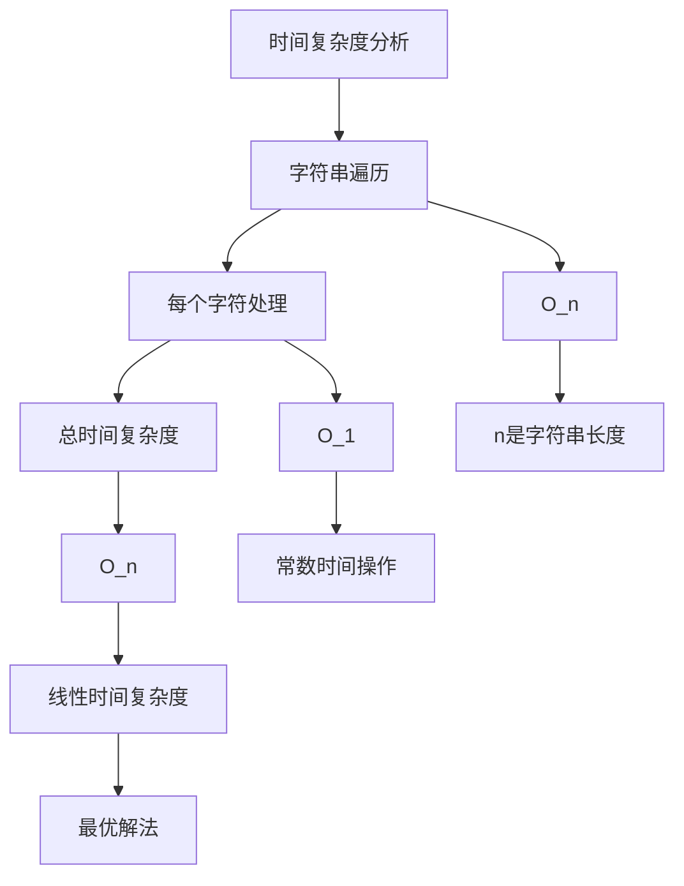

### 空间复杂度分析

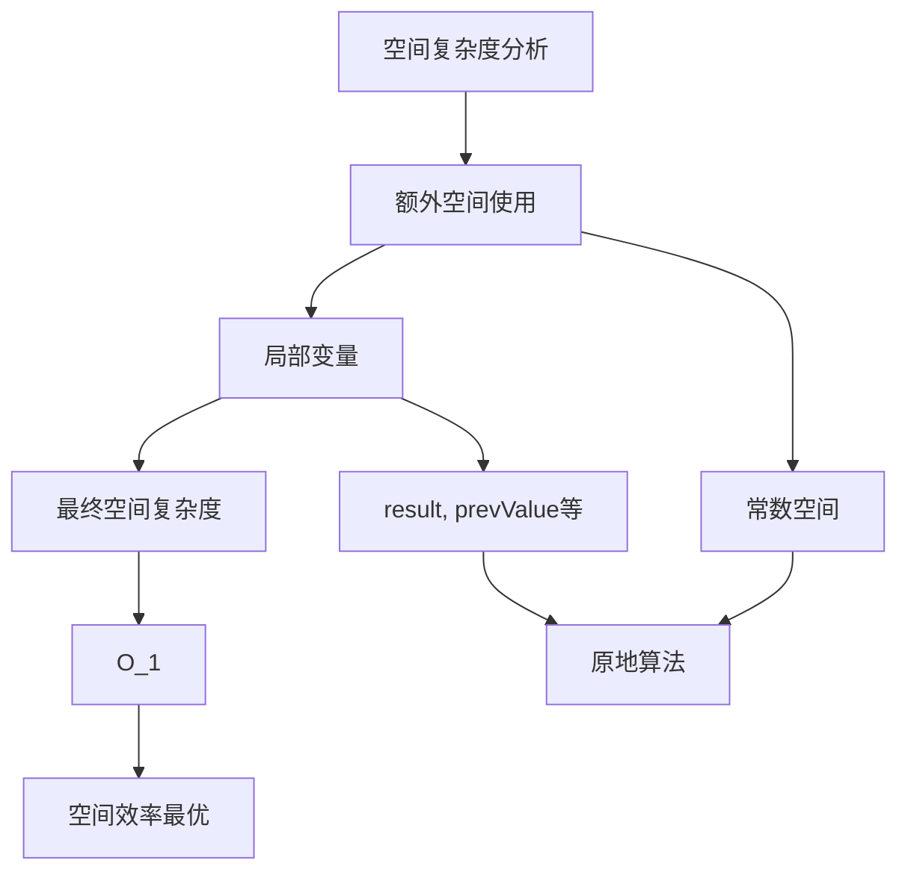

### 关键优化点

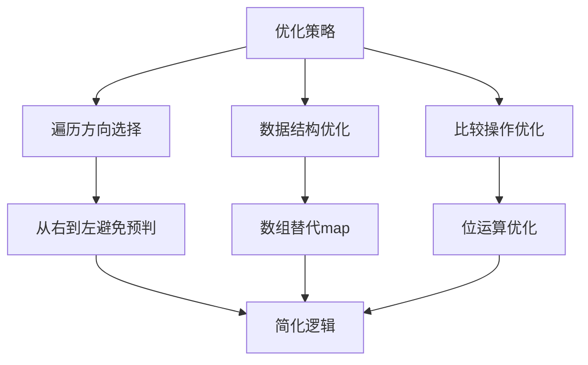

### 实际应用场景

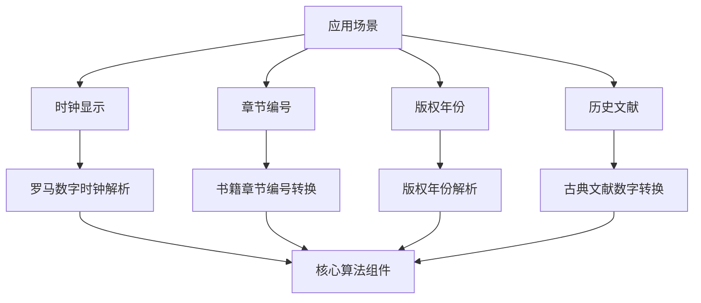

### 测试用例设计

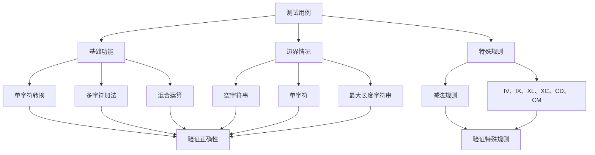

### 代码实现要点

1. **遍历方向选择**：
   - 从右到左遍历：避免预判下一个字符
   - 从左到右遍历：需要检查下一个字符

2. **减法规则识别**：
   - 当前值 < 前一个值时，需要减法
   - 当前值 >= 前一个值时，需要加法

3. **数据结构选择**：
   - 使用map：代码清晰，查找O(1)
   - 使用数组：性能最优，内存连续

4. **边界条件处理**：
   - 空字符串返回0
   - 单字符直接返回对应值
   - 确保所有情况都有正确的输出

5. **性能优化**：
   - 一次遍历完成转换
   - 使用数组替代map减少查找开销
   - 位运算优化比较操作

这个问题的关键在于**理解减法规则的识别逻辑**和**选择合适的遍历策略**，通过一次遍历和简单的比较操作，实现高效的罗马数字到整数的转换。特别是减法规则的处理，如IV、IX、XL、XC、CD、CM等特殊情况需要正确识别。
