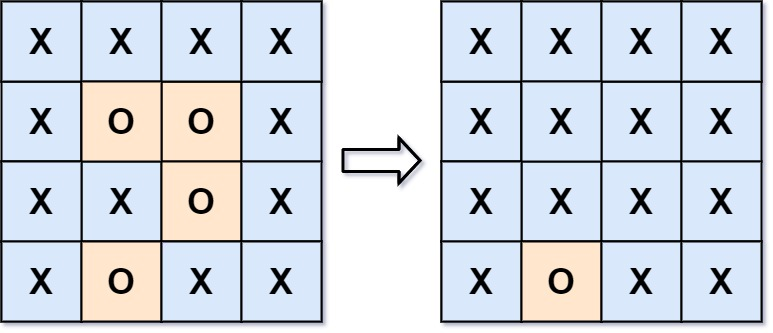

# 130. 被围绕的区域

## 描述

给你一个 m x n 的矩阵 board ，由若干字符 'X' 和 'O' 组成，捕获 所有 被围绕的区域：

连接：一个单元格与水平或垂直方向上相邻的单元格连接。
区域：连接所有 'O' 的单元格来形成一个区域。
围绕：如果您可以用 'X' 单元格 连接这个区域，并且区域中没有任何单元格位于 board 边缘，则该区域被 'X' 单元格围绕。
通过 原地 将输入矩阵中的所有 'O' 替换为 'X' 来 捕获被围绕的区域。你不需要返回任何值。

 

## 示例 1：

输入：board = [["X","X","X","X"],["X","O","O","X"],["X","X","O","X"],["X","O","X","X"]]

输出：[["X","X","X","X"],["X","X","X","X"],["X","X","X","X"],["X","O","X","X"]]

解释：

在上图中，底部的区域没有被捕获，因为它在 board 的边缘并且不能被围绕。

## 示例 2：

输入：board = [["X"]]

输出：[["X"]]

## 提示：

- m == board.length
- n == board[i].length
- 1 <= m, n <= 200
- board[i][j] 为 'X' 或 'O'

## 解题思路

### 算法分析

这道题是**图的遍历**和**连通性分析**的经典应用。主要解法包括：

1. **边界DFS法**：从边界的'O'开始DFS标记
2. **边界BFS法**：从边界的'O'开始BFS标记
3. **并查集法**：使用并查集维护连通性
4. **逆向思维法**：标记不能被围绕的区域

### 问题本质分析

### 边界DFS算法详解

### 边界BFS算法详解

### 并查集算法详解

### 算法流程图

### 边界情况分析

### 各种解法对比

### 时间复杂度分析

- **边界DFS**：O(m×n)，每个位置最多访问一次
- **边界BFS**：O(m×n)，每个位置最多访问一次
- **并查集**：O(m×n×α(m×n))，α为反阿克曼函数
- **朴素方法**：O(m²×n²)，需要多次完整遍历

### 空间复杂度分析

- **边界DFS**：O(m×n)，最坏情况递归栈深度
- **边界BFS**：O(m×n)，队列最大长度
- **并查集**：O(m×n)，存储父节点数组
- **原地修改**：O(1)，不考虑递归栈

### 关键优化点

### 实际应用场景

### DFS递归过程详解

### 测试用例设计

### 算法扩展

### 代码实现要点

1. **边界处理**：
   - 正确处理矩阵边界索引
   - 避免数组越界访问
   - 特殊情况的提前返回

2. **状态标记**：
   - 使用临时标记区分不同状态
   - 最终恢复或修改为目标状态
   - 避免重复访问同一位置

3. **搜索策略**：
   - 从边界开始而非内部
   - 四个方向的遍历顺序
   - 递归终止条件的设置

4. **空间优化**：
   - 原地修改减少空间消耗
   - 合理选择DFS或BFS
   - 避免不必要的数据结构

### 手工验证示例

这个问题的关键在于**理解逆向思维的重要性**和**掌握从边界开始搜索的技巧**，通过标记不能被围绕的区域来解决问题。

