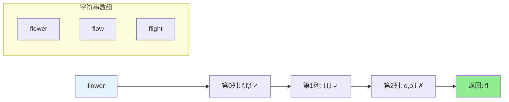
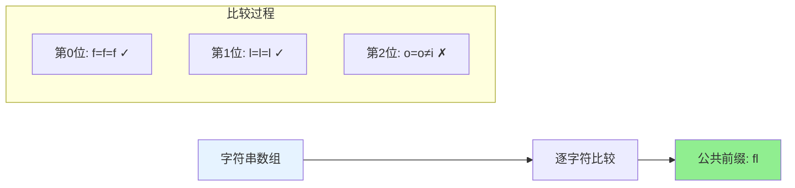
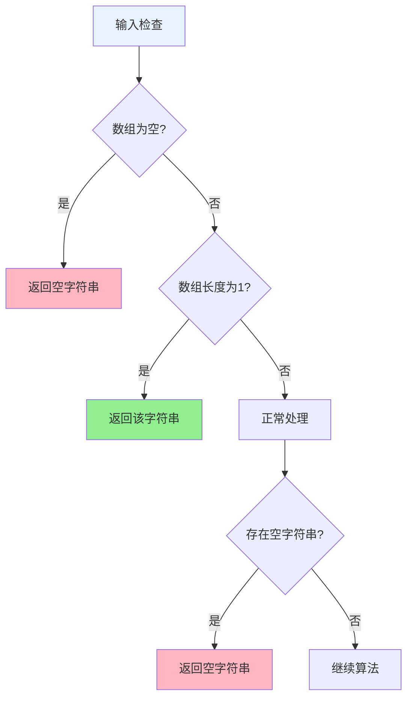

# 14. 最长公共前缀

## 题目描述

编写一个函数来查找字符串数组中的最长公共前缀。

如果不存在公共前缀，返回空字符串 ""。

>来源：力扣（LeetCode）
链接：https://leetcode.cn/problems/longest-common-prefix
著作权归领扣网络所有。商业转载请联系官方授权，非商业转载请注明出处。
<hr></hr>

## 示例 1：

输入：strs = ["flower","flow","flight"]
输出："fl"

## 示例 2：

输入：strs = ["dog","racecar","car"]
输出：""
解释：输入不存在公共前缀。

## 示例 3：

输入：strs = ["interspecies","interstellar","interstate"]
输出："inters"

## 示例 4：

输入：strs = ["throne","throne"]
输出："throne"

## 提示：

- 1 <= strs.length <= 200
- 0 <= strs[i].length <= 200
- strs[i] 如果非空，则仅由小写英文字母组成

## 解题思路

### 方法一：横向扫描（推荐）

**核心思想**：
- 依次遍历字符串数组中的每个字符串，对于每个遍历到的字符串，更新最长公共前缀
- 当遍历完所有的字符串以后，即可得到字符串数组中的最长公共前缀
- 如果在尚未遍历完所有的字符串时，最长公共前缀已经是空串，则最长公共前缀一定是空串

**算法步骤**：
1. 如果字符串数组为空，返回空字符串
2. 取第一个字符串作为初始的公共前缀
3. 遍历剩余的字符串，依次与当前公共前缀求交集
4. 如果公共前缀变为空，直接返回空字符串
5. 返回最终的公共前缀

**时间复杂度**：O(S)，其中S是所有字符串中字符数量的总和
**空间复杂度**：O(1)，使用的额外空间复杂度为常数

### 方法二：纵向扫描

**核心思想**：
- 从前往后遍历所有字符串的每一列，比较相同列上的字符是否相同
- 如果相同则继续对下一列进行比较，如果不相同则当前列不再属于公共前缀，当前列之前的部分为最长公共前缀

**算法步骤**：
1. 如果字符串数组为空，返回空字符串
2. 找到最短字符串的长度
3. 逐列比较所有字符串的字符
4. 如果某一列字符不匹配，返回当前列之前的部分
5. 如果所有列都匹配，返回最短字符串

**时间复杂度**：O(S)，其中S是所有字符串中字符数量的总和
**空间复杂度**：O(1)

### 方法三：分治算法

**核心思想**：
- 将字符串数组分成两部分，分别求两部分的最长公共前缀，然后求这两个前缀的公共前缀
- 递归地处理，直到只剩下一个字符串

**算法步骤**：
1. 如果字符串数组长度为1，返回该字符串
2. 如果字符串数组长度为2，直接比较两个字符串
3. 将数组分成两半，递归求每半的最长公共前缀
4. 求两个前缀的公共前缀

**时间复杂度**：O(S)，其中S是所有字符串中字符数量的总和
**空间复杂度**：O(m log n)，其中m是字符串数组中的字符串的平均长度，n是字符串的数量

### 方法四：二分查找

**核心思想**：
- 最长公共前缀的长度不会超过字符串数组中的最短字符串的长度
- 可以在[0, minLength]的范围内通过二分查找得到最长公共前缀的长度

**算法步骤**：
1. 找到最短字符串的长度
2. 在[0, minLength]范围内进行二分查找
3. 对于每个中间值，检查是否所有字符串的前缀都相同
4. 根据检查结果调整二分查找的范围

**时间复杂度**：O(S × log m)，其中S是所有字符串中字符数量的总和，m是字符串数组中的字符串的最小长度
**空间复杂度**：O(1)

## 代码实现

```go
// 方法一：横向扫描（推荐）
func longestCommonPrefix(strs []string) string {
    if len(strs) == 0 {
        return ""
    }
    
    prefix := strs[0]
    for i := 1; i < len(strs); i++ {
        prefix = commonPrefix(prefix, strs[i])
        if prefix == "" {
            return ""
        }
    }
    
    return prefix
}

// 辅助函数：求两个字符串的公共前缀
func commonPrefix(str1, str2 string) string {
    length := min(len(str1), len(str2))
    index := 0
    for index < length && str1[index] == str2[index] {
        index++
    }
    return str1[:index]
}

// 辅助函数：求最小值
func min(a, b int) int {
    if a < b {
        return a
    }
    return b
}
```

## 复杂度分析

| 方法     | 时间复杂度   | 空间复杂度 | 适用场景     |
| -------- | ------------ | ---------- | ------------ |
| 横向扫描 | O(S)         | O(1)       | 推荐，最优解 |
| 纵向扫描 | O(S)         | O(1)       | 直观易懂     |
| 分治算法 | O(S)         | O(m log n) | 分治思维     |
| 二分查找 | O(S × log m) | O(1)       | 理论最优     |

## 算法图解

### 横向扫描过程

```mermaid
graph TD
    A[开始: strs=["flower","flow","flight"]] --> B[初始化: prefix="flower"]
    B --> C[比较: "flower" 和 "flow"]
    C --> D[公共前缀: "flow"]
    D --> E[比较: "flow" 和 "flight"]
    E --> F[公共前缀: "fl"]
    F --> G[返回结果: "fl"]
    
    style G fill:#90EE90
    style A fill:#E6F3FF
    style B fill:#FFF2CC
```

### 纵向扫描过程



### 分治算法过程

```mermaid
graph TD
    A["strs=["flower","flow","flight"]"] --> B["分成两半"]
    B --> C["左半: ["flower","flow"]"]
    B --> D["右半: ["flight"]"]
    C --> E["求公共前缀: "flow""]
    D --> F["求公共前缀: "flight""]
    E --> G["比较: "flow" 和 "flight""]
    F --> G
    G --> H["最终结果: "fl""]
    
    style H fill:#90EE90
    style A fill:#E6F3FF
```

### 二分查找过程

```mermaid
graph TD
    A[开始: strs=["flower","flow","flight"]] --> B[最短长度: 4]
    B --> C[二分范围: [0,4]]
    C --> D[中间值: 2]
    D --> E{检查前2个字符}
    E -->|匹配| F[调整范围: [2,4]]
    F --> G[中间值: 3]
    G --> H{检查前3个字符}
    H -->|不匹配| I[调整范围: [2,3]]
    I --> J[中间值: 2]
    J --> K[返回结果: 2]
    
    style K fill:#90EE90
    style A fill:#E6F3FF
```

### 字符比较过程



### 边界情况处理



## 边界情况处理

1. **空数组**：返回空字符串
2. **单个字符串**：返回该字符串本身
3. **包含空字符串**：返回空字符串
4. **所有字符串相同**：返回任意一个字符串
5. **无公共前缀**：返回空字符串
6. **最短字符串为公共前缀**：返回最短字符串

## 测试用例

```go
func main() {
    // 测试用例1
    strs1 := []string{"flower", "flow", "flight"}
    fmt.Printf("测试用例1: %v\n", strs1)
    fmt.Printf("结果: %s\n", longestCommonPrefix(strs1))
    
    // 测试用例2
    strs2 := []string{"dog", "racecar", "car"}
    fmt.Printf("测试用例2: %v\n", strs2)
    fmt.Printf("结果: %s\n", longestCommonPrefix(strs2))
    
    // 测试用例3
    strs3 := []string{"interspecies", "interstellar", "interstate"}
    fmt.Printf("测试用例3: %v\n", strs3)
    fmt.Printf("结果: %s\n", longestCommonPrefix(strs3))
    
    // 边界测试
    testCases := []struct {
        strs []string
        desc string
    }{
        {[]string{"throne", "throne"}, "相同字符串"},
        {[]string{"a"}, "单个字符串"},
        {[]string{}, "空数组"},
        {[]string{"", "b", "c"}, "包含空字符串"},
        {[]string{"a", "b", "c"}, "无公共前缀"},
        {[]string{"abc", "abcde", "abcdef"}, "最短字符串为前缀"},
    }
    
    for _, tc := range testCases {
        fmt.Printf("%s: %v\n", tc.desc, tc.strs)
        fmt.Printf("结果: %s\n", longestCommonPrefix(tc.strs))
    }
}
```

## 关键技巧

1. **提前返回**：一旦发现不匹配，立即返回当前结果
2. **边界检查**：处理空数组、单个字符串等特殊情况
3. **字符比较**：逐字符比较，找到第一个不匹配的位置
4. **长度优化**：使用最短字符串的长度作为上限
5. **算法选择**：根据数据特点选择合适的算法

## 实际应用

- **文件路径匹配**：查找多个文件路径的公共前缀
- **URL路由**：Web框架中的路由匹配
- **字符串搜索**：搜索引擎中的前缀匹配
- **数据库查询**：索引前缀优化
- **网络协议**：IP地址前缀匹配

