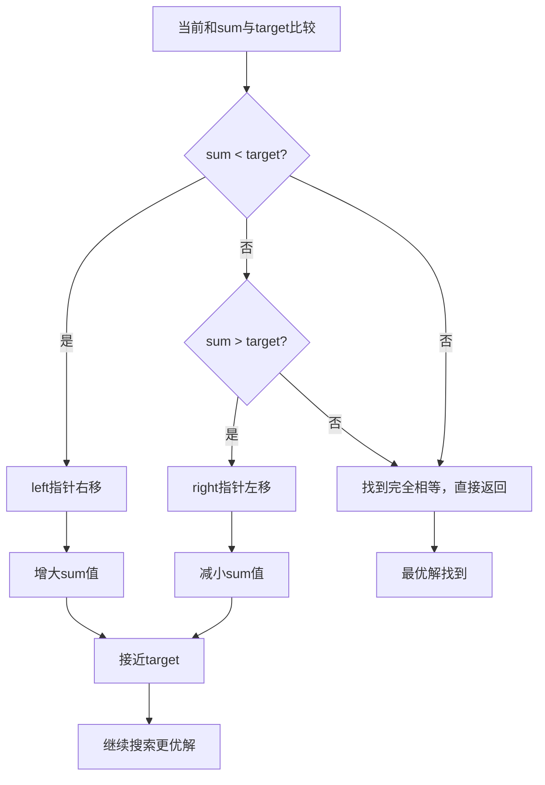
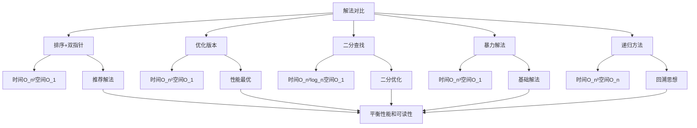
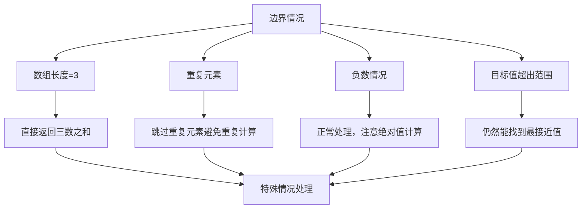
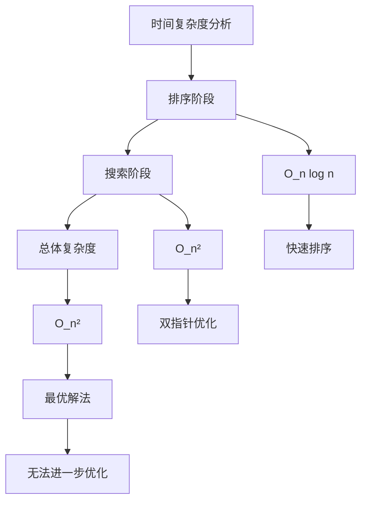
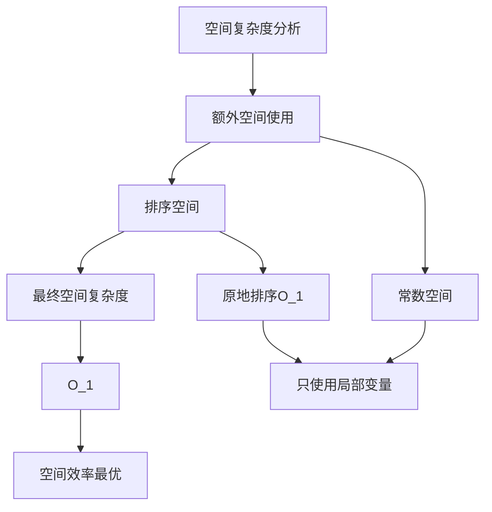
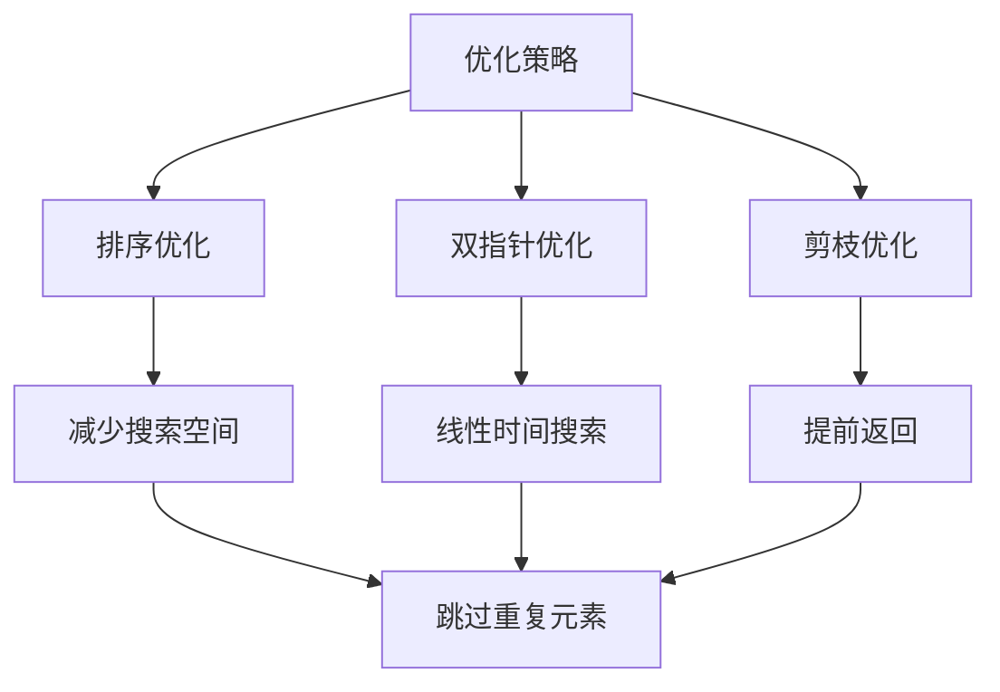
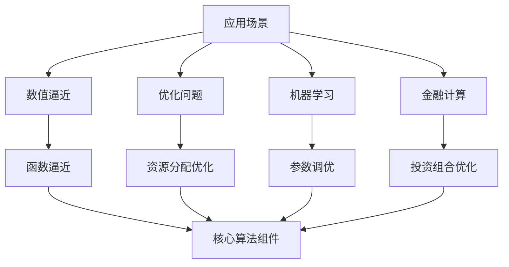
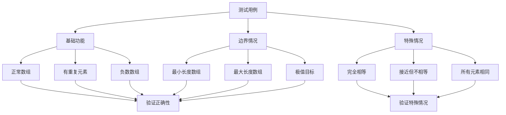

# 16. 最接近的三数之和

## 题目描述

给你一个长度为 n 的整数数组 nums 和 一个目标值 target。请你从 nums 中选出三个整数，使它们的和与 target 最接近。

返回这三个数的和。

假定每组输入只存在恰好一个解。


## 示例 1：

输入：nums = [-1,2,1,-4], target = 1
输出：2
解释：与 target 最接近的和是 2 (-1 + 2 + 1 = 2)。

## 示例 2：

输入：nums = [0,0,0], target = 1
输出：0
解释：与 target 最接近的和是 0（0 + 0 + 0 = 0）。


## 提示：

- 3 <= nums.length <= 1000
- -1000 <= nums[i] <= 1000
- -10^4 <= target <= 10^4

## 解题思路

这道题要求从数组中找出三个数，使它们的和与目标值最接近。这是第15题"三数之和"的变种，需要找到最接近而不是完全相等的组合。这是一个经典的数组搜索和优化问题。

### 算法分析

这道题的核心思想是**排序+双指针优化**，主要解法包括：

1. **排序+双指针法**：先排序，再使用双指针寻找最接近的和（推荐）
2. **优化版本**：添加提前剪枝和重复元素跳过
3. **二分查找法**：固定两个数，用二分查找找第三个数
4. **暴力解法**：三重循环枚举所有可能
5. **递归方法**：使用回溯思想逐步选择

### 问题本质分析

```mermaid
graph TD
    A[最接近的三数之和] --> B[数组排序]
    B --> C[固定第一个数]
    C --> D[双指针寻找]
    D --> E[更新最接近值]
    
    B --> F[时间复杂度优化]
    C --> G[减少搜索空间]
    D --> H[线性时间搜索]
    E --> I[绝对值比较]
    
    F --> J[排序O(n log n)]
    G --> K[跳过重复元素]
    H --> L[双指针O(n)]
    I --> M[距离计算]
    
    J --> N[总体复杂度O(n²)]
    K --> N
    L --> N
    M --> N
```

### 排序+双指针法详解

```mermaid
flowchart TD
    A[输入数组nums和目标值target] --> B[对数组排序]
    B --> C[初始化closestSum和minDiff]
    C --> D[固定第一个数i]
    
    D --> E{i < len(nums)-2?}
    E -->|否| F[返回closestSum]
    E -->|是| G[跳过重复元素]
    
    G --> H[设置双指针left=i+1, right=len(nums)-1]
    H --> I{left < right?}
    
    I -->|否| J[i++]
    J --> D
    
    I -->|是| K[计算sum = nums[i] + nums[left] + nums[right]]
    K --> L[计算diff = abs(sum - target)]
    
    L --> M{diff < minDiff?}
    M -->|是| N[更新minDiff和closestSum]
    M -->|否| O{sum < target?}
    
    N --> O
    O -->|是| P[left++]
    O -->|否| Q{sum > target?}
    O -->|否| R[返回sum]
    
    Q -->|是| S[right--]
    Q -->|否| R
    
    P --> I
    S --> I
    R --> F
```

### 双指针移动策略



### 搜索过程可视化

```mermaid
graph TD
    A["输入: nums = [-4, -1, 1, 2], target = 1"] --> B[排序后: [-4, -1, 1, 2]]
    
    B --> C["第1轮: i=0, nums[i]=-4"]
    C --> D["left=1, right=3, sum=-4+(-1)+2=-3"]
    D --> E["diff=|-3-1|=4, 更新closestSum=-3"]
    E --> F["sum < target, left++"]
    
    F --> G["left=2, right=3, sum=-4+1+2=-1"]
    G --> H["diff=|-1-1|=2, 更新closestSum=-1"]
    H --> I["sum < target, left++"]
    
    I --> J["left=3, right=3, 结束第1轮"]
    J --> K["第2轮: i=1, nums[i]=-1"]
    
    K --> L["left=2, right=3, sum=-1+1+2=2"]
    L --> M["diff=|2-1|=1, 更新closestSum=2"]
    M --> N["sum > target, right--"]
    
    N --> O["left=2, right=2, 结束第2轮"]
    O --> P["最终结果: 2"]
```

### 各种解法对比



### 算法流程图

```mermaid
flowchart TD
    A[开始] --> B[对数组排序]
    B --> C[初始化closestSum和minDiff]
    C --> D[i = 0]
    
    D --> E{i < len(nums)-2?}
    E -->|否| F[返回closestSum]
    E -->|是| G{跳过重复元素?}
    
    G -->|是| H[i++]
    H --> D
    
    G -->|否| I[left = i+1, right = len(nums)-1]
    I --> J{left < right?}
    
    J -->|否| K[i++]
    K --> D
    
    J -->|是| L[计算sum和diff]
    L --> M{更新最接近值}
    M --> N{sum与target比较}
    
    N -->|sum < target| O[left++]
    N -->|sum > target| P[right--]
    N -->|sum == target| Q[返回sum]
    
    O --> J
    P --> J
    Q --> R[结束]
```

### 边界情况处理



### 时间复杂度分析



### 空间复杂度分析



### 关键优化点



### 实际应用场景



### 测试用例设计



### 代码实现要点

1. **排序策略**：
   - 先对数组排序，便于双指针操作
   - 排序后可以跳过重复元素

2. **双指针优化**：
   - 固定第一个数，用双指针寻找另外两个数
   - 根据sum与target的关系移动指针

3. **距离计算**：
   - 使用绝对值计算距离
   - 实时更新最接近的和

4. **剪枝优化**：
   - 跳过重复元素避免重复计算
   - 找到完全相等时提前返回

5. **边界处理**：
   - 处理数组长度为3的特殊情况
   - 确保所有边界条件都有正确输出

这个问题的关键在于**理解双指针的移动策略**和**掌握距离计算的优化方法**，通过排序和双指针技术，将时间复杂度从O(n³)优化到O(n²)，实现高效的最接近三数之和查找。特别是双指针的移动逻辑，需要根据当前和与目标值的关系来决定移动方向。
