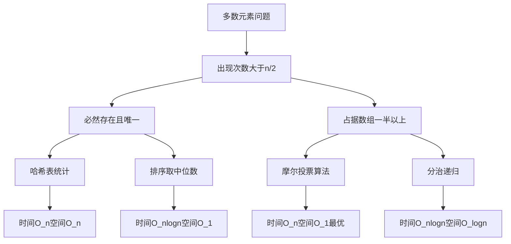
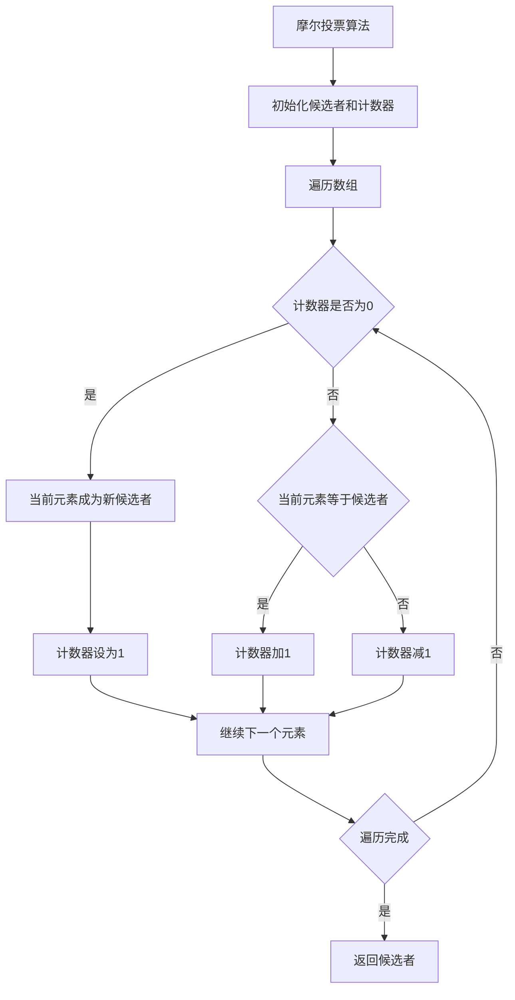
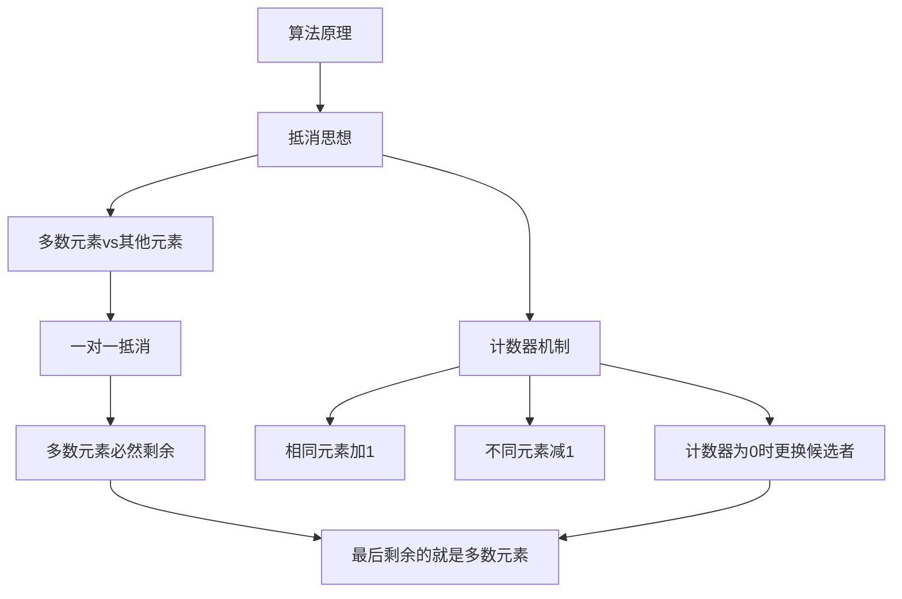
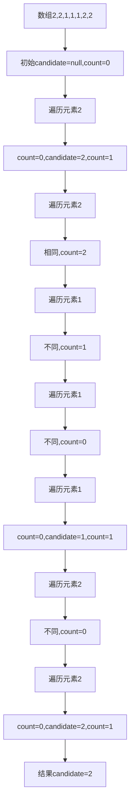
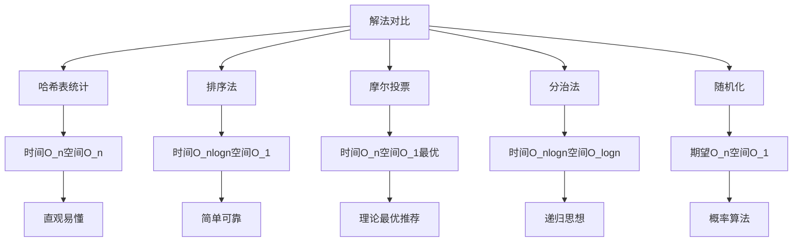
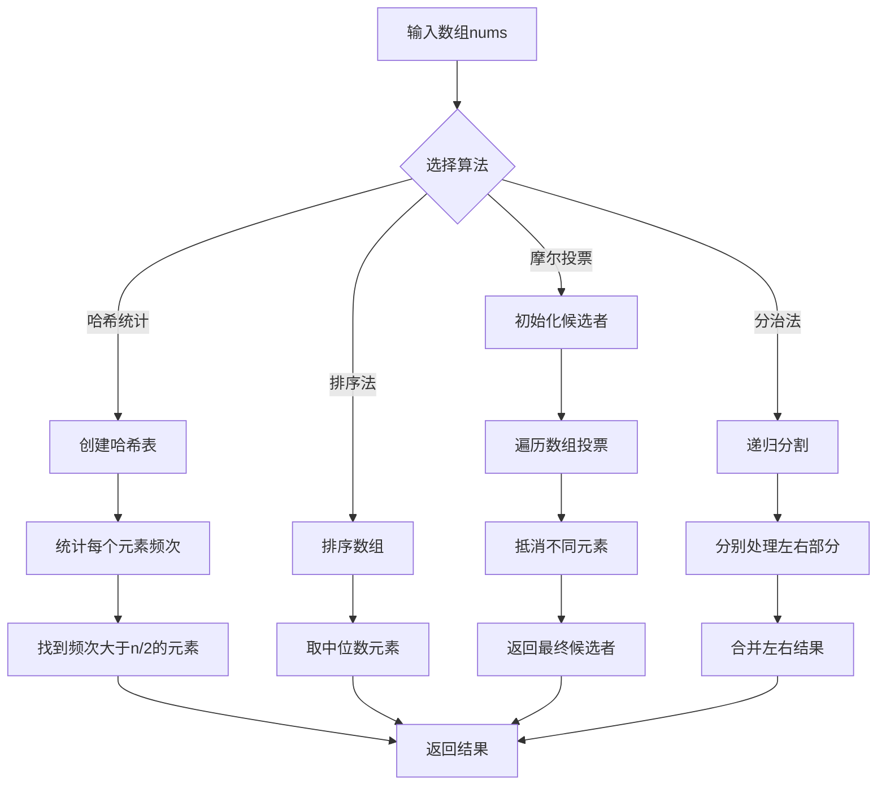
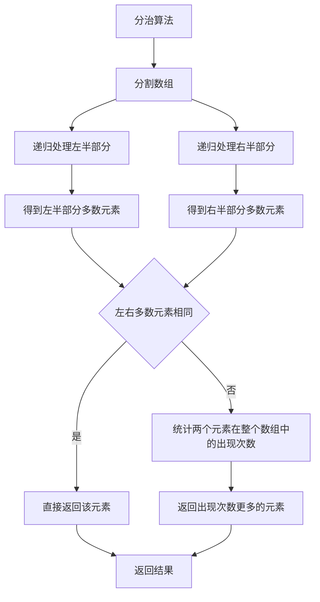
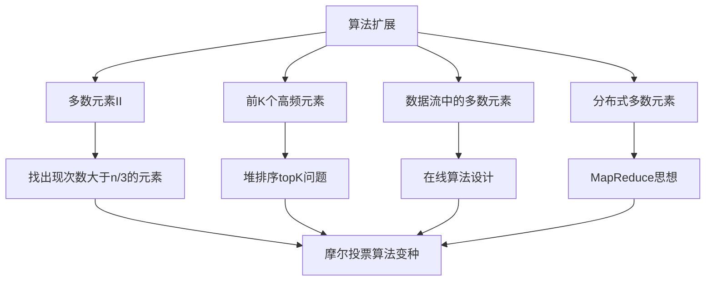
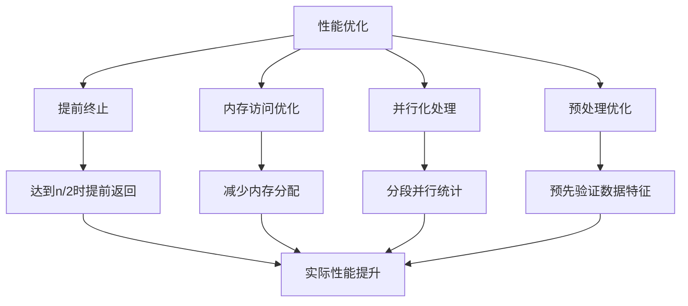
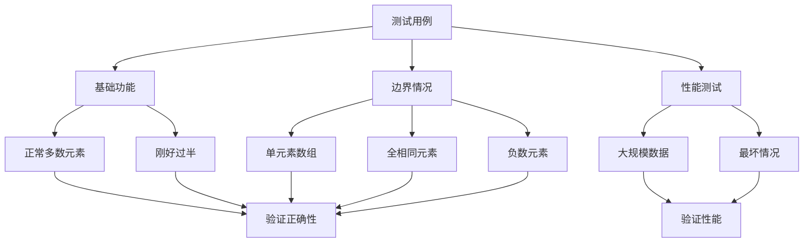

# 169. 多数元素

## 描述

给定一个大小为 n 的数组 nums ，返回其中的多数元素。多数元素是指在数组中出现次数 大于 ⌊ n/2 ⌋ 的元素。

你可以假设数组是非空的，并且给定的数组总是存在多数元素。

## 示例 1

输入：nums = [3,2,3]
输出：3

## 示例 2

输入：nums = [2,2,1,1,1,2,2]
输出：2

## 提示

- n == nums.length
- 1 <= n <= 5 * 104
- -10^9 <= nums[i] <= 10^9

## 进阶

尝试设计时间复杂度为 O(n)、空间复杂度为 O(1) 的算法解决此问题。

## 解题思路

### 算法分析

这道题是**多数元素查找**的经典问题，核心是找到出现次数大于⌊n/2⌋的元素。主要解法包括：

1. **哈希表统计法**：直接统计每个元素出现次数，简单直观
2. **排序法**：排序后中位数必然是多数元素
3. **摩尔投票法**：最优解，O(n)时间O(1)空间
4. **分治法**：递归思想，分别找左右两部分的多数元素
5. **随机化算法**：随机选择元素验证，期望O(n)时间

### 问题本质分析

### 摩尔投票算法详解

**核心思想**：多数元素的出现次数大于其他所有元素出现次数之和

### 摩尔投票算法原理

### 摩尔投票过程示例

### 各种解法对比

### 算法流程图

### 分治算法详解

### 代码实现思路

1. **摩尔投票法实现**：
   - 维护候选者和计数器
   - 遍历数组进行投票和抵消
   - 最优的时间空间复杂度

2. **哈希表统计实现**：
   - 使用map统计每个元素出现次数
   - 找到出现次数大于n/2的元素
   - 直观但需要额外空间

3. **排序法实现**：
   - 对数组进行排序
   - 中位数必然是多数元素
   - 简单可靠但时间复杂度较高

4. **分治法实现**：
   - 递归分割数组
   - 合并左右部分的结果
   - 体现分治思想

### 时间复杂度分析

- **哈希表统计法**：O(n)，需要遍历数组一次
- **排序法**：O(n log n)，主要开销在排序
- **摩尔投票法**：O(n)，只需遍历数组一次
- **分治法**：O(n log n)，递归分割加统计
- **随机化算法**：期望O(n)，最坏O(∞)

### 空间复杂度分析

- **哈希表统计法**：O(n)，需要哈希表存储
- **排序法**：O(1)，原地排序
- **摩尔投票法**：O(1)，只需常数额外空间
- **分治法**：O(log n)，递归栈空间
- **随机化算法**：O(1)，只需常数空间

### 关键优化点

1. **摩尔投票核心**：利用多数元素的数量优势
2. **抵消机制**：不同元素相互抵消，多数元素必然剩余
3. **一次遍历**：只需要遍历数组一次
4. **常数空间**：不需要额外的存储空间

### 边界情况处理

1. **数组长度为1**：直接返回唯一元素
2. **所有元素相同**：任意元素都是多数元素
3. **刚好一半以上**：确保找到正确的多数元素
4. **负数元素**：算法对元素值没有限制

### 实际应用场景

1. **投票系统**：找到得票最多的候选人
2. **数据分析**：找到出现频率最高的数据
3. **网络通信**：检测主要的数据模式
4. **质量控制**：识别主要的缺陷类型

### 算法扩展

### 性能优化技巧

### 测试用例设计

### 算法正确性证明

**摩尔投票算法正确性**：
1. **不变式**：如果多数元素存在，那么在任何时候被消除的元素中，多数元素的数量不会超过其他元素数量之和
2. **终止性**：算法必然终止，因为数组长度有限
3. **正确性**：由于多数元素数量大于n/2，经过抵消后必然剩余

这个问题的关键在于**理解摩尔投票算法的抵消思想**和**掌握多数元素的数学性质**，通过巧妙的投票机制在O(n)时间O(1)空间内解决问题。
