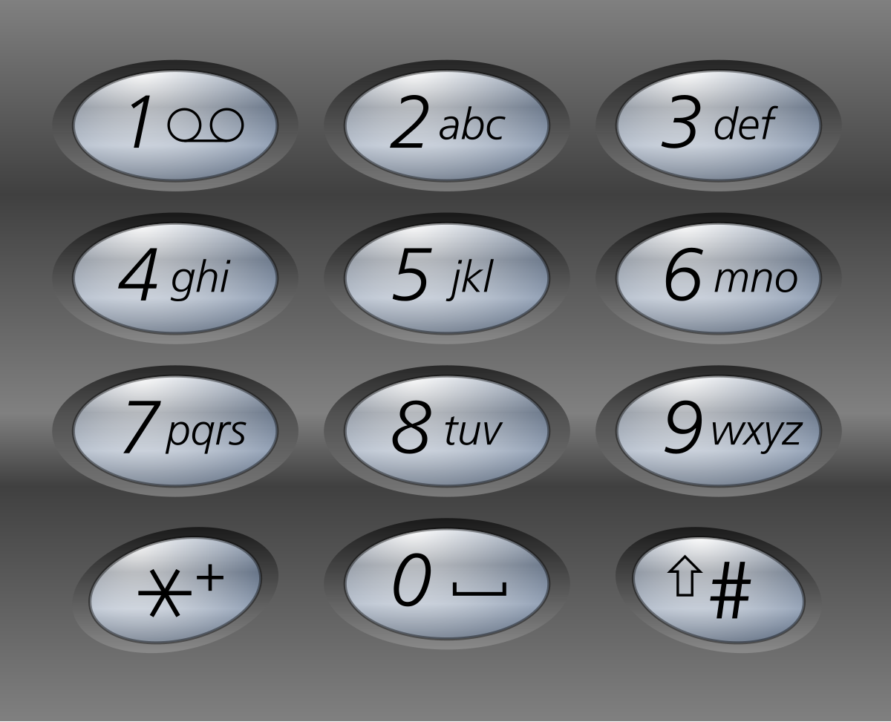

# 17. 电话号码的字母组合

## 题目描述

给定一个仅包含数字 2-9 的字符串，返回所有它能表示的字母组合。答案可以按 任意顺序 返回。

给出数字到字母的映射如下（与电话按键相同）。注意 1 不对应任何字母。



## 示例 1：

输入：digits = "23"
输出：["ad","ae","af","bd","be","bf","cd","ce","cf"]

## 示例 2：

输入：digits = ""
输出：[]

## 示例 3：

输入：digits = "2"
输出：["a","b","c"]

## 提示：

- 0 <= digits.length <= 4
- digits[i] 是范围 ['2', '9'] 的一个数字。

## 解题思路

这道题要求根据电话号码的数字组合，生成所有可能的字母组合。这是一个经典的**回溯算法**问题，需要枚举所有可能的组合。每个数字对应3-4个字母，需要生成所有可能的排列组合。

### 算法分析

这道题的核心思想是**回溯枚举**，主要解法包括：

1. **回溯法**：使用递归和回溯生成所有组合（推荐）
2. **迭代法**：使用队列进行层序遍历
3. **优化版本**：使用strings.Builder提高字符串操作效率
4. **BFS方法**：广度优先搜索生成组合
5. **递归分治**：使用分治思想逐步构建组合

### 问题本质分析


### 回溯法详解

```mermaid
flowchart TD
    A[输入digits字符串] --> B{digits为空?}
    B -->|是| C[返回空数组]
    B -->|否| D[初始化结果数组]
    
    D --> E[调用回溯函数backtrack]
    E --> F[backtrack(index=0, current="")]
    
    F --> G{index == len(digits)?}
    G -->|是| H[添加current到结果]
    G -->|否| I[获取当前数字对应的字母]
    
    H --> J[返回结果]
    I --> K[遍历每个字母]
    
    K --> L[选择当前字母]
    L --> M[递归调用backtrack(index+1)]
    M --> N[回溯：移除当前字母]
    N --> O{还有字母?}
    
    O -->|是| K
    O -->|否| P[返回上一层]
    
    G --> Q[终止条件处理]
    Q --> R[结果收集]
```

### 组合生成过程可视化


### 数字映射关系


### 各种解法对比


### 算法流程图

```mermaid
flowchart TD
    A[开始] --> B{digits为空?}
    B -->|是| C[返回空数组]
    B -->|否| D[初始化结果数组]
    
    D --> E[调用backtrack(0, '')]
    E --> F{index >= len(digits)?}
    
    F -->|是| G[添加current到结果]
    F -->|否| H[获取当前数字的字母]
    
    G --> I[返回结果]
    H --> J[遍历每个字母]
    
    J --> K[选择当前字母]
    K --> L[递归backtrack(index+1)]
    L --> M[回溯：移除字母]
    M --> N{还有字母?}
    
    N -->|是| J
    N -->|否| O[返回]
    
    F --> P[递归终止条件]
    P --> Q[结果收集和返回]
```

### 边界情况处理


### 时间复杂度分析


### 空间复杂度分析


### 关键优化点


### 实际应用场景


### 测试用例设计


### 代码实现要点

1. **回溯策略**：
   - 使用递归函数进行深度优先搜索
   - 在每个位置尝试所有可能的字母
   - 到达叶子节点时收集结果

2. **状态管理**：
   - 维护当前构建的字符串
   - 记录当前处理的位置
   - 正确进行回溯操作

3. **映射关系**：
   - 建立数字到字母的映射表
   - 处理7和9的4个字母情况
   - 使用数组或map存储映射

4. **边界处理**：
   - 空字符串返回空数组
   - 单个数字直接返回对应字母
   - 确保所有情况都有正确输出

5. **性能优化**：
   - 使用strings.Builder减少字符串拼接开销
   - 避免不必要的内存分配
   - 选择合适的递归深度

这个问题的关键在于**理解回溯算法的核心思想**和**掌握递归状态管理**，通过深度优先搜索枚举所有可能的字母组合。特别是回溯操作，需要在每次递归调用后正确恢复状态，确保能够尝试所有可能的组合。时间复杂度为O(4^n)，其中n是digits的长度，因为每个数字最多对应4个字母。

