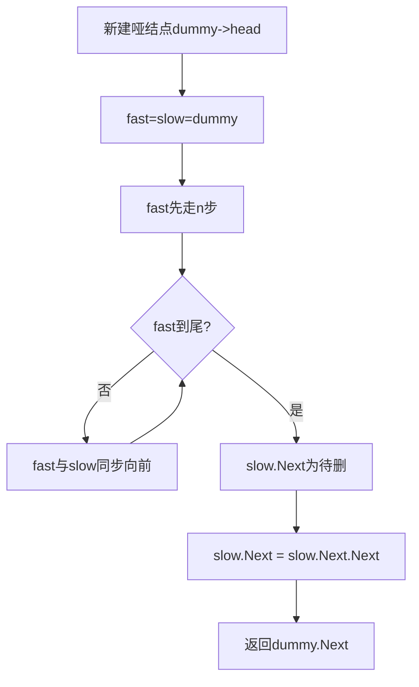

# 19. 删除链表的倒数第 N 个结点

## 题目描述

给你一个链表，删除链表的倒数第 n 个结点，并且返回链表的头结点。

## 示例 1：

输入：head = [1,2,3,4,5], n = 2
输出：[1,2,3,5]

## 示例 2：

输入：head = [1], n = 1
输出：[]

## 示例 3：

输入：head = [1,2], n = 1
输出：[1]

## 提示：

- 链表中结点的数目为 sz
- 1 <= sz <= 30
- 0 <= Node.val <= 100
- 1 <= n <= sz

## 解题思路

常用三种方法：
- **双指针一次遍历（推荐）**：快指针先走 n 步，然后快慢同步移动，快指针到尾时，慢指针在待删除结点的前一个结点。
- **栈**：遍历入栈，再弹出 n 次找到目标结点的前驱，修改指针。
- **两次遍历**：第一次统计长度 sz，第二次定位到 sz-n 的前驱删除。

### 双指针法（一次遍历）

- 设置 `dummy` 可以统一删除头结点的场景
- 边界：n 一定合法（1<=n<=sz）
- 时间 O(sz)，空间 O(1)

### 栈法
- 遍历链表全部入栈
- 弹出 n 次，栈顶即为待删结点的前驱
- 修改前驱的 Next 指向
- 时间 O(sz)，空间 O(sz)

### 两次遍历
- 第一次统计长度 sz
- 找到第 sz-n 个结点的前驱并删除
- 时间 O(sz)，空间 O(1)

### 代码要点
- 使用 `dummy` 统一处理删除头结点
- 快指针先走 n 步，再一起走
- 注意 slow.Next 是否为空的判定

本仓库 `19/main.go` 给出双指针法实现，并在 `main()` 中包含示例自检。
