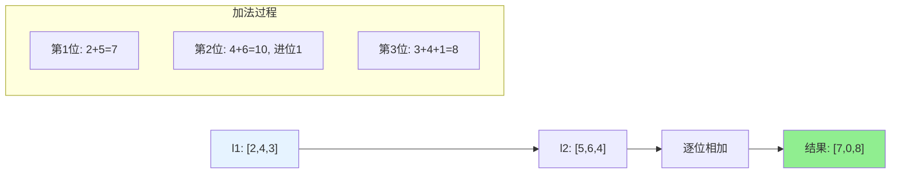
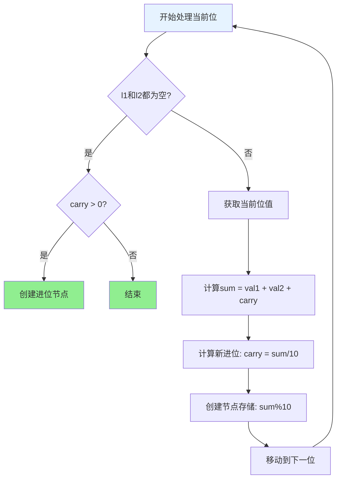
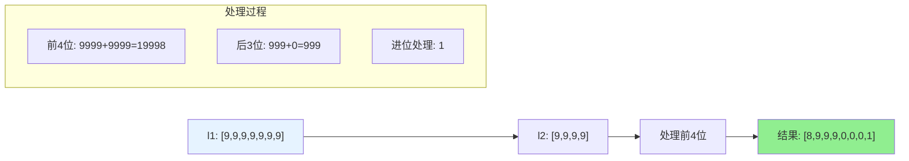

# 2. 两数相加

## 题目描述

给你两个 非空 的链表，表示两个非负的整数。它们每位数字都是按照 逆序 的方式存储的，并且每个节点只能存储 一位 数字。

请你将两个数相加，并以相同形式返回一个表示和的链表。

你可以假设除了数字 0 之外，这两个数都不会以 0 开头。

>来源：力扣（LeetCode）
链接：https://leetcode.cn/problems/add-two-numbers
著作权归领扣网络所有。商业转载请联系官方授权，非商业转载请注明出处。
<hr></hr>

## 示例 1：


输入：l1 = [2,4,3], l2 = [5,6,4]
输出：[7,0,8]
解释：342 + 465 = 807.

## 示例 2：

输入：l1 = [0], l2 = [0]
输出：[0]

## 示例 3：

输入：l1 = [9,9,9,9,9,9,9], l2 = [9,9,9,9]
输出：[8,9,9,9,0,0,0,1]

## 示例 4：

输入：l1 = [1,2,3], l2 = [4,5,6]
输出：[5,7,9]
解释：321 + 654 = 975

## 提示：

- 每个链表中的节点数在范围 [1, 100] 内
- 0 <= Node.val <= 9
- 题目数据保证列表表示的数字不含前导零

## 解题思路

### 方法一：模拟加法（推荐）

**核心思想**：
- 模拟手工加法的过程，从最低位开始逐位相加
- 维护一个进位变量carry，记录每次相加的进位
- 同时遍历两个链表，处理不同长度的情况
- 最后检查是否还有进位需要处理

**算法步骤**：
1. 初始化虚拟头节点dummy和进位变量carry = 0
2. 同时遍历两个链表l1和l2：
   - 获取当前位的值（如果链表已结束则为0）
   - 计算当前位的和：sum = val1 + val2 + carry
   - 计算进位：carry = sum / 10
   - 创建新节点存储当前位：sum % 10
3. 如果遍历结束后还有进位，创建新节点存储进位
4. 返回dummy.Next

**时间复杂度**：O(max(m,n))，其中m和n是两个链表的长度
**空间复杂度**：O(max(m,n))，需要创建新的链表存储结果

### 方法二：递归解法

**核心思想**：
- 使用递归的方式处理链表相加
- 每次递归处理当前位，然后递归处理下一位
- 递归终止条件是两个链表都为空且没有进位

**时间复杂度**：O(max(m,n))
**空间复杂度**：O(max(m,n))，递归调用栈的深度

### 方法三：转换为数字后相加

**核心思想**：
- 将两个链表转换为数字
- 进行数字相加
- 将结果转换回链表

**注意**：这种方法只适用于链表长度较小的情况，因为大数会溢出

**时间复杂度**：O(m+n)
**空间复杂度**：O(max(m,n))

## 代码实现

```go
// 链表节点定义
type ListNode struct {
    Val  int
    Next *ListNode
}

// 模拟加法解法（推荐）
func addTwoNumbers(l1 *ListNode, l2 *ListNode) *ListNode {
    dummy := &ListNode{Val: 0} // 虚拟头节点
    current := dummy
    carry := 0
    
    // 同时遍历两个链表
    for l1 != nil || l2 != nil || carry > 0 {
        val1, val2 := 0, 0
        
        if l1 != nil {
            val1 = l1.Val
            l1 = l1.Next
        }
        if l2 != nil {
            val2 = l2.Val
            l2 = l2.Next
        }
        
        // 计算当前位的和和进位
        sum := val1 + val2 + carry
        carry = sum / 10
        
        // 创建新节点
        current.Next = &ListNode{Val: sum % 10}
        current = current.Next
    }
    
    return dummy.Next
}
```

## 复杂度分析

| 方法       | 时间复杂度  | 空间复杂度  | 适用场景     |
| ---------- | ----------- | ----------- | ------------ |
| 模拟加法   | O(max(m,n)) | O(max(m,n)) | 推荐，最优解 |
| 递归解法   | O(max(m,n)) | O(max(m,n)) | 递归思维清晰 |
| 转换为数字 | O(m+n)      | O(max(m,n)) | 小规模数据   |

## 算法图解

### 模拟加法过程

```mermaid
graph TD
    A[开始: l1=[2,4,3], l2=[5,6,4]] --> B[初始化: dummy, carry=0]
    B --> C[第1位: 2+5+0=7, carry=0]
    C --> D[创建节点7, current指向7]
    D --> E[第2位: 4+6+0=10, carry=1]
    E --> F[创建节点0, current指向0]
    F --> G[第3位: 3+4+1=8, carry=0]
    G --> H[创建节点8, current指向8]
    H --> I[检查进位: carry=0, 结束]
    I --> J[返回结果: [7,0,8]]
    
    style J fill:#90EE90
    style A fill:#E6F3FF
    style B fill:#FFF2CC
```

### 链表相加示例



### 进位处理流程图



### 不同长度链表处理



### 递归解法调用栈

```mermaid
graph TD
    A[addTwoNumbers(l1, l2, 0)] --> B[处理第1位: 2+5+0=7]
    B --> C[递归: addTwoNumbers(l1.Next, l2.Next, 0)]
    C --> D[处理第2位: 4+6+0=10]
    D --> E[递归: addTwoNumbers(l1.Next, l2.Next, 1)]
    E --> F[处理第3位: 3+4+1=8]
    F --> G[递归: addTwoNumbers(nil, nil, 0)]
    G --> H[返回nil]
    H --> I[构建结果链表]
    
    style I fill:#90EE90
    style A fill:#E6F3FF
```

## 边界情况处理

1. **链表长度不同**：短链表用0补齐
2. **进位处理**：最后检查是否还有进位需要处理
3. **空链表**：返回另一个链表或空链表
4. **全为0**：返回[0]
5. **大数相加**：处理进位溢出

## 测试用例

```go
func main() {
    // 测试用例1
    l1 := buildList([]int{2, 4, 3})
    l2 := buildList([]int{5, 6, 4})
    result1 := addTwoNumbers(l1, l2)
    fmt.Printf("测试用例1: l1=[2,4,3], l2=[5,6,4]\n")
    fmt.Printf("结果: %v\n", listToSlice(result1))
    
    // 测试用例2
    l3 := buildList([]int{0})
    l4 := buildList([]int{0})
    result2 := addTwoNumbers(l3, l4)
    fmt.Printf("测试用例2: l1=[0], l2=[0]\n")
    fmt.Printf("结果: %v\n", listToSlice(result2))
    
    // 测试用例3
    l5 := buildList([]int{9, 9, 9, 9, 9, 9, 9})
    l6 := buildList([]int{9, 9, 9, 9})
    result3 := addTwoNumbers(l5, l6)
    fmt.Printf("测试用例3: l1=[9,9,9,9,9,9,9], l2=[9,9,9,9]\n")
    fmt.Printf("结果: %v\n", listToSlice(result3))
    
    // 边界测试
    l7 := buildList([]int{1, 2, 3})
    l8 := buildList([]int{4, 5, 6})
    result4 := addTwoNumbers(l7, l8)
    fmt.Printf("边界测试: l1=[1,2,3], l2=[4,5,6]\n")
    fmt.Printf("结果: %v\n", listToSlice(result4))
}
```

## 关键技巧

1. **虚拟头节点**：使用dummy节点简化链表操作
2. **进位处理**：维护carry变量，处理进位逻辑
3. **长度处理**：同时遍历两个链表，短链表用0补齐
4. **边界检查**：最后检查是否还有进位需要处理
5. **节点创建**：每次创建新节点存储当前位的结果

## 实际应用

- **大数运算**：处理超出基本数据类型范围的数字运算
- **金融计算**：高精度货币计算
- **科学计算**：需要高精度的数学运算
- **密码学**：大整数运算
