# 20. 有效的括号

## 描述

给定一个只包括 '('，')'，'{'，'}'，'['，']' 的字符串 s ，判断字符串是否有效。

有效字符串需满足：

左括号必须用相同类型的右括号闭合。
左括号必须以正确的顺序闭合。
每个右括号都有一个对应的相同类型的左括号。

## 示例 1

输入：s = "()"

输出：true

## 示例 2

输入：s = "()[]{}"

输出：true

## 示例 3

输入：s = "(]"

输出：false

## 示例 4

输入：s = "([])"

输出：true

## 示例 5

输入：s = "([)]"

输出：false

## 提示

1 <= s.length <= 104
s 仅由括号 '()[]{}' 组成

## 解题思路

### 算法分析

这道题是**栈数据结构**的经典应用。主要解法包括：

1. **栈匹配法**：使用栈存储左括号，遇到右括号时匹配栈顶
2. **计数器法**：分别计数三种括号的开闭状态
3. **替换法**：不断替换匹配的括号对直到无法替换

### 问题本质分析

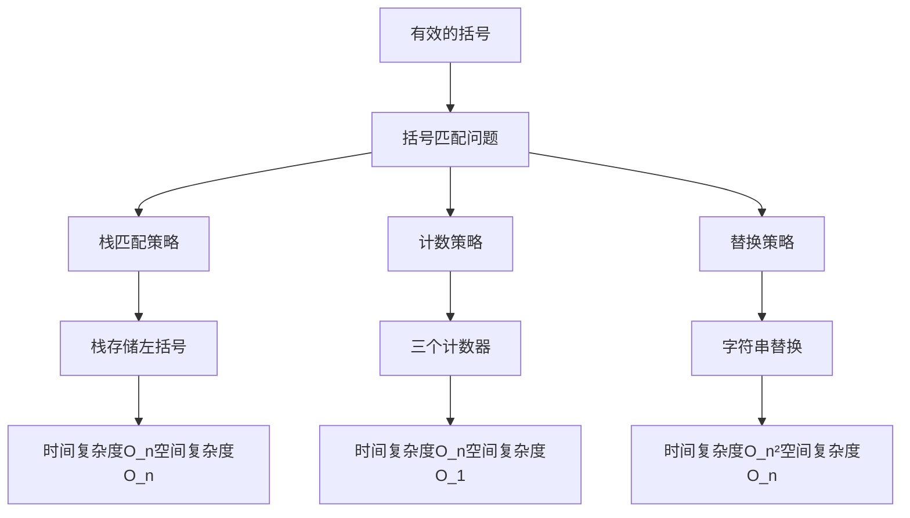

### 栈匹配算法详解

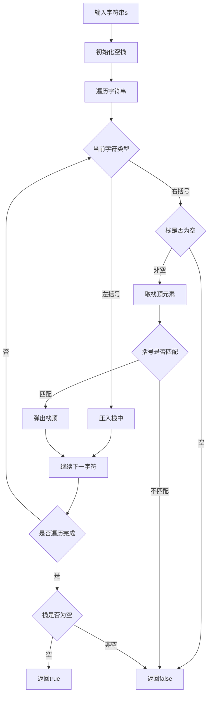

### 括号匹配过程演示

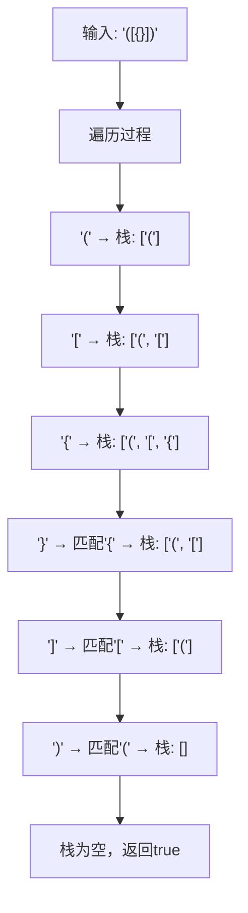

### 不匹配情况分析

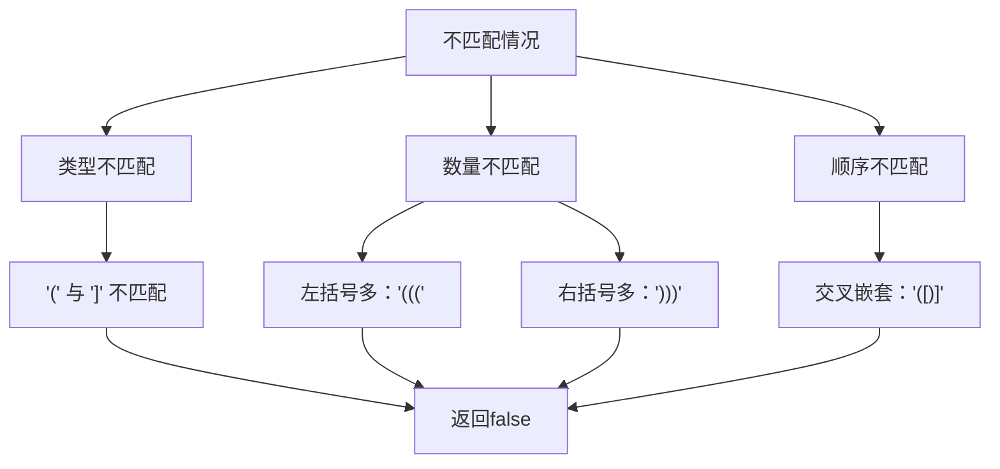

### 算法流程图

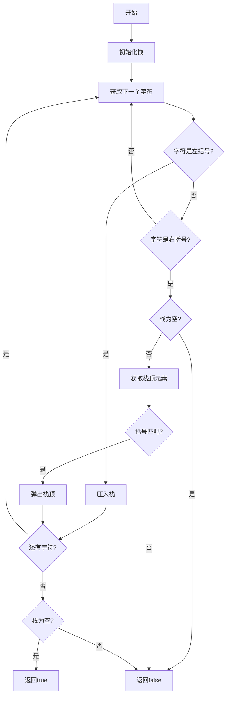

### 各种解法对比

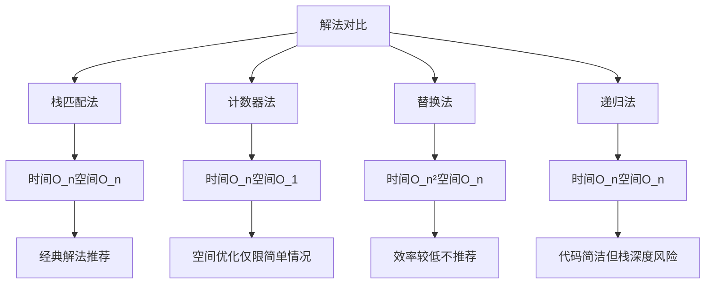

### 栈操作示意图

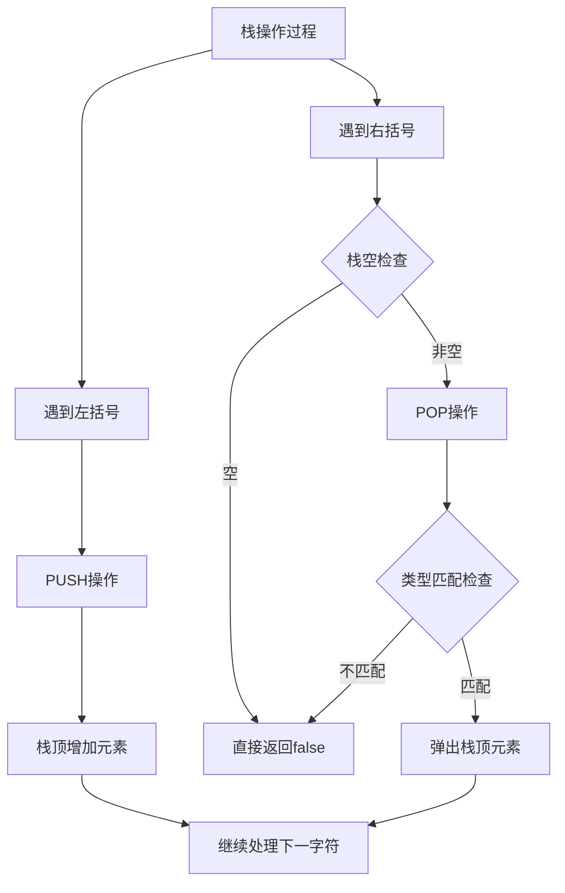

### 边界情况处理

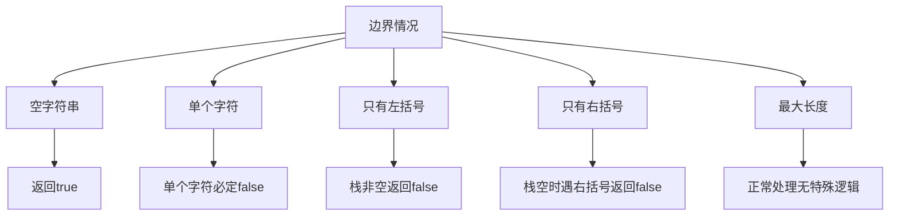

### 时间复杂度分析

- **栈匹配法**：O(n)，每个字符访问一次
- **计数器法**：O(n)，但只适用于单一类型括号
- **替换法**：O(n²)，需要多次遍历字符串
- **递归法**：O(n)，但有栈溢出风险

### 空间复杂度分析

- **栈匹配法**：O(n)，最坏情况栈存储n/2个左括号
- **计数器法**：O(1)，只需要常数个计数器
- **替换法**：O(n)，需要创建新字符串
- **递归法**：O(n)，递归调用栈空间

### 关键优化点

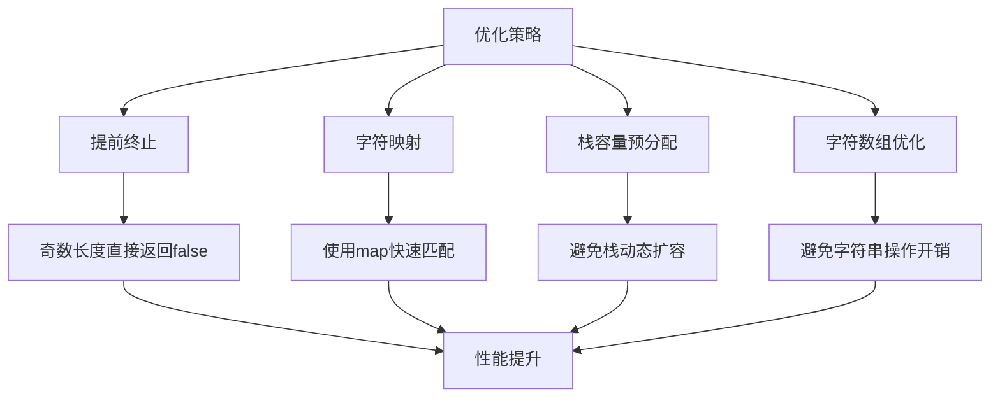

### 实际应用场景

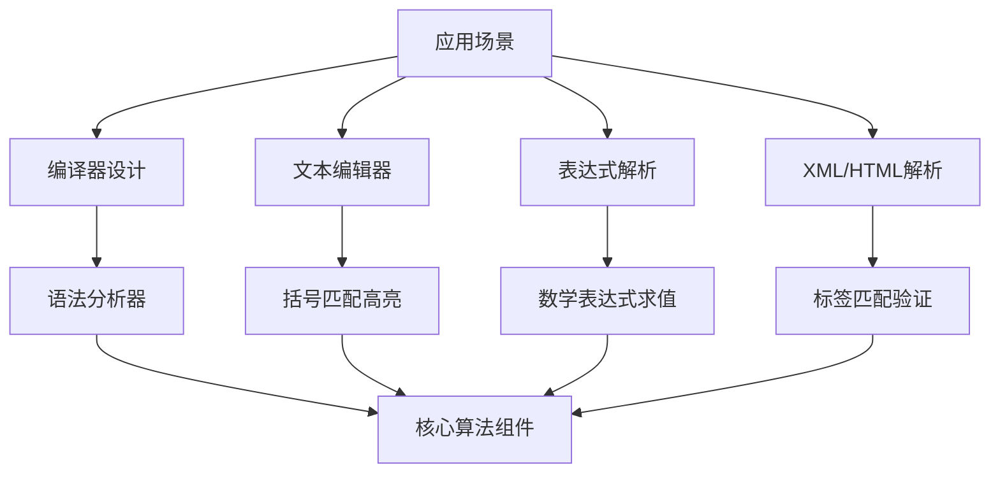

### 测试用例设计

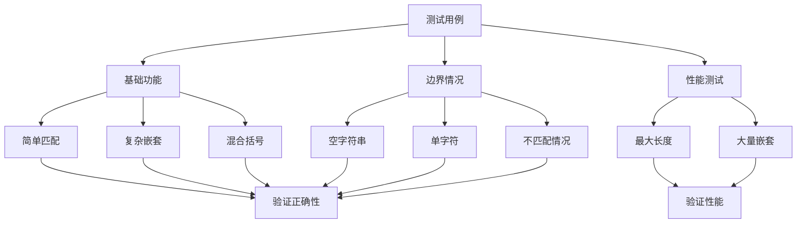

### 代码实现要点

1. **栈数据结构选择**：
   - Go语言使用切片模拟栈
   - 入栈操作：append()
   - 出栈操作：切片截取

2. **括号匹配映射**：
   - 使用map存储括号对应关系
   - 快速查找匹配的左括号

3. **边界条件处理**：
   - 字符串长度为奇数直接返回false
   - 栈为空时遇到右括号返回false
   - 遍历结束后检查栈是否为空

4. **性能优化**：
   - 提前返回减少不必要计算
   - 使用局部变量减少重复计算
   - 合理的数据结构选择

这个问题的关键在于**理解栈的后进先出特性**和**掌握括号匹配的基本规则**，通过栈来暂存待匹配的左括号，实现高效的括号有效性检查。

