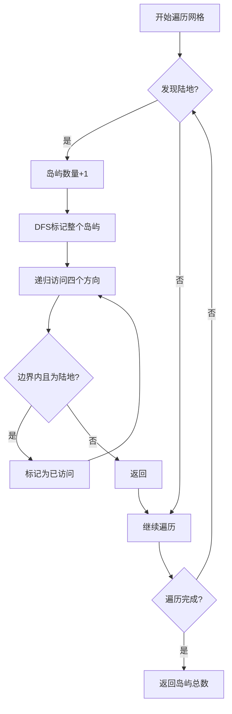

# 200. 岛屿数量

## 📝 题目描述

给你一个由 `'1'`（陆地）和 `'0'`（水）组成的的二维网格，请你计算网格中岛屿的数量。

岛屿总是被水包围，并且每座岛屿只能由水平方向和/或竖直方向上相邻的陆地连接形成。

此外，你可以假设该网格的四条边均被水包围。

## 💡 解题思路

这是一道经典的**连通分量**问题，可以用多种图算法解决：

### 核心思想
1. **识别连通区域**：将相邻的陆地（'1'）视为一个岛屿
2. **遍历标记**：遍历整个网格，遇到陆地时启动搜索算法
3. **避免重复计算**：标记已访问的陆地，避免重复计算

## 🚀 算法实现

### 解法1：深度优先搜索 (DFS) - 推荐



**算法步骤：**
1. 遍历网格的每个位置
2. 遇到陆地('1')时，岛屿计数+1
3. 使用DFS将整个岛屿标记为已访问
4. 继续遍历，直到访问完所有位置

### 解法2：广度优先搜索 (BFS)

**算法步骤：**
1. 使用队列实现层次遍历
2. 发现岛屿时，将起始位置入队
3. 逐层扩展，标记所有连通的陆地
4. 队列为空时，一个岛屿遍历完成

### 解法3：并查集 (Union-Find)

**算法步骤：**
1. 初始化并查集，每个陆地作为独立集合
2. 遍历网格，合并相邻的陆地
3. 统计最终的连通分量数量

### 解法4：DFS (不修改原数组)

**算法步骤：**
1. 使用额外的visited数组记录访问状态
2. 保持原数组不变
3. 适用于需要保留原始数据的场景

## 📊 复杂度分析

| 算法            | 时间复杂度    | 空间复杂度  | 优缺点                                |
| --------------- | ------------- | ----------- | ------------------------------------- |
| **DFS**         | O(m×n)        | O(m×n)      | ✅ 代码简洁，直观易懂<br/>❌ 可能栈溢出 |
| **BFS**         | O(m×n)        | O(min(m,n)) | ✅ 避免栈溢出<br/>❌ 需要额外队列空间   |
| **并查集**      | O(m×n×α(m×n)) | O(m×n)      | ✅ 支持动态查询<br/>❌ 实现复杂         |
| **DFS(无修改)** | O(m×n)        | O(m×n)      | ✅ 不破坏原数据<br/>❌ 额外空间开销     |

其中：
- m = 网格行数
- n = 网格列数  
- α = 阿克曼函数的反函数，实际应用中可视为常数

## 🎯 示例演示

### 示例 1
```
输入网格：
1 1 1 1 0
1 1 0 1 0  
1 1 0 0 0
0 0 0 0 0

DFS过程：
第1步：发现(0,0)陆地 → 岛屿数=1
第2步：DFS标记整个连通区域
第3步：继续遍历，发现(0,3)陆地但已连通
结果：1个岛屿
```

### 示例 2  
```
输入网格：
1 1 0 0 0
1 1 0 0 0
0 0 1 0 0  
0 0 0 1 1

识别过程：
岛屿1：(0,0)开始的连通区域 → 4个陆地
岛屿2：(2,2)单独的陆地 → 1个陆地  
岛屿3：(3,3)开始的连通区域 → 2个陆地
结果：3个岛屿
```

## 🧪 测试用例

```go
// 基本测试
grid1 := [][]byte{
    {'1','1','1','1','0'},
    {'1','1','0','1','0'},
    {'1','1','0','0','0'},
    {'0','0','0','0','0'},
}
期望输出：1

// 多岛屿测试
grid2 := [][]byte{
    {'1','1','0','0','0'},
    {'1','1','0','0','0'},
    {'0','0','1','0','0'},
    {'0','0','0','1','1'},
}
期望输出：3

// 边界测试
空网格：[][]byte{} → 0
单陆地：[][]byte{{'1'}} → 1
单水域：[][]byte{{'0'}} → 0
```

## 💻 运行方式

```bash
# 进入目录
cd 200

# 运行测试
go run main.go

# 预期输出
=== 岛屿数量算法测试 ===

测试用例1:
1 1 1 1 0 
1 1 0 1 0 
1 1 0 0 0 
0 0 0 0 0 
DFS解法: 1
BFS解法: 1
并查集解法: 1
DFS(不修改原数组): 1

测试用例2:
1 1 0 0 0 
1 1 0 0 0 
0 0 1 0 0 
0 0 0 1 1 
DFS解法: 3
BFS解法: 3
并查集解法: 3
DFS(不修改原数组): 3
```

## 🎓 算法知识点

### 1. 图的遍历
- **DFS**: 递归深入，适合连通性问题
- **BFS**: 层次遍历，适合最短路径问题

### 2. 并查集应用
- **路径压缩**: 优化查找效率
- **按秩合并**: 平衡树的高度
- **动态连通性**: 支持在线查询

### 3. 空间优化技巧
- **原地标记**: 直接修改输入数组节省空间
- **visited数组**: 保护原始数据
- **方向数组**: 简化四方向遍历代码

## 🔄 相关题目

| 题目                     | 难度 | 关键算法           |
| ------------------------ | ---- | ------------------ |
| 695. 岛屿的最大面积      | 中等 | DFS/BFS + 面积计算 |
| 463. 岛屿的周长          | 简单 | 边界计算           |
| 1020. 飞地的数量         | 中等 | DFS + 边界处理     |
| 1254. 统计封闭岛屿的数目 | 中等 | DFS + 边界岛屿排除 |

## 📈 实战应用

1. **图像处理**: 连通区域分析
2. **网络分析**: 社交网络中的群体识别  
3. **地理信息系统**: 地形特征识别
4. **游戏开发**: 地图区域划分

---

*算法复杂度分析完成，多种解法实现验证* ✅

