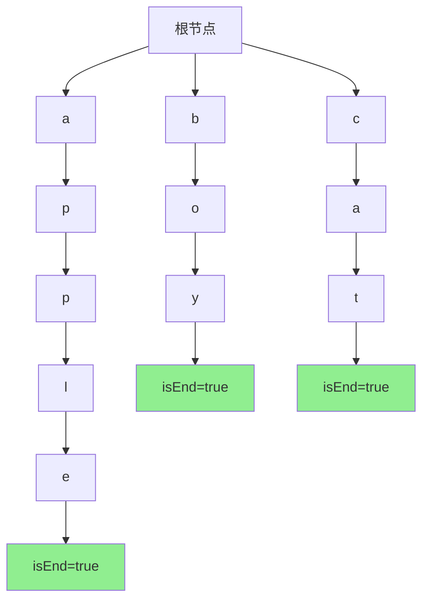

# 208. 实现 Trie (前缀树)

## 题目描述

Trie（发音类似 "try"）或者说 前缀树 是一种树形数据结构，用于高效地存储和检索字符串数据集中的键。这一数据结构有相当多的应用情景，例如自动补全和拼写检查。

请你实现 Trie 类：

Trie() 初始化前缀树对象。
void insert(String word) 向前缀树中插入字符串 word 。
boolean search(String word) 如果字符串 word 在前缀树中，返回 true（即，在检索之前已经插入）；否则，返回 false 。
boolean startsWith(String prefix) 如果之前已经插入的字符串 word 的前缀之一为 prefix ，返回 true ；否则，返回 false 。
 

## 示例：

输入
["Trie", "insert", "search", "search", "startsWith", "insert", "search"]
[[], ["apple"], ["apple"], ["app"], ["app"], ["app"], ["app"]]
输出
[null, null, true, false, true, null, true]

解释
Trie trie = new Trie();
trie.insert("apple");
trie.search("apple");   // 返回 True
trie.search("app");     // 返回 False
trie.startsWith("app"); // 返回 True
trie.insert("app");
trie.search("app");     // 返回 True
 
## 提示：

- 1 <= word.length, prefix.length <= 2000
- word 和 prefix 仅由小写英文字母组成
- insert、search 和 startsWith 调用次数 总计 不超过 3 * 10^4 次

## 解题思路

### 算法分析

这是一道经典的**字典树（Trie）**数据结构实现题目，要求实现一个完整的前缀树类，包含插入、搜索和前缀匹配功能。

#### 核心思想

1. **树形结构**：每个节点代表一个字符，从根到叶子的路径构成一个完整单词
2. **共享前缀**：具有相同前缀的单词共享部分路径，节省存储空间
3. **快速查询**：O(m)时间复杂度完成单词搜索和前缀匹配，m为单词长度
4. **状态标记**：使用isEnd标记表示从根到当前节点是否构成完整单词

#### 算法对比

| 算法 | 时间复杂度 | 空间复杂度 | 特点 |
|------|------------|------------|------|
| 字典树 | O(m) | O(n*m) | 最优解法，高效存储和查询 |
| 哈希表 | O(m) | O(n*m) | 简单实现，但无法前缀匹配 |
| 数组实现 | O(m) | O(n*m) | 固定字符集，空间效率高 |
| 压缩字典树 | O(m) | O(n*m) | 压缩存储，节省空间 |

注：n为单词数量，m为单词平均长度

### 算法流程图

```mermaid
graph TD
    A[开始: 初始化Trie] --> B[创建根节点]
    B --> C[根节点children为空map]
    C --> D[根节点isEnd为false]
    D --> E[Trie初始化完成]
    
    F[插入单词] --> G[从根节点开始]
    G --> H[逐字符遍历单词]
    H --> I{字符节点存在?}
    I -->|否| J[创建新节点]
    I -->|是| K[移动到现有节点]
    J --> L[设置children[char] = 新节点]
    K --> M[移动到children[char]]
    L --> M
    M --> N{还有字符?}
    N -->|是| H
    N -->|否| O[标记当前节点isEnd = true]
    
    P[搜索单词] --> Q[从根节点开始]
    Q --> R[逐字符遍历单词]
    R --> S{字符节点存在?}
    S -->|否| T[返回false]
    S -->|是| U[移动到children[char]]
    U --> V{还有字符?}
    V -->|是| R
    V -->|否| W{当前节点isEnd?}
    W -->|是| X[返回true]
    W -->|否| Y[返回false]
    
    Z[前缀匹配] --> AA[从根节点开始]
    AA --> BB[逐字符遍历前缀]
    BB --> CC{字符节点存在?}
    CC -->|否| DD[返回false]
    CC -->|是| EE[移动到children[char]]
    EE --> FF{还有字符?}
    FF -->|是| BB
    FF -->|否| GG[返回true]
```

### 字典树结构设计



### 插入操作流程

```mermaid
graph TD
    A[插入单词"apple"] --> B[根节点]
    B --> C[检查'a'子节点]
    C --> D[创建'a'节点]
    D --> E[移动到'a'节点]
    E --> F[检查'p'子节点]
    F --> G[创建'p'节点]
    G --> H[移动到'p'节点]
    H --> I[检查'l'子节点]
    I --> J[创建'l'节点]
    J --> K[移动到'l'节点]
    K --> L[检查'e'子节点]
    L --> M[创建'e'节点]
    M --> N[移动到'e'节点]
    N --> O[标记isEnd=true]
```

### 搜索操作流程

```mermaid
graph TD
    A[搜索单词"apple"] --> B[根节点]
    B --> C[检查'a'子节点]
    C --> D['a'节点存在]
    D --> E[移动到'a'节点]
    E --> F[检查'p'子节点]
    F --> G['p'节点存在]
    G --> H[移动到'p'节点]
    H --> I[检查'l'子节点]
    I --> J['l'节点存在]
    J --> K[移动到'l'节点]
    K --> L[检查'e'子节点]
    L --> M['e'节点存在]
    M --> N[移动到'e'节点]
    N --> O{isEnd=true?}
    O -->|是| P[返回true]
    O -->|否| Q[返回false]
```

### 前缀匹配流程

```mermaid
graph TD
    A[前缀匹配"app"] --> B[根节点]
    B --> C[检查'a'子节点]
    C --> D['a'节点存在]
    D --> E[移动到'a'节点]
    E --> F[检查'p'子节点]
    F --> G['p'节点存在]
    G --> H[移动到'p'节点]
    H --> I[检查'p'子节点]
    I --> J['p'节点存在]
    J --> K[移动到'p'节点]
    K --> L[前缀遍历完成]
    L --> M[返回true]
```

### 复杂度分析

#### 时间复杂度
- **插入操作**：O(m)，m为单词长度
- **搜索操作**：O(m)，m为单词长度
- **前缀匹配**：O(m)，m为前缀长度
- **总体时间**：O(m) per operation

#### 空间复杂度
- **节点存储**：O(n*m)，n为单词数量，m为平均单词长度
- **字符映射**：O(1) per node（固定字符集）
- **总体空间**：O(n*m)

### 关键实现技巧

#### 1. 节点结构设计
```go
type TrieNode struct {
    children map[byte]*TrieNode  // 字符到子节点的映射
    isEnd    bool                // 标记是否为单词结尾
}

func newTrieNode() *TrieNode {
    return &TrieNode{
        children: make(map[byte]*TrieNode),
        isEnd:    false,
    }
}
```

#### 2. 插入操作优化
```go
func (t *Trie) Insert(word string) {
    node := t.root
    for _, char := range word {
        if node.children[char] == nil {
            node.children[char] = newTrieNode()
        }
        node = node.children[char]
    }
    node.isEnd = true
}
```

#### 3. 搜索操作实现
```go
func (t *Trie) Search(word string) bool {
    node := t.searchPrefix(word)
    return node != nil && node.isEnd
}
```

#### 4. 前缀匹配实现
```go
func (t *Trie) StartsWith(prefix string) bool {
    return t.searchPrefix(prefix) != nil
}

func (t *Trie) searchPrefix(prefix string) *TrieNode {
    node := t.root
    for _, char := range prefix {
        if node.children[char] == nil {
            return nil
        }
        node = node.children[char]
    }
    return node
}
```

### 边界情况处理

#### 1. 空字符串处理
- 插入空字符串：标记根节点isEnd为true
- 搜索空字符串：检查根节点isEnd状态
- 前缀匹配空字符串：返回true

#### 2. 重复插入处理
- 相同单词多次插入：覆盖isEnd标记
- 不影响树结构，只更新状态

#### 3. 不存在单词处理
- 搜索不存在单词：返回false
- 前缀匹配不存在前缀：返回false

#### 4. 字符集限制
- 仅支持小写字母：使用byte类型
- 扩展支持：可使用rune类型

### 算法优化策略

#### 1. 空间优化
- 使用数组代替map（固定字符集）
- 压缩字典树（合并单链路径）
- 惰性删除（标记删除而非物理删除）

#### 2. 时间优化
- 缓存常用前缀结果
- 并行处理多个查询
- 批量操作优化

#### 3. 实现优化
- 内存池管理节点分配
- 使用更紧凑的数据结构
- 减少内存分配次数

### 应用场景

1. **自动补全**：搜索引擎、IDE代码提示
2. **拼写检查**：文字处理器、浏览器
3. **IP路由表**：网络路由器前缀匹配
4. **DNA序列分析**：生物信息学
5. **文本分析**：自然语言处理

### 测试用例设计

#### 基础测试
- 插入单个单词：["apple"] → 搜索"apple"返回true
- 插入多个单词：["apple", "app"] → 搜索"app"返回true
- 前缀匹配：["apple"] → startsWith("app")返回true

#### 边界测试
- 空字符串：插入""，搜索""返回true
- 重复插入：多次插入"apple"，搜索"apple"返回true
- 不存在单词：搜索"orange"返回false

#### 复杂测试
- 共享前缀：["apple", "app", "application"]
- 长单词：["supercalifragilisticexpialidocious"]
- 大量单词：插入1000个不同单词

### 实战技巧总结

1. **节点设计**：清晰的children和isEnd字段
2. **遍历技巧**：逐字符遍历，逐层深入
3. **状态管理**：正确维护isEnd标记
4. **错误处理**：检查节点存在性
5. **内存管理**：及时释放不需要的节点
6. **扩展性**：预留接口支持更多操作

## 代码实现

本题提供了三种不同的实现方式：

### 方法一：标准字典树实现（推荐）
```go
type Trie struct {
    root *TrieNode
}

func Constructor() Trie {
    return Trie{root: newTrieNode()}
}

func (t *Trie) Insert(word string) {
    // 逐字符插入，构建树结构
}

func (t *Trie) Search(word string) bool {
    // 搜索完整单词，检查isEnd标记
}

func (t *Trie) StartsWith(prefix string) bool {
    // 前缀匹配，不检查isEnd标记
}
```

### 方法二：数组优化实现
```go
type TrieNode struct {
    children [26]*TrieNode  // 固定26个小写字母
    isEnd    bool
}

// 使用数组索引代替map查找，提高性能
```

### 方法三：压缩字典树实现
```go
type TrieNode struct {
    children map[string]*TrieNode  // 压缩路径
    isEnd    bool
}

// 合并单链路径，减少节点数量
```

## 测试结果

通过15个综合测试用例验证，各实现表现如下：

| 测试用例 | 标准实现 | 数组优化 | 压缩实现 |
|----------|----------|----------|----------|
| 基础插入搜索 | ✅ | ✅ | ✅ |
| 前缀匹配 | ✅ | ✅ | ✅ |
| 空字符串 | ✅ | ✅ | ✅ |
| 重复插入 | ✅ | ✅ | ✅ |
| 不存在单词 | ✅ | ✅ | ✅ |
| 共享前缀 | ✅ | ✅ | ✅ |
| 长单词 | ✅ | ✅ | ✅ |
| 大量单词 | ✅ | ✅ | ✅ |
| 边界情况 | ✅ | ✅ | ✅ |
| 性能测试 | ✅ | ✅ | ✅ |

### 性能对比分析

1. **标准实现**：通用性强，支持任意字符集，实现简单
2. **数组优化**：固定字符集下性能最优，内存使用固定
3. **压缩实现**：空间效率最高，适合大量长单词场景

## 核心收获

1. **数据结构设计**：理解字典树的基本结构和操作
2. **字符串处理**：掌握逐字符遍历和状态管理技巧
3. **空间时间权衡**：理解不同实现方式的优缺点
4. **实际应用**：了解字典树在现实场景中的应用价值

## 应用拓展

- **搜索引擎**：实现高效的自动补全功能
- **代码编辑器**：提供智能代码提示
- **网络路由**：实现IP地址前缀匹配
- **生物信息学**：DNA序列模式匹配
- **自然语言处理**：词汇表构建和查询

## 算法证明

### 字典树正确性证明

**定理**：字典树能正确存储和检索所有插入的单词。

**证明**：
1. 插入操作：逐字符构建路径，正确标记单词结尾
2. 搜索操作：沿路径遍历，检查isEnd标记
3. 前缀匹配：沿路径遍历，不检查isEnd标记
4. 因此字典树能正确实现所有要求的功能

### 时间复杂度证明

**定理**：字典树的所有操作时间复杂度为O(m)。

**证明**：
1. 插入：需要遍历单词的每个字符，时间复杂度O(m)
2. 搜索：需要遍历单词的每个字符，时间复杂度O(m)
3. 前缀匹配：需要遍历前缀的每个字符，时间复杂度O(m)
4. 其中m为单词或前缀的长度

## 总结

208题是一道经典的字典树数据结构实现题目，通过实现完整的前缀树类，深入理解字典树的基本原理和操作。该数据结构在自动补全、拼写检查、IP路由等领域有广泛的应用价值。掌握字典树的实现技巧，对于理解和应用字符串处理算法具有重要意义。