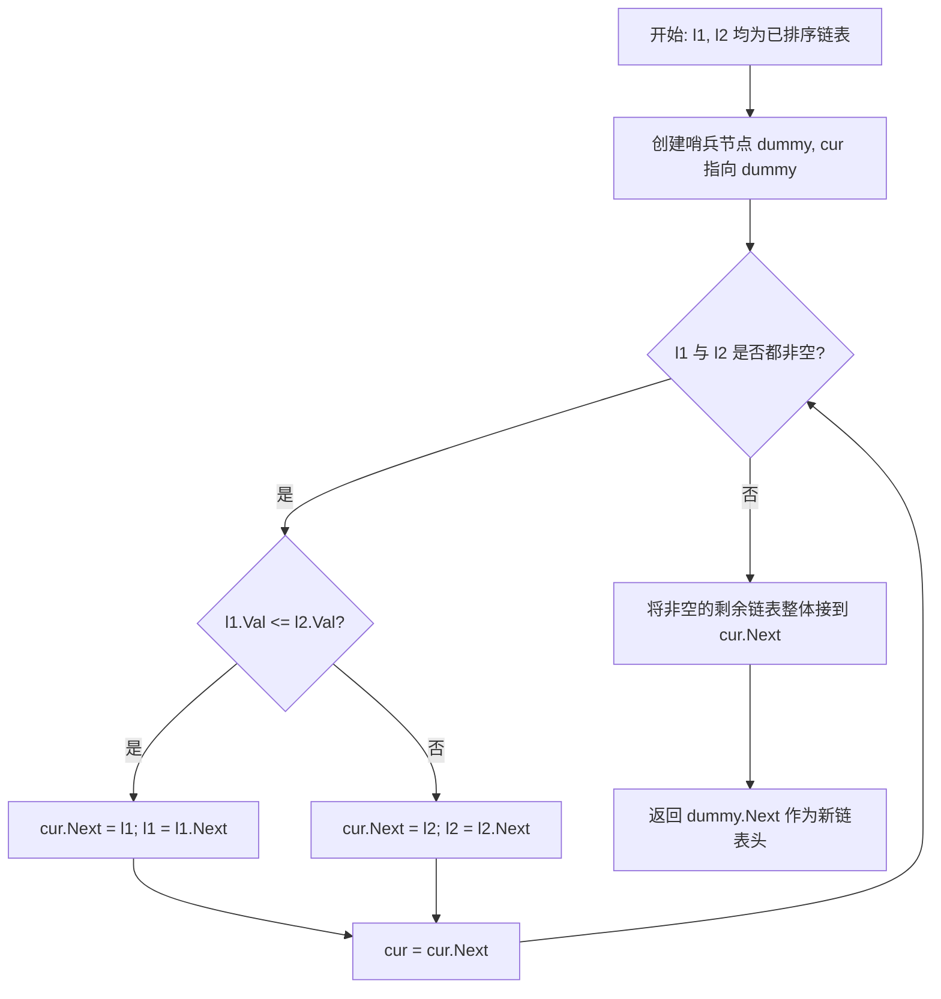

# 21. 合并两个有序链表

## 题目描述

将两个升序链表合并为一个新的 升序 链表并返回。新链表是通过拼接给定的两个链表的所有节点组成的。 

## 示例 1：


输入：l1 = [1,2,4], l2 = [1,3,4]
输出：[1,1,2,3,4,4]

## 示例 2：

输入：l1 = [], l2 = []
输出：[]

## 示例 3：

输入：l1 = [], l2 = [0]
输出：[0]

## 提示：

- 两个链表的节点数目范围是 [0, 50]
- -100 <= Node.val <= 100
- l1 和 l2 均按 非递减顺序 排列

## 解题思路

本题要求将两个已按非递减顺序排列的链表合并为一个新的有序链表。关键在于：每次从两个链表当前头部较小的节点中取出一个接到结果链表后面，直至某一方为空，再把剩余部分整体接上。

- 核心操作：双指针比较 `l1.Val` 与 `l2.Val`
- 有序性保证：每次选择较小值，整体仍保持升序

### 思路流程（迭代-哨兵）



### 解法1：迭代（哨兵节点）- 推荐
- **思路**：使用一个虚拟头 `dummy`，指针 `cur` 逐步拼接较小节点
- **优势**：实现简单、指针移动清晰、无需额外空间
- **时间复杂度**：O(m+n)
- **空间复杂度**：O(1)

### 解法2：递归
- **思路**：较小节点作为头，递归合并其余部分
- **适用**：代码更简洁，但递归层数受链表总长度限制
- **时间复杂度**：O(m+n)
- **空间复杂度**：O(m+n)（递归栈）

### 解法3：原地指针连接
- **思路**：不新建节点，仅移动指针连接已有节点，等价于迭代
- **时间复杂度**：O(m+n)
- **空间复杂度**：O(1)

## 复杂度分析

| 解法 | 时间复杂度 | 空间复杂度 | 说明 |
| ---- | ---------- | ---------- | ---- |
| 迭代-哨兵 | O(m+n) | O(1) | 推荐，简单高效 |
| 递归 | O(m+n) | O(m+n) | 代码短，栈深最多 m+n |
| 原地指针 | O(m+n) | O(1) | 与迭代等价，书写风格不同 |

## 示例演示

输入：`l1 = [1,2,4]`，`l2 = [1,3,4]`

合并过程（迭代-哨兵）：
1. 比较 1 与 1 → 取 `l1` 的 1；结果 `[1]`
2. 比较 2 与 1 → 取 `l2` 的 1；结果 `[1,1]`
3. 比较 2 与 3 → 取 2；结果 `[1,1,2]`
4. 比较 4 与 3 → 取 3；结果 `[1,1,2,3]`
5. 比较 4 与 4 → 取 `l1` 的 4；结果 `[1,1,2,3,4]`
6. `l1` 空，将 `l2` 剩余 4 接上 → `[1,1,2,3,4,4]`

## 边界与正确性
- 任一为空：直接返回另一条链表
- 全为空：返回空
- 负数、重复值、不同长度：均能保持全局非递减
- 稳定性：相等值时优先取 `l1`，保持原相对顺序

## 运行方式

```bash
cd 21
go run main.go
```

## 测试用例

```go
// 基本
l1=[1,2,4], l2=[1,3,4] → [1,1,2,3,4,4]
l1=[], l2=[]           → []
l1=[], l2=[0]          → [0]

// 混合、负数
l1=[-10,-3,0,5], l2=[-5,-3,2] → [-10,-5,-3,-3,0,2,5]
```
