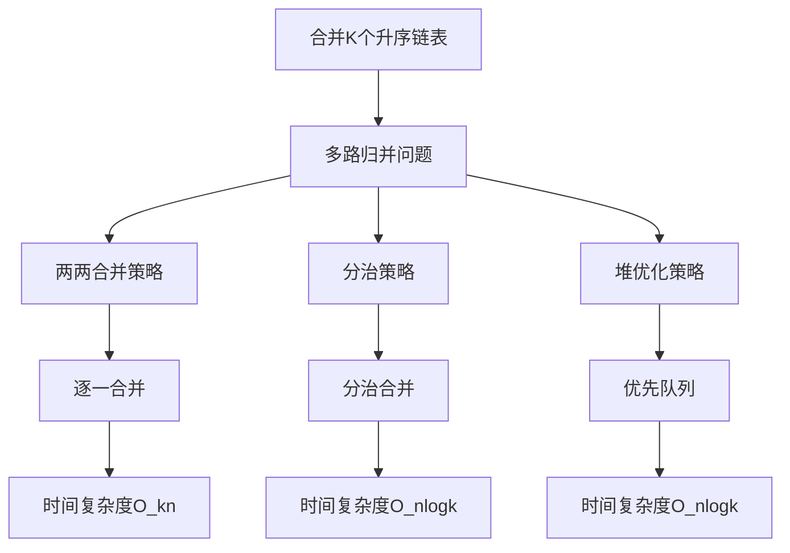
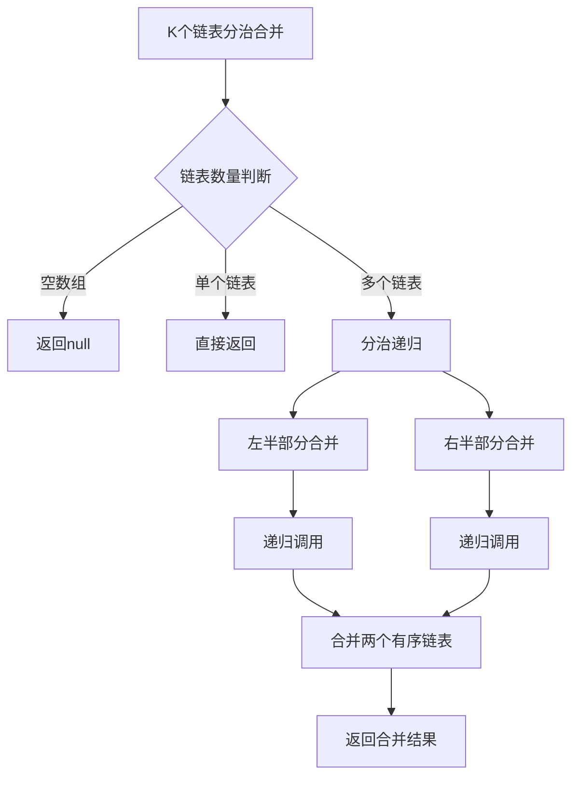
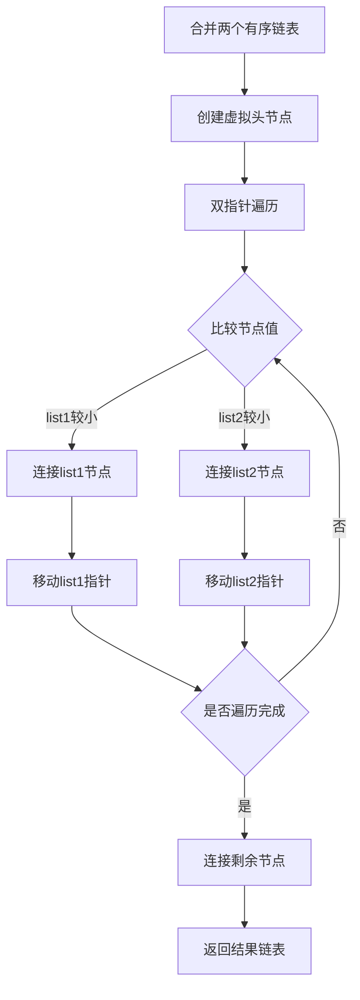
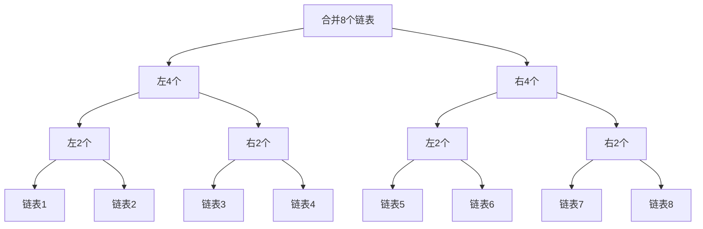
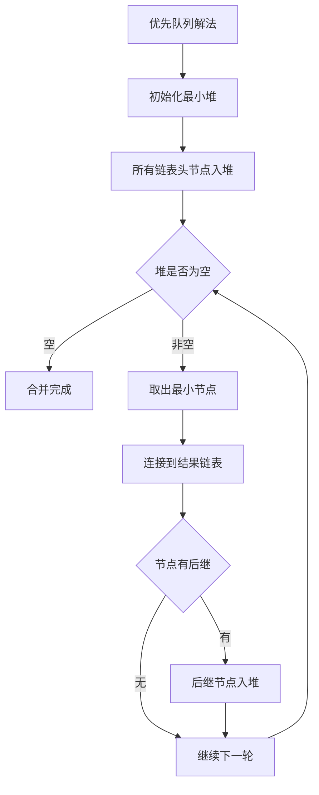
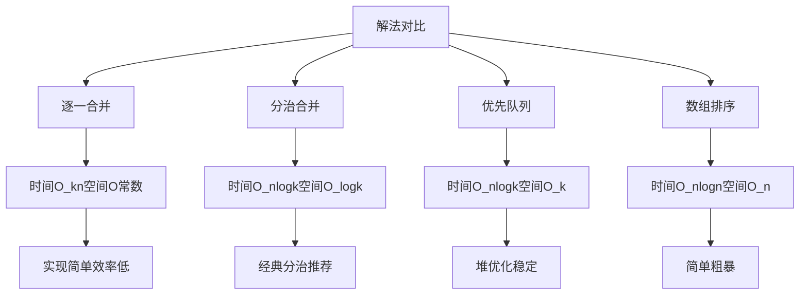
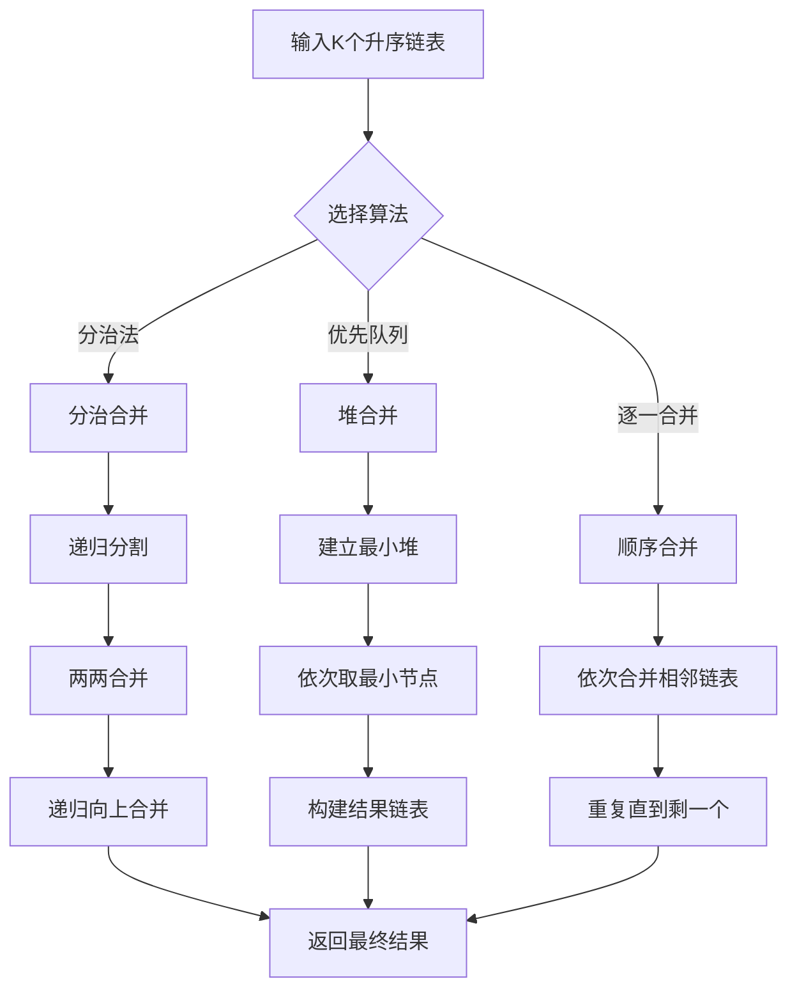
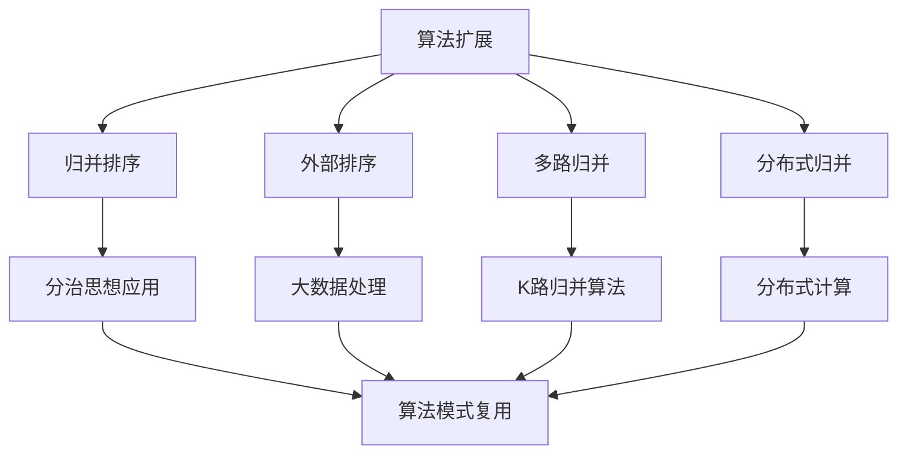
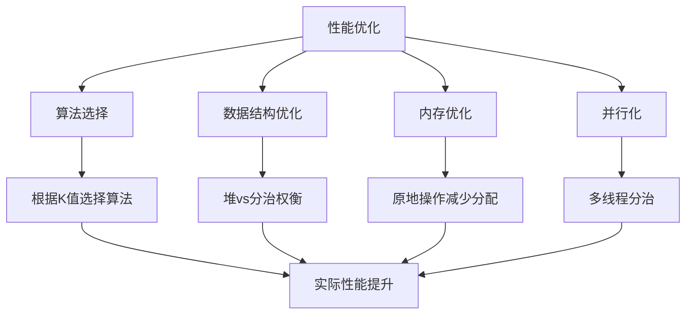
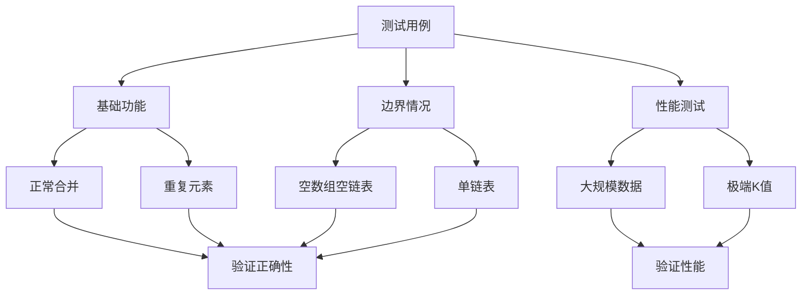

# 23. 合并 K 个升序链表

# 描述

给你一个链表数组，每个链表都已经按升序排列。

请你将所有链表合并到一个升序链表中，返回合并后的链表。

## 示例 1

输入：lists = [[1,4,5],[1,3,4],[2,6]]
输出：[1,1,2,3,4,4,5,6]
解释：链表数组如下：
[
  1->4->5,
  1->3->4,
  2->6
]
将它们合并到一个有序链表中得到。
1->1->2->3->4->4->5->6

## 示例 2

输入：lists = []
输出：[]

## 示例 3

输入：lists = [[]]
输出：[]

## 提示

- k == lists.length
- 0 <= k <= 10^4
- 0 <= lists[i].length <= 500
- -10^4 <= lists[i][j] <= 10^4
- lists[i] 按 升序 排列
- lists[i].length 的总和不超过 10^4

## 解题思路

### 算法分析

这道题是**链表合并**和**分治算法**的经典应用。主要解法包括：

1. **逐一合并法**：依次合并两个链表，简单但效率低
2. **分治合并法**：类似归并排序，递归分治合并
3. **优先队列法**：使用最小堆维护各链表头节点
4. **数组排序法**：收集所有节点后排序重建链表

### 问题本质分析

### 分治算法详解

### 两个链表合并过程

### 分治树结构

### 优先队列解法

### 各种解法对比

### 算法流程图

### 代码实现思路

1. **链表节点定义**：
   - 标准单链表节点结构
   - 包含值和下一个节点指针

2. **分治合并实现**：
   - 递归分割链表数组
   - 合并两个有序链表的经典算法
   - 时间复杂度最优

3. **优先队列实现**：
   - 使用堆维护所有链表的当前最小节点
   - 每次取出最小节点并添加其后继
   - 适合K很大的情况

4. **边界处理**：
   - 空数组、单链表、空链表的处理
   - 链表长度不等的情况

### 时间复杂度分析

- **逐一合并法**：O_kn，k为链表数量，n为总节点数
- **分治合并法**：O_nlogk，最优解法
- **优先队列法**：O_nlogk，稳定高效
- **数组排序法**：O_nlogn，简单但空间消耗大

### 空间复杂度分析

- **逐一合并法**：O常数，原地操作
- **分治合并法**：O_logk，递归栈深度
- **优先队列法**：O_k，堆存储空间
- **数组排序法**：O_n，额外数组空间

### 关键优化点

1. **分治策略**：将O_kn优化为O_nlogk
2. **虚拟头节点**：简化链表合并逻辑
3. **递归优化**：合理的递归边界处理
4. **内存管理**：复用原有节点，避免额外分配

### 边界情况处理

1. **空数组**：直接返回null
2. **单个链表**：直接返回该链表
3. **包含空链表**：跳过空链表处理
4. **所有链表为空**：返回null

### 实际应用场景

1. **外部排序**：合并多个已排序的文件
2. **分布式系统**：合并多个节点的排序结果
3. **数据库**：多路归并排序的实现
4. **搜索引擎**：合并多个索引的结果

### 算法扩展

### 性能优化技巧

### 测试用例设计

这个问题的关键在于**理解分治算法的优势**和**掌握链表合并的基本操作**，通过递归分治将复杂的多路归并问题转化为简单的两路归并问题。
