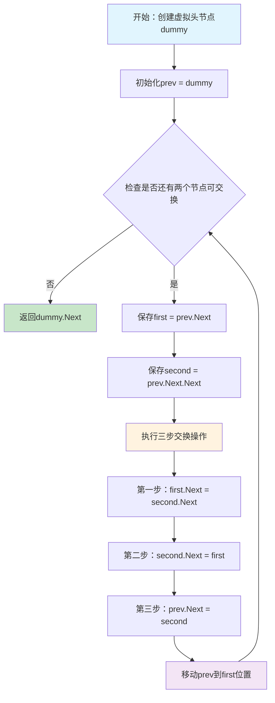
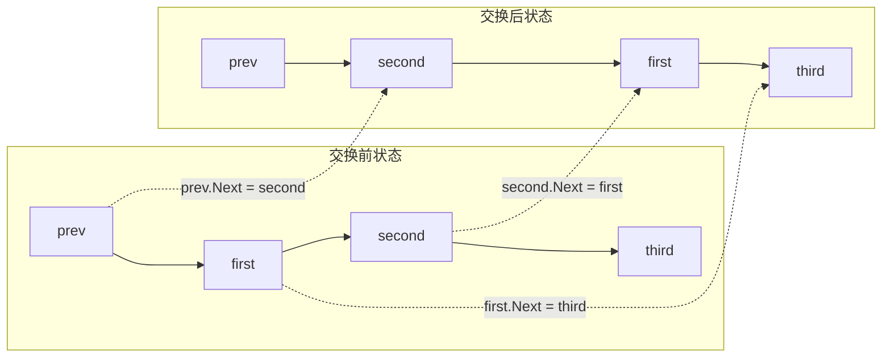
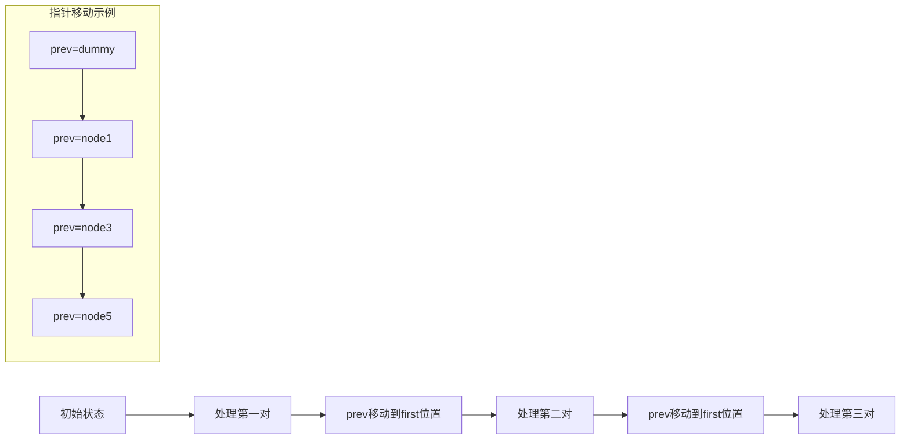
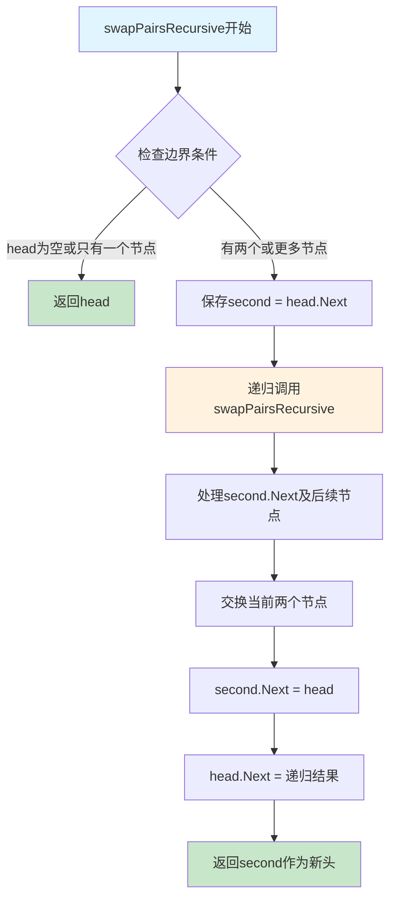
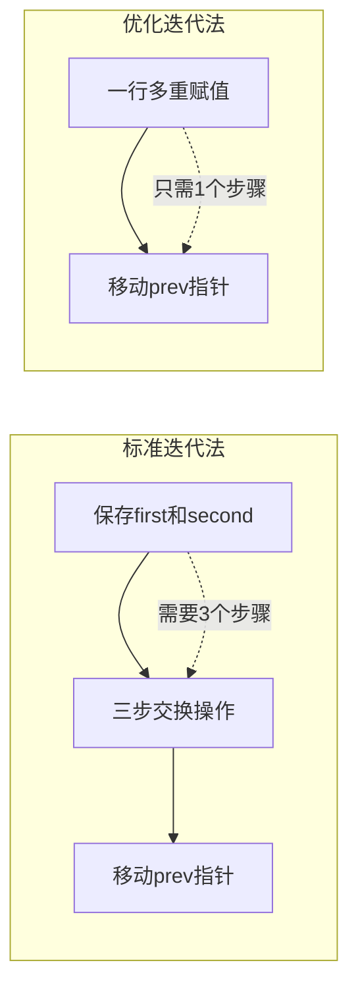
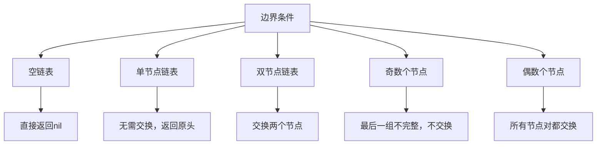
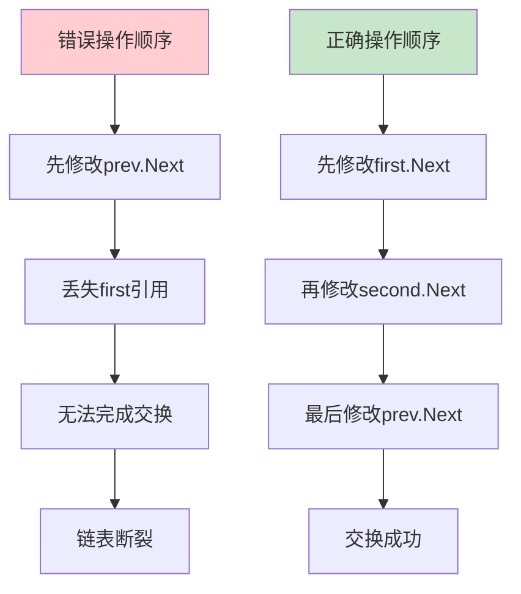
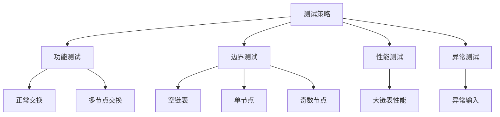

# 24. 两两交换链表中的节点

给你一个链表，两两交换其中相邻的节点，并返回交换后链表的头节点。你必须在不修改节点内部的值的情况下完成本题（即，只能进行节点交换）。

## 示例 1：


输入：head = [1,2,3,4]
输出：[2,1,4,3]

## 示例 2：

输入：head = []
输出：[]

## 示例 3：

输入：head = [1]
输出：[1]

## 提示：

- 链表中节点的数目在范围 [0, 100] 内
- 0 <= Node.val <= 100

## 解题思路

### 1. 算法分析

#### 1.1 问题本质
这道题的核心是**链表节点的重新连接**，而不是简单的值交换。我们需要：
- 保持节点值不变
- 重新调整节点的Next指针
- 确保链表结构完整且无环

#### 1.2 关键挑战
1. **头节点处理**：交换后头节点会改变，需要特殊处理
2. **指针关系维护**：交换过程中容易丢失节点引用
3. **边界条件**：空链表、单节点、奇数个节点等特殊情况
4. **指针顺序**：交换操作的顺序至关重要，错误的顺序会导致链表断裂

#### 1.3 算法分类
根据实现方式，可以分为三大类：
- **迭代法**：使用循环逐个处理节点对
- **递归法**：使用递归处理子问题
- **优化法**：在迭代基础上进行空间或时间优化

### 2. 核心算法详解

#### 2.1 迭代法（推荐解法）

##### 2.1.1 算法思想
迭代法的核心思想是**维护三个关键指针**：
- `prev`：当前处理节点对的前驱节点
- `first`：当前处理节点对的第一个节点
- `second`：当前处理节点对的第二个节点

通过这三个指针，我们可以安全地完成节点交换而不丢失引用。

##### 2.1.2 详细流程图



##### 2.1.3 交换操作详解



**三步交换操作**：
1. **`first.Next = second.Next`**：第一个节点指向第三个节点
   - 目的：保持与后续节点的连接
   - 风险：如果先执行其他步骤，可能丢失引用
   
2. **`second.Next = first`**：第二个节点指向第一个节点
   - 目的：建立反向连接
   - 时机：在第一步之后执行，确保引用安全
   
3. **`prev.Next = second`**：前驱节点指向第二个节点
   - 目的：更新前驱的指向
   - 时机：最后执行，避免破坏已建立的连接

##### 2.1.4 指针移动策略



**为什么移动到first位置？**
- `first`是当前处理节点对的第一个节点
- 交换后，`first`变成了下一对的前驱
- 这样`prev`就能正确指向下一对的前驱节点

#### 2.2 递归法

##### 2.2.1 算法思想
递归法采用**自底向上**的策略：
1. 先递归处理后续节点
2. 再处理当前两个节点
3. 返回处理后的头节点

这种方法的优势是代码简洁，逻辑清晰，但需要注意递归深度。

##### 2.2.2 递归流程图



##### 2.2.3 递归调用栈分析

```mermaid
graph TD
    subgraph "递归调用栈"
        A[swapPairs[1,2,3,4,5]] --> B[swapPairs[3,4,5]]
        B --> C[swapPairs[5]]
        C --> D[返回[5]]
        D --> E[处理[3,4]对]
        E --> F[返回[4,3,5]]
        F --> G[处理[1,2]对]
        G --> H[返回[2,1,4,3,5]]
    end
    
    subgraph "节点交换过程"
        I[1->2->3->4->5] --> J[1->2->4->3->5]
        J --> K[2->1->4->3->5]
    end
```

**递归终止条件**：
- `head == nil`：空链表
- `head.Next == nil`：单节点链表

**递归逻辑**：
1. **保存引用**：`second = head.Next`
2. **递归处理**：`head.Next = swapPairsRecursive(second.Next)`
3. **交换当前**：`second.Next = head`
4. **返回新头**：`return second`

#### 2.3 优化迭代法

##### 2.3.1 算法思想
优化迭代法利用Go语言的**多重赋值**特性，将三步交换操作合并为一行代码，减少中间变量，提高代码简洁性。

##### 2.3.2 优化对比



**多重赋值原理**：
```go
prev.Next.Next, prev.Next.Next.Next, prev.Next = 
    prev.Next, prev.Next, prev.Next.Next
```

这行代码等价于：
```go
temp1 := prev.Next.Next        // 保存second
temp2 := prev.Next.Next.Next   // 保存third
temp3 := prev.Next             // 保存first

prev.Next.Next = temp3         // second.Next = first
prev.Next.Next.Next = temp3    // second.Next.Next = first (这里有问题)
prev.Next = temp1              // prev.Next = second
```

**注意**：这种写法虽然简洁，但可读性较差，容易出错，建议在理解透彻后使用。

### 3. 算法复杂度分析

#### 3.1 时间复杂度分析

```mermaid
graph TD
    A[链表长度n] --> B[迭代法]
    A --> C[递归法]
    A --> D[优化迭代法]
    
    B --> E[O(n): 每个节点访问一次]
    C --> F[O(n): 每个节点访问一次]
    D --> G[O(n): 每个节点访问一次]
    
    subgraph "详细分析"
        H[遍历次数: n/2] --> I[每次操作: O(1)]
        I --> J[总复杂度: O(n)]
    end
```

**详细计算**：
- 链表长度为n
- 需要交换n/2对节点（向下取整）
- 每对节点的交换操作是O(1)
- 总时间复杂度：O(n/2) × O(1) = O(n)

#### 3.2 空间复杂度分析

```mermaid
graph TD
    A[空间复杂度] --> B[迭代法]
    A --> C[递归法]
    A --> D[优化迭代法]
    
    B --> E[O(1): 只使用常数个指针变量]
    C --> F[O(n): 递归调用栈深度]
    D --> G[O(1): 只使用常数个指针变量]
    
    subgraph "空间使用对比"
        H[迭代法: dummy + prev + first + second] --> I[4个变量 = O(1)]
        J[递归法: 递归栈深度] --> K[最坏情况: n/2层 = O(n)]
    end
```

**空间使用详情**：
- **迭代法**：O(1)
  - `dummy`：虚拟头节点
  - `prev`：前驱指针
  - `first`：第一个节点指针
  - `second`：第二个节点指针
  
- **递归法**：O(n)
  - 递归调用栈深度：n/2层
  - 每层保存函数参数和局部变量
  
- **优化迭代法**：O(1)
  - 与标准迭代法相同
  - 只是减少了中间变量

### 4. 边界条件处理

#### 4.1 边界情况分类



#### 4.2 详细边界处理

##### 4.2.1 空链表处理
```go
if head == nil {
    return nil
}
```
- **原因**：空链表没有节点可交换
- **处理**：直接返回nil
- **测试用例**：`[]` → `[]`

##### 4.2.2 单节点链表处理
```go
if head.Next == nil {
    return head
}
```
- **原因**：只有一个节点，无法形成节点对
- **处理**：返回原头节点
- **测试用例**：`[1]` → `[1]`

##### 4.2.3 奇数个节点处理
```go
// 在迭代循环中
for prev.Next != nil && prev.Next.Next != nil {
    // 只有当存在两个节点时才交换
}
```
- **原因**：最后一组可能只有一个节点
- **处理**：不交换，保持原状
- **测试用例**：`[1,2,3]` → `[2,1,3]`

#### 4.3 边界测试用例设计

```mermaid
graph LR
    A[边界测试] --> B[空链表]
    A --> C[单节点]
    A --> D[双节点]
    A --> E[三节点]
    A --> F[四节点]
    A --> G[五节点]
    
    B --> H[[] → []]
    C --> I[[1] → [1]]
    D --> J[[1,2] → [2,1]]
    E --> K[[1,2,3] → [2,1,3]]
    F --> L[[1,2,3,4] → [2,1,4,3]]
    G --> M[[1,2,3,4,5] → [2,1,4,3,5]]
```

### 5. 算法优化策略

#### 5.1 性能优化

##### 5.1.1 减少函数调用
```go
// 优化前：多次调用len()
for i := 0; i < len(nodes); i++ {
    // 处理逻辑
}

// 优化后：缓存长度
length := len(nodes)
for i := 0; i < length; i++ {
    // 处理逻辑
}
```

##### 5.1.2 减少内存分配
```go
// 优化前：每次创建新节点
newNode := &ListNode{Val: val}

// 优化后：复用现有节点
// 直接修改指针关系，不创建新节点
```

#### 5.2 代码优化

##### 5.2.1 使用常量
```go
const (
    MIN_NODES_FOR_SWAP = 2
    MAX_NODES = 100
)
```

##### 5.2.2 提前返回
```go
// 提前检查边界条件
if head == nil || head.Next == nil {
    return head
}
```

### 6. 实际应用场景

#### 6.1 链表重排序
- **场景**：需要将链表按照特定规则重新排列
- **应用**：数据预处理、算法优化
- **示例**：将链表按奇偶位置分组

#### 6.2 链表反转
- **场景**：需要部分反转链表
- **应用**：字符串处理、数据转换
- **示例**：每K个节点为一组进行反转

#### 6.3 链表合并
- **场景**：需要交替合并两个链表
- **应用**：数据融合、算法实现
- **示例**：将两个有序链表交替合并

### 7. 常见错误与陷阱

#### 7.1 指针丢失错误



**错误示例**：
```go
// 错误：先修改prev.Next，丢失引用
prev.Next = second        // 丢失first引用
first.Next = second.Next  // 无法访问first
second.Next = first       // 无法访问first
```

#### 7.2 边界条件遗漏
- **问题**：忘记处理空链表或单节点链表
- **后果**：程序崩溃或结果错误
- **解决**：在函数开始处添加边界检查

#### 7.3 循环条件错误
- **问题**：循环条件设置不当
- **后果**：无限循环或提前退出
- **解决**：仔细分析循环终止条件

### 8. 测试策略

#### 8.1 单元测试设计



#### 8.2 测试用例覆盖

**功能测试用例**：
1. `[1,2,3,4]` → `[2,1,4,3]`：标准偶数节点
2. `[1,2,3]` → `[2,1,3]`：奇数节点
3. `[1,2]` → `[2,1]`：双节点

**边界测试用例**：
1. `[]` → `[]`：空链表
2. `[1]` → `[1]`：单节点
3. `[1,2,3,4,5]` → `[2,1,4,3,5]`：大奇数链表

**异常测试用例**：
1. `nil` → `nil`：空指针
2. 包含重复值的链表
3. 包含负值的链表

### 9. 代码实现要点

#### 9.1 关键代码段分析

```go
func swapPairs(head *ListNode) *ListNode {
    // 1. 创建虚拟头节点
    dummy := &ListNode{Next: head}
    prev := dummy
    
    // 2. 循环处理节点对
    for prev.Next != nil && prev.Next.Next != nil {
        // 3. 保存当前两个节点
        first := prev.Next
        second := prev.Next.Next
        
        // 4. 执行三步交换
        first.Next = second.Next    // 第一步
        second.Next = first         // 第二步
        prev.Next = second          // 第三步
        
        // 5. 移动prev指针
        prev = first
    }
    
    return dummy.Next
}
```

#### 9.2 代码质量要求

**可读性**：
- 变量命名清晰：`first`, `second`, `prev`
- 注释详细：每个步骤都有说明
- 结构清晰：逻辑分明的代码块

**健壮性**：
- 边界条件检查完整
- 指针操作安全
- 异常情况处理

**可维护性**：
- 函数职责单一
- 代码复用性好
- 易于扩展和修改

### 10. 总结与展望

#### 10.1 算法特点总结

**优势**：
1. **时间复杂度优秀**：O(n)，每个节点只访问一次
2. **空间复杂度可控**：迭代法O(1)，递归法O(n)
3. **实现相对简单**：逻辑清晰，易于理解
4. **适用性广泛**：可以处理各种长度的链表

**局限性**：
1. **只能两两交换**：无法处理其他交换模式
2. **递归版本有栈溢出风险**：对于超长链表
3. **指针操作容易出错**：需要仔细处理引用关系

#### 10.2 扩展思考

**变种问题**：
1. **K个一组反转**：每K个节点为一组进行反转
2. **交替合并**：将两个链表交替合并
3. **奇偶分离**：将链表按奇偶位置分离

**优化方向**：
1. **并行处理**：对于超长链表，可以考虑并行处理
2. **缓存优化**：利用CPU缓存特性优化访问模式
3. **内存池**：减少频繁的内存分配和释放

#### 10.3 学习建议

1. **理解指针操作**：这是链表操作的基础
2. **画图分析**：复杂问题用图表辅助理解
3. **多角度思考**：尝试不同的解题思路
4. **实践验证**：多写测试用例验证正确性
5. **总结规律**：找出解题的通用模式

这道题是链表操作的经典题目，通过深入理解其解题思路，可以掌握链表操作的核心技巧，为后续更复杂的链表问题打下坚实基础。

本仓库 `24/main.go` 提供了三种完整的实现方式，并在 `main()` 函数中包含了全面的测试用例，可以直接运行验证算法的正确性。
