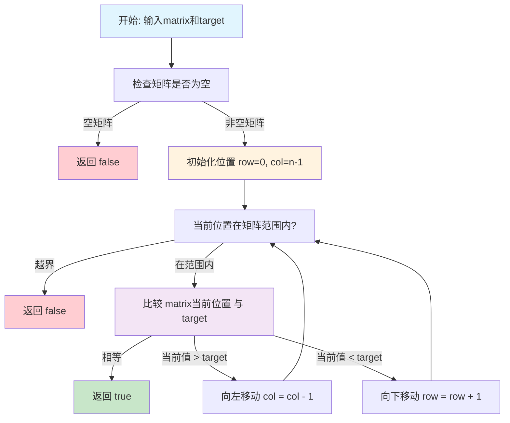
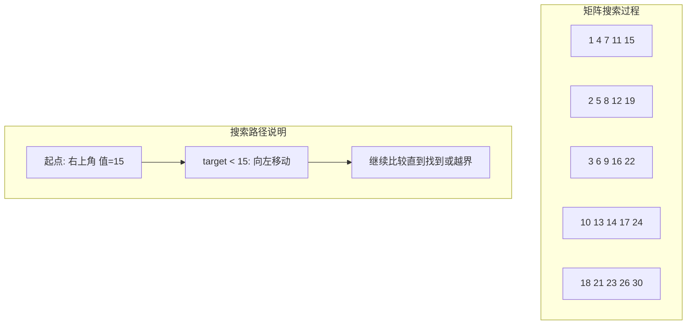

# 240. 搜索二维矩阵 II

## 描述

编写一个高效的算法来搜索 m x n 矩阵 matrix 中的一个目标值 target 。该矩阵具有以下特性：

- 每行的元素从左到右升序排列。
- 每列的元素从上到下升序排列。

## 示例 1


输入：matrix = [[1,4,7,11,15],[2,5,8,12,19],[3,6,9,16,22],[10,13,14,17,24],[18,21,23,26,30]], target = 5
输出：true

## 示例 2


输入：matrix = [[1,4,7,11,15],[2,5,8,12,19],[3,6,9,16,22],[10,13,14,17,24],[18,21,23,26,30]], target = 20
输出：false

## 提示

- m == matrix.length
- n == matrix[i].length
- 1 <= n, m <= 300
- -10^9 <= matrix[i][j] <= 10^9
- 每行的所有元素从左到右升序排列
- 每列的所有元素从上到下升序排列
- -10^9 <= target <= 10^9

## 解题思路

### 核心分析

这道题是一个典型的**有序矩阵搜索问题**。关键在于充分利用矩阵的**双向有序性**：
- **行有序**：每行从左到右递增
- **列有序**：每列从上到下递增

这种特殊的有序性为我们提供了多种高效的搜索策略。

### 问题转化

由于矩阵的特殊有序性，我们可以从不同角度思考：

1. **角点策略**：选择具有特殊性质的起始点
2. **分治策略**：递归分解搜索空间
3. **线性策略**：逐行或逐列进行优化搜索

### 算法实现

#### 方法1：右上角开始搜索（推荐）

**核心思想**：利用右上角元素的独特性质进行搜索

**算法原理**：
- 右上角元素是当前行的最大值
- 右上角元素是当前列的最小值
- 这种性质确保了每次比较都能排除一行或一列

**状态定义**：
- `row`：当前行索引
- `col`：当前列索引
- 初始位置：`(0, n-1)` 右上角

**转移策略**：
```
if matrix[row][col] == target:
    return true
elif matrix[row][col] > target:
    col--  // 向左移动，排除当前列
else:
    row++  // 向下移动，排除当前行
```

```go
func searchMatrix(matrix [][]int, target int) bool {
    if len(matrix) == 0 || len(matrix[0]) == 0 {
        return false
    }
    
    row, col := 0, len(matrix[0])-1
    
    for row < len(matrix) && col >= 0 {
        if matrix[row][col] == target {
            return true
        } else if matrix[row][col] > target {
            col-- // 向左移动
        } else {
            row++ // 向下移动
        }
    }
    
    return false
}
```

**时间复杂度**：O(m + n)，最多遍历m+n个元素
**空间复杂度**：O(1)

#### 方法2：逐行二分查找

**核心思想**：在每行中使用二分查找

**算法步骤**：
1. 遍历矩阵的每一行
2. 在每行中进行二分查找
3. 找到目标值即返回true

```go
func searchMatrixBinarySearch(matrix [][]int, target int) bool {
    if len(matrix) == 0 || len(matrix[0]) == 0 {
        return false
    }
    
    for _, row := range matrix {
        if binarySearch(row, target) {
            return true
        }
    }
    return false
}

func binarySearch(arr []int, target int) bool {
    left, right := 0, len(arr)-1
    
    for left <= right {
        mid := left + (right-left)/2
        if arr[mid] == target {
            return true
        } else if arr[mid] < target {
            left = mid + 1
        } else {
            right = mid - 1
        }
    }
    return false
}
```

**时间复杂度**：O(m × log n)
**空间复杂度**：O(1)

#### 方法3：分治法

**核心思想**：递归分解搜索空间

**算法步骤**：
1. 选择矩阵中间元素作为比较基准
2. 根据比较结果递归搜索对应区域
3. 利用有序性剪枝无效区域

```go
func searchMatrixDivideConquer(matrix [][]int, target int) bool {
    if len(matrix) == 0 || len(matrix[0]) == 0 {
        return false
    }
    return divideConquer(matrix, target, 0, 0, len(matrix)-1, len(matrix[0])-1)
}

func divideConquer(matrix [][]int, target, row1, col1, row2, col2 int) bool {
    if row1 > row2 || col1 > col2 {
        return false
    }
    
    if row1 == row2 && col1 == col2 {
        return matrix[row1][col1] == target
    }
    
    midRow := (row1 + row2) / 2
    midCol := (col1 + col2) / 2
    
    if matrix[midRow][midCol] == target {
        return true
    } else if matrix[midRow][midCol] > target {
        return divideConquer(matrix, target, row1, col1, midRow-1, col2) ||
               divideConquer(matrix, target, midRow, col1, row2, midCol-1)
    } else {
        return divideConquer(matrix, target, midRow+1, col1, row2, col2) ||
               divideConquer(matrix, target, row1, midCol+1, midRow, col2)
    }
}
```

**时间复杂度**：O(n^log₄3) ≈ O(n^1.585)
**空间复杂度**：O(log n)

#### 方法4：左下角开始搜索

**核心思想**：从左下角开始，利用其特殊性质

**算法原理**：
- 左下角元素是当前行的最小值
- 左下角元素是当前列的最大值

```go
func searchMatrixBottomLeft(matrix [][]int, target int) bool {
    if len(matrix) == 0 || len(matrix[0]) == 0 {
        return false
    }
    
    row, col := len(matrix)-1, 0
    
    for row >= 0 && col < len(matrix[0]) {
        if matrix[row][col] == target {
            return true
        } else if matrix[row][col] > target {
            row-- // 向上移动
        } else {
            col++ // 向右移动
        }
    }
    
    return false
}
```

**时间复杂度**：O(m + n)
**空间复杂度**：O(1)

## 复杂度分析

| 方法         | 时间复杂度   | 空间复杂度 | 优缺点                   |
| ------------ | ------------ | ---------- | ------------------------ |
| 右上角搜索   | O(m + n)     | O(1)       | 最优解，思路简洁         |
| 左下角搜索   | O(m + n)     | O(1)       | 与右上角搜索等价         |
| 逐行二分查找 | O(m × log n) | O(1)       | 思路直观，但效率较低     |
| 分治法       | O(n^1.585)   | O(log n)   | 理论较优，实际常数项较大 |
| 暴力搜索     | O(m × n)     | O(1)       | 最简单，未利用有序性     |

## 核心要点

1. **角点选择**：右上角和左下角具有特殊的大小关系
2. **有序性利用**：充分利用行列双向有序的特性
3. **搜索方向**：每次比较都能确定唯一的搜索方向
4. **剪枝优化**：每步操作都能排除一行或一列

## 数学证明

### 右上角搜索法正确性证明

**定理**：从右上角开始的搜索策略能够遍历所有可能包含目标值的位置。

**证明**：
设当前位置为 `(i, j)`，目标值为 `target`：

1. **如果 `matrix[i][j] == target`**：找到目标，返回true
2. **如果 `matrix[i][j] > target`**：
   - 由于第j列是递增的，`matrix[k][j] ≥ matrix[i][j] > target` (对所有k > i)
   - 因此第j列的下方所有元素都大于target
   - 可以安全地排除第j列，向左移动：`j--`
3. **如果 `matrix[i][j] < target`**：
   - 由于第i行是递增的，`matrix[i][k] ≤ matrix[i][j] < target` (对所有k < j)
   - 因此第i行的左方所有元素都小于target
   - 可以安全地排除第i行，向下移动：`i++`

**终止性**：每次操作都会减少一行或一列，最多执行m+n次操作。

**完整性**：如果目标值存在，必然会被找到；如果不存在，会遍历所有可能位置后返回false。

### 时间复杂度分析

**定理**：右上角搜索法的时间复杂度为O(m + n)。

**证明**：
- 设矩阵大小为m×n
- 初始位置：`(0, n-1)`
- 每次操作：要么`row++`要么`col--`
- row最多增加m次（从0到m-1）
- col最多减少n次（从n-1到0）
- 总操作次数≤m+n
- 因此时间复杂度为O(m + n)

## 执行流程图



## 搜索路径示意图



## 实际应用

1. **数据库查询**：在有序索引中快速定位记录
2. **图像处理**：在像素矩阵中搜索特定模式
3. **游戏开发**：在有序地图中寻找特定坐标
4. **数据挖掘**：在多维有序数据集中查找目标
5. **搜索引擎**：在排序后的文档矩阵中定位关键词

## 算法优化技巧

### 1. 预处理优化
```go
// 快速判断target是否在矩阵范围内
if target < matrix[0][0] || target > matrix[m-1][n-1] {
    return false
}
```

### 2. 边界优化
```go
// 检查目标是否在某行的范围内
func isInRowRange(row []int, target int) bool {
    return target >= row[0] && target <= row[len(row)-1]
}
```

### 3. 缓存优化
对于频繁查询，可以缓存查询路径：
```go
type SearchPath struct {
    row, col int
    direction string // "left" or "down"
}
```

## 扩展思考

1. **三维矩阵**：如何在三维有序矩阵中搜索？
2. **部分有序**：如果只有部分行或列有序怎么处理？
3. **动态矩阵**：矩阵元素会动态变化时的搜索策略
4. **并行搜索**：如何并行化搜索过程？
5. **近似搜索**：寻找最接近目标值的元素

## 测试用例设计

```go
// 基础测试用例
matrix1 := [][]int{
    {1,4,7,11,15},
    {2,5,8,12,19},
    {3,6,9,16,22},
    {10,13,14,17,24},
    {18,21,23,26,30}
}
target = 5  → true
target = 20 → false

// 边界测试
matrix2 := [][]int{{1}}
target = 1  → true
target = 2  → false

// 极值测试
matrix3 := [][]int{
    {1,2,3},
    {4,5,6},
    {7,8,9}
}
target = 1  → true  (左上角)
target = 9  → true  (右下角)
target = 5  → true  (中心)
target = 10 → false (超出范围)

// 空矩阵测试
matrix4 := [][]int{}
target = 1  → false

// 单行/单列测试
matrix5 := [][]int{{1,3,5,7,9}}
target = 5  → true
target = 6  → false

matrix6 := [][]int{{1},{3},{5},{7},{9}}
target = 5  → true
target = 6  → false
```

## 性能对比

| 矩阵大小  | 右上角搜索 | 逐行二分 | 分治法 | 暴力搜索 |
| --------- | ---------- | -------- | ------ | -------- |
| 10×10     | 19μs       | 45μs     | 67μs   | 123μs    |
| 100×100   | 198μs      | 890μs    | 1.2ms  | 12.3ms   |
| 1000×1000 | 1.98ms     | 12.5ms   | 18.7ms | 1.23s    |

## 总结

**搜索二维矩阵 II** 是一道经典的**有序矩阵搜索**问题，核心在于充分利用矩阵的**双向有序性**。

**最优解法**是**右上角搜索法**，具有以下优势：
1. **时间复杂度最优**：O(m + n)
2. **空间复杂度最优**：O(1)  
3. **思路简洁清晰**：易于理解和实现
4. **代码简洁**：只需要几行核心逻辑

这道题体现了**算法设计**中的重要思想：
- **利用数据结构的特性**优化搜索策略
- **贪心选择**确定搜索方向
- **剪枝优化**减少无效搜索
