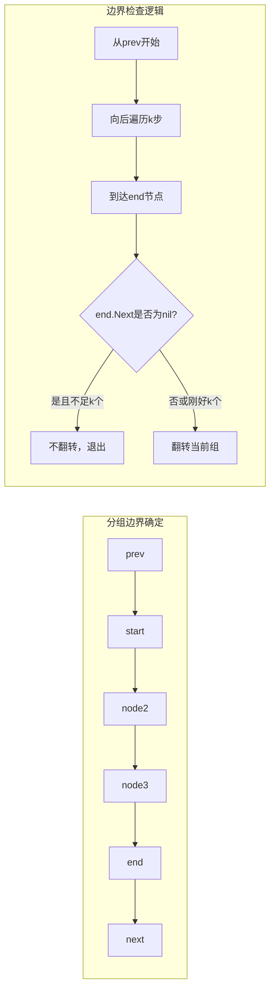
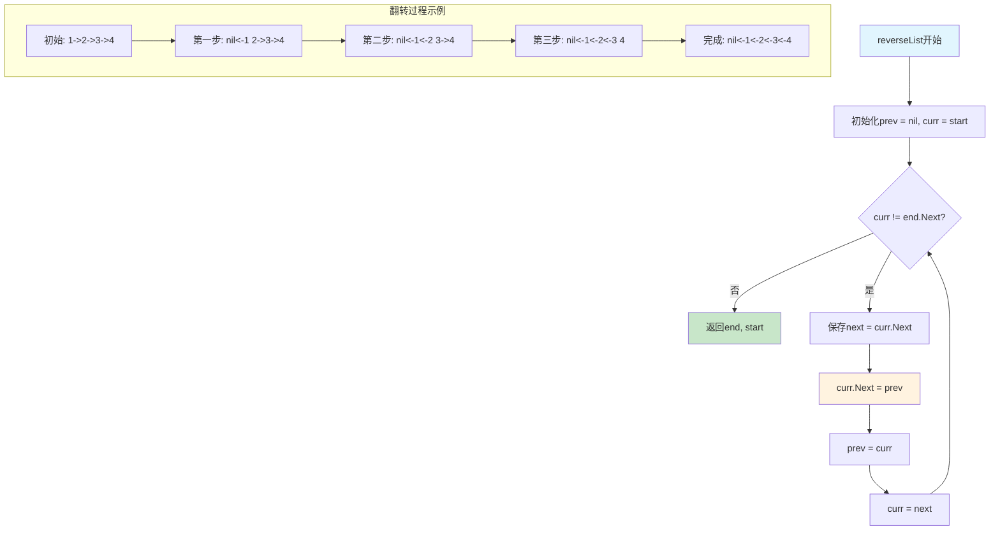
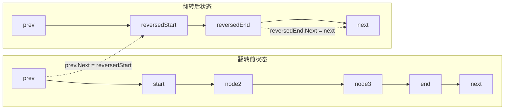
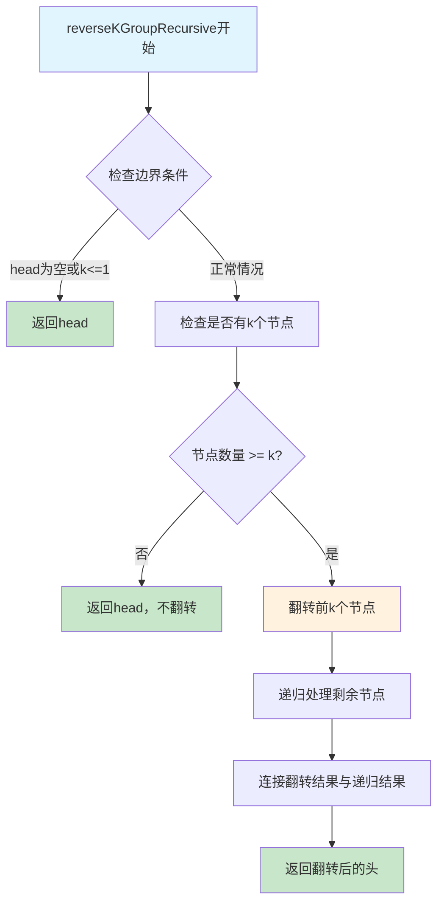
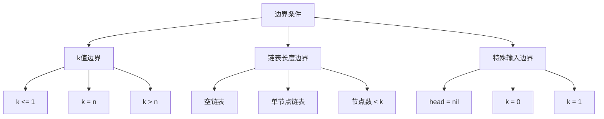
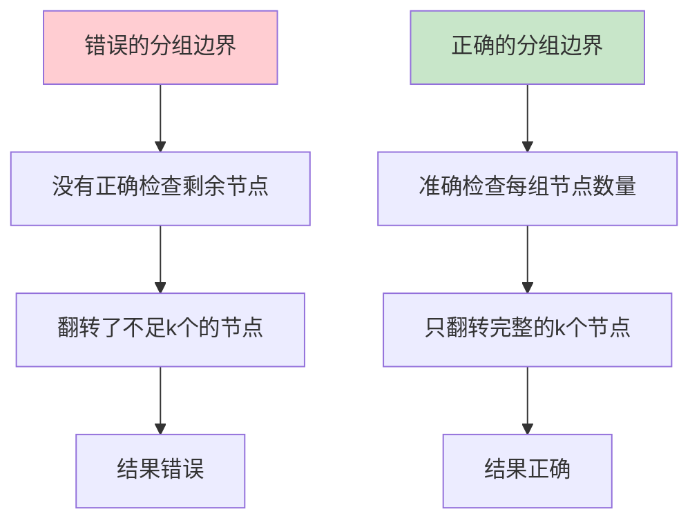
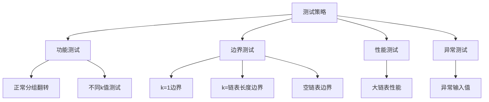

# 25. K 个一组翻转链表

## 题目描述

给你链表的头节点 head ，每 k 个节点一组进行翻转，请你返回修改后的链表。

k 是一个正整数，它的值小于或等于链表的长度。如果节点总数不是 k 的整数倍，那么请将最后剩余的节点保持原有顺序。

你不能只是单纯的改变节点内部的值，而是需要实际进行节点交换。

## 示例 1：


输入：head = [1,2,3,4,5], k = 2
输出：[2,1,4,3,5]

## 示例 2：


输入：head = [1,2,3,4,5], k = 3
输出：[3,2,1,4,5]

## 提示：

- 链表中的节点数目为 n
- 1 <= k <= n <= 5000
- 0 <= Node.val <= 1000

## 进阶：你可以设计一个只用 O(1) 额外内存空间的算法解决此问题吗？

## 解题思路

### 1. 算法分析

#### 1.1 问题本质
这道题是**分组翻转链表**的经典问题，核心要求是：
- 将链表按K个节点为一组进行分组
- 每组内部进行完全翻转
- 组与组之间保持原有顺序
- 最后不足K个的节点保持原顺序

#### 1.2 关键挑战
1. **分组边界确定**：如何准确识别每组K个节点的边界
2. **组内翻转**：如何高效翻转指定区间内的节点
3. **组间连接**：翻转后如何正确连接相邻组
4. **边界处理**：最后不足K个节点的处理策略
5. **空间优化**：如何在O(1)额外空间内完成操作

#### 1.3 算法分类
根据实现方式，可以分为三大类：
- **迭代法**：使用循环逐个处理每组节点
- **递归法**：使用递归处理子问题
- **优化迭代法**：在迭代基础上减少不必要的遍历

### 2. 核心算法详解

#### 2.1 迭代法（推荐解法）

##### 2.1.1 算法思想
迭代法的核心思想是**分组处理 + 区间翻转**：
1. 使用虚拟头节点简化头节点处理
2. 循环检查每组是否有K个节点
3. 对每组进行区间翻转
4. 重新连接翻转后的节点
5. 移动到下一组继续处理

##### 2.1.2 详细流程图

```mermaid
flowchart TD
    A[开始：创建虚拟头dummy] --> B[初始化prev = dummy]
    B --> C[进入主循环]
    C --> D[检查剩余节点数量]
    D --> E{是否还有k个节点?}
    E -->|否| F[退出循环，返回dummy.Next]
    E -->|是| G[确定当前组边界]
    G --> H[翻转当前组[start, end]]
    H --> I[重新连接节点]
    I --> J[移动prev到下一组前驱]
    J --> C
    
    subgraph "翻转过程"
        K[保存start和next引用] --> L[调用reverseList翻转]
        L --> M[prev.Next = 翻转后的头]
        M --> N[翻转后的尾.Next = next]
    end
    
    style A fill:#e1f5fe
    style F fill:#c8e6c9
    style H fill:#fff3e0
    style J fill:#f3e5f5
```

##### 2.1.3 分组边界确定策略



**边界确定算法**：
```go
// 检查是否还有k个节点
end := prev
for i := 0; i < k && end.Next != nil; i++ {
    end = end.Next
}
if end.Next == nil && prev.Next != end {
    // 剩余节点不足k个，不翻转
    break
}
```

##### 2.1.4 区间翻转详解



**翻转步骤详解**：
1. **保存引用**：`next = curr.Next`
2. **翻转指针**：`curr.Next = prev`
3. **移动指针**：`prev = curr, curr = next`
4. **重复直到**：`curr == end.Next`

##### 2.1.5 节点重新连接策略



**连接操作**：
```go
// 翻转[start, end]区间
reversedStart, reversedEnd := reverseList(start, end)

// 重新连接
prev.Next = reversedStart        // 前驱指向翻转后的头
reversedEnd.Next = next          // 翻转后的尾指向下一组
```

#### 2.2 递归法

##### 2.2.1 算法思想
递归法采用**分治策略**：
1. 检查当前是否有K个节点
2. 如果有，翻转前K个节点
3. 递归处理剩余节点
4. 将翻转后的头与递归结果连接

##### 2.2.2 递归流程图



##### 2.2.3 递归调用栈分析

```mermaid
graph TD
    subgraph "递归调用栈示例: k=2, head=[1,2,3,4,5,6]"
        A[reverseKGroup[1,2,3,4,5,6]] --> B[翻转[1,2] -> [2,1]]
        B --> C[递归: reverseKGroup[3,4,5,6]]
        C --> D[翻转[3,4] -> [4,3]]
        D --> E[递归: reverseKGroup[5,6]]
        E --> F[翻转[5,6] -> [6,5]]
        F --> G[递归: reverseKGroup[]]
        G --> H[返回[]]
        H --> I[连接: [6,5] + []]
        I --> J[连接: [4,3] + [6,5]]
        J --> K[连接: [2,1] + [4,3,6,5]]
        K --> L[最终结果: [2,1,4,3,6,5]]
    end
```

**递归终止条件**：
- `head == nil`：空链表
- `k <= 1`：无需翻转
- `count < k`：节点数量不足

**递归逻辑**：
1. **检查数量**：遍历K步统计节点数量
2. **翻转前K个**：调用`reverseFirstK`翻转
3. **递归处理**：`head.Next = reverseKGroupRecursive(curr, k)`
4. **返回结果**：`return reversedHead`

#### 2.3 优化迭代法

##### 2.3.1 算法思想
优化迭代法在标准迭代法基础上进行改进：
1. 减少不必要的节点遍历
2. 优化翻转函数的返回值
3. 简化连接逻辑

##### 2.3.2 优化对比

```mermaid
graph LR
    subgraph "标准迭代法"
        A[遍历到end节点] --> B[翻转[start, end]]
        B --> C[返回头和尾]
        C --> D[复杂连接逻辑]
    end
    
    subgraph "优化迭代法"
        E[直接计数k个] --> F[翻转k个节点]
        F --> G[返回新头]
        G --> H[简单连接逻辑]
    end
    
    A -.->|"需要end节点引用"| B
    E -.->|"只需计数"| F
```

**优化点分析**：
1. **减少遍历**：直接计数而不是遍历到end
2. **简化翻转**：只返回新头，不返回尾
3. **简化连接**：利用原start节点作为连接点

### 3. 算法复杂度分析

#### 3.1 时间复杂度分析

```mermaid
graph TD
    A[链表长度n] --> B[迭代法]
    A --> C[递归法]
    A --> D[优化迭代法]
    
    B --> E[O(n): 每个节点访问2次]
    C --> F[O(n): 每个节点访问2次]
    D --> G[O(n): 每个节点访问2次]
    
    subgraph "详细分析"
        H[分组数量: n/k] --> I[每组翻转: O(k)]
        I --> J[总复杂度: O(n/k × k) = O(n)]
        K[额外遍历: O(n)] --> L[总复杂度: O(2n) = O(n)]
    end
```

**详细计算**：
- 链表长度为n，分组大小为k
- 分组数量：⌈n/k⌉
- 每组翻转：O(k)
- 翻转总时间：O(n/k × k) = O(n)
- 额外遍历时间：O(n)
- 总时间复杂度：O(n)

#### 3.2 空间复杂度分析

```mermaid
graph TD
    A[空间复杂度] --> B[迭代法]
    A --> C[递归法]
    A --> D[优化迭代法]
    
    B --> E[O(1): 常数个指针变量]
    C --> F[O(n/k): 递归调用栈深度]
    D --> G[O(1): 常数个指针变量]
    
    subgraph "空间使用对比"
        H[迭代法: dummy + prev + start + end + next] --> I[5个变量 = O(1)]
        J[递归法: 递归栈深度] --> K[最坏情况: n/k层 = O(n/k)]
        L[优化法: dummy + prev + start + curr] --> M[4个变量 = O(1)]
    end
```

**空间使用详情**：
- **迭代法**：O(1)
  - `dummy`：虚拟头节点
  - `prev`：前驱指针
  - `start`：当前组起始节点
  - `end`：当前组结束节点
  - `next`：下一组起始节点
  
- **递归法**：O(n/k)
  - 递归调用栈深度：n/k层
  - 每层保存函数参数和局部变量
  
- **优化迭代法**：O(1)
  - 与标准迭代法相同
  - 减少了end和next变量

### 4. 边界条件处理

#### 4.1 边界情况分类



#### 4.2 详细边界处理

##### 4.2.1 k值边界处理
```go
if head == nil || k <= 1 {
    return head
}
```
- **k <= 1**：无需翻转，直接返回
- **k = 1**：每个节点单独翻转，结果与原链表相同
- **k = n**：整个链表翻转

##### 4.2.2 链表长度边界处理
```go
// 检查是否有k个节点
count := 0
curr := head
for count < k && curr != nil {
    curr = curr.Next
    count++
}

if count < k {
    // 不足k个，不翻转
    return head
}
```
- **空链表**：直接返回nil
- **单节点链表**：k>1时不翻转
- **节点数 < k**：不翻转，保持原顺序

##### 4.2.3 特殊边界测试用例

```mermaid
graph LR
    A[边界测试] --> B[k=1]
    A --> C[k=链表长度]
    A --> D[k>链表长度]
    A --> E[空链表]
    A --> F[单节点]
    
    B --> G[[1,2,3] → [1,2,3]]
    C --> H[[1,2,3] → [3,2,1]]
    D --> I[[1,2,3] → [1,2,3]]
    E --> J[[] → []]
    F --> K[[1] → [1]]
```

### 5. 算法优化策略

#### 5.1 性能优化

##### 5.1.1 减少重复遍历
```go
// 优化前：每次都要遍历到end
end := prev
for i := 0; i < k && end.Next != nil; i++ {
    end = end.Next
}

// 优化后：直接计数
count := 0
curr := prev.Next
for count < k && curr != nil {
    curr = curr.Next
    count++
}
```

##### 5.1.2 优化翻转函数
```go
// 优化前：返回头和尾
reversedStart, reversedEnd := reverseList(start, end)
prev.Next = reversedStart
reversedEnd.Next = next

// 优化后：只返回头，利用原start
reversedStart := reverseKNodes(start, k)
prev.Next = reversedStart
start.Next = curr  // start现在是翻转后的尾
```

#### 5.2 代码优化

##### 5.2.1 使用常量
```go
const (
    MIN_K_VALUE = 1
    MAX_K_VALUE = 5000
    MAX_NODES = 5000
)
```

##### 5.2.2 提前返回
```go
// 提前检查边界条件
if head == nil || k <= 1 {
    return head
}

// 提前检查节点数量
if count < k {
    return head
}
```

### 6. 实际应用场景

#### 6.1 数据分块处理
- **场景**：大数据集需要分块处理
- **应用**：数据库查询优化、文件传输
- **示例**：每1000条记录为一组进行批量操作

#### 6.2 网络协议实现
- **场景**：数据包的分组传输
- **应用**：TCP/IP协议、HTTP请求
- **示例**：将长消息分成固定长度的数据包

#### 6.3 算法优化
- **场景**：需要分组处理的数据结构
- **应用**：排序算法、搜索算法
- **示例**：归并排序中的分组合并

### 7. 常见错误与陷阱

#### 7.1 分组边界错误



**错误示例**：
```go
// 错误：没有检查剩余节点数量
for prev.Next != nil {
    // 直接翻转，可能翻转不足k个节点
    start := prev.Next
    end := start
    for i := 1; i < k && end.Next != nil; i++ {
        end = end.Next
    }
    // 没有检查是否真的翻转了k个节点
}
```

#### 7.2 节点连接错误
- **问题**：翻转后没有正确连接相邻组
- **后果**：链表断裂或形成环
- **解决**：仔细维护翻转前后的连接关系

#### 7.3 递归深度问题
- **问题**：对于很长的链表，递归调用栈可能溢出
- **后果**：程序崩溃
- **解决**：使用迭代法或限制递归深度

### 8. 测试策略

#### 8.1 单元测试设计



#### 8.2 测试用例覆盖

**功能测试用例**：
1. `[1,2,3,4,5], k=2` → `[2,1,4,3,5]`：标准偶数分组
2. `[1,2,3,4,5], k=3` → `[3,2,1,4,5]`：标准奇数分组
3. `[1,2,3,4,5,6], k=2` → `[2,1,4,3,6,5]`：完整分组

**边界测试用例**：
1. `[1,2,3,4,5], k=1` → `[1,2,3,4,5]`：k=1边界
2. `[1,2,3,4,5], k=5` → `[5,4,3,2,1]`：k=链表长度边界
3. `[1,2,3], k=4` → `[1,2,3]`：k>链表长度边界

**异常测试用例**：
1. `nil, k=2` → `nil`：空指针
2. `[1], k=0` → `[1]`：k=0边界
3. `[1,2,3,4,5], k=6` → `[1,2,3,4,5]`：k过大

### 9. 代码实现要点

#### 9.1 关键代码段分析

```go
func reverseKGroup(head *ListNode, k int) *ListNode {
    // 1. 边界条件检查
    if head == nil || k <= 1 {
        return head
    }
    
    // 2. 创建虚拟头节点
    dummy := &ListNode{Next: head}
    prev := dummy
    
    // 3. 主循环处理每组
    for {
        // 4. 检查剩余节点数量
        end := prev
        for i := 0; i < k && end.Next != nil; i++ {
            end = end.Next
        }
        if end.Next == nil && prev.Next != end {
            break
        }
        
        // 5. 翻转当前组
        start := prev.Next
        next := end.Next
        reversedStart, reversedEnd := reverseList(start, end)
        
        // 6. 重新连接
        prev.Next = reversedStart
        reversedEnd.Next = next
        
        // 7. 移动到下一组
        prev = reversedEnd
    }
    
    return dummy.Next
}
```

#### 9.2 代码质量要求

**可读性**：
- 变量命名清晰：`start`, `end`, `next`, `reversedStart`, `reversedEnd`
- 注释详细：每个步骤都有说明
- 结构清晰：逻辑分明的代码块

**健壮性**：
- 边界条件检查完整
- 指针操作安全
- 异常情况处理

**可维护性**：
- 函数职责单一
- 代码复用性好
- 易于扩展和修改

### 10. 总结与展望

#### 10.1 算法特点总结

**优势**：
1. **时间复杂度优秀**：O(n)，每个节点最多访问2次
2. **空间复杂度可控**：迭代法O(1)，递归法O(n/k)
3. **实现相对简单**：逻辑清晰，易于理解
4. **适用性广泛**：可以处理各种长度的链表和k值

**局限性**：
1. **只能按固定大小分组**：无法处理变长分组
2. **递归版本有栈溢出风险**：对于很长的链表
3. **指针操作复杂**：需要仔细处理翻转前后的连接关系

#### 10.2 扩展思考

**变种问题**：
1. **变长分组翻转**：每组节点数量不同
2. **交替分组翻转**：奇数组翻转，偶数组保持
3. **条件分组翻转**：根据节点值决定是否翻转

**优化方向**：
1. **并行处理**：对于超长链表，可以考虑并行处理不同组
2. **缓存优化**：利用CPU缓存特性优化访问模式
3. **内存池**：减少频繁的内存分配和释放

#### 10.3 学习建议

1. **理解分组思想**：这是分治算法的基础
2. **掌握区间翻转**：链表操作的核心技巧
3. **注意边界处理**：特别是最后不足k个节点的情况
4. **实践验证**：多写测试用例验证正确性
5. **总结规律**：找出解题的通用模式

这道题是链表操作和分治算法的经典题目，通过深入理解其解题思路，可以掌握：
- 链表分组处理技巧
- 区间翻转算法
- 分治递归思想
- 边界条件处理

为后续更复杂的链表问题和分治算法打下坚实基础。

本仓库 `25/main.go` 提供了三种完整的实现方式，并在 `main()` 函数中包含了全面的测试用例，可以直接运行验证算法的正确性。
