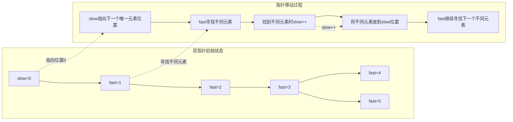
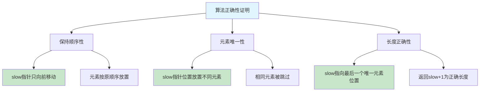
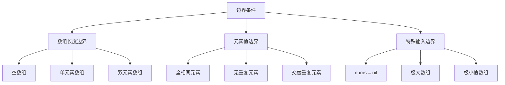
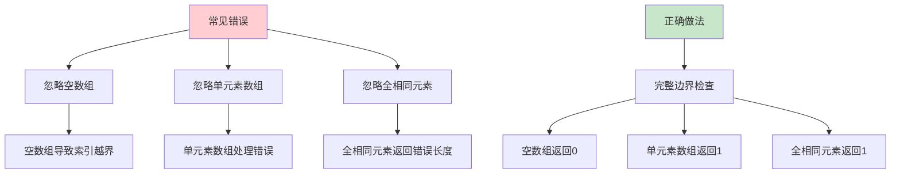
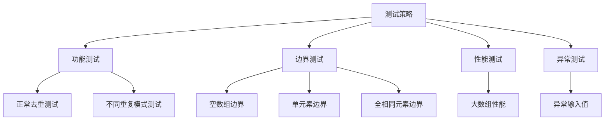

# 26. 删除有序数组中的重复项

## 题目描述

给你一个 **非严格递增排列** 的数组 `nums` ，请你 **原地** 删除重复出现的元素，使每个元素 **只出现一次** ，返回删除后数组的新长度。元素的 **相对顺序** 应该保持 **一致** 。然后返回 `nums` 中唯一元素的个数。

考虑 `nums` 的唯一元素的数量为 `k` ，你需要做以下事情确保你的题解可以被通过：

1. 更改数组 `nums` ，使 `nums` 的前 `k` 个元素包含唯一元素，并按照它们最初在 `nums` 中出现的顺序排列。
2. `nums` 的其余元素与 `nums` 的大小不重要。
3. 返回 `k` 。

## 判题标准

系统会用下面的代码来测试你的题解:

```java
int[] nums = [...]; // 输入数组
int[] expectedNums = [...]; // 长度正确的期望答案

int k = removeDuplicates(nums); // 调用

assert k == expectedNums.length;
for (int i = 0; i < k; i++) {
    assert nums[i] == expectedNums[i];
}
```

如果所有断言都通过，那么您的题解将被通过。

## 示例

### 示例 1：
**输入**：`nums = [1,1,2]`  
**输出**：`2, nums = [1,2,_]`  
**解释**：函数应该返回新的长度 `2` ，并且原数组 `nums` 的前两个元素被修改为 `1, 2` 。不需要考虑数组中超出新长度后面的元素。

### 示例 2：
**输入**：`nums = [0,0,1,1,1,2,2,3,3,4]`  
**输出**：`5, nums = [0,1,2,3,4]`  
**解释**：函数应该返回新的长度 `5` ， 并且原数组 `nums` 的前五个元素被修改为 `0, 1, 2, 3, 4` 。不需要考虑数组中超出新长度后面的元素。

## 提示

- `1 <= nums.length <= 3 * 10^4`
- `-10^4 <= nums[i] <= 10^4`
- `nums` 已按 **非严格递增** 排列

## 解题思路

### 1. 算法分析

#### 1.1 问题本质
这道题是**有序数组去重**的经典问题，核心要求是：
- **原地操作**：不能使用额外的数组空间
- **保持顺序**：去重后元素的相对顺序不变
- **返回长度**：返回去重后数组的有效长度
- **数组修改**：将去重后的元素放在数组前部

#### 1.2 关键挑战
1. **空间限制**：必须在O(1)额外空间内完成操作
2. **顺序保持**：去重后元素的相对顺序必须保持不变
3. **边界处理**：空数组、单元素数组、全相同元素等边界情况
4. **算法效率**：需要在线性时间内完成操作
5. **原地修改**：不能创建新的数组，必须修改原数组

#### 1.3 算法分类
根据实现方式，可以分为四大类：
- **双指针法**：使用快慢指针，最经典和高效的解法
- **计数法**：统计重复元素数量，然后移动元素
- **递归法**：使用递归思想处理子问题
- **原地操作法**：直接在原数组上进行读写操作

### 2. 核心算法详解

#### 2.1 双指针法（推荐解法）

##### 2.1.1 算法思想
双指针法的核心思想是**快慢指针 + 原地覆盖**：
1. 使用慢指针`slow`指向下一个唯一元素应该放置的位置
2. 使用快指针`fast`遍历整个数组寻找不同的元素
3. 当快指针遇到与慢指针不同的元素时，将其放到慢指针位置
4. 慢指针向前移动，继续寻找下一个唯一元素

##### 2.1.2 详细流程图

```mermaid
flowchart TD
    A[开始：检查数组是否为空] --> B{数组为空?}
    B -->|是| C[返回0]
    B -->|否| D[初始化slow=0, fast=1]
    D --> E[进入主循环]
    E --> F{fast < len(nums)?}
    F -->|否| G[返回slow+1]
    F -->|是| H{nums[fast] != nums[slow]?}
    H -->|否| I[fast++，继续循环]
    H -->|是| J[slow++]
    J --> K[nums[slow] = nums[fast]]
    K --> L[fast++]
    L --> E
    
    style A fill:#e1f5fe
    style C fill:#c8e6c9
    style G fill:#c8e6c9
    style H fill:#fff3e0
    style K fill:#f3e5f5
```

##### 2.1.3 双指针移动策略



**指针移动规则**：
```go
// 慢指针：指向下一个唯一元素应该放置的位置
slow := 0

// 快指针：遍历整个数组
for fast := 1; fast < len(nums); fast++ {
    if nums[fast] != nums[slow] {
        slow++                    // 慢指针前进
        nums[slow] = nums[fast]  // 将不同元素放到慢指针位置
    }
    // 快指针继续前进
}
```

##### 2.1.4 元素覆盖过程详解

```mermaid
flowchart TD
    A[初始状态: [1,1,2]] --> B[slow=0, fast=1]
    B --> C{nums[1] != nums[0]?}
    C -->|否: 1!=1| D[fast++]
    D --> E[slow=0, fast=2]
    E --> F{nums[2] != nums[0]?}
    F -->|是: 2!=1| G[slow++]
    G --> H[nums[1] = nums[2]]
    H --> I[最终状态: [1,2,2]]
    I --> J[返回长度: slow+1 = 2]
    
    subgraph "数组变化过程"
        K[步骤1: [1,1,2], slow=0, fast=1] --> L[步骤2: [1,1,2], slow=0, fast=2]
        L --> M[步骤3: [1,2,2], slow=1, fast=2]
    end
    
    style A fill:#e1f5fe
    style J fill:#c8e6c9
    style G fill:#fff3e0
    style H fill:#f3e5f5
```

**覆盖过程分析**：
1. **初始状态**：`[1,1,2]`，`slow=0`，`fast=1`
2. **第一次比较**：`nums[1]=1`，`nums[0]=1`，相等，`fast++`
3. **第二次比较**：`nums[2]=2`，`nums[0]=1`，不等，`slow++`
4. **元素覆盖**：`nums[1] = nums[2]`，数组变为`[1,2,2]`
5. **返回结果**：`slow+1 = 2`，表示前2个元素是唯一的

##### 2.1.5 算法正确性证明



**正确性分析**：
1. **顺序保持**：`slow`指针只向前移动，元素按原顺序放置
2. **元素唯一**：只有与`nums[slow]`不同的元素才会被放置
3. **长度正确**：`slow`指向最后一个唯一元素，返回`slow+1`

#### 2.2 优化双指针法

##### 2.2.1 算法思想
优化双指针法在标准双指针法基础上进行改进：
1. 减少不必要的自我赋值操作
2. 当`slow == fast`时跳过赋值
3. 保持算法逻辑不变，提高执行效率

##### 2.2.2 优化对比

```mermaid
graph LR
    subgraph "标准双指针法"
        A[每次找到不同元素] --> B[slow++]
        B --> C[nums[slow] = nums[fast]]
        C --> D[可能自我赋值]
    end
    
    subgraph "优化双指针法"
        E[每次找到不同元素] --> F[slow++]
        F --> G{slow != fast?}
        G -->|是| H[nums[slow] = nums[fast]]
        G -->|否| I[跳过赋值]
    end
    
    style A fill:#fff3e0
    style E fill:#c8e6c9
    style H fill:#c8e6c9
    style I fill:#c8e6c9
```

**优化代码**：
```go
func removeDuplicatesOptimized(nums []int) int {
    if len(nums) == 0 {
        return 0
    }
    
    slow := 0
    for fast := 1; fast < len(nums); fast++ {
        if nums[fast] != nums[slow] {
            slow++
            // 只有当slow != fast时才需要赋值，避免自我赋值
            if slow != fast {
                nums[slow] = nums[fast]
            }
        }
    }
    
    return slow + 1
}
```

#### 2.3 计数法

##### 2.3.1 算法思想
计数法采用**统计重复 + 元素移动**的策略：
1. 统计数组中重复元素的总数
2. 将非重复元素移动到正确位置
3. 返回去重后的长度

##### 2.3.2 计数法流程图

```mermaid
flowchart TD
    A[开始：初始化duplicates=0] --> B[遍历数组从索引1开始]
    B --> C{当前元素与前一个相同?}
    C -->|是| D[duplicates++]
    C -->|否| E[将元素移动到正确位置]
    E --> F[nums[i-duplicates] = nums[i]]
    D --> G[继续下一个元素]
    F --> G
    G --> H{还有元素?}
    H -->|是| C
    H -->|否| I[返回len(nums) - duplicates]
    
    style A fill:#e1f5fe
    style I fill:#c8e6c9
    style D fill:#fff3e0
    style F fill:#f3e5f5
```

**计数法实现**：
```go
func removeDuplicatesCount(nums []int) int {
    if len(nums) == 0 {
        return 0
    }
    
    duplicates := 0
    for i := 1; i < len(nums); i++ {
        if nums[i] == nums[i-1] {
            duplicates++
        } else {
            // 将非重复元素移动到正确位置
            nums[i-duplicates] = nums[i]
        }
    }
    
    return len(nums) - duplicates
}
```

##### 2.3.3 计数法工作原理

```mermaid
graph LR
    subgraph "计数法示例: [1,1,2,2,3]"
        A[初始: duplicates=0] --> B[检查nums[1]: 1==1, duplicates=1]
        B --> C[检查nums[2]: 2!=1, 移动nums[1-1]=nums[2]]
        C --> D[数组变为: [1,2,2,2,3]]
        D --> E[检查nums[3]: 2==2, duplicates=2]
        E --> F[检查nums[4]: 3!=2, 移动nums[4-2]=nums[4]]
        F --> G[最终数组: [1,2,3,2,3]]
        G --> H[返回长度: 5-2=3]
    end
    
    style A fill:#e1f5fe
    style H fill:#c8e6c9
    style C fill:#fff3e0
    style F fill:#f3e5f5
```

#### 2.4 递归法

##### 2.4.1 算法思想
递归法采用**分治策略**：
1. 递归处理子数组（去掉最后一个元素）
2. 检查最后一个元素是否与前面的唯一元素重复
3. 如果不重复，将其添加到结果中
4. 返回去重后的长度

##### 2.4.2 递归流程图

```mermaid
flowchart TD
    A[removeDuplicatesRecursive开始] --> B{数组长度 <= 1?}
    B -->|是| C[返回数组长度]
    B -->|否| D[递归处理子数组]
    D --> E[uniqueCount = removeDuplicatesRecursive(nums[:len-1])]
    E --> F{最后一个元素与nums[uniqueCount-1]不同?}
    F -->|是| G[nums[uniqueCount] = nums[len-1]]
    G --> H[返回uniqueCount + 1]
    F -->|否| I[返回uniqueCount]
    
    style A fill:#e1f5fe
    style C fill:#c8e6c9
    style H fill:#c8e6c9
    style I fill:#c8e6c9
    style G fill:#fff3e0
```

##### 2.4.3 递归调用栈分析

```mermaid
graph TD
    subgraph "递归调用栈示例: [1,1,2]"
        A[removeDuplicatesRecursive[1,1,2]] --> B[递归: removeDuplicatesRecursive[1,1]]
        B --> C[递归: removeDuplicatesRecursive[1]]
        C --> D[返回1]
        D --> E[检查: 1 != nums[1-1]? 1!=1? 否]
        E --> F[返回1]
        F --> G[检查: 2 != nums[1-1]? 2!=1? 是]
        G --> H[nums[1] = 2, 返回2]
        H --> I[最终结果: [1,2], 长度2]
    end
    
    style A fill:#e1f5fe
    style I fill:#c8e6c9
    style D fill:#c8e6c9
    style F fill:#c8e6c9
    style H fill:#c8e6c9
```

**递归法实现**：
```go
func removeDuplicatesRecursive(nums []int) int {
    if len(nums) <= 1 {
        return len(nums)
    }
    
    // 递归处理子数组
    uniqueCount := removeDuplicatesRecursive(nums[:len(nums)-1])
    
    // 检查最后一个元素是否与前面的唯一元素重复
    if uniqueCount == 0 || nums[len(nums)-1] != nums[uniqueCount-1] {
        nums[uniqueCount] = nums[len(nums)-1]
        return uniqueCount + 1
    }
    
    return uniqueCount
}
```

#### 2.5 原地操作法

##### 2.5.1 算法思想
原地操作法直接在原数组上进行读写操作：
1. 使用写指针`writeIndex`指向下一个写入位置
2. 使用读指针`readIndex`遍历整个数组
3. 当遇到不同元素时，写入到写指针位置
4. 写指针前进，继续寻找下一个唯一元素

##### 2.5.2 原地操作流程图

```mermaid
flowchart TD
    A[开始：初始化writeIndex=0] --> B[遍历数组从索引0开始]
    B --> C{是第一个元素或与前一个不同?}
    C -->|是| D[nums[writeIndex] = nums[readIndex]]
    D --> E[writeIndex++]
    C -->|否| F[跳过当前元素]
    E --> G[继续下一个元素]
    F --> G
    G --> H{还有元素?}
    H -->|是| C
    H -->|否| I[返回writeIndex]
    
    style A fill:#e1f5fe
    style I fill:#c8e6c9
    style D fill:#fff3e0
    style E fill:#f3e5f5
```

**原地操作法实现**：
```go
func removeDuplicatesInPlace(nums []int) int {
    if len(nums) == 0 {
        return 0
    }
    
    writeIndex := 0
    for readIndex := 0; readIndex < len(nums); readIndex++ {
        // 如果是第一个元素，或者与前一个元素不同，则写入
        if readIndex == 0 || nums[readIndex] != nums[readIndex-1] {
            nums[writeIndex] = nums[readIndex]
            writeIndex++
        }
    }
    
    return writeIndex
}
```

### 3. 算法复杂度分析

#### 3.1 时间复杂度分析

```mermaid
graph TD
    A[时间复杂度分析] --> B[双指针法]
    A --> C[优化双指针法]
    A --> D[计数法]
    A --> E[递归法]
    A --> F[原地操作法]
    
    B --> G[O(n): 每个元素访问1次]
    C --> H[O(n): 每个元素访问1次]
    D --> I[O(n): 每个元素访问1次]
    E --> J[O(n): 每个元素访问1次]
    F --> K[O(n): 每个元素访问1次]
    
    subgraph "详细分析"
        L[数组长度: n] --> M[单次遍历: O(n)]
        N[指针移动: O(n)] --> O[总复杂度: O(n)]
    end
```

**时间复杂度计算**：
- 所有算法都需要遍历整个数组一次
- 每个元素最多被访问一次
- 指针移动和元素赋值操作都是O(1)
- 总时间复杂度：O(n)

#### 3.2 空间复杂度分析

```mermaid
graph TD
    A[空间复杂度分析] --> B[双指针法]
    A --> C[优化双指针法]
    A --> D[计数法]
    A --> E[递归法]
    A --> F[原地操作法]
    
    B --> G[O(1): 常数个变量]
    C --> H[O(1): 常数个变量]
    D --> I[O(1): 常数个变量]
    E --> J[O(n): 递归调用栈]
    F --> K[O(1): 常数个变量]
    
    subgraph "空间使用对比"
        L[迭代法: slow + fast + 其他] --> M[3-4个变量 = O(1)]
        N[递归法: 递归栈深度] --> O[最坏情况: n层 = O(n)]
        P[其他方法: 1-3个变量] --> Q[常数个变量 = O(1)]
    end
```

**空间复杂度详情**：
- **双指针法**：O(1)
  - `slow`：慢指针
  - `fast`：快指针
  - 其他临时变量
  
- **优化双指针法**：O(1)
  - 与标准双指针法相同
  
- **计数法**：O(1)
  - `duplicates`：重复元素计数
  - `i`：循环索引
  
- **递归法**：O(n)
  - 递归调用栈深度：最坏情况n层
  - 每层保存函数参数和局部变量
  
- **原地操作法**：O(1)
  - `writeIndex`：写指针
  - `readIndex`：读指针

### 4. 边界条件处理

#### 4.1 边界情况分类



#### 4.2 详细边界处理

##### 4.2.1 数组长度边界处理
```go
// 空数组处理
if len(nums) == 0 {
    return 0
}

// 单元素数组处理
if len(nums) == 1 {
    return 1
}
```

**边界情况分析**：
- **空数组**：直接返回0
- **单元素数组**：返回1，无需去重
- **双元素数组**：需要检查是否相等

##### 4.2.2 元素值边界处理
```go
// 全相同元素处理
// 例如：[3,3,3,3,3] -> [3], 长度1

// 无重复元素处理
// 例如：[1,2,3,4,5] -> [1,2,3,4,5], 长度5

// 交替重复元素处理
// 例如：[1,1,2,2,3,3] -> [1,2,3], 长度3
```

##### 4.2.3 特殊边界测试用例

```mermaid
graph LR
    A[边界测试] --> B[空数组]
    A --> C[单元素]
    A --> D[全相同]
    A --> E[无重复]
    A --> F[交替重复]
    
    B --> G[[] → [], 长度0]
    C --> H[[5] → [5], 长度1]
    D --> I[[3,3,3] → [3], 长度1]
    E --> J[[1,2,3] → [1,2,3], 长度3]
    F --> K[[1,1,2,2] → [1,2], 长度2]
```

### 5. 算法优化策略

#### 5.1 性能优化

##### 5.1.1 减少不必要的赋值
```go
// 优化前：每次都赋值
if nums[fast] != nums[slow] {
    slow++
    nums[slow] = nums[fast]  // 可能自我赋值
}

// 优化后：避免自我赋值
if nums[fast] != nums[slow] {
    slow++
    if slow != fast {
        nums[slow] = nums[fast]  // 避免自我赋值
    }
}
```

##### 5.1.2 提前返回优化
```go
// 提前检查边界条件
if len(nums) == 0 {
    return 0
}

if len(nums) == 1 {
    return 1
}
```

#### 5.2 代码优化

##### 5.2.1 使用常量
```go
const (
    MIN_ARRAY_LENGTH = 0
    MAX_ARRAY_LENGTH = 30000
    MIN_ELEMENT_VALUE = -10000
    MAX_ELEMENT_VALUE = 10000
)
```

##### 5.2.2 变量命名优化
```go
// 清晰的变量命名
slow := 0        // 慢指针：指向下一个唯一元素位置
fast := 1        // 快指针：遍历数组寻找不同元素
duplicates := 0  // 重复元素计数
writeIndex := 0  // 写指针：指向下一个写入位置
readIndex := 0   // 读指针：遍历数组读取元素
```

### 6. 实际应用场景

#### 6.1 数据库查询优化
- **场景**：数据库查询结果去重
- **应用**：用户列表去重、商品列表去重
- **示例**：查询用户访问记录，去除重复访问

#### 6.2 日志处理
- **场景**：日志文件中的重复记录去除
- **应用**：系统日志分析、错误日志统计
- **示例**：去除重复的错误日志，保留唯一错误类型

#### 6.3 数据清洗
- **场景**：大数据处理中的数据去重
- **应用**：ETL过程、数据仓库构建
- **示例**：清洗用户数据，去除重复用户记录

#### 6.4 缓存优化
- **场景**：缓存中的重复数据去除
- **应用**：Web缓存、应用缓存
- **示例**：缓存搜索结果，去除重复结果

### 7. 常见错误与陷阱

#### 7.1 边界条件忽略



**错误示例**：
```go
// 错误：没有检查空数组
func removeDuplicates(nums []int) int {
    slow := 0
    for fast := 1; fast < len(nums); fast++ {
        // 如果nums为空，len(nums)=0，fast=1 >= 0，会进入循环
        // 但nums[0]不存在，导致panic
    }
    return slow + 1
}
```

#### 7.2 算法逻辑错误
- **问题**：没有正确理解双指针的移动逻辑
- **后果**：去重结果错误或数组越界
- **解决**：仔细理解slow指针的含义和移动时机

#### 7.3 空间复杂度错误
- **问题**：创建了额外的数组来存储结果
- **后果**：空间复杂度变为O(n)，不符合要求
- **解决**：严格原地操作，不创建新数组

### 8. 测试策略

#### 8.1 单元测试设计



#### 8.2 测试用例覆盖

**功能测试用例**：
1. `[1,1,2]` → `[1,2]`, 长度2：标准去重
2. `[0,0,1,1,1,2,2,3,3,4]` → `[0,1,2,3,4]`, 长度5：复杂去重
3. `[1,2,3,4,5]` → `[1,2,3,4,5]`, 长度5：无重复元素

**边界测试用例**：
1. `[]` → `[]`, 长度0：空数组
2. `[5]` → `[5]`, 长度1：单元素数组
3. `[3,3,3,3,3]` → `[3]`, 长度1：全相同元素

**异常测试用例**：
1. `nil` → 处理nil指针
2. 极大数组：测试性能边界
3. 极小值数组：测试数值边界

### 9. 代码实现要点

#### 9.1 关键代码段分析

```go
func removeDuplicates(nums []int) int {
    // 1. 边界条件检查
    if len(nums) == 0 {
        return 0
    }
    
    // 2. 初始化双指针
    slow := 0
    
    // 3. 主循环处理
    for fast := 1; fast < len(nums); fast++ {
        // 4. 找到不同元素时更新
        if nums[fast] != nums[slow] {
            slow++
            nums[slow] = nums[fast]
        }
    }
    
    // 5. 返回去重后长度
    return slow + 1
}
```

#### 9.2 代码质量要求

**可读性**：
- 变量命名清晰：`slow`、`fast`、`duplicates`
- 注释详细：每个步骤都有说明
- 结构清晰：逻辑分明的代码块

**健壮性**：
- 边界条件检查完整
- 数组索引安全
- 异常情况处理

**可维护性**：
- 函数职责单一
- 代码复用性好
- 易于扩展和修改

### 10. 总结与展望

#### 10.1 算法特点总结

**优势**：
1. **时间复杂度优秀**：O(n)，每个元素最多访问一次
2. **空间复杂度可控**：迭代法O(1)，递归法O(n)
3. **实现相对简单**：逻辑清晰，易于理解
4. **适用性广泛**：可以处理各种长度的数组和重复模式

**局限性**：
1. **只能处理有序数组**：无序数组需要先排序
2. **递归版本有栈溢出风险**：对于很长的数组
3. **原地操作限制**：不能使用额外的数组空间

#### 10.2 扩展思考

**变种问题**：
1. **无序数组去重**：需要先排序或使用哈希表
2. **保留K个重复元素**：允许最多K个相同元素
3. **去重并统计频率**：返回每个元素的出现次数

**优化方向**：
1. **并行处理**：对于超长数组，可以考虑并行处理
2. **缓存优化**：利用CPU缓存特性优化访问模式
3. **内存池**：减少频繁的内存分配和释放

#### 10.3 学习建议

1. **理解双指针思想**：这是数组操作的核心技巧
2. **掌握原地操作**：理解如何在不使用额外空间的情况下修改数组
3. **注意边界处理**：特别是空数组和单元素数组的情况
4. **实践验证**：多写测试用例验证正确性
5. **总结规律**：找出解题的通用模式

这道题是数组操作和双指针算法的经典题目，通过深入理解其解题思路，可以掌握：
- 双指针技巧
- 原地数组操作
- 边界条件处理
- 算法复杂度分析

为后续更复杂的数组问题和双指针算法打下坚实基础。

本仓库 `26/main.go` 提供了五种完整的实现方式，并在 `main()` 函数中包含了全面的测试用例，可以直接运行验证算法的正确性。
