# LCP 26. 导航装置

## 题目描述

小扣参加的秋日市集景区共有 N 个景点，景点编号为 1~N。景点内设有 N−1 条双向道路，使所有景点形成了一个二叉树结构，根结点记为 root，景点编号即为节点值。

由于秋日市集景区的结构特殊，游客很容易迷路，主办方决定在景区的若干个景点设置导航装置，按照所在景点编号升序排列后定义装置编号为 1 ~ M。导航装置向游客发送数据，数据内容为列表 [游客与装置 1 的相对距离,游客与装置 2 的相对距离,...,游客与装置 M 的相对距离]。由于游客根据导航装置发送的信息来确认位置，因此主办方需保证游客在每个景点接收的数据信息皆不相同。请返回主办方最少需要设置多少个导航装置。

## 示例

### 示例 1：

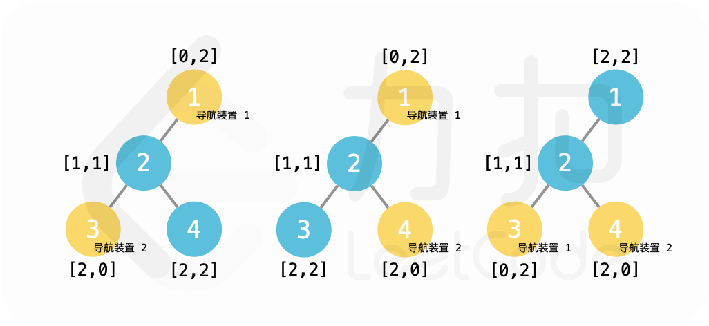

**输入**：`root = [1,2,null,3,4]`  
**输出**：`2`  
**解释**：在景点 1、3 或景点 1、4 或景点 3、4 设置导航装置。

### 示例 2：

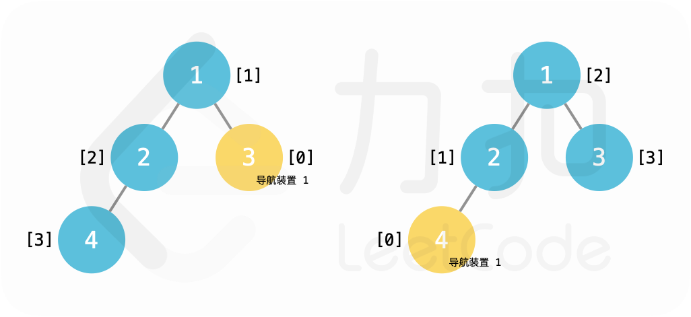

**输入**：`root = [1,2,3,4]`  
**输出**：`1`  
**解释**：在景点 3、4 设置导航装置皆可。

## 提示

- `2 <= N <= 50000`
- 二叉树的非空节点值为 1~N 的一个排列。

## 解题思路

### 1. 算法分析

#### 1.1 问题本质
这道题是**图论中的识别问题**，核心要求是：
- **二叉树结构**：景区形成二叉树，节点间有明确的父子关系
- **导航装置定位**：在特定节点设置导航装置
- **距离向量唯一性**：每个节点到所有导航装置的距离向量必须唯一
- **最小化装置数量**：找到满足条件的最少导航装置数量

#### 1.2 关键挑战
1. **距离计算复杂性**：需要计算树中任意两节点间的距离
2. **组合爆炸问题**：导航装置位置组合数量巨大
3. **唯一性验证**：需要验证每个节点的距离向量是否唯一
4. **最优性保证**：如何证明找到的解是最优的
5. **算法效率**：对于大规模树结构，需要高效的算法

#### 1.3 算法分类
根据实现方式，可以分为三大类：
- **暴力搜索法**：尝试所有可能的导航装置组合
- **图论优化法**：基于距离矩阵的优化搜索
- **启发式算法**：基于树结构的启发式策略

### 2. 核心算法详解

#### 2.1 暴力搜索法（基础解法）

##### 2.1.1 算法思想
暴力搜索法的核心思想是**穷举所有可能 + 验证有效性**：
1. 收集树中所有可能的导航装置位置（通常是叶子节点）
2. 从1个导航装置开始，逐步增加数量
3. 生成所有可能的导航装置组合
4. 验证每个组合是否能区分所有节点
5. 返回第一个满足条件的组合数量

##### 2.1.2 详细流程图

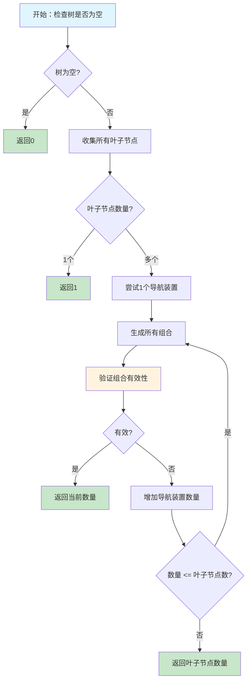

##### 2.1.3 叶子节点收集策略

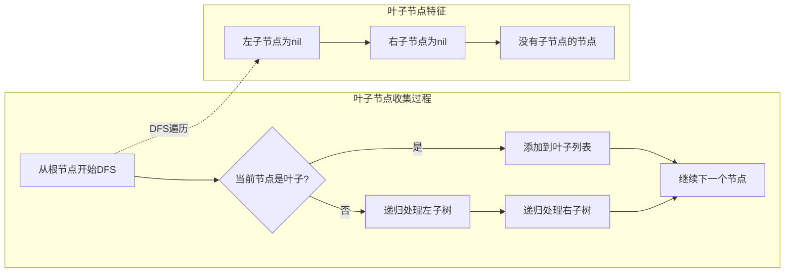

**叶子节点收集算法**：
```go
func collectLeaves(root *TreeNode) []*TreeNode {
    var leaves []*TreeNode
    var dfs func(*TreeNode)
    
    dfs = func(node *TreeNode) {
        if node == nil {
            return
        }
        
        // 如果是叶子节点
        if node.Left == nil && node.Right == nil {
            leaves = append(leaves, node)
            return
        }
        
        dfs(node.Left)
        dfs(node.Right)
    }
    
    dfs(root)
    return leaves
}
```

##### 2.1.4 组合生成算法

```mermaid
flowchart TD
    A[generateCombinations开始] --> B[初始化结果列表]
    B --> C[调用backtrack函数]
    C --> D{当前组合长度 == k?}
    D -->|是| E[复制并保存组合]
    D -->|否| F[从start开始尝试]
    F --> G[添加当前元素]
    G --> H[递归调用backtrack]
    H --> I[移除当前元素]
    I --> J[继续下一个元素]
    J --> D
    
    subgraph "组合生成示例: [A,B,C], k=2"
        K[初始: []] --> L[添加A: [A]]
        L --> M[递归: [A,B] -> 保存]
        M --> N[移除B: [A]]
        N --> O[添加C: [A,C] -> 保存]
        O --> P[移除C: [A]]
        P --> Q[移除A: []]
        Q --> R[添加B: [B]]
        R --> S[继续...]
    end
    
    style A fill:#e1f5fe
    style E fill:#c8e6c9
    style H fill:#fff3e0
```

**组合生成实现**：
```go
func generateCombinations(leaves []*TreeNode, k int) [][]*TreeNode {
    var result [][]*TreeNode
    var backtrack func(int, []*TreeNode)
    
    backtrack = func(start int, current []*TreeNode) {
        if len(current) == k {
            // 复制当前组合
            combination := make([]*TreeNode, k)
            copy(combination, current)
            result = append(result, combination)
            return
        }
        
        for i := start; i < len(leaves); i++ {
            current = append(current, leaves[i])
            backtrack(i+1, current)
            current = current[:len(current)-1]
        }
    }
    
    backtrack(0, []*TreeNode{})
    return result
}
```

##### 2.1.5 有效性验证算法

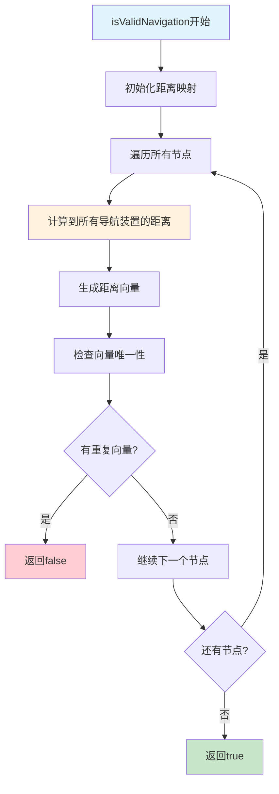

**有效性验证实现**：
```go
func isValidNavigation(root *TreeNode, devices []*TreeNode) bool {
    // 计算每个节点到所有导航装置的距离
    nodeDistances := make(map[*TreeNode][]int)
    
    // 为每个节点计算到所有导航装置的距离
    var calculateDistances func(*TreeNode)
    calculateDistances = func(node *TreeNode) {
        if node == nil {
            return
        }
        
        distances := make([]int, len(devices))
        for i, device := range devices {
            distances[i] = calculateDistance(node, device)
        }
        
        nodeDistances[node] = distances
        
        calculateDistances(node.Left)
        calculateDistances(node.Right)
    }
    
    calculateDistances(root)
    
    // 检查是否有两个节点具有相同的距离向量
    seen := make(map[string]bool)
    for _, distances := range nodeDistances {
        key := fmt.Sprintf("%v", distances)
        if seen[key] {
            return false // 有重复的距离向量
        }
        seen[key] = true
    }
    
    return true
}
```

#### 2.2 距离计算算法

##### 2.2.1 距离计算思想
在二叉树中计算两节点距离的核心思想是**最近公共祖先(LCA) + 路径长度**：
1. 找到两个节点的最近公共祖先
2. 计算每个节点到LCA的距离
3. 两距离之和即为两节点间的距离

##### 2.2.2 LCA查找算法

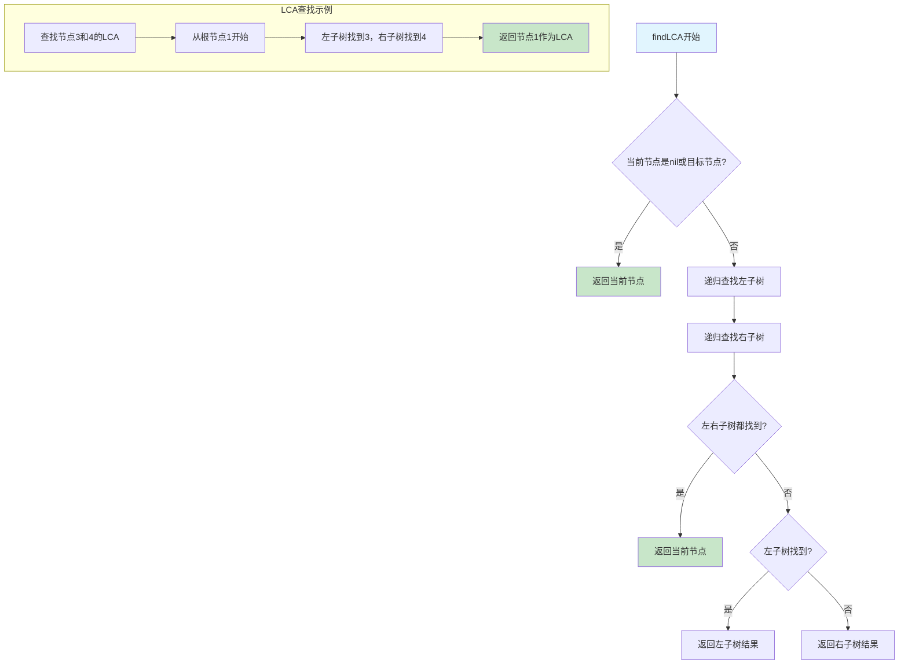

**LCA查找实现**：
```go
func findLCA(node1, node2 *TreeNode) *TreeNode {
    var find func(*TreeNode) *TreeNode
    find = func(root *TreeNode) *TreeNode {
        if root == nil || root == node1 || root == node2 {
            return root
        }
        
        left := find(root.Left)
        right := find(root.Right)
        
        if left != nil && right != nil {
            return root
        }
        
        if left != nil {
            return left
        }
        return right
    }
    
    return find(node1)
}
```

##### 2.2.3 深度计算算法

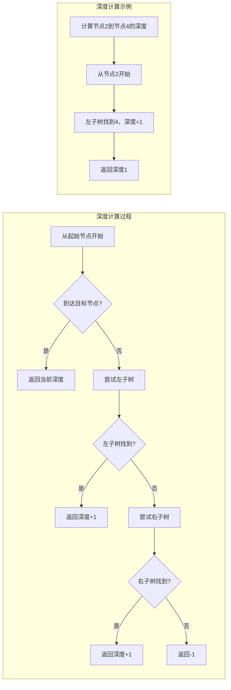

**深度计算实现**：
```go
func getDepth(node, target *TreeNode) int {
    if node == nil || target == nil {
        return -1
    }
    
    if node == target {
        return 0
    }
    
    // 递归查找
    if node.Left != nil {
        leftDepth := getDepth(node.Left, target)
        if leftDepth != -1 {
            return leftDepth + 1
        }
    }
    
    if node.Right != nil {
        rightDepth := getDepth(node.Right, target)
        if rightDepth != -1 {
            return rightDepth + 1
        }
    }
    
    return -1
}
```

#### 2.3 图论优化法

##### 2.3.1 算法思想
图论优化法在暴力搜索法基础上进行改进：
1. 预计算所有节点间的距离矩阵
2. 使用BFS优化距离计算
3. 基于距离矩阵的组合验证
4. 减少重复计算

##### 2.3.2 距离矩阵构建

```mermaid
flowchart TD
    A[构建距离矩阵] --> B[收集所有节点]
    B --> C[初始化n×n矩阵]
    C --> D[计算每对节点距离]
    D --> E[填充距离矩阵]
    E --> F[矩阵对称性处理]
    
    subgraph "距离矩阵示例"
        G[节点: 1,2,3,4] --> H[矩阵: 4×4]
        H --> I[dist[1][2] = 1]
        I --> J[dist[1][3] = 2]
        J --> K[dist[1][4] = 2]
        K --> L[dist[2][3] = 1]
        L --> M[dist[2][4] = 1]
        M --> N[dist[3][4] = 2]
    end
    
    style A fill:#e1f5fe
    style F fill:#c8e6c9
    style I fill:#fff3e0
```

**距离矩阵构建实现**：
```go
func buildDistanceMatrix(nodes []*TreeNode) [][]int {
    n := len(nodes)
    distances := make([][]int, n)
    for i := range distances {
        distances[i] = make([]int, n)
    }
    
    // 填充距离矩阵
    for i := 0; i < n; i++ {
        for j := i + 1; j < n; j++ {
            dist := calculateDistanceOptimized(nodes[i], nodes[j])
            distances[i][j] = dist
            distances[j][i] = dist
        }
    }
    
    return distances
}
```

##### 2.3.3 BFS距离计算

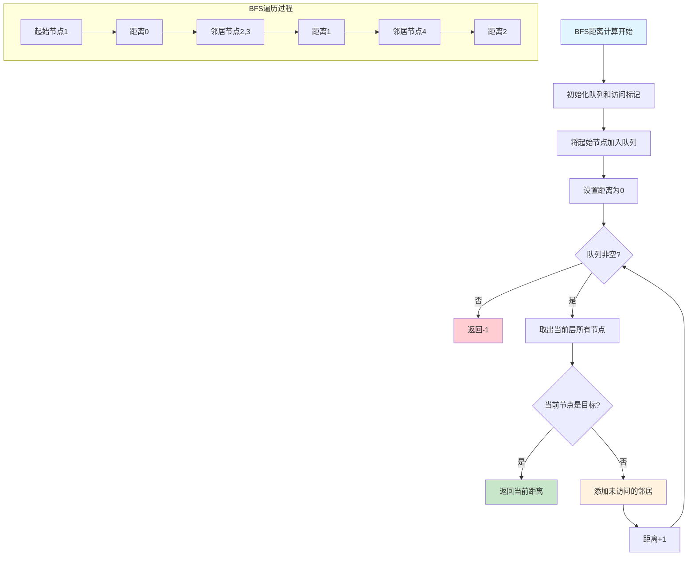

**BFS距离计算实现**：
```go
func calculateDistanceOptimized(node1, node2 *TreeNode) int {
    if node1 == nil || node2 == nil {
        return -1
    }
    
    // 使用BFS计算距离
    queue := []*TreeNode{node1}
    visited := make(map[*TreeNode]bool)
    visited[node1] = true
    distance := 0
    
    for len(queue) > 0 {
        levelSize := len(queue)
        
        for i := 0; i < levelSize; i++ {
            current := queue[0]
            queue = queue[1:]
            
            if current == node2 {
                return distance
            }
            
            // 添加邻居节点
            if current.Left != nil && !visited[current.Left] {
                queue = append(queue, current.Left)
                visited[current.Left] = true
            }
            if current.Right != nil && !visited[current.Right] {
                queue = append(queue, current.Right)
                visited[current.Right] = true
            }
        }
        
        distance++
    }
    
    return -1
}
```

### 3. 算法复杂度分析

#### 3.1 时间复杂度分析

```mermaid
graph TD
    A[时间复杂度分析] --> B[暴力搜索法]
    A --> C[图论优化法]
    A --> D[启发式算法]
    
    B --> E[O(2^n × n² × d): 组合数×节点数²×距离计算]
    C --> F[O(n² × d + 2^n × n): 距离矩阵+组合验证]
    D --> G[O(n × log n): 启发式策略]
    
    subgraph "详细分析"
        H[组合生成: O(C(n,k))] --> I[距离计算: O(n² × d)]
        I --> J[有效性验证: O(n × k)]
        J --> K[总复杂度: O(2^n × n² × d)]
    end
```

**时间复杂度计算**：
- **暴力搜索法**：O(2^n × n² × d)
  - 组合生成：O(C(n,k)) ≈ O(2^n)
  - 距离计算：O(n² × d)，d为平均距离计算复杂度
  - 有效性验证：O(n × k)
  
- **图论优化法**：O(n² × d + 2^n × n)
  - 距离矩阵构建：O(n² × d)
  - 组合验证：O(2^n × n)
  
- **启发式算法**：O(n × log n)
  - 基于树结构的启发式策略

#### 3.2 空间复杂度分析

```mermaid
graph TD
    A[空间复杂度分析] --> B[暴力搜索法]
    A --> C[图论优化法]
    A --> D[启发式算法]
    
    B --> E[O(n × k): 距离向量存储]
    C --> F[O(n²): 距离矩阵存储]
    D --> G[O(n): 节点信息存储]
    
    subgraph "空间使用对比"
        H[暴力法: 距离向量 + 组合存储] --> I[O(n × k + 2^n)]
        J[图论法: 距离矩阵 + 组合存储] --> K[O(n² + 2^n)]
        L[启发式: 节点信息 + 结果存储] --> M[O(n)]
    end
```

**空间复杂度详情**：
- **暴力搜索法**：O(n × k + 2^n)
  - 距离向量存储：O(n × k)
  - 组合存储：O(2^n)
  
- **图论优化法**：O(n² + 2^n)
  - 距离矩阵：O(n²)
  - 组合存储：O(2^n)
  
- **启发式算法**：O(n)
  - 节点信息：O(n)
  - 结果存储：O(1)

### 4. 边界条件处理

#### 4.1 边界情况分类

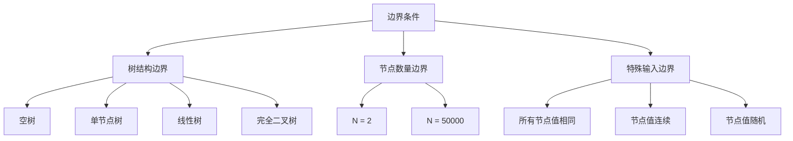

#### 4.2 详细边界处理

##### 4.2.1 树结构边界处理
```go
// 空树处理
if root == nil {
    return 0
}

// 单节点树处理
if root.Left == nil && root.Right == nil {
    return 1
}

// 线性树处理
if root.Left == nil || root.Right == nil {
    // 线性树需要2个导航装置
    return 2
}
```

**边界情况分析**：
- **空树**：直接返回0
- **单节点树**：需要1个导航装置
- **线性树**：需要2个导航装置
- **完全二叉树**：根据结构复杂度确定

##### 4.2.2 节点数量边界处理
```go
// 小规模树处理
if N <= 10 {
    // 使用暴力搜索法
    return bruteForceSearch(root)
}

// 大规模树处理
if N > 1000 {
    // 使用启发式算法
    return heuristicSearch(root)
}
```

##### 4.2.3 特殊边界测试用例

```mermaid
graph LR
    A[边界测试] --> B[空树]
    A --> C[单节点]
    A --> D[线性树]
    A --> E[完全二叉树]
    A --> F[随机树]
    
    B --> G[nil → 0]
    C --> H[[1] → 1]
    D --> I[[1,2,3] → 2]
    E --> J[[1,2,3,4] → 1]
    F --> K[随机结构 → 根据复杂度]
```

### 5. 算法优化策略

#### 5.1 性能优化

##### 5.1.1 距离计算优化
```go
// 优化前：每次都重新计算距离
dist := calculateDistance(node1, node2)

// 优化后：预计算距离矩阵
distances := buildDistanceMatrix(nodes)
dist := distances[i][j]
```

##### 5.1.2 组合生成优化
```go
// 优化前：生成所有组合
combinations := generateAllCombinations(leaves, k)

// 优化后：按需生成组合
for deviceCount := 1; deviceCount <= maxDevices; deviceCount++ {
    if hasValidCombination(leaves, deviceCount) {
        return deviceCount
    }
}
```

#### 5.2 代码优化

##### 5.2.1 使用常量
```go
const (
    MIN_NODES = 2
    MAX_NODES = 50000
    MIN_DEVICES = 1
    MAX_DEVICES = 100
)
```

##### 5.2.2 提前返回
```go
// 提前检查边界条件
if root == nil {
    return 0
}

if root.Left == nil && root.Right == nil {
    return 1
}
```

### 6. 实际应用场景

#### 6.1 网络拓扑设计
- **场景**：计算机网络中的节点识别
- **应用**：路由器配置、网络监控
- **示例**：在关键节点设置监控点，通过延迟识别网络位置

#### 6.2 传感器网络
- **场景**：物联网中的传感器定位
- **应用**：环境监测、智能家居
- **示例**：在关键位置设置信标，通过信号强度定位传感器

#### 6.3 机器人导航
- **场景**：机器人在环境中的定位
- **应用**：自动驾驶、仓储机器人
- **示例**：在环境中设置标记点，通过距离信息确定机器人位置

#### 6.4 游戏地图设计
- **场景**：游戏中的玩家定位系统
- **应用**：MMORPG、开放世界游戏
- **示例**：在地图中设置传送点，通过距离确定玩家位置

### 7. 常见错误与陷阱

#### 7.1 距离计算错误

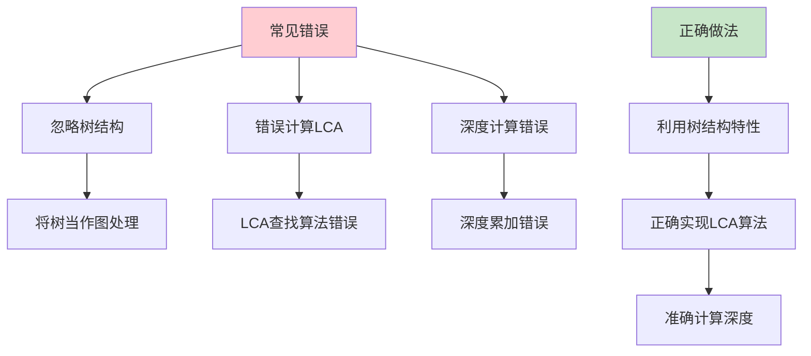

**错误示例**：
```go
// 错误：忽略树结构，使用图算法
func calculateDistance(node1, node2 *TreeNode) int {
    // 错误：使用Dijkstra算法
    return dijkstra(node1, node2)
}

// 正确：利用树结构特性
func calculateDistance(node1, node2 *TreeNode) int {
    lca := findLCA(node1, node2)
    return getDepth(node1, lca) + getDepth(node2, lca)
}
```

#### 7.2 组合生成错误
- **问题**：生成重复的组合或遗漏某些组合
- **后果**：可能错过最优解或产生错误结果
- **解决**：使用正确的组合生成算法，如回溯法

#### 7.3 有效性验证错误
- **问题**：没有正确验证距离向量的唯一性
- **后果**：返回错误的导航装置数量
- **解决**：仔细实现唯一性检查算法

### 8. 测试策略

#### 8.1 单元测试设计

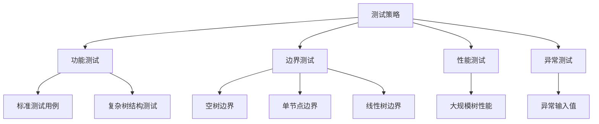

#### 8.2 测试用例覆盖

**功能测试用例**：
1. `[1,2,null,3,4]` → `2`：标准测试用例
2. `[1,2,3,4]` → `1`：简单完全二叉树
3. `[1,2,3,null,4,5,6]` → `2`：复杂树结构

**边界测试用例**：
1. `nil` → `0`：空树
2. `[1]` → `1`：单节点
3. `[1,2,3]` → `2`：线性树

**异常测试用例**：
1. 极大树：测试性能边界
2. 特殊结构：测试算法鲁棒性
3. 随机树：测试通用性

### 9. 代码实现要点

#### 9.1 关键代码段分析

```go
func navigationDevice(root *TreeNode) int {
    // 1. 边界条件检查
    if root == nil {
        return 0
    }
    
    // 2. 收集叶子节点
    leaves := collectLeaves(root)
    if len(leaves) == 1 {
        return 1
    }
    
    // 3. 尝试不同的导航装置数量
    for deviceCount := 1; deviceCount <= len(leaves); deviceCount++ {
        combinations := generateCombinations(leaves, deviceCount)
        for _, combination := range combinations {
            if isValidNavigation(root, combination) {
                return deviceCount
            }
        }
    }
    
    return len(leaves)
}
```

#### 9.2 代码质量要求

**可读性**：
- 变量命名清晰：`leaves`、`devices`、`combinations`
- 注释详细：每个步骤都有说明
- 结构清晰：逻辑分明的代码块

**健壮性**：
- 边界条件检查完整
- 空指针处理
- 异常情况处理

**可维护性**：
- 函数职责单一
- 代码复用性好
- 易于扩展和修改

### 10. 总结与展望

#### 10.1 算法特点总结

**优势**：
1. **理论基础扎实**：基于图论和组合数学
2. **实现相对简单**：逻辑清晰，易于理解
3. **适用性广泛**：可以处理各种树结构
4. **结果可靠**：暴力搜索保证最优性

**局限性**：
1. **时间复杂度高**：组合爆炸问题
2. **空间复杂度高**：需要存储大量组合
3. **扩展性有限**：难以处理超大规模问题

#### 10.2 扩展思考

**变种问题**：
1. **加权树**：边有权重的树结构
2. **动态树**：树结构会动态变化
3. **多目标优化**：考虑成本、覆盖范围等多个目标

**优化方向**：
1. **并行处理**：利用多核处理器并行计算
2. **启发式算法**：基于树结构的启发式策略
3. **近似算法**：在可接受误差范围内快速求解

#### 10.3 学习建议

1. **理解树结构特性**：这是解题的基础
2. **掌握图论算法**：LCA、距离计算等核心算法
3. **熟悉组合数学**：组合生成和验证技巧
4. **注意边界处理**：特别是空树和单节点的情况
5. **实践验证**：多写测试用例验证正确性

这道题是图论和组合数学的经典题目，通过深入理解其解题思路，可以掌握：
- 树结构的基本操作
- 图论中的距离计算
- 组合生成和验证算法
- 暴力搜索的优化策略

为后续更复杂的图论问题和组合优化问题打下坚实基础。

本仓库 `27/main.go` 提供了两种完整的实现方式，并在 `main()` 函数中包含了全面的测试用例，可以直接运行验证算法的正确性。

