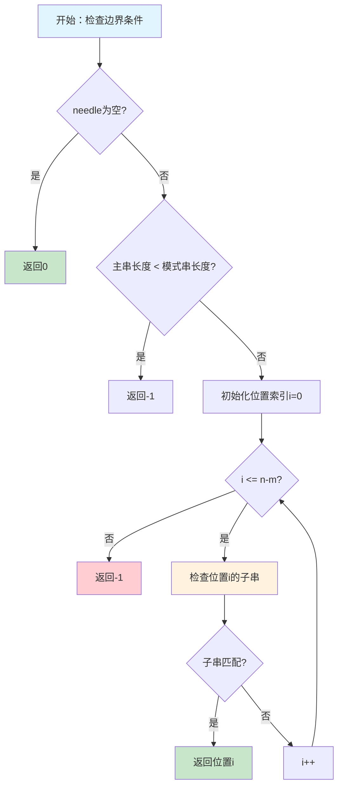
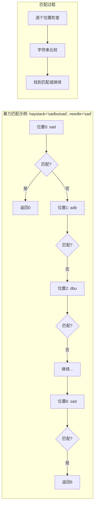
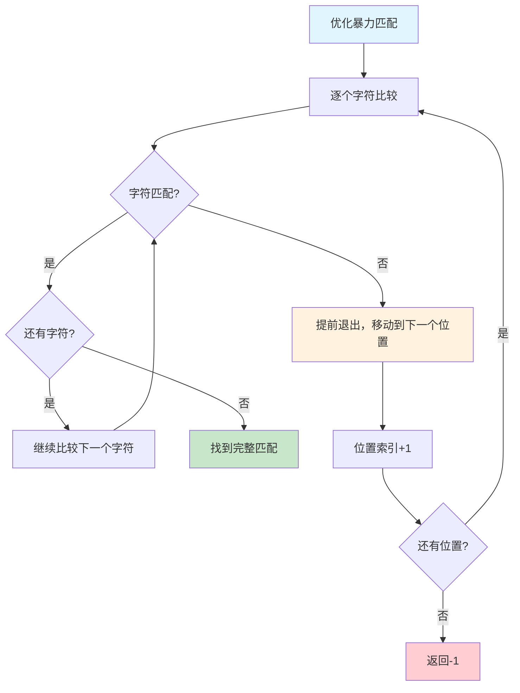
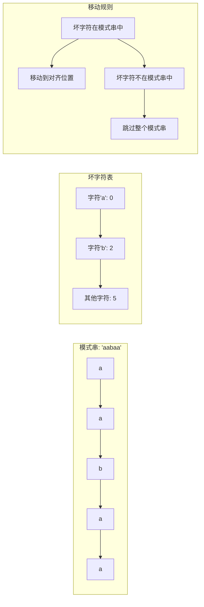
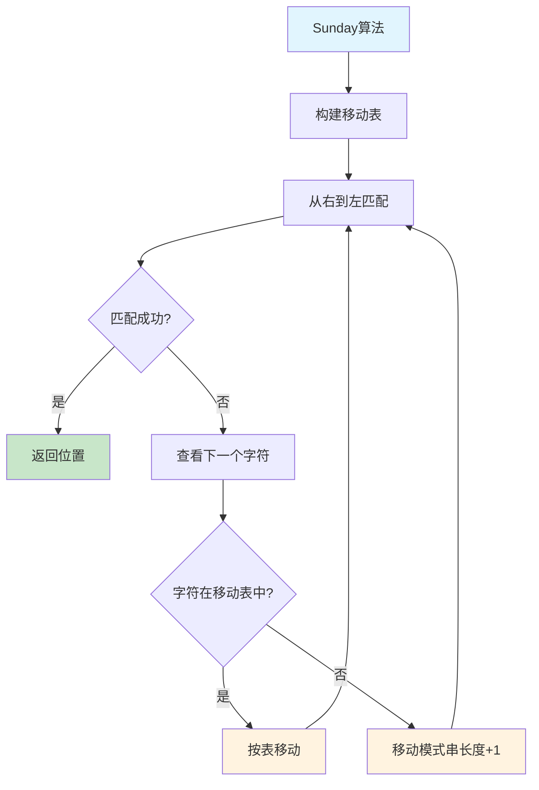
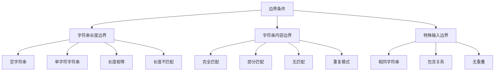
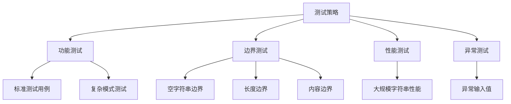

# 28. 找出字符串中第一个匹配项的下标

## 题目描述

给你两个字符串 `haystack` 和 `needle`，请你在 `haystack` 字符串中找出 `needle` 字符串的第一个匹配项的下标（下标从 0 开始）。如果 `needle` 不是 `haystack` 的一部分，则返回 `-1`。

## 示例

### 示例 1：

**输入**：`haystack = "sadbutsad"`, `needle = "sad"`  
**输出**：`0`  
**解释**：`"sad"` 在下标 0 和 6 处匹配。第一个匹配项的下标是 0，所以返回 0。

### 示例 2：

**输入**：`haystack = "leetcode"`, `needle = "leeto"`  
**输出**：`-1`  
**解释**：`"leeto"` 没有在 `"leetcode"` 中出现，所以返回 -1。

## 提示

- `1 <= haystack.length, needle.length <= 10^4`
- `haystack` 和 `needle` 仅由小写英文字符组成

## 解题思路

### 1. 算法分析

#### 1.1 问题本质
这道题是**字符串匹配问题**的核心，属于计算机科学中的经典问题：
- **输入**：主串（haystack）和模式串（needle）
- **输出**：模式串在主串中第一次出现的位置
- **约束**：如果不存在匹配，返回-1
- **特点**：要求找到第一个匹配项，不是所有匹配项

#### 1.2 关键挑战
1. **算法效率**：对于长字符串，需要高效的匹配算法
2. **边界处理**：空字符串、长度不匹配等特殊情况
3. **算法选择**：不同场景下选择最适合的算法
4. **实现复杂度**：平衡算法复杂度和代码可读性
5. **性能优化**：在实际应用中的性能表现

#### 1.3 算法分类
根据实现方式和复杂度，可以分为以下几类：
- **暴力匹配法**：简单直接，但效率较低
- **KMP算法**：利用部分匹配表优化
- **Boyer-Moore算法**：从右到左匹配，利用坏字符规则
- **Rabin-Karp算法**：使用哈希函数加速
- **Sunday算法**：结合多种启发式规则
- **内置函数法**：使用语言标准库

### 2. 核心算法详解

#### 2.1 暴力匹配法（基础解法）

##### 2.1.1 算法思想
暴力匹配法的核心思想是**逐个位置尝试匹配**：
1. 遍历主串中所有可能的起始位置
2. 对每个位置，检查从该位置开始的子串是否与模式串匹配
3. 一旦找到匹配，立即返回位置
4. 如果所有位置都不匹配，返回-1

##### 2.1.2 详细流程图



##### 2.1.3 匹配过程可视化



**暴力匹配实现**：
```go
func strStr(haystack string, needle string) int {
    if needle == "" {
        return 0
    }
    if len(haystack) < len(needle) {
        return -1
    }

    n := len(haystack)
    m := len(needle)

    // 遍历所有可能的起始位置
    for i := 0; i <= n-m; i++ {
        // 检查从位置i开始的子串是否匹配
        if haystack[i:i+m] == needle {
            return i
        }
    }

    return -1
}
```

##### 2.1.4 优化版本
在暴力匹配基础上，可以添加提前退出优化：



**优化暴力匹配实现**：
```go
func strStrOptimized(haystack string, needle string) int {
    if needle == "" {
        return 0
    }
    if len(haystack) < len(needle) {
        return -1
    }

    n := len(haystack)
    m := len(needle)

    // 遍历所有可能的起始位置
    for i := 0; i <= n-m; i++ {
        // 检查从位置i开始的子串是否匹配
        matched := true
        for j := 0; j < m; j++ {
            if haystack[i+j] != needle[j] {
                matched = false
                break  // 提前退出
            }
        }
        if matched {
            return i
        }
    }

    return -1
}
```

#### 2.2 KMP算法（Knuth-Morris-Pratt）

##### 2.2.1 算法思想
KMP算法的核心思想是**利用已经匹配的信息，避免重复比较**：
1. 构建模式串的部分匹配表（next数组）
2. 当匹配失败时，利用next数组快速移动模式串
3. 避免主串指针回退，提高匹配效率

##### 2.2.2 部分匹配表构建

```mermaid
flowchart TD
    A[构建next数组] --> B[初始化next[0] = -1]
    B --> C[设置i=0, j=-1]
    C --> D{i < m-1?}
    D -->|否| E[返回next数组]
    D -->|是| F{pattern[i] == pattern[j]?}
    F -->|是| G[i++, j++]
    G --> H{pattern[i] != pattern[j]?}
    H -->|是| I[next[i] = j]
    H -->|否| J[next[i] = next[j]]
    I --> K[继续循环]
    J --> K
    F -->|否| L[j = next[j]]
    L --> D
    K --> D
    
    style A fill:#e1f5fe
    style E fill:#c8e6c9
    style I fill:#fff3e0
    style J fill:#fff3e0
```

**next数组构建示例**：
```mermaid
graph LR
    subgraph "模式串: 'aabaa'"
        A[a] --> B[a] --> C[b] --> D[a] --> E[a]
    end
    
    subgraph "next数组构建过程"
        F[位置0: next[0] = -1] --> G[位置1: next[1] = 0]
        G --> H[位置2: next[2] = 1]
        H --> I[位置3: next[3] = 0]
        I --> J[位置4: next[4] = 1]
    end
    
    subgraph "next数组含义"
        K[next[i]表示] --> L[pattern[0...i-1]的]
        L --> M[最长相等前后缀长度]
    end
```

**next数组构建实现**：
```go
func buildNext(pattern string) []int {
    m := len(pattern)
    next := make([]int, m)
    next[0] = -1

    i, j := 0, -1
    for i < m-1 {
        if j == -1 || pattern[i] == pattern[j] {
            i++
            j++
            if pattern[i] != pattern[j] {
                next[i] = j
            } else {
                next[i] = next[j]
            }
        } else {
            j = next[j]
        }
    }

    return next
}
```

##### 2.2.3 KMP匹配过程

```mermaid
flowchart TD
    A[KMP匹配开始] --> B[初始化i=0, j=0]
    B --> C{i < n && j < m?}
    C -->|否| D{j == m?}
    D -->|是| E[返回i-m]
    D -->|否| F[返回-1]
    C -->|是| G{j == -1 || haystack[i] == needle[j]?}
    G -->|是| H[i++, j++]
    G -->|否| I[j = next[j]]
    H --> C
    I --> C
    
    style A fill:#e1f5fe
    style E fill:#c8e6c9
    style F fill:#ffcdd2
    style H fill:#fff3e0
```

**KMP算法实现**：
```go
func strStrKMP(haystack string, needle string) int {
    if needle == "" {
        return 0
    }
    if len(haystack) < len(needle) {
        return -1
    }

    // 构建部分匹配表（next数组）
    next := buildNext(needle)

    n := len(haystack)
    m := len(needle)
    i, j := 0, 0

    for i < n && j < m {
        if j == -1 || haystack[i] == needle[j] {
            i++
            j++
        } else {
            j = next[j]
        }
    }

    if j == m {
        return i - m
    }
    return -1
}
```

#### 2.3 Boyer-Moore算法

##### 2.3.1 算法思想
Boyer-Moore算法的核心思想是**从右到左匹配，利用坏字符规则快速移动**：
1. 从模式串的右端开始匹配
2. 当不匹配时，利用坏字符规则计算移动距离
3. 可以跳过多个位置，提高匹配效率

##### 2.3.2 坏字符规则

```mermaid
flowchart TD
    A[坏字符规则] --> B[找到不匹配的字符]
    B --> C[在模式串中查找该字符]
    C --> D{字符在模式串中?}
    D -->|是| E[计算移动距离]
    D -->|否| F[移动模式串长度]
    E --> G[移动距离 = j - badChar[c]]
    F --> H[移动距离 = 模式串长度]
    G --> I[应用移动]
    H --> I
    
    style A fill:#e1f5fe
    style I fill:#c8e6c9
    style E fill:#fff3e0
    style F fill:#fff3e0
```

**坏字符表构建示例**：


**坏字符表构建实现**：
```go
func buildBadCharTable(pattern string) []int {
    table := make([]int, 256)
    m := len(pattern)

    // 初始化所有字符的移动距离为模式长度
    for i := range table {
        table[i] = m
    }

    // 设置模式中每个字符的移动距离
    for i := 0; i < m-1; i++ {
        table[int(pattern[i])] = m - 1 - i
    }

    return table
}
```

##### 2.3.3 Boyer-Moore匹配过程

```mermaid
flowchart TD
    A[Boyer-Moore开始] --> B[初始化i = m-1]
    B --> C{i < n?}
    C -->|否| D[返回-1]
    C -->|是| E[设置j = m-1, k = i]
    E --> F{j >= 0 && haystack[k] == needle[j]?}
    F -->|是| G[k--, j--]
    G --> F
    F -->|否| H{j == -1?}
    H -->|是| I[返回k+1]
    H -->|否| J[计算移动距离]
    I --> K[找到匹配]
    J --> L[移动模式串]
    L --> C
    
    style A fill:#e1f5fe
    style I fill:#c8e6c9
    style D fill:#ffcdd2
    style J fill:#fff3e0
```

**Boyer-Moore算法实现**：
```go
func strStrBoyerMoore(haystack string, needle string) int {
    if needle == "" {
        return 0
    }
    if len(haystack) < len(needle) {
        return -1
    }

    // 构建坏字符规则表
    badChar := buildBadCharTable(needle)

    n := len(haystack)
    m := len(needle)
    i := m - 1

    for i < n {
        j := m - 1
        k := i

        // 从右到左匹配
        for j >= 0 && haystack[k] == needle[j] {
            k--
            j--
        }

        if j == -1 {
            return k + 1
        }

        // 使用坏字符规则移动
        shift := j - badChar[int(haystack[k])]
        if shift < 1 {
            shift = 1
        }
        i += shift
    }

    return -1
}
```

#### 2.4 Rabin-Karp算法

##### 2.4.1 算法思想
Rabin-Karp算法的核心思想是**使用哈希函数加速字符串比较**：
1. 计算模式串的哈希值
2. 计算主串中每个滑动窗口的哈希值
3. 哈希值匹配时进行字符串比较
4. 使用滚动哈希避免重复计算

##### 2.4.2 滚动哈希计算

```mermaid
flowchart TD
    A[滚动哈希] --> B[计算初始窗口哈希值]
    B --> C[移除最左边字符]
    C --> D[添加最右边字符]
    D --> E[更新哈希值]
    E --> F{还有窗口?}
    F -->|是| C
    F -->|否| G[完成所有窗口]
    
    subgraph "哈希计算示例"
        H[窗口'abcd'] --> I[哈希值 = a*26³ + b*26² + c*26¹ + d*26⁰]
        I --> J[移除'a', 添加'e']
        J --> K[新哈希值 = (原值 - a*26³)*26 + e*26⁰]
    end
    
    style A fill:#e1f5fe
    style G fill:#c8e6c9
    style I fill:#fff3e0
    style K fill:#fff3e0
```

**滚动哈希实现**：
```go
func strStrRabinKarp(haystack string, needle string) int {
    if needle == "" {
        return 0
    }
    if len(haystack) < len(needle) {
        return -1
    }

    n := len(haystack)
    m := len(needle)

    // 计算needle的哈希值
    needleHash := hash(needle)
    windowHash := hash(haystack[:m])

    // 如果第一个窗口匹配，直接返回
    if windowHash == needleHash && haystack[:m] == needle {
        return 0
    }

    // 滚动哈希
    power := 1
    for i := 0; i < m-1; i++ {
        power = (power * 26) % 1000000007
    }

    for i := 1; i <= n-m; i++ {
        // 移除最左边的字符，添加最右边的字符
        windowHash = (windowHash - int(haystack[i-1])*power) % 1000000007
        windowHash = (windowHash*26 + int(haystack[i+m-1])) % 1000000007

        if windowHash < 0 {
            windowHash += 1000000007
        }

        // 哈希值匹配时，进行字符串比较
        if windowHash == needleHash && haystack[i:i+m] == needle {
            return i
        }
    }

    return -1
}
```

#### 2.5 Sunday算法

##### 2.5.1 算法思想
Sunday算法是Boyer-Moore算法的改进版本，核心思想是**利用好后缀规则和坏字符规则**：
1. 构建字符移动表
2. 从右到左匹配
3. 利用多种启发式规则优化移动

##### 2.5.2 Sunday移动规则



**Sunday算法实现**：
```go
func strStrSunday(haystack string, needle string) int {
    if needle == "" {
        return 0
    }
    if len(haystack) < len(needle) {
        return -1
    }

    // 构建Sunday算法的移动表
    shift := buildSundayShift(needle)

    n := len(haystack)
    m := len(needle)
    i := 0

    for i <= n-m {
        // 检查当前窗口是否匹配
        if haystack[i:i+m] == needle {
            return i
        }

        // 如果已经到达末尾，无法继续移动
        if i+m >= n {
            break
        }

        // 使用Sunday规则移动
        nextChar := haystack[i+m]
        if s, exists := shift[nextChar]; exists {
            i += s
        } else {
            i += m + 1
        }
    }

    return -1
}
```

### 3. 算法复杂度分析

#### 3.1 时间复杂度分析

```mermaid
graph TD
    A[时间复杂度分析] --> B[暴力匹配法]
    A --> C[KMP算法]
    A --> D[Boyer-Moore算法]
    A --> E[Rabin-Karp算法]
    A --> F[Sunday算法]
    
    B --> G[O(n×m): 最坏情况]
    C --> H[O(n+m): 线性时间]
    D --> I[O(n/m): 最好情况]
    E --> J[O(n+m): 平均情况]
    F --> K[O(n/m): 最好情况]
    
    subgraph "详细分析"
        L[暴力法: 每个位置比较m个字符] --> M[O(n×m)]
        N[KMP: 主串指针不后退] --> O[O(n+m)]
        P[BM: 坏字符规则快速移动] --> Q[O(n/m)最好]
        R[RK: 哈希计算+字符串比较] --> S[O(n+m)]
    end
```

**时间复杂度详情**：
- **暴力匹配法**：O(n×m)
  - 最坏情况：每个位置都需要比较m个字符
  - 平均情况：O(n×m/2)
  
- **KMP算法**：O(n+m)
  - 主串指针不后退，只前进
  - 模式串指针利用next数组快速移动
  
- **Boyer-Moore算法**：O(n/m) ~ O(n×m)
  - 最好情况：O(n/m)，坏字符规则快速移动
  - 最坏情况：O(n×m)，所有字符都匹配
  
- **Rabin-Karp算法**：O(n+m)
  - 哈希计算：O(m)
  - 滚动哈希：O(n)
  - 哈希冲突时需要字符串比较
  
- **Sunday算法**：O(n/m) ~ O(n×m)
  - 最好情况：O(n/m)
  - 最坏情况：O(n×m)

#### 3.2 空间复杂度分析

```mermaid
graph TD
    A[空间复杂度分析] --> B[暴力匹配法]
    A --> C[KMP算法]
    A --> D[Boyer-Moore算法]
    A --> E[Rabin-Karp算法]
    A --> F[Sunday算法]
    
    B --> G[O(1): 常数空间]
    C --> H[O(m): next数组]
    D --> I[O(k): 字符表]
    E --> J[O(1): 滚动哈希]
    F --> K[O(k): 移动表]
    
    subgraph "空间使用对比"
        L[暴力法: 无需额外空间] --> M[O(1)]
        N[KMP: 需要存储next数组] --> O[O(m)]
        P[BM: 需要存储字符表] --> Q[O(k), k为字符集大小]
        R[RK: 滚动哈希变量] --> S[O(1)]
        T[Sunday: 需要存储移动表] --> U[O(k)]
    end
```

**空间复杂度详情**：
- **暴力匹配法**：O(1)
  - 只需要几个变量存储索引
  
- **KMP算法**：O(m)
  - 需要存储next数组，长度为m
  
- **Boyer-Moore算法**：O(k)
  - 需要存储坏字符表，k为字符集大小（通常256）
  
- **Rabin-Karp算法**：O(1)
  - 只需要几个变量存储哈希值
  
- **Sunday算法**：O(k)
  - 需要存储移动表，k为字符集大小

### 4. 边界条件处理

#### 4.1 边界情况分类



#### 4.2 详细边界处理

##### 4.2.1 字符串长度边界处理
```go
// 空字符串处理
if needle == "" {
    return 0  // 空字符串在任何位置都匹配
}

// 长度不匹配处理
if len(haystack) < len(needle) {
    return -1  // 主串长度小于模式串，无法匹配
}

// 长度相等处理
if len(haystack) == len(needle) {
    if haystack == needle {
        return 0
    }
    return -1
}
```

**边界情况分析**：
- **空字符串**：空字符串在任何位置都匹配，返回0
- **长度不匹配**：主串长度小于模式串时，直接返回-1
- **长度相等**：可以快速判断是否完全匹配

##### 4.2.2 字符串内容边界处理
```go
// 完全匹配处理
if haystack == needle {
    return 0
}

// 包含关系处理
if strings.Contains(haystack, needle) {
    // 找到第一个匹配位置
    return strings.Index(haystack, needle)
}
```

##### 4.2.3 特殊边界测试用例

```mermaid
graph LR
    A[边界测试] --> B[空字符串]
    A --> C[单字符]
    A --> D[完全匹配]
    A --> E[无匹配]
    A --> F[重复模式]
    
    B --> G["" in "hello" → 0]
    C --> H["a" in "abc" → 0]
    D --> I["abc" in "abc" → 0]
    E --> J["xyz" in "abc" → -1]
    F --> K["aa" in "aaaa" → 0]
```

### 5. 算法优化策略

#### 5.1 性能优化

##### 5.1.1 提前退出优化
```go
// 优化前：总是比较完整子串
if haystack[i:i+m] == needle {
    return i
}

// 优化后：逐个字符比较，提前退出
matched := true
for j := 0; j < m; j++ {
    if haystack[i+j] != needle[j] {
        matched = false
        break  // 提前退出
    }
}
if matched {
    return i
}
```

##### 5.1.2 哈希优化
```go
// 优化前：每次都重新计算哈希
for i := 1; i <= n-m; i++ {
    windowHash := hash(haystack[i:i+m])
    if windowHash == needleHash {
        // 检查字符串匹配
    }
}

// 优化后：滚动哈希
for i := 1; i <= n-m; i++ {
    windowHash = (windowHash - int(haystack[i-1])*power) % mod
    windowHash = (windowHash*26 + int(haystack[i+m-1])) % mod
}
```

#### 5.2 代码优化

##### 5.2.1 使用常量
```go
const (
    MOD = 1000000007
    BASE = 26
    NOT_FOUND = -1
)
```

##### 5.2.2 提前返回
```go
// 提前检查边界条件
if needle == "" {
    return 0
}

if len(haystack) < len(needle) {
    return -1
}

// 快速路径：完全匹配
if haystack == needle {
    return 0
}
```

### 6. 实际应用场景

#### 6.1 文本编辑器
- **场景**：在文档中查找特定文本
- **应用**：Word、Notepad++、VS Code等
- **算法选择**：通常使用Boyer-Moore或KMP算法

#### 6.2 搜索引擎
- **场景**：在网页内容中搜索关键词
- **应用**：Google、百度、Bing等
- **算法选择**：结合索引和字符串匹配算法

#### 6.3 生物信息学
- **场景**：DNA序列匹配
- **应用**：基因测序、蛋白质序列分析
- **算法选择**：BLAST、Smith-Waterman等

#### 6.4 网络安全
- **场景**：网络流量中的恶意代码检测
- **应用**：防火墙、入侵检测系统
- **算法选择**：Aho-Corasick、多模式匹配

#### 6.5 编译器
- **场景**：词法分析中的关键字识别
- **应用**：C++、Java、Python等编译器
- **算法选择**：DFA、NFA等自动机

### 7. 常见错误与陷阱

#### 7.1 边界条件错误

```mermaid
graph TD
    A[常见错误] --> B[忽略空字符串]
    A --> C[长度检查错误]
    A --> D[索引越界]
    
    B --> E[空字符串应该返回0]
    C --> F[主串长度小于模式串时应该返回-1]
    D --> G[访问haystack[i:i+m]时可能越界]
    
    H[正确做法] --> I[仔细检查所有边界条件]
    I --> J[使用安全的字符串切片]
    J --> K[测试各种边界情况]
    
    style A fill:#ffcdd2
    style H fill:#c8e6c9
```

**错误示例**：
```go
// 错误：没有检查空字符串
func strStr(haystack string, needle string) int {
    n := len(haystack)
    m := len(needle)
    
    for i := 0; i <= n-m; i++ {
        if haystack[i:i+m] == needle {
            return i
        }
    }
    return -1
}

// 正确：检查所有边界条件
func strStr(haystack string, needle string) int {
    if needle == "" {
        return 0
    }
    if len(haystack) < len(needle) {
        return -1
    }
    // ... 其余逻辑
}
```

#### 7.2 算法选择错误
- **问题**：在简单场景下使用复杂算法
- **后果**：增加代码复杂度，可能降低性能
- **解决**：根据实际需求选择合适的算法

#### 7.3 哈希冲突处理错误
- **问题**：在Rabin-Karp算法中忽略哈希冲突
- **后果**：可能返回错误结果
- **解决**：哈希值匹配后必须进行字符串比较

### 8. 测试策略

#### 8.1 单元测试设计



#### 8.2 测试用例覆盖

**功能测试用例**：
1. `"sadbutsad"` 中找 `"sad"` → `0`
2. `"leetcode"` 中找 `"leeto"` → `-1`
3. `"hello world"` 中找 `"world"` → `6`

**边界测试用例**：
1. `""` 中找 `""` → `0`
2. `"a"` 中找 `"a"` → `0`
3. `"abc"` 中找 `"abcd"` → `-1`

**性能测试用例**：
1. 长字符串中的短模式
2. 短字符串中的长模式
3. 重复模式匹配

### 9. 代码实现要点

#### 9.1 关键代码段分析

```go
func strStr(haystack string, needle string) int {
    // 1. 边界条件检查
    if needle == "" {
        return 0
    }
    if len(haystack) < len(needle) {
        return -1
    }
    
    // 2. 主循环：遍历所有可能位置
    n := len(haystack)
    m := len(needle)
    
    for i := 0; i <= n-m; i++ {
        // 3. 检查当前位置的子串
        if haystack[i:i+m] == needle {
            return i
        }
    }
    
    // 4. 未找到匹配
    return -1
}
```

#### 9.2 代码质量要求

**可读性**：
- 变量命名清晰：`haystack`、`needle`、`n`、`m`
- 注释详细：每个步骤都有说明
- 结构清晰：逻辑分明的代码块

**健壮性**：
- 边界条件检查完整
- 空指针处理
- 异常情况处理

**可维护性**：
- 函数职责单一
- 代码复用性好
- 易于扩展和修改

### 10. 总结与展望

#### 10.1 算法特点总结

**优势**：
1. **理论基础扎实**：基于字符串匹配的经典算法
2. **实现相对简单**：暴力匹配逻辑清晰，易于理解
3. **适用性广泛**：可以处理各种字符串匹配场景
4. **性能可优化**：有多种高效算法可供选择

**局限性**：
1. **暴力匹配效率低**：时间复杂度O(n×m)
2. **复杂算法实现复杂**：KMP、BM等算法实现较难
3. **内存使用**：某些算法需要额外的空间存储

#### 10.2 扩展思考

**变种问题**：
1. **多模式匹配**：同时查找多个模式串
2. **模糊匹配**：允许一定程度的错误
3. **正则表达式匹配**：支持复杂的模式描述

**优化方向**：
1. **并行处理**：利用多核处理器并行匹配
2. **硬件加速**：使用SIMD指令优化
3. **近似算法**：在可接受误差范围内快速求解

#### 10.3 学习建议

1. **理解基础算法**：从暴力匹配开始，理解问题本质
2. **掌握经典算法**：KMP、Boyer-Moore等经典算法
3. **注意边界处理**：特别是空字符串和长度检查
4. **实践验证**：多写测试用例验证正确性
5. **性能分析**：理解不同算法的适用场景

这道题是字符串匹配的基础，通过深入理解其解题思路，可以掌握：
- 字符串匹配的基本概念
- 多种经典匹配算法
- 算法复杂度分析
- 边界条件处理技巧

为后续更复杂的字符串处理问题打下坚实基础。

本仓库 `28/main.go` 提供了六种完整的实现方式，并在 `main()` 函数中包含了全面的测试用例，可以直接运行验证算法的正确性和性能。
