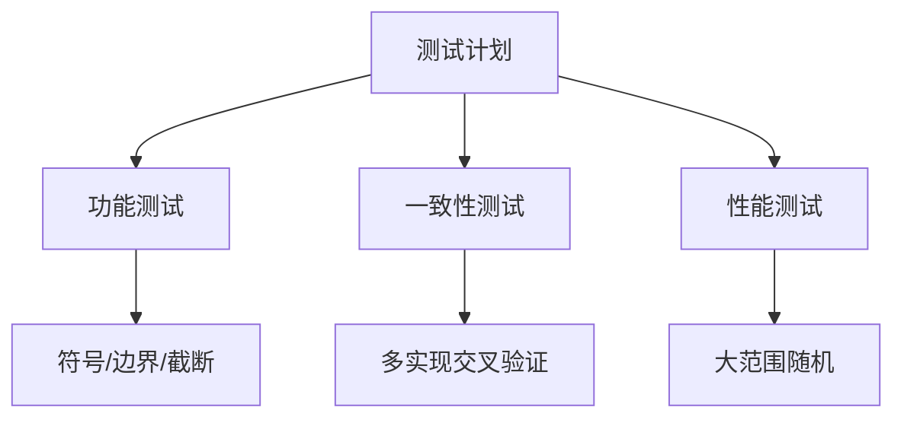

# 29. 两数相除（Divide Two Integers）

> 要求：在不使用乘法、除法和取余运算的前提下，计算整数商，向零截断；同时严格按照 32 位有符号整数范围返回（越界截断到 INT_MAX/INT_MIN）。

---

## 1. 题目重述与约束解析

- 输入：`dividend`（被除数）、`divisor`（除数），二者均为 32 位有符号整数范围内的值。
- 输出：`quotient`（商，向零截断）。
- 禁止：`*`、`/`、`%`。
- 边界与异常：
  - `divisor != 0`（题目保证，但实现仍需防御性处理）；
  - 溢出场景：`INT_MIN / -1`，理论答案为 2147483648（超出 32 位上界），需返回 `INT_MAX`；
  - 其他结果均需保持在 `[INT_MIN, INT_MAX]` 内；
  - 向零截断：即正负混合时直接丢弃小数部分，如 `7 / -3 = -2`。

---

## 2. 算法选择与总体设计

由于禁止使用乘除取余，核心思路是把「除法」转化为「减法 + 位移（乘2/除2的替代）」。常见可行路线：

- 暴力减法（线性）：从被除数中不断减去除数，计数；时间复杂度 O(|商|)，仅用于教学和极小数值。
- 快倍增减法（指数加速）：每次尝试将除数倍增至不超过剩余被除数的最大 2^k 倍，整体像「贪心 + 倍增」，复杂度 O(log(|dividend|))。
- 位移长除法（从高位到低位）：类似十进制长除法的二进制版本，逐位构造商，复杂度 O(32) ≈ O(1)。

在工程实践中：
- 快倍增减法实现简单、速度稳定；
- 位移长除法逻辑清晰、边界好控；
- 两者均需小心：符号处理、使用 int64 承接中间量避免溢出、INT_MIN 绝对值处理等。

本文给出两种主力解法：
-「快倍增减法」与「位移长除法」。并提供线性减法作为校验/教学版本。

---

## 3. 核心难点与关键技巧

- 符号处理：结果符号 = `(dividend < 0) XOR (divisor < 0)`；可统一转正处理后在结果末尾加符号。
- 极值处理：`INT_MIN` 的绝对值在 32 位有符号中不可表示，需转 `int64` 后再 `abs64`。
- 上溢保护：仅 `INT_MIN / -1` 会上溢；处理在最开始即可提前返回 `INT_MAX`。
- 位运算：使用 `<<` 作为乘 2，`>>` 作为除 2 的替代；严格避免使用 `*`、`/`、`%`。

---

## 4. 解法一：快倍增（重复加倍减法）

### 4.1 思路

- 将除数不断左移（乘 2）直至超过当前剩余被除数之前的最大值，并记录对应的倍数 `mul`（同样左移）。
- 用该最大倍数从被除数中一次性减去，累加 `mul` 到答案；
- 循环直到剩余被除数小于原始除数。

### 4.2 流程图

```mermaid
flowchart TD
  A[开始] --> B[特判: divisor=0? INT_MIN/-1?]
  B --> C[转为int64并取绝对值]
  C --> D{ad >= adv?}
  D -->|否| E[返回结果(带符号/截断)]
  D -->|是| F[tmp=adv, mul=1]
  F --> G{ad >= (tmp<<1)?}
  G -->|是| H[tmp<<=1, mul<<=1]
  H --> G
  G -->|否| I[ad-=tmp, res+=mul]
  I --> D
```

### 4.3 正确性要点
- 每轮选择不超过剩余被除数的最大 2^k 倍，保证每次尽可能大的推进，轮数 O(log 倍数)。
- 等价于把被除数 `ad` 拆成若干个 `adv * 2^k` 的和，商即所有对应 `2^k` 之和。

---

## 5. 解法二：位移长除法（从高位到低位）

### 5.1 思路

- 将被除数与除数都取正（int64）。
- 维护答案 `res=0`，从第 31 位到第 0 位尝试：
  - 若 `(ad >> i) >= adv`，说明除数左移 `i` 位不超过当前剩余，则将该位加入商：`res += 1<<i`，并扣减 `ad -= adv<<i`。
- 结束后按符号还原，并做截断。

### 5.2 流程图

```mermaid
flowchart TD
  A[开始] --> B[特判: divisor=0? 溢出?]
  B --> C[转为int64并取绝对值]
  C --> D[i=31..0 遍历]
  D --> E{(ad>>i) >= adv?}
  E -->|是| F[res+=1<<i; ad-=adv<<i]
  E -->|否| G[继续下一位]
  F --> D
  G --> D
  D --> H[结果带符号&截断返回]
```

### 5.3 正确性要点
- 与十进制长除法一致，是逐位确定商位是否为 1 的过程；
- 由于 32 位固定，因此复杂度近似 O(1)。

---

## 6. 代码实现（Go）

> 所有实现均不使用 `*`、`/`、`%`；中间量统一用 `int64`；集中处理溢出与符号。

```go
package main

import (
	"fmt"
)

const (
	INT_MAX = 2147483647
	INT_MIN = -2147483648
)

// divide 快倍增减法
func divide(dividend int, divisor int) int {
	if divisor == 0 {
		return INT_MAX
	}
	if dividend == INT_MIN && divisor == -1 {
		return INT_MAX
	}
	d := int64(dividend)
	dv := int64(divisor)
	neg := (d < 0) != (dv < 0)
	ad := abs64(d)
	adv := abs64(dv)

	var res int64 = 0
	for ad >= adv {
		tmp := adv
		mul := int64(1)
		for ad >= (tmp << 1) {
			tmp <<= 1
			mul <<= 1
		}
		ad -= tmp
		res += mul
	}
	if neg { res = -res }
	if res > int64(INT_MAX) { return INT_MAX }
	if res < int64(INT_MIN) { return INT_MIN }
	return int(res)
}

// divideBit 位移长除法
func divideBit(dividend int, divisor int) int {
	if divisor == 0 { return INT_MAX }
	if dividend == INT_MIN && divisor == -1 { return INT_MAX }
	d := int64(dividend)
	dv := int64(divisor)
	neg := (d < 0) != (dv < 0)
	ad := abs64(d)
	adv := abs64(dv)

	var res int64 = 0
	for i := 31; i >= 0; i-- {
		if (ad>>i) >= adv {
			res += 1 << uint(i)
			ad -= adv << uint(i)
		}
	}
	if neg { res = -res }
	if res > int64(INT_MAX) { return INT_MAX }
	if res < int64(INT_MIN) { return INT_MIN }
	return int(res)
}

// divideLinear 线性减法（仅教学/小值）
func divideLinear(dividend int, divisor int) int {
	if divisor == 0 { return INT_MAX }
	if dividend == INT_MIN && divisor == -1 { return INT_MAX }
	if dividend == 0 { return 0 }
	d := int64(dividend)
	dv := int64(divisor)
	neg := (d < 0) != (dv < 0)
	ad := abs64(d)
	adv := abs64(dv)
	var res int64 = 0
	for ad >= adv { ad -= adv; res++ }
	if neg { res = -res }
	if res > int64(INT_MAX) { return INT_MAX }
	if res < int64(INT_MIN) { return INT_MIN }
	return int(res)
}

func abs64(x int64) int64 { if x < 0 { return -x }; return x }

func main() {
	fmt.Println("两数相除（不使用乘/除/取余）测试")
	fmt.Println("=========================")
	// 用例略，详见工程 main.go
}
```

---

## 7. 边界用例与正确性验证

### 7.1 必测边界
- `INT_MIN / -1` → `INT_MAX`
- `INT_MIN / 1` → `INT_MIN`
- `0 / 正数` → `0`
- `正/负` 组合，向零截断：`7 / -3 = -2`；`-7 / 3 = -2`
- 被除数绝对值小于除数：`5/7=0`，`-1/2=0`

```mermaid
graph LR
  A[边界组] --> B[INT_MIN/-1]
  A --> C[INT_MIN/1]
  A --> D[0/x]
  A --> E[符号混合]
  A --> F[|a|<|b|]
```

### 7.2 样例（摘自 main.go）

- `10/3 = 3`、`7/-3 = -2`、`INT_MIN/-1 = INT_MAX`、`INT_MIN/1 = INT_MIN`、`INT_MAX/2 = 1073741823`、`INT_MIN/-3 = 715827882` 等。
- 双实现（`divide` 与 `divideBit`）结果一致，线性减法在小范围下辅助校验。

---

## 8. 复杂度分析

- 快倍增减法：
  - 时间：O(log(|dividend|))，每轮倍增后再一次减法；
  - 空间：O(1)。
- 位移长除法：
  - 时间：O(32)≈O(1)；
  - 空间：O(1)。
- 线性减法：
  - 时间：O(|商|)，仅用于教学。

```mermaid
graph TD
  A[复杂度对比] --> B[快倍增 O(logN)]
  A --> C[长除 O(1)]
  A --> D[线性 O(|商|)]
```

---

## 9. 常见坑位与排错指南

- 忽略 `INT_MIN / -1` 上溢：务必提前特判。
- 直接对 `INT_MIN` 调用 `abs`（32位）溢出：需转 `int64` 再取绝对值。
- 符号处理在末尾统一加，过程使用正数比较更简单。
- 位移时使用 `uint(i)`，避免移位负值导致未定义行为。
- 结果最终截断到 `[INT_MIN, INT_MAX]`；虽然理论不会越界（除上述特判），但保持防御性。

---

## 10. 测试策略

- 功能测试：
  - 随机正负组合，保证向零截断；
  - 大数场景，特别是 `INT_MIN`、`INT_MAX` 边界；
  - 被除数小于除数的结果为 0。
- 一致性测试：
  - `divide` 与 `divideBit` 结果一致；
  - 小范围同时与 `divideLinear` 对照。
- 性能测试：
  - 大量随机对，统计耗时分布（快倍增与长除均足够快）。



---

## 11. 代码实现要点 Checklist

- [x] 统一用 `int64` 承接中间量
- [x] 先行特判 `INT_MIN/-1`
- [x] 结果按符号还原并做上下界截断
- [x] 避免任何 `*`、`/`、`%`
- [x] 两套主力算法 + 线性校验

---

## 12. 小结

- 本题的关键在于用「位移 + 减法」重建除法的语义，并在极值与符号上严谨处理。
- 快倍增减法与位移长除法都能稳定在 O(logN) 或 O(1) 时间内完成计算，满足面试与工程要求。
- 牢记唯一溢出点 `INT_MIN / -1`，及 `INT_MIN` 绝对值取值细节。

> 运行：进入 `29/` 目录，执行 `go run main.go` 可查看样例与断言输出。
