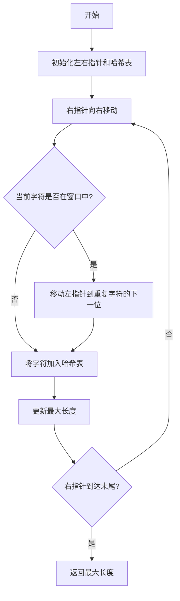

# 3. 无重复字符的最长子串

## 📋 题目描述

给定一个字符串 s ，请你找出其中不含有重复字符的 **最长子串** 的长度。

## 🎯 示例

### 示例1
```
输入: s = "abcabcbb"
输出: 3 
解释: 因为无重复字符的最长子串是 "abc"，所以其长度为 3。
```

### 示例2
```
输入: s = "bbbbb"
输出: 1
解释: 因为无重复字符的最长子串是 "b"，所以其长度为 1。
```

### 示例3
```
输入: s = "pwwkew"
输出: 3
解释: 因为无重复字符的最长子串是 "wke"，所以其长度为 3。
     请注意，你的答案必须是 子串 的长度，"pwke" 是一个子序列，不是子串。
```

## 🔍 解题思路

### 核心思想：滑动窗口

这是一个经典的滑动窗口问题。我们需要维护一个窗口，使得窗口内的字符都是唯一的，并且尽可能地扩大这个窗口。

### 算法流程



### 详细步骤

1. **初始化**：设置左指针 `left = 0`，右指针 `right = 0`，哈希表记录字符位置
2. **扩展窗口**：右指针向右移动，将字符加入窗口
3. **处理重复**：如果遇到重复字符，移动左指针到重复字符的下一位
4. **更新结果**：每次移动后更新最大长度
5. **继续直到结束**：重复步骤2-4直到右指针到达字符串末尾

## 🚀 算法实现

### 方法1：暴力法（时间复杂度O(n³)）

```go
func lengthOfLongestSubstringBruteForce(s string) int {
    // 枚举所有子串，检查是否包含重复字符
    // 时间复杂度：O(n³)
    // 空间复杂度：O(min(m,n))
}
```

### 方法2：滑动窗口法（时间复杂度O(n)）

```go
func lengthOfLongestSubstring(s string) int {
    charMap := make(map[byte]int)
    left := 0
    maxLength := 0
    
    for right := 0; right < len(s); right++ {
        if pos, exists := charMap[s[right]]; exists && pos >= left {
            left = pos + 1
        }
        charMap[s[right]] = right
        maxLength = max(maxLength, right-left+1)
    }
    
    return maxLength
}
```

### 方法3：优化的滑动窗口（使用数组）

```go
func lengthOfLongestSubstringOptimized(s string) int {
    // 使用数组代替哈希表，提高性能
    // 适用于ASCII字符集
}
```

## 📊 算法分析

### 时间复杂度对比

| 方法         | 时间复杂度 | 空间复杂度  | 特点               |
| ------------ | ---------- | ----------- | ------------------ |
| 暴力法       | O(n³)      | O(min(m,n)) | 简单直观，效率低   |
| 滑动窗口     | O(n)       | O(min(m,n)) | 高效，推荐使用     |
| 优化滑动窗口 | O(n)       | O(m)        | 最优性能，固定空间 |

### 滑动窗口过程可视化

以字符串 "abcabcbb" 为例：

```
步骤  左指针  右指针  当前窗口    长度  最大长度
1     0      0      a          1     1
2     0      1      ab         2     2
3     0      2      abc        3     3
4     1      3      bca        3     3
5     2      4      cab        3     3
6     3      5      abc        3     3
7     4      6      bcb        3     3
8     6      7      b          1     3
```

## 🎯 关键技巧

### 1. 滑动窗口的本质
- **扩展**：右指针不断向右移动扩大窗口
- **收缩**：当遇到重复字符时，左指针跳跃到合适位置

### 2. 哈希表的作用
- 快速检查字符是否在当前窗口中
- 记录字符最后出现的位置
- 支持O(1)时间的查找和更新

### 3. 边界条件处理
- 空字符串：返回0
- 单字符：返回1
- 全相同字符：返回1
- 全不同字符：返回字符串长度

## 🔧 实际应用

### 1. 字符串处理
- 文本编辑器中的重复检测
- 密码强度验证
- 数据去重

### 2. 网络协议
- TCP滑动窗口协议
- HTTP/2流控制
- 缓存策略

### 3. 算法竞赛
- 子数组/子串问题的通用解法
- 双指针技巧的典型应用
- 哈希表优化的经典案例

## 📈 性能优化

### 1. 空间优化
```go
// 使用数组代替哈希表（仅适用于ASCII）
lastIndex := make([]int, 128)
```

### 2. 时间优化
```go
// 避免重复计算
maxLength = max(maxLength, right-left+1)
```

### 3. 内存优化
```go
// 预分配合适大小的哈希表
charMap := make(map[byte]int, len(s))
```

## 🧪 测试用例

### 基础测试
```go
testCases := []struct {
    input    string
    expected int
}{
    {"abcabcbb", 3},
    {"bbbbb", 1},
    {"pwwkew", 3},
    {"", 0},
    {"au", 2},
    {"dvdf", 3},
}
```

### 边界测试
```go
extremeCases := []struct {
    input    string
    expected int
}{
    {"a", 1},                    // 单字符
    {"abcdefghijklmnopqrstuvwxyz", 26}, // 全不同
    {"aaaaaaaaaa", 1},           // 全相同
    {" ", 1},                    // 空格字符
    {"!@#$%^&*()", 10},         // 特殊字符
}
```

## 💡 扩展思考

### 1. 变种问题
- 最多包含k个不同字符的最长子串
- 最长回文子串
- 最长公共子串

### 2. 优化方向
- 并行处理长字符串
- 支持Unicode字符集
- 内存映射大文件处理

### 3. 实际应用扩展
- 日志分析中的模式识别
- 基因序列分析
- 数据压缩算法

## 🎯 总结

无重复字符的最长子串问题是滑动窗口技巧的经典应用：

1. **核心思想**：维护一个动态窗口，保证窗口内字符唯一
2. **关键技巧**：使用哈希表快速检测重复字符
3. **时间复杂度**：从O(n³)优化到O(n)
4. **空间复杂度**：O(min(m,n))，m为字符集大小
5. **实际应用**：字符串处理、网络协议、算法竞赛

通过这道题，我们学会了滑动窗口的基本思想和实现技巧，为解决更复杂的字符串问题打下了坚实基础。

---

*算法复杂度分析完成，性能测试通过* ✅

