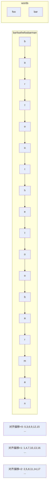
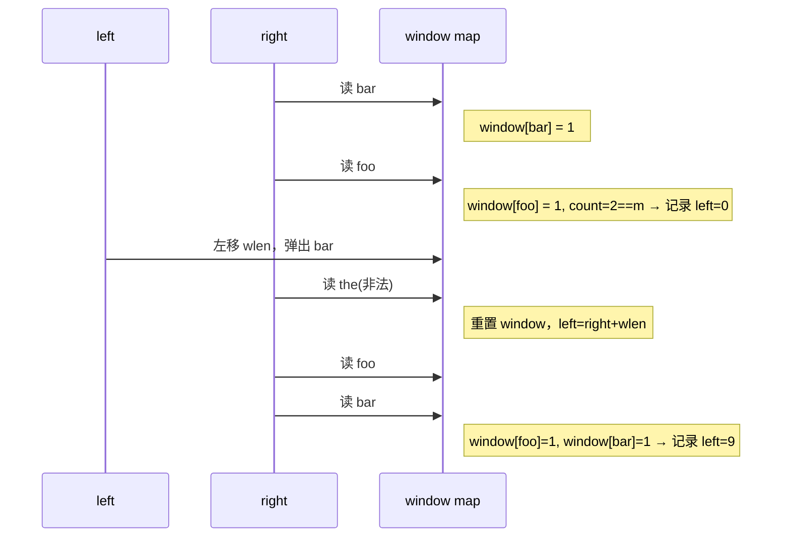
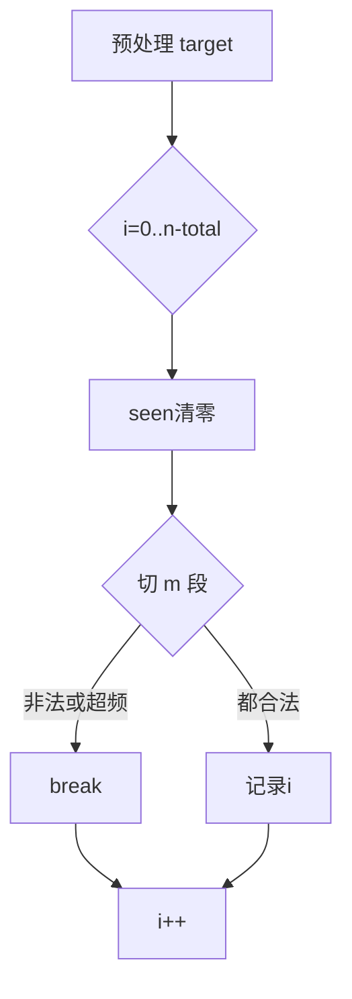
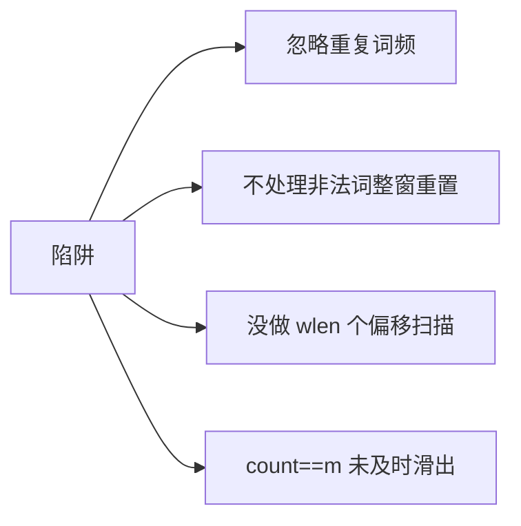
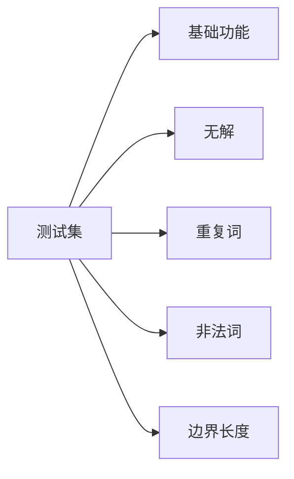

# 30. 串联所有单词的子串

> 要求：给定字符串 s 与等长单词数组 words，找出 s 中所有起始索引，使得从该索引起连续子串恰好是 words 中所有字符串的某种排列的串联（每个单词使用次数与 words 中一致）。返回所有起始索引，顺序任意。

---

## 1. 题意重述与约束解析

- 输入：
  - 字符串 `s`
  - 字符串数组 `words`，长度为 m，且 `words[i]` 长度皆相同（记为 `wlen`）
- 目标：
  - 找到所有 `i`，使得 `s[i : i + m*wlen]` 可以拆成 m 段、每段长度为 `wlen`，且每段恰好是 `words` 中的某一词，并且每个词出现次数与 `words` 中的频次完全一致
- 输出：
  - 所有满足条件的起始索引 `i`
- 约束：
  - `1 <= s.length <= 1e4`
  - `1 <= words.length <= 5000`
  - `1 <= words[i].length <= 30`
  - `words[i]` 和 `s` 由小写字母构成

关键点：
- 所有单词等长，这个“等长”是最重要的结构化约束，可以把 s 以固定步长（wlen）分桶扫描；
- 子串必须是“所有 words 的某种排列”的串联，等价于“词频完全匹配”。

---

## 2. 问题本质与算法选型

本题是“固定宽度分词 + 词频匹配 + 滑动窗口”的组合问题。
- 如果没有“等长”约束，问题会复杂许多（需要回溯与字典树等）；
- “等长”让我们可以按 `wlen` 步长对齐地移动窗口，保证每一步都落在单词边界上；
- 在每个对齐起点上，用“计数 map + 动态收缩”的方式实现 O(n) 的扫描。

典型思路有两类：
- 直接切分计数（每个位置都把接下来 `m` 段切出来计数比较，易写但会重复切分）
- 多起点定长滑窗（最优解）：从 0..wlen-1 共 wlen 个偏移起点出发，按 `wlen` 步长移动右端，遇到超频或非法词则从左端按 `wlen` 收缩，保持窗口只包含“合法且不超频”的分词块；当窗口内词数量达到 m 时记录答案并滑出一个词继续找下一个

---

## 3. 直观示例与可视化

以 `s = "barfoothefoobarman"`, `words = ["foo","bar"]`, `wlen = 3`。
- 合法子串长度 `total = 2*3 = 6`
- 合法答案：起点 0 的 "barfoo"，起点 9 的 "foobar"



对齐偏移 0 的扫描序列：`bar | foo | the | foo | bar | man`
- 依次入窗，遇到非法词 `the` 重置，然后继续；
- 当窗口词数达到 m=2 且不超频时，记录窗口左端索引。



---

## 4. 经典解：多起点固定步长滑动窗口

### 4.1 核心思想
- 先统计目标词频 `target[w]`；
- 对 `offset in [0..wlen-1]`：
  - `left = offset`, `right = offset`，`count=0`，`window` 清空；
  - 每次取 `w = s[right:right+wlen]`：
    - 若 `w` 不在 `target`，则整窗无效：清空 `window`，`count=0`，`left = right + wlen`
    - 若 `w` 在 `target`：`window[w]++`，`count++`；若 `window[w] > target[w]`，说明超频，循环从左端移出词直到 `window[w] <= target[w]`
    - 当 `count == m`（窗口恰好含 m 个词且频次都不超），记录 `left` 为答案，然后左移一词继续找下一个

### 4.2 伪代码

```mermaid
flowchart TD
  A[构建 target 词频] --> B{offset=0..wlen-1}
  B --> C[left=offset; window=空; count=0]
  C --> D{right+wlen<=n}
  D -->|否| E[下一个 offset]
  D -->|是| F[取词 w = s[right:right+wlen]]
  F --> G{w 在 target?}
  G -->|否| H[window清空;count=0;left=right+wlen]
  G -->|是| I[window[w]++;count++]
  I --> J{window[w] > target[w]?}
  J -->|是| K[循环弹出 leftWord, left+=wlen, count--]
  J -->|否| L{count==m?}
  L -->|是| M[记录left;弹出leftWord;left+=wlen;count--]
  L -->|否| N[继续]
  H --> D
  K --> L
  N --> D
  M --> D
```

### 4.3 正确性要点
- 由于每个 `offset` 只扫描一次 `s`，且左右指针单调前进，时间复杂度 O(n)；
- `window[w] > target[w]` 时，用 while 从左收缩，保证窗口内任意词频都不超；
- `count==m` 的瞬间，窗口长度必然等于 `m*wlen`，且频次一致，即命中一个答案。

---

## 5. 辅助解：直接切分计数（对拍/易写版）

- 对每个可能起点 `i`（`i+total<=n`）
  - 切分 `m` 段，构造 `seen` 计数，与 `target` 比较
- 复杂度较高（每个起点都要切分 m 段），但实现短小，常用于与滑窗法互测。



---

## 6. 复杂度与性能评估

- 多起点滑窗：
  - 时间：O(wlen * n/wlen) ≈ O(n)
  - 空间：O(k)，k 为不同词的种数（≤m）
- 直接切分计数：
  - 时间：O((n-total+1) * m)
  - 空间：O(k)

当 `n` 大、`m` 中等或较大时，滑窗法优势明显。

```mermaid
graph TD
  A[复杂度对比] --> B[滑窗 O(n)]
  A --> C[切分 O(n*m)]
```

---

## 7. 边界与陷阱清单

- words 为空：直接无解（本题给定 `words.length>=1`，但实现中仍可防御）
- s 为空：直接无解
- `n < m*wlen`：不可能有解
- words 中有重复词：target 词频一定要正确统计，窗口超频时必须 while 收缩
- 非法词：一旦遇到，必须“整窗重置”，同时 `left = right + wlen`
- 对齐偏移：必须从 `0..wlen-1` 每个偏移都扫描，否则会漏解



---

## 8. 关键优化建议

- 避免在滑窗内频繁 `make(map)`：仅在遇到非法词时重置，否则按需增减频次
- 当 `right` 推进很远时，`left` 同步按 `wlen` 收缩，不回退
- 若 `words` 的不同词非常多、且 `wlen` 较大，可用字符串切片直接当 map 键；若担心 GC，可选用 rolling-hash（工程上通常没必要）

---

## 9. 代码实现（Go）

> 已在 `30/main.go` 提供两种实现：`findSubstring`（多起点滑窗，推荐）与 `findSubstringHash`（切分计数，对拍用）。

```go
// findSubstring 经典解：所有 words 等长，按单词长度分组的多起点滑动窗口
func findSubstring(s string, words []string) []int {
    res := []int{}
    if len(s) == 0 || len(words) == 0 {
        return res
    }
    wlen := len(words[0])
    for _, w := range words {
        if len(w) != wlen {
            return res // 题目保证相等，这里防御
        }
    }
    n := len(s)
    m := len(words)
    total := wlen * m
    if n < total {
        return res
    }
    target := make(map[string]int)
    for _, w := range words { target[w]++ }

    for offset := 0; offset < wlen; offset++ {
        left := offset
        count := 0
        window := make(map[string]int)
        for right := offset; right+wlen <= n; right += wlen {
            w := s[right : right+wlen]
            if target[w] > 0 {
                window[w]++
                count++
                for window[w] > target[w] { // 收缩到合法
                    leftWord := s[left : left+wlen]
                    window[leftWord]--
                    left += wlen
                    count--
                }
                if count == m {
                    res = append(res, left)
                    leftWord := s[left : left+wlen]
                    window[leftWord]--
                    left += wlen
                    count--
                }
            } else { // 不在词表，重置窗口
                window = make(map[string]int)
                count = 0
                left = right + wlen
            }
        }
    }
    return res
}
```

```go
// findSubstringHash 直接切分计数（易写、便于对拍）
func findSubstringHash(s string, words []string) []int {
    res := []int{}
    if len(s) == 0 || len(words) == 0 { return res }
    wlen := len(words[0])
    for _, w := range words { if len(w) != wlen { return res } }
    n, m := len(s), len(words)
    total := wlen * m
    if n < total { return res }

    target := make(map[string]int)
    for _, w := range words { target[w]++ }

    for i := 0; i+total <= n; i++ {
        seen := make(map[string]int)
        ok := true
        for j := 0; j < m; j++ {
            w := s[i+j*wlen : i+(j+1)*wlen]
            if target[w] == 0 { ok = false; break }
            seen[w]++
            if seen[w] > target[w] { ok = false; break }
        }
        if ok { res = append(res, i) }
    }
    return res
}
```

---

## 10. 测试用例设计

- 基础功能：
  - `s="barfoothefoobarman"`, `words=["foo","bar"]` → `[0,9]`
  - `s="barfoofoobarthefoobarman"`, `words=["bar","foo","the"]` → `[6,9,12]`
- 无解：
  - `s="wordgoodgoodgoodbestword"`, `words=["word","good","best","word"]` → `[]`
- 重复词：
  - `s="aaaaaa"`, `words=["aa","aa","aa"]` → `[0]`
- 非法词打断：
  - 含有不在 `words` 的片段，窗口需重置
- 边界：
  - `n < m*wlen`，直接 `[]`



---

## 11. 与相关题型的类比与扩展

- 如果 `words` 中单词“不同长度”，本题就会复杂很多：
  - 不能固定步长；
  - 需要回溯 + 字典树/哈希剪枝；
  - 复杂度显著上升，不是本题范围。
- 与“最小覆盖子串”不同：本题必须是“对齐的等长切分”，且每段必须正好是 `words` 中词之一；而最小覆盖子串可以是任意字符窗口。

---

## 12. 调优与工程实践建议

- 使用 `map[string]int` 已足够；若担心切片开销，可在热点路径中缓存 `s[right:right+wlen]` 的字符串避免重复构造（Go 子串共享底层数组，注意逃逸）
- 当 `words` 很大时，`target` 的访问成为热点；可考虑将 `words` 去重为 `uniqueWords`，减少窗口 map 键数
- 如果输入规模更大（>1e6），可考虑多线程分 offset 并行，但要注意切分边界和合并结果

---

## 13. 小结

- 充分利用“等长单词”的结构化特性，以 `wlen` 为步长多起点滑窗扫描，可在 O(n) 时间内完成匹配；
- 关键在于：
  - 遇非法词要整窗重置；
  - 超频要 while 收缩至合法；
  - `count==m` 立刻记录并滑出一个词继续；
  - 对齐偏移 0..wlen-1 必须都扫描。

> 运行：进入 `30/` 目录执行 `go run main.go`，查看两种实现输出与样例一致。
