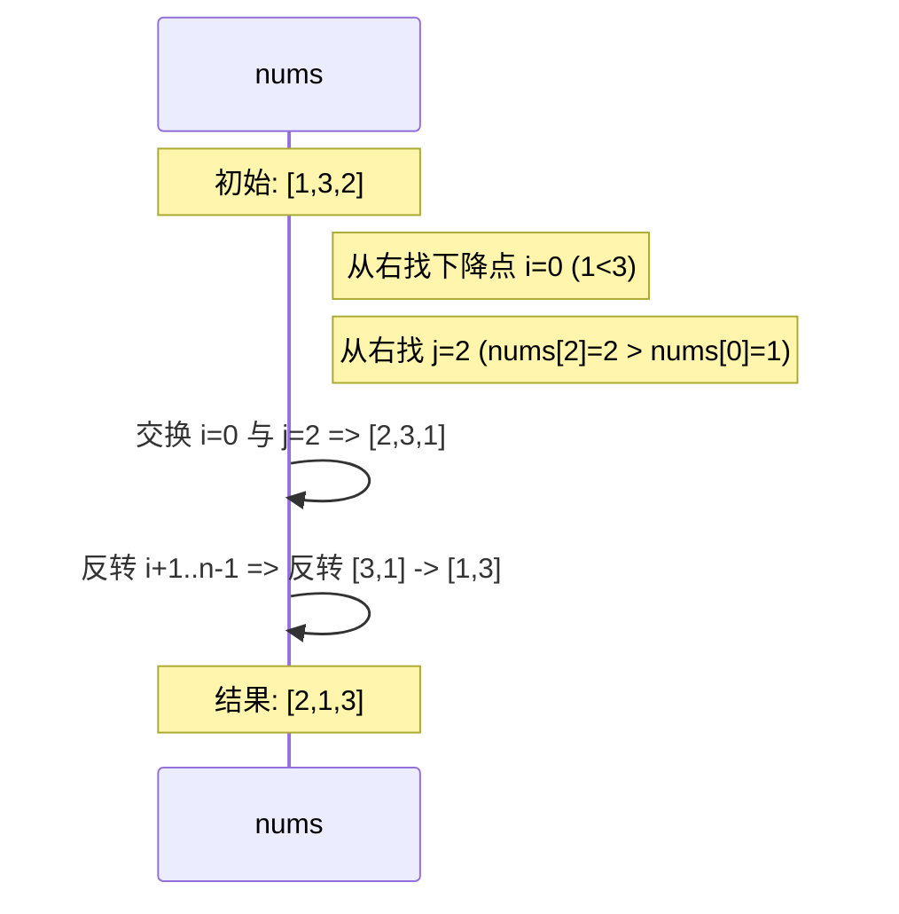
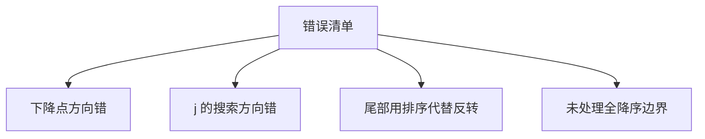
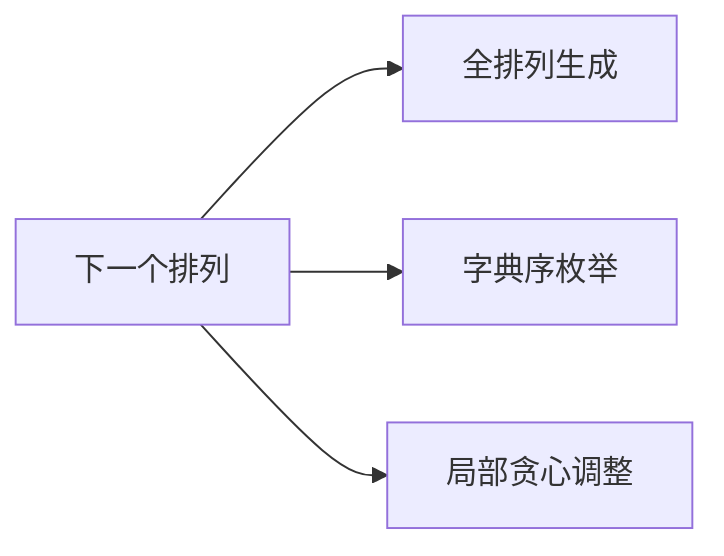

# 31. 下一个排列

## 题目描述

整数数组的一个 排列  就是将其所有成员以序列或线性顺序排列。

例如，arr = [1,2,3] ，以下这些都可以视作 arr 的排列：[1,2,3]、[1,3,2]、[3,1,2]、[2,3,1] 。
整数数组的 下一个排列 是指其整数的下一个字典序更大的排列。更正式地，如果数组的所有排列根据其字典顺序从小到大排列在一个容器中，那么数组的 下一个排列 就是在这个有序容器中排在它后面的那个排列。如果不存在下一个更大的排列，那么这个数组必须重排为字典序最小的排列（即，其元素按升序排列）。

例如，arr = [1,2,3] 的下一个排列是 [1,3,2] 。
类似地，arr = [2,3,1] 的下一个排列是 [3,1,2] 。
而 arr = [3,2,1] 的下一个排列是 [1,2,3] ，因为 [3,2,1] 不存在一个字典序更大的排列。
给你一个整数数组 nums ，找出 nums 的下一个排列。

必须 原地 修改，只允许使用额外常数空间。

## 示例 1：

输入：nums = [1,2,3]
输出：[1,3,2]

## 示例 2：

输入：nums = [3,2,1]
输出：[1,2,3]

## 示例 3：

输入：nums = [1,1,5]
输出：[1,5,1]

## 提示：

- 1 <= nums.length <= 100
- 0 <= nums[i] <= 100

## 解题思路

### 1. 问题本质与字典序回顾

“下一个排列”是经典的字典序（lexicographical order）问题。对一个整数数组 `nums`，我们需要在所有排列中找到“严格大于当前排列”的最小排列。如果不存在更大的排列，则按题意需要重排为最小字典序（即升序）。

关键观察：
- 若从右向左看，末尾越靠右的部分若已是“非递增”序列（如 `... 5,4,4,2`），说明这个尾部已经是“当前排列中该尾部位置可能的最大形态”。
- 第一个“破坏非递增”的位置（即从右向左的“首个下降点”）决定了我们能否构造更大的排列。

把数组拆为三段：
- 前缀 A：`[0..i-1]`
- 关键位 p：`i`
- 后缀 B：`[i+1..n-1]`（从右往左非递增）

要得到“刚好大一点”的排列：
1) 在 B 中找一个最小但“比 `nums[i]` 大”的元素与 `nums[i]` 交换；
2) 交换后，为了让整体“最小变大”，需要把 B（此时为 `[i+1..n-1]`）从大到小的结构逆转为从小到大（升序），即对 B 就地反转（因为原先 B 是非递增的，反转即可得到非递减（升序））。

若不存在下降点（整个数组从右到左都是非递增，如 `3,2,1`），意味着这是所有排列中的最大排列，答案是“最小字典序”：直接整体反转为升序。

---

### 2. 经典算法三步曲（必须原地、常数空间）

算法步骤：
1. 从右向左找到第一个下标 `i`，使得 `nums[i] < nums[i+1]`（首个下降点）。若未找到，则转第4步。
2. 再从右向左找到第一个下标 `j`，使得 `nums[j] > nums[i]`。
3. 交换 `nums[i]` 与 `nums[j]`。
4. 反转区间 `[i+1..n-1]`，使其变为升序。若第1步未找到下降点，则 `i` 视为 `-1`，这一步等价于反转整个数组。

```mermaid
flowchart TD
    A[开始] --> B[从右往左找首个下降点 i: nums[i] < nums[i+1]]
    B -->|找到| C[从右往左找 j: nums[j] > nums[i]]
    B -->|未找到| D[整个序列为非递增 → 反转全数组]
    C --> E[交换 nums[i], nums[j]]
    E --> F[反转区间 i+1..n-1]
    F --> G[结束]
    D --> G

    style A fill:#e1f5fe
    style G fill:#c8e6c9
    style E fill:#fff3e0
```

为什么这样正确？
- 步骤1找到了需要“提升”的最低位 `i`。
- 步骤2在右侧尾部（非递增段）中挑选“刚好比它大”的那个替换位，保证整体只“略微”变大。
- 步骤4将尾部重置为最小（升序），保证得到的排列是严格大于原排列的“最小的那个”。

---

### 3. 直观示例与过程可视化

示例：`[1, 2, 3]` → 下一个排列
- 从右向左：`3` 与左边 `2`，发生 `2 < 3`，下降点 `i=1`
- 从右向左找 `j`：第一个大于 `nums[1]=2` 的是 `3`（`j=2`）
- 交换：`[1, 3, 2]`
- 反转尾部 `[i+1..]`：尾部只有一个元素，无变化，答案 `[1,3,2]`

再看：`[1, 3, 2]` → 下一个排列
- 从右向左：`2` 与左边 `3`：`3 > 2` 非下降；继续看 `3` 与左边 `1`：`1 < 3`，`i=0`
- 从右向左找 `j`：第一个大于 `nums[0]=1` 的是最右侧大于 1 的元素，此处最右侧依次 `2,3`，第一个大于 1 的是 `2`（更靠右的选择保证“刚刚大”）
- 交换得 `[2,3,1]`
- 反转尾部 `[i+1..]`：`[3,1]` 反转为 `[1,3]`，最终 `[2,1,3]` ？注意：这里要从最右开始找“第一个大于 nums[i] 的 j”，应取 `j=2(2)`，交换 `[2,3,1]`，反转 `[3,1]` → `[1,3]`，结果 `[2,1,3]`，其确实是介于 `[1,3,2]` 与 `[2,3,1]` 之间的下一个。为了避免理解混乱，我们再统一用下一段的动画图描述。



边界示例：`[3,2,1]` → 下一个排列
- 整体从右到左是非递增，没有下降点
- 直接反转为升序 `[1,2,3]`

---

### 4. 与“62. 不同路径”风格对应的分析维度

参考 62 题的结构，我们也从多个维度完整剖析：

#### 4.1 算法流程图（总览）
```mermaid
flowchart TD
    A[输入 nums] --> B[从右往左扫描找 i]
    B --> C{存在 i?}
    C -->|否| D[反转全数组 -> 最小字典序]
    C -->|是| E[从右往左找 j: > nums[i]]
    E --> F[交换 nums[i], nums[j]]
    F --> G[反转区间 i+1..n-1]
    G --> H[返回]
    D --> H

    style D fill:#ffcdd2
    style H fill:#c8e6c9
```

#### 4.2 关键子过程细化
- 找下降点 i：
```mermaid
flowchart LR
    X[for i=n-2..0] --> Y{nums[i] < nums[i+1]?}
    Y -->|是| Z[break; 得到 i]
    Y -->|否| X
```
- 找替换位 j（从右往左第一个大于 `nums[i]` 的）：
```mermaid
flowchart LR
    P[for j=n-1..i+1] --> Q{nums[j] > nums[i]?}
    Q -->|是| R[break; 得到 j]
    Q -->|否| P
```
- 反转 `[i+1..n-1]`：
```mermaid
flowchart LR
    A1[l=i+1] --> A2[r=n-1]
    A2 --> A3{l<r?}
    A3 -->|是| A4[swap(nums[l], nums[r]); l++; r--]
    A3 -->|否| A5[Done]
    A4 --> A3
```

---

### 5. 边界条件与正确性讨论

- 全降序（最大排列）：无 i，直接反转全数组为升序，得到最小排列
- 尾部已有相等元素：如 `[1,5,5,2]`，下降点寻找仍以“严格小于”为判定，后续在右侧找第一个“严格大于”的元素即可
- 重复元素：算法同样适用，因为我们从右侧找的是“第一个大于”而不是“第一个不同”
- 长度为 1：原地不变

正确性核心：
- “略微变大”由“最右侧第一个可提升位 + 最靠右刚好大于它的元素”保证；
- “其余尽可能小”由“反转降序尾部为升序”保证。

---

### 6. 时间与空间复杂度

- 时间：整体为 O(n)
  - 找 i：O(n)
  - 找 j：O(n)（在最坏情况下）
  - 反转尾部：O(n)
- 空间：O(1)（原地交换与反转）

```mermaid
graph TD
  C[复杂度] --> T[时间 O(n)]
  C --> S[空间 O(1)]
  T --> T1[三步均线性]
  S --> S1[就地交换/反转]
```

---

### 7. 常见错误与陷阱

- 错把“非递增/非递减”的方向写反，导致错误地判定下降点或反转区间
- 找 j 时没有“从右往左”，会错过“刚好大于”的元素，导致结果不是最小的那个更大排列
- 反转尾部时用排序（虽然可行但多余），就地反转即可且更高效
- 全降序时忘了处理（必须整体反转）



---

### 8. 测试用例设计

功能用例：
1. `[1,2,3]` → `[1,3,2]`
2. `[3,2,1]` → `[1,2,3]`（全降序）
3. `[1,1,5]` → `[1,5,1]`（含重复）
4. `[1,3,2]` → `[2,1,3]`
5. `[1,5,1]` → `[5,1,1]`

边界用例：
- 长度 1：`[7]` → `[7]`
- 已是“某段升序 + 尾部降序”：如 `[2,2,0,4,3,1]` → 按步骤走，验证细节

鲁棒性用例：
- 大量重复元素：`[2,2,2,2]` → `[2,2,2,2]`（最小/最大同一）
- 近乎升序/近乎降序随机数组

---

### 9. 代码实现要点（语言无关伪码）

```text
nextPermutation(nums):
  n = len(nums)
  if n <= 1: return

  # 1) 找 i
  i = n-2
  while i >= 0 and nums[i] >= nums[i+1]:
      i -= 1

  if i >= 0:
      # 2) 找 j
      j = n-1
      while nums[j] <= nums[i]:
          j -= 1
      swap(nums[i], nums[j])

  # 3) 反转尾部
  reverse(nums, i+1, n-1)
```

- `>=` 与 `<=` 的方向要与“严格大于/严格小于”保持一致
- `reverse` 就地反转即可，无需排序

---

### 10. 与相关主题的联系

- 全排列生成（下一个排列可迭代地产生所有排列，配合起始升序与终止降序的判定）
- 字典序枚举（组合/排列的通用技巧）
- 贪心 + 局部调整思想（仅调整“最右侧可提升位”与其尾部）



---

### 11. 小结

- 牢记“三步曲”：找 i、找 j、交换、反转尾部；
- 正确的方向与严格不等是保证字典序“刚刚大一点”的关键；
- 该算法原地、线性时间，面试高频，必须熟练掌握。
