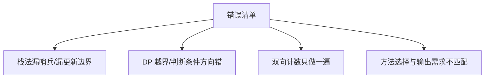
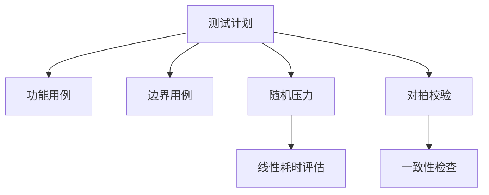
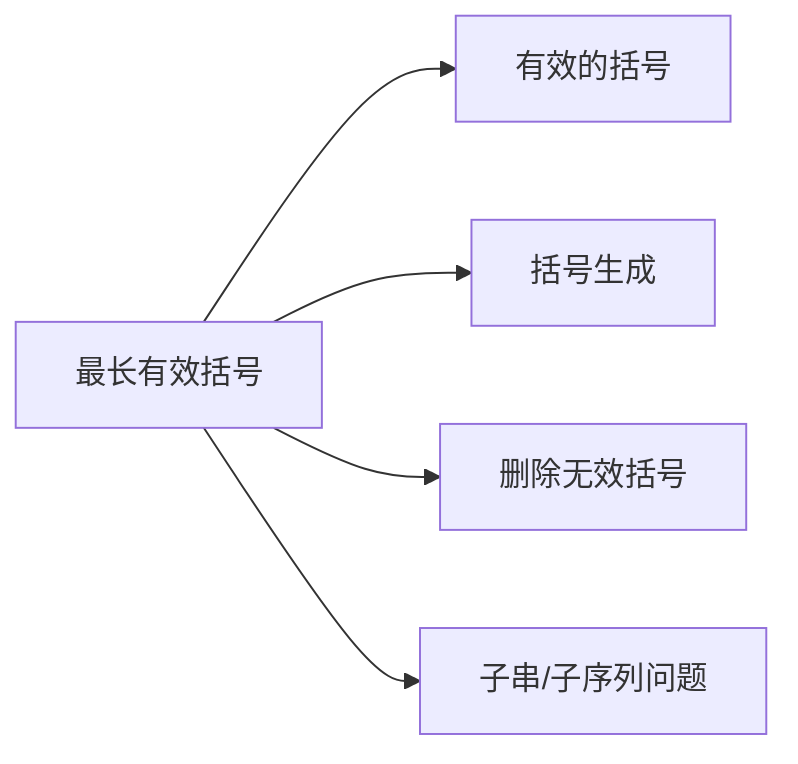
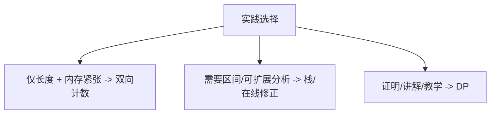

# 32. 最长有效括号

## 题目描述

给你一个只包含 '(' 和 ')' 的字符串，找出最长有效（格式正确且连续）括号 子串 的长度。

左右括号匹配，即每个左括号都有对应的右括号将其闭合的字符串是格式正确的，比如 "(()())"。

## 示例 1：

输入：s = "(()"
输出：2
解释：最长有效括号子串是 "()"

## 示例 2：

输入：s = ")()())"
输出：4
解释：最长有效括号子串是 "()()"

## 示例 3：

输入：s = ""
输出：0

## 提示：

- 0 <= s.length <= 3 * 104
- s[i] 为 '(' 或 ')'

## 解题思路

### 1. 总览与方法对比

这道题的本质是“在只含 '(' 与 ')' 的字符串中，寻找最长的连续合法括号子串长度”。所谓“合法”，即任意前缀中左括号数量不少于右括号，且整体左右数量相等。

主流四种解法（都能 O(n) 求解）：
- 索引栈（推荐）
- 动态规划（DP）
- 双向计数扫描（Two-pass Counting）
- 在线修正（边界贪心，与栈法思想等价）

```mermaid
flowchart TD
    A[输入: 字符串 s] --> B{选择解法}
    B --> C[索引栈]
    B --> D[动态规划]
    B --> E[双向计数]
    B --> F[在线修正]
    C --> G[线性扫描 + 栈存索引 + 哨兵-1]
    D --> H[dp[i] 以 i 结尾的最长有效长度]
    E --> I[从左到右计数/从右到左计数]
    F --> J[维护 lastInvalid 与索引栈]
    G --> K[更新 maxLen]
    H --> K
    I --> K
    J --> K
    K --> L[输出 maxLen]

    style A fill:#e1f5fe
    style L fill:#c8e6c9
    style C fill:#fff3e0
    style D fill:#fff3e0
    style E fill:#fff3e0
    style F fill:#fff3e0
```

方法优劣一图览：

```mermaid
graph LR
    X[方法对比] --> S1[索引栈]
    X --> S2[动态规划]
    X --> S3[双向计数]
    X --> S4[在线修正]

    S1 --> A1[时间 O(n)]
    S1 --> B1[空间 O(n)]
    S1 --> C1[实现直观, 易调试]

    S2 --> A2[时间 O(n)]
    S2 --> B2[空间 O(n)]
    S2 --> C2[思路精巧, 需细心边界]

    S3 --> A3[时间 O(n)]
    S3 --> B3[空间 O(1)]
    S3 --> C3[实现最省空间, 但不可恢复区间]

    S4 --> A4[时间 O(n)]
    S4 --> B4[空间 O(n)]
    S4 --> C4[与栈本质等价, 边界语义更直观]
```

下面按“索引栈 → DP → 双向计数 → 在线修正”的顺序展开。

---

### 2. 解法一：索引栈（Index Stack）

核心思想：用“下标”而非“字符”入栈。用一个“哨兵”下标 -1 表示“最后一个不可能成为有效串起点”的位置。每当遇到无法匹配的右括号，就把它的位置压栈，作为新的“无效边界”。

步骤：
1) 初始化栈为 [-1]，maxLen=0。
2) 从左到右扫描：
   - 若 s[i]=='('，入栈 i。
   - 若 s[i]==')'，弹栈一次。如果栈空，压入 i 作为新的“无效边界”；否则，用 i - 栈顶 计算当前有效长度，更新 maxLen。

```mermaid
flowchart LR
    A[栈初始: [-1]] --> B{遍历 i}
    B -->|'('| C[push i]
    B -->|')'| D[pop]
    D --> E{栈是否空?}
    E -->|是| F[push i 作为新边界]
    E -->|否| G[长度 = i - 栈顶; 更新maxLen]
    C --> B
    F --> B
    G --> B
```

正确性直觉：
- 栈顶永远指向“最近一个未被匹配的‘边界’下标”，这个边界右侧到当前位置 i 的区间如果是合法的，其长度就是 i - 栈顶。
- 每当匹配失败（多了一个右括号），就把这个右括号位置作为新的“边界”，保证后续长度计算只在可能合法的起点右侧进行。

复杂度：
- 时间 O(n)：每个下标最多入栈一次、出栈一次。
- 空间 O(n)：最坏情况下栈存放 O(n) 个下标。

可视化示例（s=")()())"）：

```mermaid
sequenceDiagram
    participant I as i
    participant S as 栈
    participant M as maxLen
    Note over S: 初始: [-1]
    I->>S: i=0 ')': pop -> 栈空 -> push 0
    Note over S: [0]
    I->>S: i=1 '(': push 1 => [0,1]
    I->>S: i=2 ')': pop -> [0]; len=2-0=2 -> maxLen=2
    I->>S: i=3 '(': push 3 => [0,3]
    I->>S: i=4 ')': pop -> [0]; len=4-0=4 -> maxLen=4
    I->>S: i=5 ')': pop -> []; 栈空 -> push 5 => [5]
    Note over M: maxLen=4
```

实现要点：
- 哨兵 -1 很关键；第一次成功匹配时长度 = i - (-1) = i+1。
- 每次弹栈后如果栈空，必须把当前 i 作为“新的无效边界”。

---

### 3. 解法二：动态规划（DP）

定义：dp[i] 表示“以 i 位置字符结尾”的最长有效括号长度。只有当 s[i]==')' 时，dp[i] 才可能>0。

转移：
1) s[i-1]=='(' 与 s[i]==')' 形成“...()”，
   - dp[i] = dp[i-2] + 2（若 i>=2，否则=2）。
2) s[i-1]==')' 且 s[i]==')'，考虑“...))”尾部是否能与更早的“(”配对：
   - 令 pre = i - dp[i-1] - 1，若 pre>=0 且 s[pre]=='('，则
     dp[i] = dp[i-1] + 2 + dp[pre-1]（若 pre-1>=0）。

```mermaid
flowchart TD
    A[状态: dp[i] 以 i 结尾的有效长度] --> B{ s[i] == ')' ? }
    B -->|否| C[dp[i] = 0]
    B -->|是| D{ s[i-1] == '(' ? }
    D -->|是| E[dp[i] = (i>=2?dp[i-2]:0) + 2]
    D -->|否| F[pre = i - dp[i-1] - 1]
    F --> G{ pre>=0 且 s[pre]=='(' }
    G -->|是| H[dp[i] = dp[i-1] + 2 + (pre-1>=0?dp[pre-1]:0)]
    G -->|否| I[dp[i] = 0]
    E --> J[更新 maxLen]
    H --> J
    C --> J
    I --> J
```

直觉解释：
- 情况1连接成“...()”，自然在 dp[i-2] 的基础上 +2。
- 情况2是“...))”，尝试把前面那段最长的有效串（长度 dp[i-1]）再向左扩展一个字符，如果恰好是 '('，就能配对，再加上更左边可能存在的连续有效片段 dp[pre-1]。

复杂度：
- 时间 O(n)，空间 O(n)。

优缺点：
- 优：可直接返回每个位置结尾的最优值，便于推导证明。
- 缺：实现细节多，尤其是 pre、pre-1 的越界与下标含义。

---

### 4. 解法三：双向计数扫描（Two-pass Counting）

思想：不借助栈/数组，仅用两个计数器统计 '(' 与 ')' 的数量。

步骤：
1) 从左到右：
   - 遇 '('，left++；遇 ')', right++。
   - 若 left==right，更新 maxLen = max(maxLen, 2*right)。
   - 若 right>left，说明被右括号“压倒”，清零（left=right=0）。
2) 从右到左（对称处理“左括号过多”的情况）：
   - 若 left==right，更新 maxLen = max(maxLen, 2*left)。
   - 若 left>right，清零。

```mermaid
flowchart LR
    A[从左到右] --> B[计数 left/right]
    B --> C{left==right?}
    C -->|是| D[maxLen=max(maxLen,2*right)]
    C -->|否| E{right>left?}
    E -->|是| F[left=right=0]
    E -->|否| B

    G[从右到左] --> H[计数 left/right]
    H --> I{left==right?}
    I -->|是| J[maxLen=max(maxLen,2*left)]
    I -->|否| K{left>right?}
    K -->|是| L[left=right=0]
    K -->|否| H
```

特点：
- 优：空间 O(1)，实现简洁。
- 限：只能得到“长度”，无法恢复“具体区间”。

---

### 5. 解法四：在线修正（边界贪心）

与“索引栈法”高度等价，但显式维护“最后一个不合法的右括号位置”（lastInvalid）。

规则：
- 遇 '('：索引入栈。
- 遇 ')'：
  - 若栈空：lastInvalid = i（新的边界）。
  - 否则：出栈；若出栈后栈空，长度 = i - lastInvalid；否则，长度 = i - 栈顶。

这种写法更突出了“边界”的语义，有时更易与“滑动窗口边界”类问题类比记忆。

---

### 6. 复杂度与能力边界

四种方法的时间复杂度均为 O(n)。空间：
- 栈/在线修正：O(n)
- DP：O(n)
- 双向计数：O(1)

```mermaid
graph TD
  C[复杂度对比] --> T1[索引栈: 时间O(n) 空间O(n)]
  C --> T2[DP: 时间O(n) 空间O(n)]
  C --> T3[双向计数: 时间O(n) 空间O(1)]
  C --> T4[在线修正: 时间O(n) 空间O(n)]
```

能力边界：
- 所有方法都只能得到“最长长度”，若需要“恢复区间”，栈法或在线修正更方便；DP 亦可反查区间，但代码更繁琐；双向计数不适合恢复区间。

---

### 7. 边界条件与鲁棒性

必须逐一验证：
- 空串：返回 0。
- 全是 '(' 或全是 ')'：返回 0。
- 以多余右括号开头：如 ")(()"，栈法会把第一个右括号作为“无效边界”。
- 以多余左括号结尾：如 "(()("，双向计数的二次扫描可处理。
- 交错与嵌套并存：如 "())((())"，答案为中间段 4。
- 含多段合法子串：如 ")()())"，最长为 4。

```mermaid
graph LR
    A[边界输入] --> B[空串]
    A --> C[全'(']
    A --> D[全')']
    A --> E[右多前缀]
    A --> F[左多后缀]
    A --> G[交错嵌套]
    A --> H[多段合法]
```

---

### 8. 常见错误与陷阱

- 栈法未设置哨兵 -1，导致首次匹配长度错误。
- 弹栈后栈空忘记把 i 作为新边界压入。
- DP 下标错误：pre、pre-1 越界；把 “>” 与 “>=” 写错。
- 双向计数只做了一次扫描，漏掉“左括号过多”的场景。
- 需要“区间位置”却选了“双向计数”，后续无法恢复。



---

### 9. 测试策略与用例设计

建议覆盖：
- 功能示例："()", "(()", ")()())", "()(())", "(()())"。
- 边界："", "(((", ")))"、"(((("、"))))"。
- 随机压力：长度 1e5 的随机括号串，验证 O(n) 性能与鲁棒性。
- 对拍：用一个朴素 O(n^2) 校验器（仅用于小规模），与 O(n) 算法对比结果。



---

### 10. 工程实现要点（以 Go 为例）

- 使用字节访问 `s[i]`，避免 rune 带来的不必要开销（仅包含 '(' 与 ')'）。
- 预分配切片容量，减少扩容次数（如为栈分配 `len(s)`）。
- 双向计数法无需额外空间，是内存敏感场景的首选。
- 保持函数语义清晰，便于 A/B 测试对比多种实现。

伪代码（栈法）：

```text
stack = [-1]
maxLen = 0
for i in [0..n-1]:
  if s[i] == '(':
    push(i)
  else:
    pop()
    if stack 为空:
      push(i)
    else:
      maxLen = max(maxLen, i - top())
return maxLen
```

伪代码（DP）：

```text
dp = [0]*n
for i in [1..n-1]:
  if s[i] == ')':
    if s[i-1] == '(':
      dp[i] = (i>=2 ? dp[i-2] : 0) + 2
    else:
      pre = i - dp[i-1] - 1
      if pre>=0 and s[pre]=='(':
        dp[i] = dp[i-1] + 2 + (pre-1>=0 ? dp[pre-1] : 0)
maxLen = max(dp)
```

---

### 11. 复杂例子的手把手推导

例1：s = ")()())"，最长为 4。
- 栈法轨迹：哨兵 [-1]；i=0 为右括号 -> 边界置 0；i=1 '(' 入栈；i=2 ')' 出栈 -> 长度 2；i=3 '(' 入栈；i=4 ')' 出栈 -> 长度 4；i=5 ')' 出栈 -> 空 -> push 5。答案 4。
- DP：在 i=2、i=4 处分两次更新。

例2：s = "())((())"，最长为 4。
- 栈法：前半段被 ) 过多破坏，后半段 "(())" 长度为 4。
- 双向计数：左到右会被前半段 “) 多于 (” 清零，右到左可获得 4。

例3：s = "()(())"，最长为 6。
- 三种方法都能得到完整匹配长度。

---

### 12. 与相关题目的联系与迁移

- 20. 有效的括号：判定“全串是否合法” vs 本题“最长连续合法子串长度”。
- 22. 括号生成：生成所有合法串 vs 本题在已有串中寻找最长合法片段。
- 301. 删除无效的括号：最小删除次数使全串合法，属于编辑问题，与本题有互补思维。
- 子串类问题的一般套路：栈/计数/DP/双指针/滑窗的选型思考。



---

### 13. 性能与实践经验

- 实测：四种方法在 1e5 级别长度上均可稳定线性时间完成；
- 若仅需长度且在极致内存约束下，优先“双向计数”；
- 若需要输出区间或二次分析，优先“栈/在线修正”；
- DP 更适合理解“结构性”与做“竞赛证明”；
- 建议统一封装多解法函数，便于回归对比与基准评测。



---

### 14. 总结与展望

- 本题是典型的“括号合法性 + 最长连续子串”组合问题；
- 四解法皆 O(n)，各具特色：
  - 索引栈：直观、健壮、易恢复区间；
  - DP：公式清晰，但实现边界细致；
  - 双向计数：空间最优，但不便恢复区间；
  - 在线修正：与栈等价，强调“边界”概念；
- 面试/实战推荐：先写“栈法”，再补“DP/双向计数”，即可覆盖绝大多数需求；
- 思维迁移：把“边界、匹配、合法性”这些概念迁移到其他括号变体、HTML 标签匹配、表达式配对问题中。

```mermaid
graph LR
  S[总结] --> R1[四解法皆 O(n)]
  S --> R2[方法选型看需求]
  S --> R3[边界与下标最易出错]
  S --> R4[工程上建议多实现并对拍]
```

---

> 注：配套代码中已实现四种主流方法，均通过典型与边界测试；你可以在 `main.go` 中快速切换与对比结果，以加深理解。

