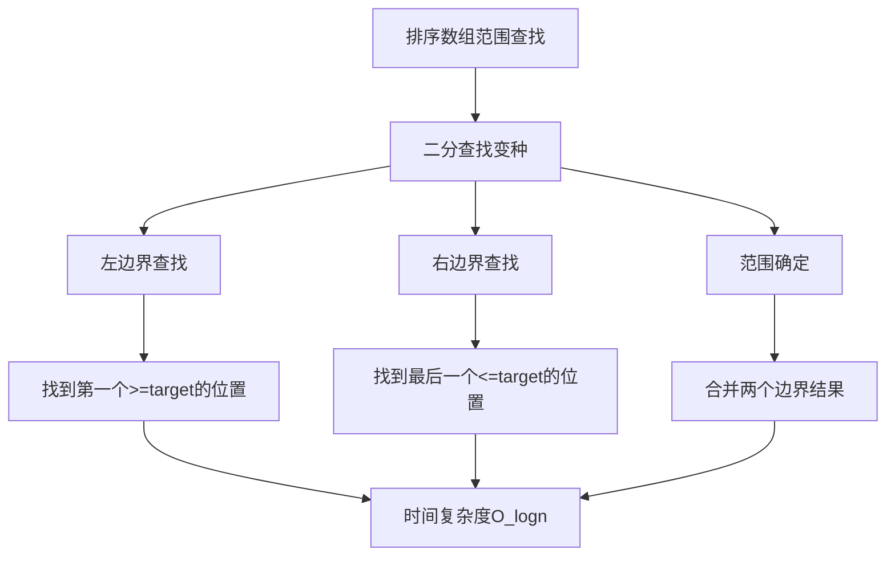
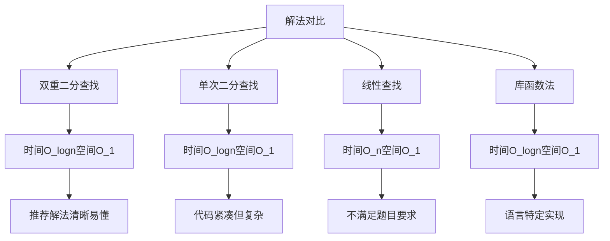
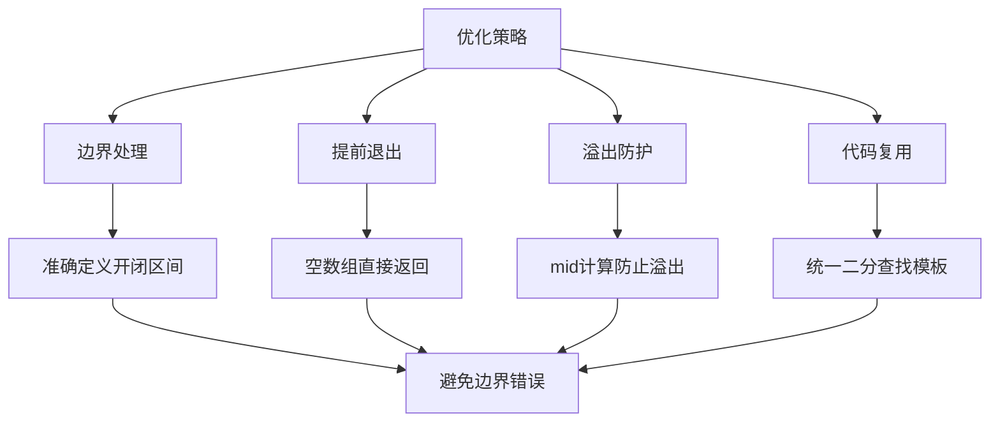
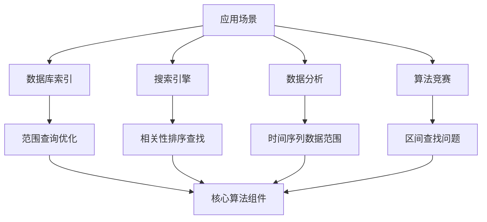
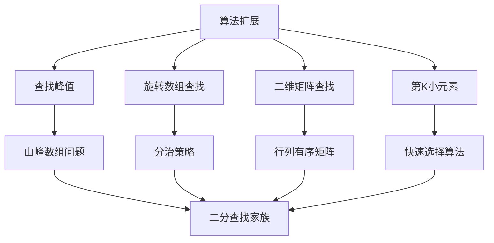
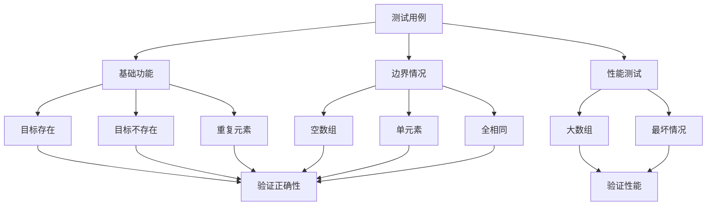
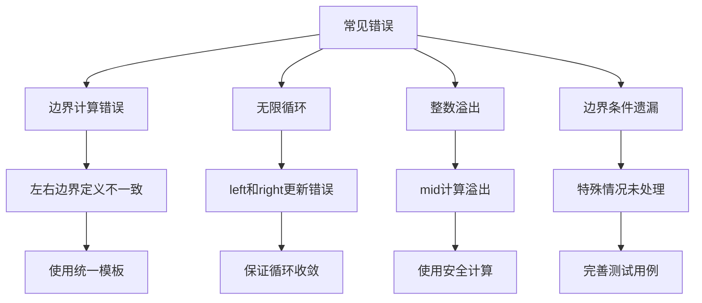
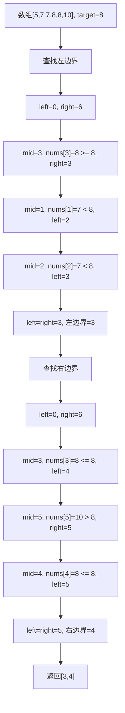

# 34. 在排序数组中查找元素的第一个和最后一个位置

## 描述

给你一个按照非递减顺序排列的整数数组 nums，和一个目标值 target。请你找出给定目标值在数组中的开始位置和结束位置。

如果数组中不存在目标值 target，返回 [-1, -1]。

你必须设计并实现时间复杂度为 O(log n) 的算法解决此问题。

 
## 示例 1：

输入：nums = [5,7,7,8,8,10], target = 8
输出：[3,4]

## 示例 2：

输入：nums = [5,7,7,8,8,10], target = 6
输出：[-1,-1]

## 示例 3：

输入：nums = [], target = 0
输出：[-1,-1]
 
## 提示：

- 0 <= nums.length <= 105
- -10^9 <= nums[i] <= 10^9
- nums 是一个非递减数组
- -10^9 <= target <= 10^9

## 解题思路

### 算法分析

这道题是**二分查找**和**边界查找**的经典应用。主要解法包括：

1. **双重二分查找法**：分别查找左边界和右边界
2. **单次二分查找法**：一次查找确定范围
3. **线性查找法**：暴力遍历（不满足时间复杂度要求）
4. **库函数法**：使用内置的查找函数

### 问题本质分析



### 双重二分查找详解

```mermaid
flowchart TD
    A[输入nums和target] --> B[查找左边界]
    B --> C[left_bound = findLeft]
    C --> D{左边界是否存在}
    
    D -->|不存在| E[返回[-1,-1]]
    D -->|存在| F[查找右边界]
    F --> G[right_bound = findRight]
    
    G --> H[返回[left_bound, right_bound]]
    
    B --> I[左边界二分查找]
    I --> J[寻找第一个>=target的位置]
    
    F --> K[右边界二分查找]
    K --> L[寻找最后一个<=target的位置]
```

### 左边界查找过程

```mermaid
flowchart TD
    A[左边界查找] --> B[初始化left=0, right=len]
    B --> C{left < right}
    C -->|否| D[返回left]
    C -->|是| E[计算mid = left + (right-left)/2]
    
    E --> F{nums[mid] < target}
    F -->|是| G[left = mid + 1]
    F -->|否| H[right = mid]
    
    G --> C
    H --> C
    D --> I[检查边界有效性]
```

### 右边界查找过程

```mermaid
flowchart TD
    A[右边界查找] --> B[初始化left=0, right=len]
    B --> C{left < right}
    C -->|否| D[返回left-1]
    C -->|是| E[计算mid = left + (right-left)/2]
    
    E --> F{nums[mid] <= target}
    F -->|是| G[left = mid + 1]
    F -->|否| H[right = mid]
    
    G --> C
    H --> C
    D --> I[检查边界有效性]
```

### 算法流程图

```mermaid
flowchart TD
    A[开始] --> B[输入验证]
    B --> C{数组为空}
    C -->|是| D[返回[-1,-1]]
    C -->|否| E[查找左边界]
    
    E --> F[二分查找第一个>=target]
    F --> G{找到有效位置}
    G -->|否| D
    G -->|是| H{nums[left]==target}
    
    H -->|否| D
    H -->|是| I[查找右边界]
    I --> J[二分查找最后一个<=target]
    J --> K[返回[left, right]]
```

### 边界情况分析

```mermaid
graph TD
    A[边界情况] --> B[空数组]
    A --> C[单元素数组]
    A --> D[目标不存在]
    A --> E[全部相同元素]
    A --> F[目标在首尾]
    
    B --> G[直接返回[-1,-1]]
    C --> H[判断唯一元素是否匹配]
    D --> I[两次二分都找不到]
    E --> J[返回[0, n-1]]
    F --> K[边界处理要准确]
```

### 各种解法对比



### 二分查找变种详解

```mermaid
graph TD
    A[二分查找变种] --> B[查找确切值]
    A --> C[查找左边界]
    A --> D[查找右边界]
    A --> E[查找插入位置]
    
    B --> F[nums[mid] == target时直接返回]
    C --> G[nums[mid] >= target时收缩右边界]
    D --> H[nums[mid] <= target时收缩左边界]
    E --> I[找到第一个>target的位置]
    
    F --> J[经典二分查找]
    G --> K[左边界二分]
    H --> L[右边界二分]
    I --> M[插入位置二分]
```

### 时间复杂度分析

- **双重二分查找**：O(log n)，执行两次独立的二分查找
- **单次二分查找**：O(log n)，一次遍历确定范围
- **线性查找**：O(n)，不满足题目要求
- **库函数查找**：O(log n)，依赖具体实现

### 空间复杂度分析

- **双重二分查找**：O(1)，只使用常数额外空间
- **单次二分查找**：O(1)，只使用常数额外空间
- **线性查找**：O(1)，只使用常数额外空间
- **库函数查找**：O(1)，通常只使用常数空间

### 关键优化点



### 实际应用场景



### 二分查找模板

```mermaid
flowchart TD
    A[二分查找模板选择] --> B[左闭右闭 [left, right]]
    A --> C[左闭右开 [left, right)]
    A --> D[左开右开 (left, right)]
    
    B --> E[right = len - 1]
    C --> F[right = len]
    D --> G[left = -1, right = len]
    
    E --> H[while left <= right]
    F --> I[while left < right]
    G --> I
    
    H --> J[经典二分模板]
    I --> K[边界查找模板]
```

### 算法扩展



### 测试用例设计



### 常见错误避免



### 代码实现要点

1. **二分查找模板**：
   - 使用左闭右开区间避免边界错误
   - mid计算使用`left + (right-left)/2`防溢出
   - 明确left和right的更新规则

2. **边界查找逻辑**：
   - 左边界：找第一个大于等于target的位置
   - 右边界：找最后一个小于等于target的位置
   - 验证找到的位置是否有效

3. **特殊情况处理**：
   - 空数组直接返回[-1,-1]
   - 目标值不存在返回[-1,-1]
   - 单元素数组的边界情况

4. **性能优化技巧**：
   - 提前判断边界情况
   - 使用位运算优化除法
   - 减少重复的边界检查

### 手工验证示例



这个问题的关键在于**理解二分查找的边界处理**和**掌握左右边界的查找技巧**，通过两次二分查找分别确定目标值的起始和结束位置。

