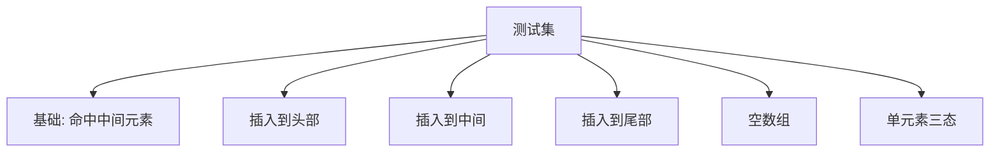

# 35. 搜索插入位置

## 题目描述

给定一个排序数组和一个目标值，在数组中找到目标值，并返回其索引。如果目标值不存在于数组中，返回它将会被按顺序插入的位置。

请必须使用时间复杂度为 O(log n) 的算法。

## 示例 1:

输入: nums = [1,3,5,6], target = 5
输出: 2

## 示例 2:

输入: nums = [1,3,5,6], target = 2
输出: 1

## 示例 3:

输入: nums = [1,3,5,6], target = 7
输出: 4

## 提示:

- 1 <= nums.length <= 10^4
- -10^4 <= nums[i] <= 10^4
- nums 为 无重复元素 的 升序 排列数组
- -10^4 <= target <= 10^4

## 解题思路

本题要求 O(log n) 时间，天然指向二分查找。可归纳为“lower_bound”问题：在有序无重复数组中，寻找第一个大于等于 target 的位置；若全部元素小于 target，则返回末尾位置 len(nums)。

### 一、算法总览（对标 62 风格，图文并茂）

```mermaid
flowchart TD
    A[输入 nums, target] --> B{nums 是否为空}
    B -->|是| C[返回 0]
    B -->|否| D[二分查找]
    D --> E{nums[mid] >= target?}
    E -->|是| F[right = mid]
    E -->|否| G[left = mid + 1]
    F --> H{left < right?}
    G --> H
    H -->|是| D
    H -->|否| I[返回 left]
```

### 二、核心细节（下标与区间语义）
- 使用区间 [left, right)（半开区间）更易写对：初始化 left=0, right=len(nums)，循环条件 left<right。
- mid = left + (right-left)/2，避免整型溢出。
- 当 nums[mid] >= target 时，收缩右边界到 mid；否则收缩左边界到 mid+1。
- 循环结束时，left 即为“第一个 >= target 的位置”。

### 三、复杂度与实现对比
- 时间复杂度：O(log n)
- 空间复杂度：O(1)

### 四、等价写法与对拍（多方案护航）
- 右偏二分：寻找“最后一个 < target 的位置”，答案为该位置 + 1。
- 线性基线：从左到右找到第一个 >= target 的索引（仅用于小规模对拍验证正确性）。

### 五、边界与陷阱（必查清单）
- 空数组：返回 0。
- target 小于首元素：应返回 0。
- target 大于尾元素：应返回 len(nums)。
- 单元素数组的 3 种情况（<、=、>）都要覆盖。

### 六、测试用例设计（覆盖典型+极端）



> 代码中已覆盖：`[1,3,5,6]` with target 5/2/7/0，`[]`，`[1]` with 0/1/2。

### 七、总结与延展
1. 本题是标准 lower_bound 模板题，建议背熟半开区间写法。
2. 可延展到：
   - 上界 upper_bound（第一个 > target 的位置）。
   - 区间计数：出现次数 = upper_bound - lower_bound（适用于有重复元素版本）。
   - 浮点二分/答案二分：将“可行性判定”单调化后在答案空间二分。
- 本题是标准的 lower_bound 模板题。
- 推荐使用 [left, right) 半开区间写法，逻辑统一、边界清晰。
- 对拍时保留一个 O(n) 线性版本核验结果，增强鲁棒性。

