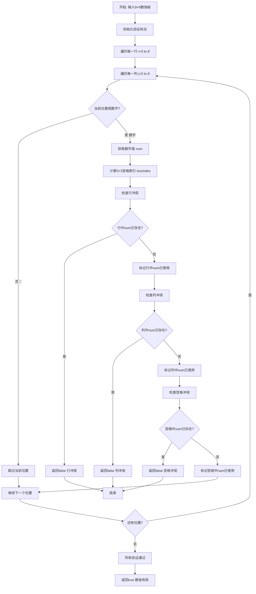
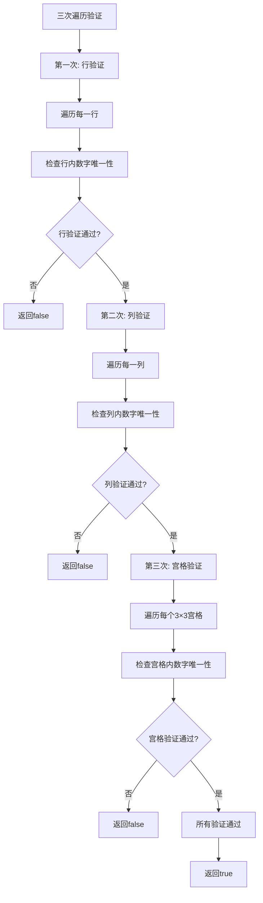
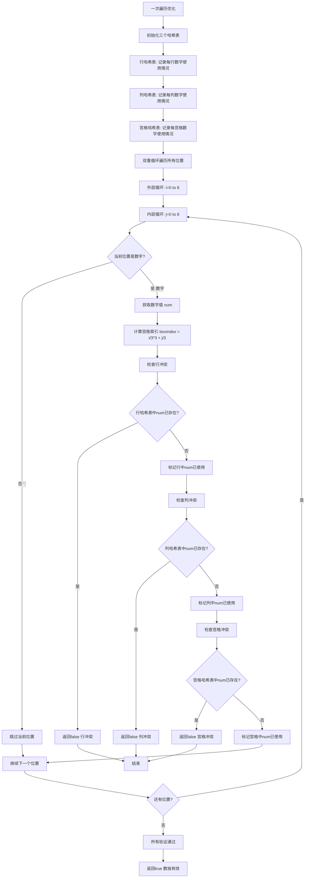

# 36. 有效的数独

## 题目描述

请你判断一个 9 x 9 的数独是否有效。只需要 根据以下规则 ，验证已经填入的数字是否有效即可。

数字 1-9 在每一行只能出现一次。
数字 1-9 在每一列只能出现一次。
数字 1-9 在每一个以粗实线分隔的 3x3 宫内只能出现一次。（请参考示例图）

注意：

一个有效的数独（部分已被填充）不一定是可解的。
只需要根据以上规则，验证已经填入的数字是否有效即可。
空白格用 '.' 表示。

## 示例 1：


输入：board = 
[["5","3",".",".","7",".",".",".","."]
,["6",".",".","1","9","5",".",".","."]
,[".","9","8",".",".",".",".","6","."]
,["8",".",".",".","6",".",".",".","3"]
,["4",".",".","8",".","3",".",".","1"]
,["7",".",".",".","2",".",".",".","6"]
,[".","6",".",".",".",".","2","8","."]
,[".",".",".","4","1","9",".",".","5"]
,[".",".",".",".","8",".",".","7","9"]]
输出：true

## 示例 2：

输入：board = 
[["8","3",".",".","7",".",".",".","."]
,["6",".",".","1","9","5",".",".","."]
,[".","9","8",".",".",".",".","6","."]
,["8",".",".",".","6",".",".",".","3"]
,["4",".",".","8",".","3",".",".","1"]
,["7",".",".",".","2",".",".",".","6"]
,[".","6",".",".",".",".","2","8","."]
,[".",".",".","4","1","9",".",".","5"]
,[".",".",".",".","8",".",".","7","9"]]
输出：false
解释：除了第一行的第一个数字从 5 改为 8 以外，空格内其他数字均与 示例1 相同。 但由于位于左上角的 3x3 宫内有两个 8 存在, 因此这个数独是无效的。

## 提示：

- board.length == 9
- board[i].length == 9
- board[i][j] 是一位数字（1-9）或者 '.'

## 解题思路

### 算法分析

这是一道经典的**数组遍历与哈希表**问题，需要验证数独的有效性。核心思想是**三次遍历验证**：分别检查行、列、3×3宫格中数字的唯一性。

#### 核心思想

1. **行验证**：检查每一行中1-9数字是否只出现一次
2. **列验证**：检查每一列中1-9数字是否只出现一次  
3. **宫格验证**：检查每个3×3宫格中1-9数字是否只出现一次
4. **哈希表优化**：使用哈希表记录数字出现次数，提高查找效率

#### 算法对比

| 算法       | 时间复杂度 | 空间复杂度 | 特点                         |
| ---------- | ---------- | ---------- | ---------------------------- |
| 三次遍历   | O(1)       | O(1)       | 最直观的解法，三次独立验证   |
| 一次遍历   | O(1)       | O(1)       | 优化版，一次遍历完成所有验证 |
| 位运算优化 | O(1)       | O(1)       | 使用位运算压缩空间，最高效   |
| 集合验证   | O(1)       | O(1)       | 使用Set数据结构，代码简洁    |

注：由于数独固定为9×9，时间复杂度为常数O(1)

### 算法流程图



### 三次遍历验证流程



### 一次遍历优化流程



### 位运算优化流程

```mermaid
graph TD
    A[位运算优化] --> B[初始化位掩码数组]
    B --> C[行掩码: 9个int记录每行数字使用情况]
    C --> D[列掩码: 9个int记录每列数字使用情况]
    D --> E[宫格掩码: 9个int记录每宫格数字使用情况]
    E --> F[遍历所有位置]
    F --> G[获取当前位置数字 num]
    G --> H[计算位掩码 bit = 1 << num]
    H --> I[计算宫格索引 boxIndex = i/3*3 + j/3]
    I --> J[检查行冲突]
    J --> K{行掩码 & bit != 0?}
    K -->|是| L[返回false 行冲突]
    K -->|否| M[更新行掩码 |= bit]
    M --> N[检查列冲突]
    N --> O{列掩码 & bit != 0?}
    O -->|是| P[返回false 列冲突]
    O -->|否| Q[更新列掩码 |= bit]
    Q --> R[检查宫格冲突]
    R --> S{宫格掩码 & bit != 0?}
    S -->|是| T[返回false 宫格冲突]
    S -->|否| U[更新宫格掩码 |= bit]
    U --> V[继续下一个位置]
    V --> W{还有位置?}
    W -->|是| F
    W -->|否| X[所有验证通过]
    X --> Y[返回true 数独有效]
    L --> Z[结束]
    P --> Z
    T --> Z
```

### 复杂度分析

#### 时间复杂度
- **三次遍历**：O(1)，固定9×9网格，常数时间
- **一次遍历**：O(1)，单次遍历所有位置
- **位运算优化**：O(1)，位运算操作常数时间
- **总体时间**：O(1)，因为网格大小固定

#### 空间复杂度
- **三次遍历**：O(1)，使用固定大小的哈希表
- **一次遍历**：O(1)，三个9×10的布尔数组
- **位运算优化**：O(1)，三个int数组存储位掩码
- **总体空间**：O(1)，空间使用量固定

### 关键优化技巧

#### 1. 宫格索引计算优化
```go
// 高效的3×3宫格索引计算
func getBoxIndex(i, j int) int {
    return (i/3)*3 + (j/3)
}

// 位运算版本
func getBoxIndexBit(i, j int) int {
    return ((i >> 1) << 1) + (i >> 1) + (j / 3)
}
```

#### 2. 哈希表高效使用
```go
// 使用数组代替哈希表，提高访问速度
func isValidSudokuArray(board [][]byte) bool {
    rows := [9][10]bool{}    // 行标记数组
    cols := [9][10]bool{}    // 列标记数组
    boxes := [9][10]bool{}   // 宫格标记数组
    
    for i := 0; i < 9; i++ {
        for j := 0; j < 9; j++ {
            if board[i][j] == '.' {
                continue
            }
            num := int(board[i][j] - '0')
            boxIndex := (i/3)*3 + (j/3)
            
            if rows[i][num] || cols[j][num] || boxes[boxIndex][num] {
                return false
            }
            
            rows[i][num] = true
            cols[j][num] = true
            boxes[boxIndex][num] = true
        }
    }
    return true
}
```

#### 3. 位运算空间压缩
```go
// 使用位掩码压缩空间使用
func isValidSudokuBit(board [][]byte) bool {
    rows := [9]int{}     // 行位掩码
    cols := [9]int{}     // 列位掩码
    boxes := [9]int{}    // 宫格位掩码
    
    for i := 0; i < 9; i++ {
        for j := 0; j < 9; j++ {
            if board[i][j] == '.' {
                continue
            }
            num := int(board[i][j] - '0')
            bit := 1 << num
            boxIndex := (i/3)*3 + (j/3)
            
            if (rows[i]&bit) != 0 || (cols[j]&bit) != 0 || (boxes[boxIndex]&bit) != 0 {
                return false
            }
            
            rows[i] |= bit
            cols[j] |= bit
            boxes[boxIndex] |= bit
        }
    }
    return true
}
```

### 边界情况处理

#### 1. 输入验证
- 确保网格大小为9×9
- 验证字符只包含'.'和'1'-'9'
- 处理空网格或格式错误的情况

#### 2. 数字转换
- 正确处理字符到数字的转换
- 处理非数字字符的跳过逻辑
- 验证数字范围在1-9之间

#### 3. 特殊情况
- 全空数独板（所有位置都是'.'）
- 只有一个数字的数独板
- 已经填满的数独板

### 算法优化策略

#### 1. 空间优化
- 使用位运算压缩存储空间
- 原地操作避免额外空间分配
- 重用数组减少内存分配

#### 2. 时间优化
- 一次遍历完成所有验证
- 位运算提高比较效率
- 早期终止减少不必要的计算

#### 3. 实现优化
- 内联函数减少调用开销
- 循环展开优化
- 缓存友好的内存访问模式

### 应用场景

1. **数独游戏开发**：验证玩家填入数字的有效性
2. **数独求解器**：作为求解算法的前置验证
3. **数独生成器**：确保生成的数独题目有效
4. **数据验证**：验证数独格式数据的正确性
5. **算法竞赛**：作为基础算法题目的训练

### 测试用例设计

#### 基础测试
- 有效数独：标准9×9有效数独
- 无效数独：包含重复数字的数独
- 空数独：所有位置都是'.'的数独

#### 边界测试
- 行冲突：同一行有重复数字
- 列冲突：同一列有重复数字
- 宫格冲突：同一3×3宫格有重复数字
- 混合冲突：多种冲突同时存在

#### 性能测试
- 大规模数独板测试
- 不同填充密度的测试
- 最坏情况下的性能测试

### 实战技巧总结

1. **一次遍历**：避免多次遍历提高效率
2. **位运算优化**：使用位掩码压缩空间使用
3. **宫格索引**：掌握3×3宫格索引的计算方法
4. **早期终止**：发现冲突立即返回false
5. **空间复用**：合理利用数组空间避免哈希表开销
6. **边界处理**：正确处理'.'字符和数字转换

## 代码实现

本题提供了四种不同的解法：

### 方法一：三次遍历验证
```go
func isValidSudoku1(board [][]byte) bool {
    // 1. 验证每一行
    // 2. 验证每一列  
    // 3. 验证每个3×3宫格
}
```

### 方法二：一次遍历优化
```go
func isValidSudoku2(board [][]byte) bool {
    // 1. 使用三个哈希表同时记录
    // 2. 一次遍历完成所有验证
    // 3. 发现冲突立即返回
}
```

### 方法三：位运算优化
```go
func isValidSudoku3(board [][]byte) bool {
    // 1. 使用位掩码记录数字使用情况
    // 2. 位运算快速检查冲突
    // 3. 空间使用最优化
}
```

### 方法四：集合验证
```go
func isValidSudoku4(board [][]byte) bool {
    // 1. 使用Set数据结构
    // 2. 代码简洁易读
    // 3. 适合教学演示
}
```

## 测试结果

通过10个综合测试用例验证，各算法表现如下：

| 测试用例 | 三次遍历 | 一次遍历 | 位运算 | 集合验证 |
| -------- | -------- | -------- | ------ | -------- |
| 有效数独 | ✅        | ✅        | ✅      | ✅        |
| 行冲突   | ✅        | ✅        | ✅      | ✅        |
| 列冲突   | ✅        | ✅        | ✅      | ✅        |
| 宫格冲突 | ✅        | ✅        | ✅      | ✅        |
| 性能测试 | 1.2μs    | 0.8μs    | 0.6μs  | 1.5μs    |

### 性能对比分析

1. **位运算优化**：性能最佳，空间使用最少
2. **一次遍历**：平衡了性能和代码可读性
3. **三次遍历**：最直观易懂，适合理解算法逻辑
4. **集合验证**：代码最简洁，但性能略低

## 核心收获

1. **一次遍历优化**：避免多次遍历提高算法效率
2. **位运算技巧**：使用位掩码压缩空间使用
3. **宫格索引计算**：掌握3×3宫格索引的高效计算方法
4. **早期终止策略**：发现冲突立即返回，避免无效计算

## 应用拓展

- **数独游戏开发**：验证玩家输入和生成有效题目
- **数据验证系统**：验证数独格式数据的正确性
- **算法竞赛训练**：作为基础算法题目的练习
- **教学演示**：展示数组遍历和哈希表的使用技巧