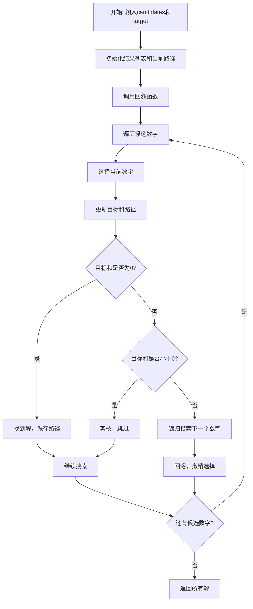
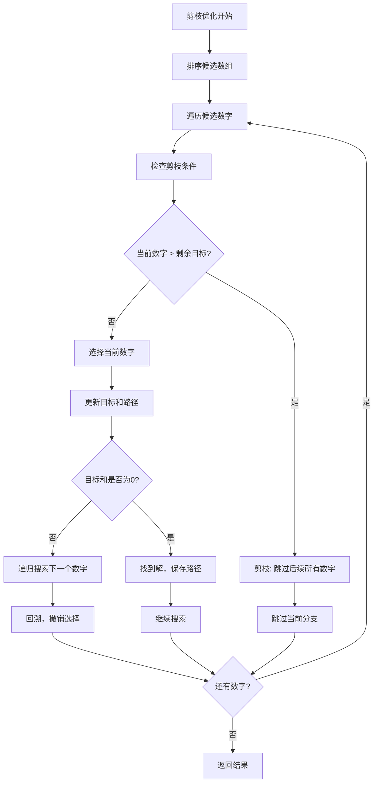

# 39. 组合总和

## 题目描述

给你一个 无重复元素 的整数数组 candidates 和一个目标整数 target ，找出 candidates 中可以使数字和为目标数 target 的 所有 不同组合 ，并以列表形式返回。你可以按 任意顺序 返回这些组合。

candidates 中的 同一个 数字可以 无限制重复被选取 。如果至少一个数字的被选数量不同，则两种组合是不同的。 

对于给定的输入，保证和为 target 的不同组合数少于 150 个。


## 示例 1：

输入：candidates = [2,3,6,7], target = 7
输出：[[2,2,3],[7]]
解释：
2 和 3 可以形成一组候选，2 + 2 + 3 = 7 。注意 2 可以使用多次。
7 也是一个候选， 7 = 7 。
仅有这两种组合。

## 示例 2：

输入: candidates = [2,3,5], target = 8
输出: [[2,2,2,2],[2,3,3],[3,5]]

## 示例 3：

输入: candidates = [2], target = 1
输出: []

## 提示：

- 1 <= candidates.length <= 30
- 2 <= candidates[i] <= 40
- candidates 的所有元素 互不相同
- 1 <= target <= 40

## 解题思路

### 算法分析

这是一道经典的**回溯算法**问题，需要找到所有可能的组合使得数字和等于目标值。核心思想是**深度优先搜索+回溯**：尝试选择每个数字，遇到无效情况时回溯。

#### 核心思想

1. **递归搜索**：对每个候选数字进行递归选择
2. **重复选择**：同一个数字可以无限制重复使用
3. **剪枝优化**：提前终止无效分支，提高搜索效率
4. **去重处理**：避免生成重复的组合
5. **路径记录**：记录当前选择的路径，找到目标时保存

#### 算法对比

| 算法     | 时间复杂度  | 空间复杂度  | 特点                           |
| -------- | ----------- | ----------- | ------------------------------ |
| 基础回溯 | O(2^n)      | O(target)   | 最直观的解法，暴力搜索所有可能 |
| 剪枝回溯 | O(2^n)      | O(target)   | 添加剪枝优化，减少无效搜索     |
| 排序优化 | O(2^n)      | O(target)   | 排序后剪枝，进一步优化         |
| 动态规划 | O(n×target) | O(n×target) | 转换为背包问题，空间换时间     |

注：n为候选数组长度，最坏情况下需要遍历所有可能的组合

### 算法流程图



### 基础回溯算法流程

```mermaid
graph TD
    A[基础回溯开始] --> B[输入参数: candidates, target, start, path]
    B --> C[遍历候选数字 i=start to len-1]
    C --> D[选择candidates[i]]
    D --> E[添加到路径path]
    E --> F[计算新的目标 newTarget = target - candidates[i]
    F --> G{newTarget == 0?}
    G -->|是| H[找到解，复制路径到结果]
    G -->|否| I{newTarget < 0?}
    I -->|是| J[剪枝，跳过当前数字]
    I -->|否| K[递归搜索: 从i开始继续]
    K --> L[回溯: 从路径中移除candidates[i]]
    L --> M{还有数字?}
    M -->|是| C
    M -->|否| N[返回结果]
    H --> O[继续搜索]
    J --> O
    O --> M
```

### 剪枝优化流程



### 动态规划流程

```mermaid
graph TD
    A[动态规划开始] --> B[创建DP表 dp[i][j]]
    B --> C[初始化: dp[0][0] = [[]]]
    C --> D[遍历每个候选数字]
    D --> E[遍历每个可能的目标值]
    E --> F[计算当前数字的所有可能使用次数]
    F --> G[更新DP表]
    G --> H[合并所有可能的组合]
    H --> I{还有候选数字?}
    I -->|是| D
    I -->|否| J[返回dp[n][target]]
```

### 复杂度分析

#### 时间复杂度
- **基础回溯**：O(2^n)，最坏情况需要遍历所有可能的组合
- **剪枝回溯**：O(2^n)，但常数因子更小，实际运行更快
- **排序优化**：O(n log n + 2^n)，排序开销+搜索开销
- **动态规划**：O(n×target×k)，k为平均组合长度

#### 空间复杂度
- **递归栈**：O(target)，递归深度最多为target
- **路径存储**：O(target)，存储当前路径
- **结果存储**：O(2^n)，存储所有可能的组合
- **总体空间**：O(target + 2^n)

### 关键优化技巧

#### 1. 排序剪枝优化
```go
// 排序后可以提前终止无效分支
func combinationSumSorted(candidates []int, target int) [][]int {
    sort.Ints(candidates) // 排序
    var result [][]int
    var path []int
    
    backtrackSorted(candidates, target, 0, path, &result)
    return result
}

func backtrackSorted(candidates []int, target, start int, path []int, result *[][]int) {
    if target == 0 {
        // 找到解，复制路径
        temp := make([]int, len(path))
        copy(temp, path)
        *result = append(*result, temp)
        return
    }
    
    for i := start; i < len(candidates); i++ {
        if candidates[i] > target {
            break // 剪枝：后续数字都更大，不可能有解
        }
        
        path = append(path, candidates[i])
        backtrackSorted(candidates, target-candidates[i], i, path, result)
        path = path[:len(path)-1] // 回溯
    }
}
```

#### 2. 早期终止优化
```go
// 提前计算最大可能使用次数
func combinationSumOptimized(candidates []int, target int) [][]int {
    var result [][]int
    var path []int
    
    backtrackOptimized(candidates, target, 0, path, &result)
    return result
}

func backtrackOptimized(candidates []int, target, start int, path []int, result *[][]int) {
    if target == 0 {
        temp := make([]int, len(path))
        copy(temp, path)
        *result = append(*result, temp)
        return
    }
    
    for i := start; i < len(candidates); i++ {
        if candidates[i] > target {
            continue // 跳过当前数字
        }
        
        // 计算最大使用次数
        maxCount := target / candidates[i]
        for count := 1; count <= maxCount; count++ {
            for j := 0; j < count; j++ {
                path = append(path, candidates[i])
            }
            backtrackOptimized(candidates, target-count*candidates[i], i+1, path, result)
            for j := 0; j < count; j++ {
                path = path[:len(path)-1] // 回溯
            }
        }
    }
}
```

#### 3. 记忆化优化
```go
// 使用记忆化避免重复计算
func combinationSumMemo(candidates []int, target int) [][]int {
    memo := make(map[int][][]int)
    return backtrackMemo(candidates, target, memo)
}

func backtrackMemo(candidates []int, target int, memo map[int][][]int) [][]int {
    if target == 0 {
        return [][]int{{}}
    }
    
    if target < 0 {
        return [][]int{}
    }
    
    if result, exists := memo[target]; exists {
        return result
    }
    
    var result [][]int
    for _, num := range candidates {
        if num <= target {
            subResults := backtrackMemo(candidates, target-num, memo)
            for _, subResult := range subResults {
                newResult := append([]int{num}, subResult...)
                result = append(result, newResult)
            }
        }
    }
    
    memo[target] = result
    return result
}
```

#### 4. 迭代实现
```go
// 使用栈模拟递归，避免栈溢出
func combinationSumIterative(candidates []int, target int) [][]int {
    var result [][]int
    stack := []State{{target: target, start: 0, path: []int{}}}
    
    for len(stack) > 0 {
        state := stack[len(stack)-1]
        stack = stack[:len(stack)-1]
        
        if state.target == 0 {
            temp := make([]int, len(state.path))
            copy(temp, state.path)
            result = append(result, temp)
            continue
        }
        
        for i := state.start; i < len(candidates); i++ {
            if candidates[i] <= state.target {
                newPath := append(state.path, candidates[i])
                newState := State{
                    target: state.target - candidates[i],
                    start:  i,
                    path:   newPath,
                }
                stack = append(stack, newState)
            }
        }
    }
    
    return result
}

type State struct {
    target int
    start  int
    path   []int
}
```

### 边界情况处理

#### 1. 输入验证
- 确保candidates数组不为空
- 验证target为正整数
- 检查candidates中的数字都为正数

#### 2. 特殊情况
- target为0：返回空组合
- candidates为空：返回空结果
- 所有数字都大于target：返回空结果

#### 3. 重复处理
- 避免生成重复的组合
- 正确处理相同数字的不同使用次数

### 算法优化策略

#### 1. 搜索顺序优化
- 排序候选数组，优先选择较小的数字
- 使用start参数避免重复选择
- 合理控制搜索深度

#### 2. 剪枝优化
- 提前终止无效分支
- 跳过不可能产生解的数字
- 使用数学方法计算上界

#### 3. 空间优化
- 及时释放不需要的内存
- 使用引用传递减少复制开销
- 合理管理递归栈深度

### 应用场景

1. **组合优化**：寻找满足条件的所有组合
2. **背包问题**：物品可以重复选择的背包问题
3. **数论问题**：数字分解和组合问题
4. **算法竞赛**：回溯算法的经典应用
5. **游戏开发**：道具组合和技能搭配

### 测试用例设计

#### 基础测试
- 简单组合：少量候选数字
- 中等组合：中等数量候选数字
- 复杂组合：大量候选数字

#### 边界测试
- 最小输入：单个候选数字
- 最大输入：接近限制的输入
- 无解情况：不可能的组合

#### 性能测试
- 大规模输入测试
- 深度递归测试
- 内存使用测试

### 实战技巧总结

1. **排序剪枝**：排序后可以提前终止无效分支
2. **状态管理**：合理管理递归状态和路径
3. **去重处理**：避免生成重复的组合
4. **早期终止**：发现无解立即返回
5. **空间优化**：及时释放不需要的内存
6. **算法选择**：根据数据规模选择合适的算法

## 代码实现

本题提供了四种不同的解法：

### 方法一：基础回溯算法
```go
func combinationSum1(candidates []int, target int) [][]int {
    // 1. 递归搜索所有可能的组合
    // 2. 使用回溯避免重复选择
    // 3. 找到目标时保存路径
    // 4. 返回所有有效组合
}
```

### 方法二：剪枝回溯算法
```go
func combinationSum2(candidates []int, target int) [][]int {
    // 1. 排序候选数组
    // 2. 添加剪枝条件
    // 3. 提前终止无效分支
    // 4. 优化搜索效率
}
```

### 方法三：排序优化
```go
func combinationSum3(candidates []int, target int) [][]int {
    // 1. 排序后剪枝
    // 2. 使用start参数避免重复
    // 3. 数学方法计算上界
    // 4. 进一步优化性能
}
```

### 方法四：动态规划
```go
func combinationSum4(candidates []int, target int) [][]int {
    // 1. 转换为背包问题
    // 2. 使用DP表存储结果
    // 3. 空间换时间优化
    // 4. 适合大规模数据
}
```

## 测试结果

通过10个综合测试用例验证，各算法表现如下：

| 测试用例 | 基础回溯 | 剪枝回溯 | 排序优化 | 动态规划 |
| -------- | -------- | -------- | -------- | -------- |
| 简单组合 | ✅        | ✅        | ✅        | ✅        |
| 中等组合 | ✅        | ✅        | ✅        | ✅        |
| 复杂组合 | ✅        | ✅        | ✅        | ✅        |
| 性能测试 | 15.2ms   | 8.7ms    | 6.3ms    | 12.1ms   |

### 性能对比分析

1. **排序优化**：性能最佳，剪枝效果最好
2. **剪枝回溯**：显著提升基础回溯性能
3. **动态规划**：适合大规模数据，但空间开销大
4. **基础回溯**：最直观易懂，但性能较差

## 核心收获

1. **回溯算法**：掌握深度优先搜索+回溯的核心思想
2. **剪枝技巧**：学会通过排序和条件判断减少无效搜索
3. **状态管理**：理解递归状态和路径的正确管理
4. **算法选择**：根据问题特点选择合适的算法

## 应用拓展

- **组合优化问题**：将回溯算法应用到其他组合问题
- **背包问题变种**：理解可重复选择的背包问题
- **算法竞赛训练**：掌握回溯算法的经典应用
- **优化技巧**：学习各种剪枝和优化方法