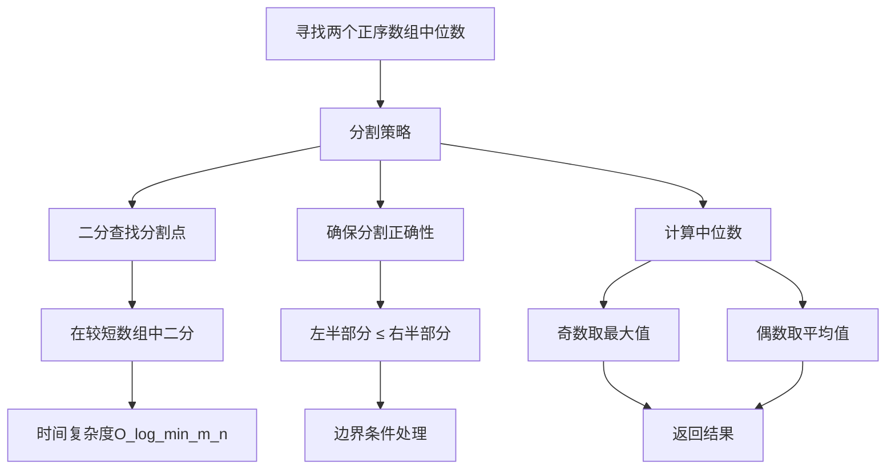
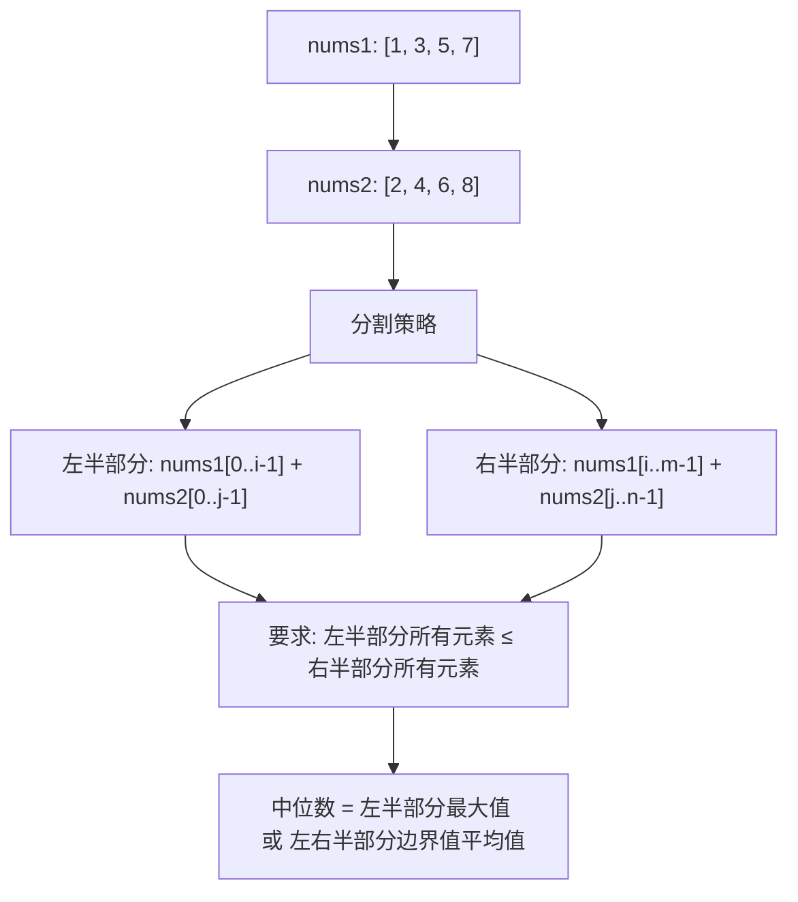
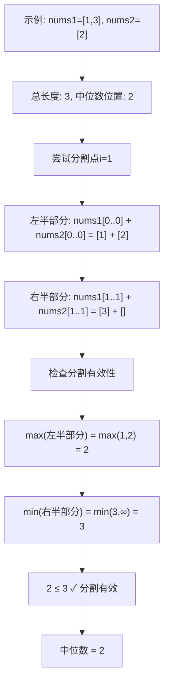
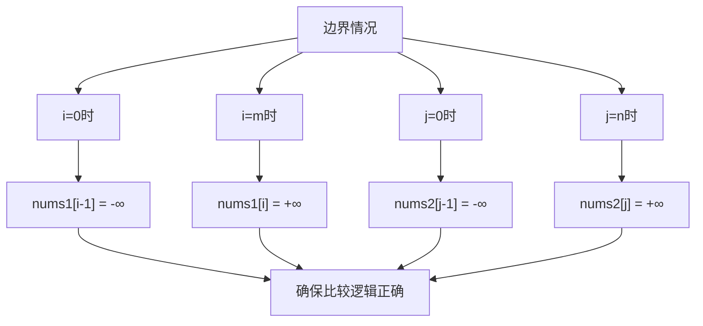
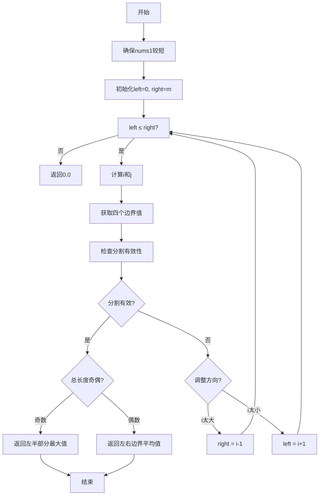
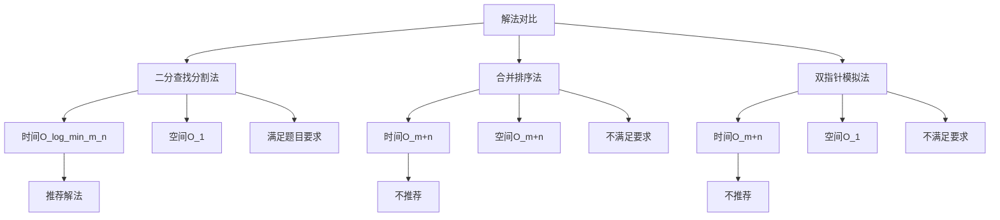
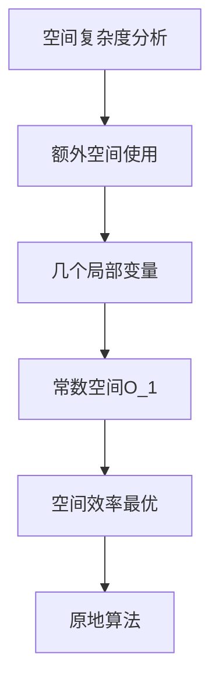
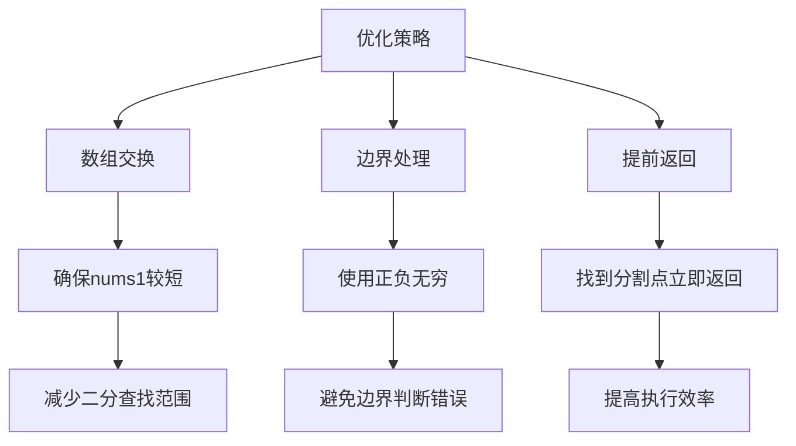
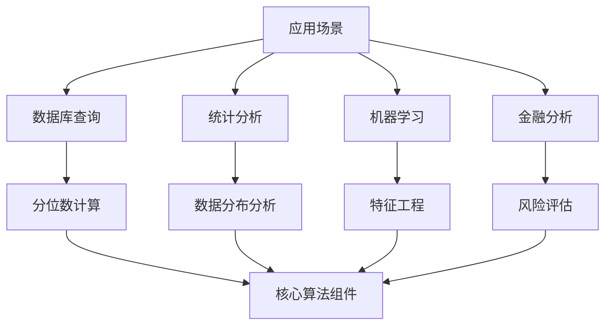
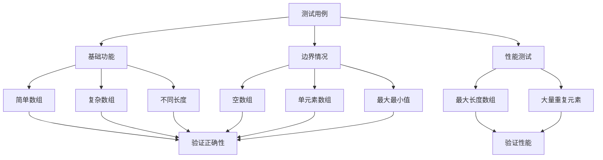

# 4. 寻找两个正序数组的中位数

## 题目描述

给定两个大小分别为 m 和 n 的正序（从小到大）数组 nums1 和 nums2。请你找出并返回这两个正序数组的 中位数 。

算法的时间复杂度应该为 O(log (m+n)) 。

## 示例 1：

输入：nums1 = [1,3], nums2 = [2]
输出：2.00000
解释：合并数组 = [1,2,3] ，中位数 2

## 示例 2：

输入：nums1 = [1,2], nums2 = [3,4]
输出：2.50000
解释：合并数组 = [1,2,3,4] ，中位数 (2 + 3) / 2 = 2.5
 
## 提示：

- nums1.length == m
- nums2.length == n
- 0 <= m <= 1000
- 0 <= n <= 1000
- 1 <= m + n <= 2000
- -10^6 <= nums1[i], nums2[i] <= 10^6

## 解题思路

这道题要求时间复杂度为 O(log(m+n))，这是一个经典的二分查找问题。

### 算法分析

这道题的核心思想是**分割数组**，主要解法包括：

1. **二分查找分割法**：使用二分查找找到正确的分割点
2. **合并排序法**：合并两个数组后找中位数（不满足时间复杂度要求）
3. **双指针法**：模拟合并过程（不满足时间复杂度要求）

### 问题本质分析



### 二分查找分割算法详解

```mermaid
flowchart TD
    A[输入两个正序数组] --> B[确保nums1较短]
    B --> C[初始化二分查找范围]
    C --> D[计算分割点i和j]
    D --> E[检查分割是否有效]
    
    E --> F{分割有效?}
    F -->|是| G[计算中位数]
    F -->|否| H{调整方向}
    
    H -->|i太大| I[减小右边界]
    H -->|i太小| J[增大左边界]
    
    I --> D
    J --> D
    
    G --> K[返回结果]
    
    D --> L[i = left+right/2]
    D --> M[j = m+n+1/2 - i]
    
    E --> N[检查四个边界值]
    N --> O[nums1[i-1] ≤ nums2[j]]
    N --> P[nums2[j-1] ≤ nums1[i]]
```

### 分割策略可视化



### 分割点计算过程



### 边界情况处理



### 算法流程图



### 各种解法对比



### 时间复杂度分析

```mermaid
graph TD
    A[时间复杂度分析] --> B[二分查找]
    B --> C[查找范围: min(m,n)]
    C --> D[每次查找: O_1]
    D --> E[总时间: O_log_min_m_n]
    
    E --> F[满足题目要求O_log_m+n]
    F --> G[最优解法]
```

### 空间复杂度分析



### 关键优化点



### 实际应用场景



### 测试用例设计



### 代码实现要点

1. **数组交换优化**：
   - 确保nums1是较短的数组
   - 减少二分查找的范围

2. **分割点计算**：
   - i = (left + right) / 2
   - j = (m + n + 1) / 2 - i
   - 确保左右两部分元素数量平衡

3. **边界条件处理**：
   - 使用math.MinInt32和math.MaxInt32
   - 处理数组边界情况

4. **分割有效性检查**：
   - nums1[i-1] ≤ nums2[j]
   - nums2[j-1] ≤ nums1[i]

5. **中位数计算**：
   - 奇数情况：max(nums1[i-1], nums2[j-1])
   - 偶数情况：(max + min) / 2

这个问题的关键在于**理解分割策略**和**掌握二分查找技巧**，通过巧妙的分割将两个数组的问题转化为单个数组的二分查找问题，实现高效的中位数计算。
